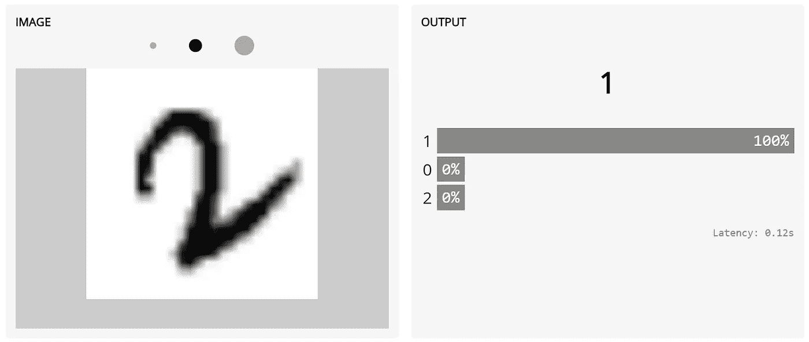
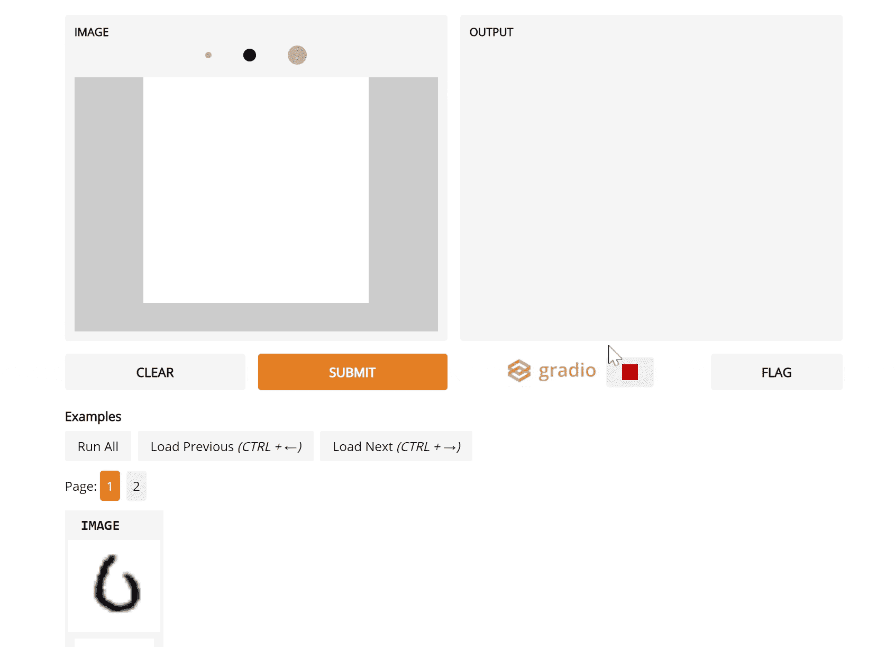
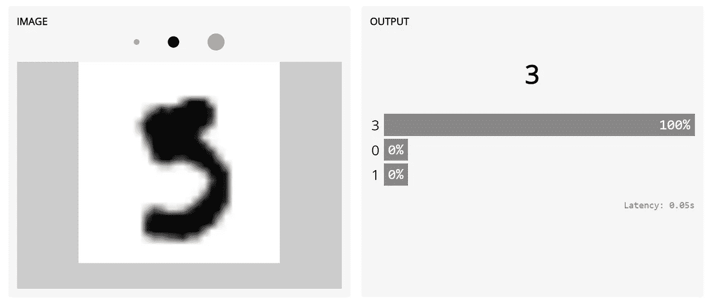
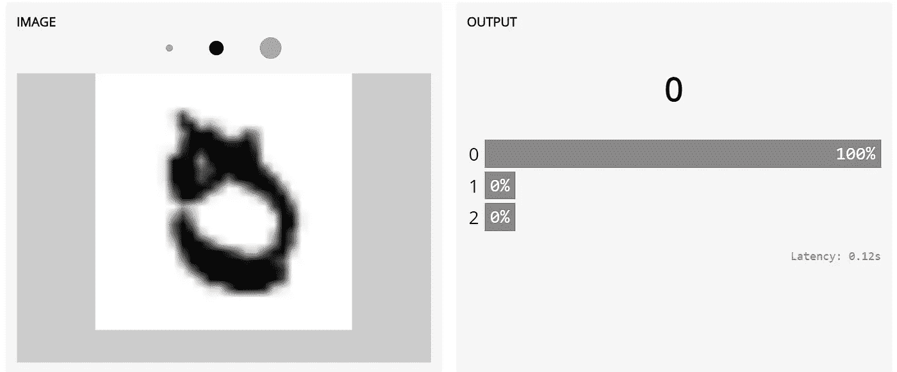
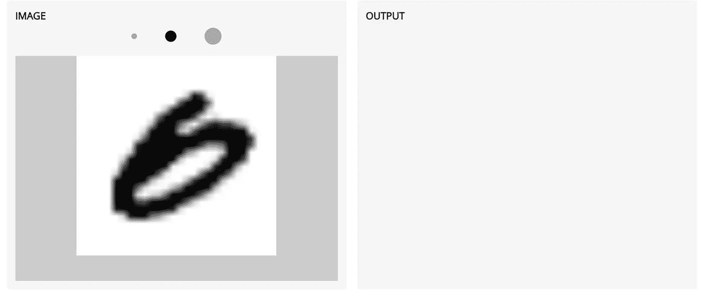

# 修复你的机器学习模型的故障点

> 原文：<https://towardsdatascience.com/fixing-your-machine-learning-models-failure-points-e3ec0a047895?source=collection_archive---------40----------------------->

## 一步一步的指导你发现和理解你的机器学习模型中的问题，并修复它们！

机器学习模型可以用来构建很酷的应用程序和演示。但是在现实世界中可靠地部署机器学习系统仍然是一个挑战，因为当意想不到的数据出现时，它们经常以意想不到的方式失败。

例如，对 MNIST 手写数据集中的数字进行分类是最基本的机器学习任务之一，经常被用作机器学习入门课程中“已解决问题”的示例。然而，当数字以不寻常的方式旋转时，即使达到 99%准确率的机器学习分类器也可能做出不正确的预测:

一个在 MNIST 数据集上训练到 99%以上准确率的卷积神经网络仍然预测“1”，当它遇到来自测试集的异常旋转的“2”时(试试 [www.gradio.app](http://www.gradio.app)

这篇博客的目的是帮助你发现这些数据点(我们将称之为**“硬数据”**)，这些数据点在训练过程中导致机器学习失败，这样你就不会让你的模型出现各种各样的裂缝，这些裂缝可能会变成更大的裂缝，因为在你的模型部署后，数据分布会继续变化。我们将介绍修复模型故障点的三个重要步骤:

1.  **识别硬数据**
2.  **可视化硬数据&理解它破坏模型的原因**
3.  **固定模型**

所以让我们开始吧！

## 0.设置:加载您的模型

我们将首先在 TensorFlow 中加载一个简单的 MNIST 模型，我们将在本文的其余部分使用它。在我们的例子中，我们将从一个 S3 桶中加载一个预先训练好的模型，当然，您可以很容易地自己训练一个 MNIST 模型或者使用一个完全不同的模型。

## 1.识别硬数据

训练完模型后，神经网络通常会在训练数据集上达到非常高的精度，因此，要确定潜在的故障点，您需要使用模型以前没有见过的数据。在我们的例子中，我们将使用 MNIST 测试集来识别硬数据。

为了以一种有用的方式识别硬数据，我们应该考虑两个因素:

*   **难度**:模型*最不*准确的数据点是什么？我们将研究神经网络的可信度，以此作为代理。
*   **多样性**:我们如何挑选一组多样化的硬数据点，以便我们检查一组有代表性的硬数据？有许多方法可以使用它，但是我们将着眼于最简单的:确保我们收集的样本包括来自 10 个标签类的一些例子

下面的代码执行这些步骤，首先对测试数据运行模型，然后识别 20 个硬数据点，即每个数字中最难的 2 个。你会注意到，我们将这些例子都保存为图片，这在下一步中很重要。

## 2.**可视化硬数据&理解为什么它打破了模型**

在您识别出硬数据之后，现在是时候动手了，并真正理解为什么这些数据点会破坏您的模型。为此，使用像**Gradio**([https://github.com/gradio-app/gradio](https://github.com/gradio-app/gradio))这样的可视化库是有帮助的，它可以帮助你“看到”你的硬数据点以及它们根据模型的预测。

要使用 Gradio 库，我们必须编写一个包装模型的函数。在下面的代码中，那就是`recognize_digit()`。我们还定义了我们想要创建什么样的 UI(*画板* → *标签*)，然后我们可以传入一个`examples`列表，这是上一步中的文件名列表。下面是完整的代码:

这将产生以下 GUI，它加载了示例，并使我能够理解为什么不同的示例会破坏模型:

## 3.**固定模型**

现在，进入最重要的部分！修复模型需要您彻底理解为什么不同的硬数据点会破坏模型。根据原因，可能需要不同的步骤来使模型更加健壮。让我们将此应用到我们为 MNIST 模型确定的**硬数据**中，并集体讨论我们需要做些什么来修正这个模型。

***3A。添加数据增强*和**

您的模型可能损坏的第一个原因是，如果它看到输入数据以不寻常的方式转换，如下面的旋转“2”示例。这通常可以通过**数据扩充**(在训练期间综合转换你的输入数据)很容易地解决。这里有一个[数据扩充](https://neptune.ai/blog/data-augmentation-in-python)的指南。

*边注:*可以使用 Gradio 库的内置特性旋转样本，观察预测的差异。通过使用一个*图像→标签*接口，我们能够在我们的样本上尝试许多不同的转换(更多细节参见 [colab 笔记本](https://colab.research.google.com/drive/1eOrsRGCcovZxCDxf8GL3xm8j2yzngr0Y?usp=sharing&authuser=1#scrollTo=Cvb4bYGaB4fY))。以下是我们将样品旋转 30°回到正确方向时的结果，证实旋转可能是罪魁祸首:

***3B。获取更多的稀有样本***

您的模型可能失败的第二个原因是因为它在训练期间不常看到的稀有数据。考虑下面的“5 ”,在形成“5”顶部的水平杆和弯曲钻头的顶部之间只有很小的空间。因为像这样的训练例子不多，所以 MNIST 模型没有意识到它是一个“5”。这种问题很难通过数据扩充来解决——解决方案是**获取更多像这样的样本**。

***3C。平衡等级*和**

我注意到仔细阅读硬数据的一件事是，不管数字实际上是什么，模型很少预测“5”。例如，下面的数字是模糊的——它可能是“5”或“0”或“9”，但是模型确信它是“0”而不是“5”(真正的标签)。这可能反映了训练数据的不平等分布，也许该模型在训练期间遇到“5”的频率比其他数字低。事实上，尽管在训练数据中有很多“5 ”,但它们是训练数据中最不常见的类别。这使得模型通常不太可能预测“5”要解决这个问题，你可以尝试[平衡你的训练设置](https://machinelearningmastery.com/tactics-to-combat-imbalanced-classes-in-your-machine-learning-dataset/)。

***3D。删除坏数据***

有时，硬数据被错误分类仅仅是因为它是一个坏数据点。数据集通常由人来注释，人会犯错误。如果您确定一个数据点被贴错了标签(就像我相信下面的数据点一样，根据其分配的标签，据称是“0”)，并且不代表您的部署数据，那么您应该将它从您的测试集中删除，以便您的评估指标更符合实际。

在这篇文章中，我概述了一个捕捉模型故障点并尽早修复它们的过程。尽管具体细节会根据您拥有的模型类型而有所不同，但这种识别、理解和修复 **硬点的**一般方法将会改进您的数据集，并生成一个健壮的模型**，它不仅具有更高的测试准确性，而且在现实世界中部署时可能会更加可靠。祝你好运！**

注:你可以在这个 Colab 笔记本上一次性运行以上所有代码:[https://Colab . research . Google . com/drive/1 orsrgccovzxcdxf 8 GL 3 XM 8 j2yzngr 0y？usp =分享](https://colab.research.google.com/drive/1eOrsRGCcovZxCDxf8GL3xm8j2yzngr0Y?usp=sharing)