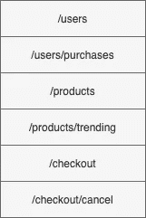
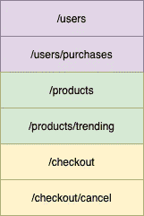

# 生产中的 Flask:最小的 Web APIs

> 原文：<https://towardsdatascience.com/flask-in-production-minimal-web-apis-2e0859736df?source=collection_archive---------16----------------------->

## 将 API 投入生产可能是一个令人困惑的前景。这篇文章给你在生产中使用 Flask 的技巧和模板。


蒂姆·福斯特在 Unsplash 上的照片

# 烧瓶是什么？

如果你在云软件领域(或与之相邻的领域)工作，并且熟悉 Python，你很可能会遇到[Flask](https://en.wikipedia.org/wiki/Flask_(web_framework))——这是一个优秀的、最小化的“[micro](https://flask.palletsprojects.com/en/1.1.x/foreword/)”web 框架，十年来一直是 Python web 社区的核心。据报道，它已经进入了大量的应用程序，包括 LinkedIn 和 Pinterest 平台，以及无数其他商业、私人和研究项目。这种受欢迎程度确保了它有一个充满活力的扩展、文档和教程生态系统。

那么为什么*又发了一篇* Flask 的博文呢？在过去八年左右的时间里，我已经使用 Flask 进行了几十个个人和专业项目，我学到了很多东西。然而，很难找到简单、高质量的指南来指导如何开始使用“生产就绪”的 Flask 应用程序。我想我已经把我对一个简单、最小的 Flask“生产就绪”应用程序可能是什么样子的一些想法放在一起了——一个(不全面的)列表，列出了我希望这些年来已经知道的一些事情。如果你对这篇文章中的建议有什么改进的建议，一定要联系我，让我知道。

此外，在这篇文章中，我特别关注为提供 API 作为 web 服务而开发的 Flask 应用程序。这是许多软件专业人员的基本用例，也越来越与许多机器学习实践者相关。另外，对于软件世界的新来者来说，这可能有点令人困惑。因此，这篇文章的目的是给你一个简单但可靠的“生产就绪”的 Flask 服务模板，并分享我提供的结构的一些基本原理。我也给出了几个基本步骤来将模板项目部署到 Google Cloud Run。让我们开始吧。

# 一点术语…

和技术领域一样，很容易被 API 语言绊倒。在我们研究模板项目本身之前，有必要快速回顾一下几个更重要的术语，以便有所了解。

如果你想直接跳到代码，那就这样吧:

[](https://github.com/markdouthwaite/minimal-flask-api) [## markdouthwaite/最小烧瓶-api

### 这个模板库为一个“生产就绪”的 Flask API 项目提供了一个最小的配置。它包括一个…

github.com](https://github.com/markdouthwaite/minimal-flask-api) 

# 我们所说的“生产就绪”是什么意思？

软件社区使用“生产就绪”这个词作为一个近乎护身符的不言自明的术语。然而，有一点不清楚*特别是*是什么使得一个软件产品化，特别是对于这个领域的新来者，或许也包括技术水平较低的团队。那么*当我们说一个软件是“生产就绪”的时候，*意味着什么(对于一个软件专业人员来说)？这有点主观，但我认为这些是关键因素:

*   软件[满足其需求](https://citeseerx.ist.psu.edu/viewdoc/download?doi=10.1.1.13.7861&rep=rep1&type=pdf)。你的软件做了它应该做的事情，并且它做得足够好来产生商业价值。
*   该软件已经过充分测试。有一个(最好是)自动测试套件可以有效地测试你的代码。
*   软件有充分的文档记录。有足够的文档让另一个从业者拿起软件并开始使用它。
*   该软件“架构良好”。它是可扩展的、可维护的和可伸缩的。这包括确保软件包含[优雅的错误处理](https://en.wikipedia.org/wiki/Graceful_exit)。
*   该软件已经过同行评审。您的代码已经得到了同行的评审和签署。

显然，我不能帮助你解决其中的一些问题:我不能确定你的软件是否满足你的需求，我不能检查你的测试套件是否合理，你的应用程序是否架构良好，你的文档是否足够。但是，我*可以*让您从一个项目模板开始，该模板指示您可能如何着手构建您的工作以满足其中的每一项，相关代码和信息可以/应该位于何处，并且模板代码为您提供了一个初始的脚手架，您可以使用它来使您的项目达到该标准。这就是我这篇文章的目的。

# “API”和“服务”之间有什么区别？

您可能只听说过 web 服务上下文中使用的术语“API ”,在这种情况下，您可能认为它们是同义词。这种观点不太准确。

*   **API**—API 是一个“应用程序编程接口”，定义了一组其他应用程序可以访问和利用的功能。这可以通过不同的媒介公开，例如，包括通过 web 和作为语言、包和库的公共接口。
*   **服务** —服务是通过 web 公开的[资源](https://en.wikipedia.org/wiki/Web_resource)。换句话说，它是一个可以通过网络互动的实体。这个实体可以是函数的集合，或者只是一个静态文件。实际上，这意味着 web 服务*也是*API，但它不是唯一的*API。*

换句话说，web 服务公开了一个 API，但并不是所有的 API 都通过 web 公开。如果你写了一个 Python 包，可以说这个包也提供了一个 API。

# 路由和端点有什么区别？

这是另一个微妙的技术区别。如果你过去浏览过 Flask 应用程序，毫无疑问你会看到`route` [装饰器](https://www.datacamp.com/community/tutorials/decorators-python)，也许会听到一般的“路线”的说法。如果你读过很多关于 web APIs 的书，你可能也听说过“端点”的说法。有时这些术语看起来几乎是同义的。那么它们是什么意思呢？

*   **路由** —路由就是 URL。这是定位资源的一种方式(例如，资源是某种功能或信息)。例如，这可能是`localhost:8080/users`。
*   **端点** —端点是通信信道的一个特定端。重要的是，一条路由可能有多个端点。例如，`GET localhost:8080/users`和`DELETE localhost:8080/users`将是单条路线`localhost:8080/users`的两个不同端点。这对于你如何选择设计你的 API 有着重要的影响。

术语到此为止。让我们来看看代码！

# 输入模板

在这篇文章的其余部分，我将参考 GitHub [模板库](https://docs.github.com/en/github/creating-cloning-and-archiving-repositories/creating-a-repository-from-a-template)，我把它放在一起展示我认为是一个*最小*生产就绪 Flask API 的一些基本元素。您可以在这里找到存储库:

[](https://github.com/markdouthwaite/minimal-flask-api) [## markdouthwaite/最小烧瓶-api

### 这个模板库为一个“生产就绪”的 Flask API 项目提供了一个最小的配置。它包括一个…

github.com](https://github.com/markdouthwaite/minimal-flask-api) 

要进行设置，您可以[直接从这个模板](https://docs.github.com/en/github/creating-cloning-and-archiving-repositories/creating-a-repository-from-a-template)创建一个新的存储库，或者您可以[将存储库](https://docs.github.com/en/github/getting-started-with-github/fork-a-repo)分支到您自己的帐户，然后[从那里克隆它](https://docs.github.com/en/github/creating-cloning-and-archiving-repositories/cloning-a-repository)——任何适合您的方式！最后，如果你想用 Google Cloud Run 部署你的 API，一定要检查一下`google-cloud-run`分支。都准备好了吗？太好了！

# 项目结构

下一个问题:你刚刚拉下了什么？以下是您正在查看的项目结构的几个最重要方面的概要:

*   `bin` -正如[您可能期望的](http://www.linfo.org/bin.html)，这个目录是项目的任何直接可执行文件的存储位置。默认情况下，这里有一个名为`run.sh`的文件。该文件包含 [bash](https://www.gnu.org/software/bash/) 命令，该命令将初始化 [Gunicorn 服务器](https://gunicorn.org/)并显示您的 Flask 应用程序。如果这还不太有意义，不要担心，我们稍后会介绍它！
*   `docs` -这个目录应该存储任何关于你的 API 的文档。你会在这个目录中看到一个名为`swagger.yaml`的文件。它存储了 API 的标准规范。实际上，这可以让其他团队和服务更容易地使用你的 API，并且你应该考虑为你构建的每个*API*制作一个****。在本文中，我们不会深入探讨 Swagger 或 OpenAPI 标准，但是你可以在 Swagger 网站上找到更多信息。****
*   *`requirements` -这个目录存储你的经典 Python `requirements.txt`类型的文件。注意，这里实际上有两个文件:`common.txt`和`develop.txt`。这有助于将部署 API 时需要的依赖项(基本的依赖项存储在`common.txt`中)与开发 API 时需要的依赖项(这些存储在`develop.txt`中，通常是测试工具和[样式](https://github.com/psf/black) / [林挺](https://stackoverflow.com/questions/8503559/what-is-linting#:~:text=Linting%20is%20the%20process%20of,in%20C%20language%20source%20code.)实用程序)分开。换句话说，当开发你的 API 时，你需要安装*`common.txt`和`develop.txt`，但是当*部署*你的 API 时，你可以只安装`common.txt`。**
*   **这个目录存储了你的 API 的源代码。文件`app.py`设置你的 Flask 应用程序并创建你的应用程序的‘路线’。我们稍后将更详细地讨论这个问题。您还会看到`errors.py`文件。它存储了一个 [Flask Blueprint](https://flask.palletsprojects.com/en/1.1.x/blueprints/) ，用于处理 API 代码中的错误。我们很快会看一下蓝图。最后，`handlers`目录应该存储您的模型处理程序。换句话说，这是您提供加载和查询模型的函数的地方。同样，我们很快会再看一遍。**
*   **`Dockerfile` -该文件包含特定 Docker 图像的定义。换句话说，它包含构建 Docker 的命令，Docker 可以作为一个独立的。如果这对您来说没有多大意义，您可以简单地将其视为定义您希望代码运行的特定环境的一种方式。我不打算在这里介绍 Docker 的基础知识，所以如果您对 Docker 和容器技术不熟悉，请务必查看 Docker 文档，另外，如果您感兴趣，YouTube 上还有一些[很棒的入门教程](https://www.youtube.com/watch?v=i7ABlHngi1Q)。如果您遵循本文末尾的部署步骤，对 Docker 的理解将会派上用场。**
*   **`Makefile` -这个文件提供了一个[简单的机制来为你的项目运行有用的命令](https://opensource.com/article/18/8/what-how-makefile#:~:text=The%20make%20utility%20requires%20a,be%20installed%20using%20make%20install%20.)。我们将在这篇文章的后面触及其中的一些。**
*   **`tests`——这个目录存储了你的测试套件的文件，包括一个展示如何使用来测试你的 Flask 应用的基本例子，以及一个最小的`[locustfile](https://locust.io/)`，你也可以使用它来加载测试你的 API。**
*   **`wsgi.py`——这个文件是你的 API 的 [WSGI 入口点](https://wsgi.readthedocs.io/en/latest/what.html)。稍后会有更多的介绍。**

**有道理吗？太好了！让我们再深入一点。**

# **了解 Flask**

**虽然 Flask 是一个紧凑的框架，但仍然有一些重要的概念可以真正帮助您构建更干净、更具可伸缩性的应用程序，因此非常值得更好地理解其中的一些概念。这样做可能是拥有一个整洁的、[高性能的](https://dictionary.cambridge.org/dictionary/english/performant) API 和一个杂乱无章、杂乱无章的 API 之间的区别。我还想强调的是，这远远不是 Flask 的全部内容，但是我认为这是您可能会发现对基本 API 特别有用的几个领域。**

# **申请途径**

**值得从头开始。Flask(以及一般的 web 服务)中最基本的概念之一是 Flask 中的一个`route`的概念。这些被设计用作[装饰符](https://wiki.python.org/moin/PythonDecorators#What_is_a_Decorator)，指示当调用给定的`route`时应该执行的特定函数。我不打算在这里深入装饰者的技术细节，但是如果你不熟悉他们，很值得阅读一下[那里的一些资料](https://www.datacamp.com/community/tutorials/decorators-python)更详细地解释他们做什么。**

**看看下面的例子:**

```
**import flask 
app = flask.Flask(__name__) @app.route("/") 
def home(): 
    return "You are home"**
```

**这段代码创建了一个只有一个`route`的 Flask 应用程序。该路线告诉应用程序在调用`/`路线时执行`home`功能。Flask `route` decorator 可以用来指示和解包 URL 参数。例如，下面是如何定义一个新的路由来从 URL 中提取一个`name`参数:**

```
**@app.route("/users/<name>") 
def user(name): 
    return f"Hey, {name}!"**
```

**如果您要调用路由`/user/Jane`，这个处理程序将返回`Hey, Jane!`。正如您可能看到的，这些是任何 web 服务的构建块，通过扩展，理解`route` decorator 的功能将使您在构建 API 的道路上走得更好。**

# **应用蓝图**

**Flask 框架中的另一个关键概念是 [*蓝图*](https://exploreflask.com/en/latest/blueprints.html) 的想法。蓝图很棒。它们可以用来划分你的 API。例如，假设您想要创建一个 API 来管理您的在线商店。你需要一些关键的功能。三组明显的功能是处理用户、产品和结账过程的功能。如上所述，您可以使用上述`route`装饰器提供的功能轻松捕捉这种行为。您可以在`app.py`中为以下内容创建单独的路线:**

****

**图 1:您可能期望在购物 API 上看到的示例路线。在你的 Flask 应用程序中，这些将是单独的“标准”路线。作者图片**

**然而——虽然是一个虚构的例子——这个 API 中显然有一些定义良好的功能子集。您可以将这些子集捕获为独立的 Python 模块，每个模块为该子集定义一个不同的蓝图。将此功能划分到蓝图中的一种方法如下:**

****

**图 2:一个购物 API 的路径示例，其中颜色表示功能被分组到一个单独的蓝图中，并注入到 Flask 应用程序中。图片作者。**

**然后你可以*在你的“核心”应用程序中注册*这些蓝图。注册蓝图会立即将蓝图中定义的所有*路线添加到“父”Flask 应用程序中。这样做的好处是，你可以快速添加和删除 Flask 应用程序功能的全部子集，并独立开发子集。正如您可能想象的那样，当您开发更复杂的 API 时，这非常有用。***

**要查看蓝图的实际例子，请看模板库中的`api/error.py`文件。这是蓝图的一个超级实用的用例。在这种情况下，这个蓝图定义了一个简单的模式来优雅地处理 API 中未被捕获的错误。它定义了一种特殊类型的装饰器，`error_handler`，它将有效地处理应用程序中的错误。同样，我不打算详细说明装饰器是如何工作的，但只要说这个特殊的装饰器可以捕捉你的应用程序中未处理的`Exception`就够了。在这种情况下，它返回一个股票字符串响应和一个错误代码(500) 。**

**该蓝图已*注册*在主应用程序中，代码行为:**

```
**app.register_blueprint(errors)**
```

**这将在您的蓝图中定义的错误处理行为注入到您的应用程序中。换句话说，你的*整个应用*现在可以利用这个蓝图来捕捉和处理任何地方可能出现的未被捕捉的错误。这将适用于您应用程序中的所有*路线。酷吧。***

# **为什么要用 Gunicorn？**

**有一件事有时会让初入 Flask 世界的人感到困惑，那就是需要使用符合 WSGI 的 web 服务器来包装 Flask 应用程序。你*不应该*使用捆绑的 Flask 开发服务器部署 Flask 应用。在实践中，这个开发服务器可以方便地快速测试您的应用程序，但是它不是为高要求的应用程序设计的，因此当您将它推到生产环境中时，它不太可能很好地发挥作用。**

**相反，Flask 是*设计的*用于其他符合 WSGI 的 web 服务器。对于这篇文章，(在模板中)我使用了 [Gunicorn](https://gunicorn.org/) 。这是一个坚实的工具。然而，这不是唯一的选择，例如，还有`twisted`和`uWSGI`。如果您想了解关于您的部署选项的更多信息，Flask 提供了一些关于如何准备这些选项的极好的提示:**

 **[## 部署到生产烧瓶文档(1.1.x)

### 本教程的这一部分假设您有一个要部署应用程序的服务器。它给出了一个概述…

flask.palletsprojects.com](https://flask.palletsprojects.com/en/1.1.x/tutorial/deploy/)** 

**在模板存储库中，Gunicorn 与 Flask 的配置由两个文件处理。第一个是`bin/run.sh` bash 脚本。如果您检查这个文件，您将看到一个命令。该命令将 Gunicorn 服务器指向您的 Flask 应用程序，在`0.0.0.0:8080`(即在您的本地主机上的端口 8080)公开应用程序，将您的应用程序设置为在`debug`级别登录(即记录*所有内容*)，并使用 4 个工作进程初始化服务器(即，将被初始化以处理对您的 API 的请求的工作进程的数量，以及因此可以并行处理的请求的数量)。后一个参数(`workers`)通常最好设置为运行 API 的服务器上可用内核的数量。**

**第二个感兴趣的文件是`wsgi.py` Python 模块，那是关于什么的？**

# **WSGI 和 WSGI 入口点**

**`wsgi.py`通常被称为 [WSGI](https://wsgi.readthedocs.io/en/latest/what.html) 入口点。你会问，WSGI 是什么？它代表“web 服务器网关接口”，简而言之，它是定义 Web 服务器如何与 Python 应用程序交互的规范。**

**在这个示例项目中，它只是一个让您的 web 服务器(在这个示例中是:Gunicorn)挂钩到您的应用程序的文件。每当您发现自己在使用常见的 Python web 框架(例如，包括 [Django](https://www.djangoproject.com/) )时，您将会看到并且可能需要提供类似的 WSGI 入口点。**

**在这个例子中，我遵循了一个相对标准的惯例，将这个文件与“核心”Flask 应用程序的定义分开。然而，如果你愿意的话，你可以把你所有的代码放在一个文件中(例如在 T8 中)。**

# **获取设置**

**此时，您可能已经准备好启动服务器了。很公平。首先，您需要安装这个项目的开发需求。为此，在项目目录的顶层，您应该运行:**

```
**make develop**
```

**这将安装测试和样式工具，以及运行应用程序所需的核心 Python 包。安装这些程序后，您可以通过运行以下命令来启动服务器:**

**这将启动你的 Gunicorn 服务器(暴露你的 Flask 应用)。在继续之前，确保您已经安装了`[curl](https://curl.se/)`(一个用于与您的 API 交互的命令行工具)您可以通过运行(可能在一个单独的终端窗口中)来检查您的服务器是否已经成功启动:**

```
**curl localhost:8080/health**
```

**你应该得到回应`OK`。这个`/health`路径提供了一个简单的方法来检查你的 API 是否仍然响应。[一些云服务*要求*这些路由存在](https://docs.aws.amazon.com/sagemaker/latest/dg/your-algorithms-inference-code.html#your-algorithms-inference-algo-ping-requests)，一般来说，设置它们是一个好主意，以便您自己监控(和保持理智！).显然，示例项目附带了一个。您现在可以拨打:**

```
**curl localhost:8080**
```

**您应该会看到带有默认处理程序的响应`Hello, world!`。您有一个运行在本地机器上的最小 Flask API。很好。现在，如果你想做一些更复杂的事情呢？**

# **修改您的 API**

**如你所料，许多“真实世界”的 web APIs 至少会比这复杂一点点。那么，如何着手扩展您的应用程序呢？有几种方法，但这里有一些基本的建议。**

# **创建新的路线和处理程序**

**显而易见的选择是简单地创建更多的`route`。例如，看看下面的片段:**

```
**from flask import request # ... existing routes and handlers @app.route("/custom", methods=["POST"]) 
def custom(): 
    """A handler that receives a POST request with a JSON payload,   and may or may not return a friendly JSON-formatted response!"""     payload = request.get_json()     if payload.get("say_hello"): 
       output = jsonify({"message": "Hello!"}) 
    else: 
       output = jsonify({"message": "..."})     return output**
```

**这个代码片段将`/custom`路由添加到您的应用程序中，并将其设置为只接受使用`[POST](https://en.wikipedia.org/wiki/POST_(HTTP))` [方法](https://en.wikipedia.org/wiki/POST_(HTTP))发出的请求。在这种情况下，`custom`函数试图从发送给服务器的`request`中提取 JSON 数据。这意味着它也期望在请求中发送 JSON 格式的主体。最后，它也返回 JSON 格式的响应。**

**如果添加上面的代码片段(记住附加的 import 语句！)添加到您的`api/app.py`文件中，并重新启动您的服务器，然后您可以使用:**

```
**curl -X POST 'localhost:8080/custom' --data-raw '{"say_hello": true}' --header 'Content-Type: application/json'**
```

**您应该会看到这样的回应:**

```
**{ "message": "Hello!" }**
```

**正如您所看到的，通过这一小小的添加，您已经向 API 添加了一个稍微复杂一些的功能。您还可以想象如何通过添加更多的路由和相关功能来构建越来越复杂的 API。然而，对于一个大型应用程序(即 API)，以这种方式添加大量的路由会变得很麻烦。幸运的是，这就是 Flask 的蓝图(前面讨论过的)出现的地方。**

# **划分您的应用程序**

**是时候让 API 变得更复杂一些了。假设您想要添加一大堆与操作用户数据相关的功能。正如前面所讨论的，您可以创建一个单独的蓝图来捕获这个功能。**

**要了解如何操作，在`api`目录中创建一个名为`users.py`的新 Python 文件。在此文件中，复制以下代码片段:**

```
**from flask import Blueprint, Response users = Blueprint("users", __name__, url_prefix="/users") @users.route("/list") 
def index(): 
    return Response(f"Looks like there are no registered users!") @users.route("/purchases") 
def history(): 
    return Response(f"Looks like there are no purchases!")**
```

**在这个蓝图中，您将向您的蓝图中添加两条新路线(`/list`和`/purchases`)。重要的是，`Blueprint`初始化中的`url_prefix`参数表示该蓝图的路线应*安装到*前缀。具体来说，这意味着蓝图注册后调用应用程序时，路线`/list`和`/purchases`将在`/users/list`和`/users/purchases`可用。要注册蓝图，您可以在您的`api/app.py`文件中包含以下代码:**

```
**# ... existing imports 
from .users import users app = Flask(__name__) # you don't need this twice. 
# ... register other blueprints 
app.register_blueprint(users) # ... 'core' handlers**
```

**当您现在重新启动 Gunicorn 服务器时，您将能够调用:**

```
**curl localhost:8080/users/list**
```

**并查看这种情况下的响应`Looks like there are no registered users!`。实际上，`users`模块中定义的所有路线现在都已经添加到您的 API 中了。希望您能看到如何将这种模式应用于 API 中的每个主要功能子集，这反过来会帮助您开发一个良好划分的、可维护的 web 服务。**

# **更新您的测试套件**

**正如您前面看到的，`tests`目录包含了您的 API 的测试代码。我已经草拟了一个用和构建的超级基本测试套件。前者是一个很好的测试框架，你可以用它来测试你的 API 的*功能性*属性(比如你的 API 实现了所需的功能)，而后者用于测试你的 API 的*非功能性*属性(比如你的 API 可以处理预期的流量)。**

**在以后的文章中，我将深入探讨 web APIs 的`locust`和`pytest`，所以我将厚着脸皮跳过它们。然而，如果你想启动`locust`并同时使用[基于网络的用户界面](https://locust.io/)，你可以运行:**

```
**make load-test**
```

**类似地，您可以使用以下代码运行模板`pytest`测试套件:**

```
**make test**
```

**当然，如果您像在 API 的前面部分中那样更新路由，您需要确保更新测试套件以捕捉这些变化。事实上，如果你做得很好，并且遵循一个[测试驱动开发(TDD)](https://en.wikipedia.org/wiki/Test-driven_development) 工作流程，你应该在编写任何核心 API 代码的扩展之前，将测试添加到`tests/test_api.py`(以及你添加的任何其他文件)*。建立`tests/test_api.py`文件是为了(希望)让你的 API 编写测试变得更容易一些。***

# **部署到 Google 云运行**

**至此，我们已经触及了项目中的大多数关键文件和相关概念，让我们进行最后一步，将最小的 API 部署为一个活动的 web 服务。如果你想继续这最后一步，确保你已经检查了模板的`google-cloud-run`分支，并且(如果你还没有)在 Google Cloud 注册一个免费的*账户。在写这篇文章的时候，你可以获得 300 美元的注册费用，这比你在这里做任何事情的费用都要多。如果你不打算在 Google Cloud 上做更多的工作，请记住禁用你的帐户。***

**[](https://cloud.google.com/free) [## GCP 免费等级免费扩展试用和永远免费|谷歌云

### 20 多种免费产品免费体验热门产品，包括计算引擎和云存储，最高可达…

cloud.google.com](https://cloud.google.com/free) 

还要注意，在继续之前，您需要确保您的 API 在本地运行，因此，如果您在继续操作时对模板项目中的文件进行了任何更改，请确保在继续操作之前检查这些更改是否有效。

准备好了吗？开始部署吧。

# 了解你的`Dockerfile`

在部署到 Cloud Run 之前，您需要[构建](https://docs.docker.com/engine/reference/commandline/build/)和[推送](https://docs.docker.com/engine/reference/commandline/push/)一个 Docker 映像到 Google Cloud。这意味着理解你将在项目中看到的神秘`Dockerfile`中发生的事情是有用的。当您试图部署服务时，熟悉容器技术肯定会对您有所帮助。

然而，这篇文章不是关于 Docker 的*,我不会在这里详述。我将假定您对 Docker 和`Dockerfile` s 有一些基本的了解。如果您不熟悉 Docker，我鼓励您去看看网上有很多[很棒的资源](https://docs.docker.com/get-started/overview/)。不言而喻:在继续之前，确保你已经为你的系统下载了 Docker。*

[](https://docs.docker.com/get-started/overview/) [## Docker 概述

### Docker 是一个开发、发布和运行应用程序的开放平台。Docker 使您能够分离您的…

docs.docker.com](https://docs.docker.com/get-started/overview/) 

现在，回到你的`Dockerfile`本身。首先，您需要指定构建映像的基础映像。这体现在下面一行中:

```
FROM python:3.7.8-slim
```

这告诉 Docker 您希望使用官方的 Python 3.7.8 映像作为新映像的基础。换句话说，这建立了一个标准的 Python 3.7.8 环境。`-slim`后缀告诉 Docker 使用该图像的‘slimline’版本。这消除了“完整的”Python 3.7.8 映像中包含的一些“混乱”。实际上，这有助于保持较小的图像大小，当 API 投入使用时，这有助于降低成本和提高性能。

值得注意的是，如果你正在创建一个依赖非常少(包括系统依赖)的 API，你应该考虑使用`alpine`基础映像。这是额外的。然而，基于`alpine`的图像可能会让新用户有点头疼:`alpine`图像通常不会随通用编译器和其他工具一起发布。如果你不需要它们，这很好，但是如果你不确定如何将这些工具添加到图像中，这可能会很麻烦。例如，许多数字库依赖于特定的编译器和没有在`alpine`映像中发布的专用库。

接下来，是时候安装依赖项了。这由以下代码行处理:

```
COPY requirements/common.txt requirements/common.txt RUN pip install -U pip && pip install -r requirements/common.txt
```

这个代码片段将系统环境中的`requirements/common.txt`文件复制到映像中。然后我们升级 pip 并在`requirements/common.txt`文件中安装需求。这意味着我们只*安装运行服务所需的依赖项，而不安装仅用于开发的依赖项(例如测试工具)。*

你可以在其他地方看到一些使用`COPY . .`的例子。这会将当前工作目录中的所有内容(实际上是:Docker 上下文)复制到映像中。这是一个坏主意，因为 Docker 尽最大努力避免重新运行不必要的步骤，它是通过在映像构建时在每个'[层](https://docs.docker.com/storage/storagedriver/#images-and-layers)'中查找文件的变化来做到这一点的。如果您使用`COPY . .`命令后接`RUN pip install -r requirements.txt`，每当您对当前工作目录中的任何*文件进行更改时，Docker 将被迫在每次编译时重新安装您的所有需求。通过孤立地复制您的需求，Docker 只会在您更新文件本身时重新安装这个(或这些)文件中的依赖项。这可以为你节省很多时间。*

然后，映像将所有相关的 API 代码和 WSGI 入口点复制到不在给定操作系统“顶层”的目录中的容器中，并将该目录设置为其工作目录。这确保了您的代码在远离重要系统文件的地方执行。此外，通过添加用户并承担该用户的角色，该用户具有:

```
RUN useradd demo USER demo
```

您限制了您的应用程序代码对系统的访问。出于各种安全性和可用性原因，这可能是有用的，并且被认为是良好的实践。

最后，映像公开端口 8080(Cloud Run 需要的)，并运行上面讨论的`bash`脚本来启动 Gunicorn 服务器。这样，你就有了一个容器化的 API。您可以通过执行以下命令来检查您的 API 是否运行良好:

```
docker build . -t flask-demo docker run -t -p 8080:8080 flask-demo
```

这将在本地机器的端口 8080 上构建并运行您的容器化 web 服务。然后，您应该能够再次运行:

```
curl localhost:8080/health
```

确认您的 API 在 Docker 容器中运行正常。完成后，您就可以推进云运行了。

# 推动云运行

在推动之前，你需要[确保你已经安装了 GCP 工具](https://cloud.google.com/sdk/docs/install)。完成后，导航到模板的顶层目录(在`google-cloud-run`分支上带有`cloudbuild.yaml`的目录)。你可能需要从命令行登录到你的 GCP 账户，所以在继续之前确保你已经这样做了。你还需要确保[环境变量](https://en.wikipedia.org/wiki/Environment_variable) `PROJECT_ID`也已经设置好了。如果您不确定在哪里可以找到这个变量的值，[看看 Google 的帮助文档](https://support.google.com/googleapi/answer/7014113?hl=en)。接下来，运行:

```
gcloud builds submit
```

这将触发 [Google Cloud Build](https://cloud.google.com/cloud-build) 工具，该工具首先将您的项目文件推送到 Google 云存储，然后使用 Cloud Build 在云中构建您的映像。然后，它会在 Cloud Run 中将您的 API 作为一个容器化的 web 服务从这个映像中启动。关于 Cloud Run 的伟大之处在于，它为你管理了许多复杂的网络设置和路由，为你节省了许多潜在的复杂工作。几分钟后，您应该会看到成功消息。

现在，您应该能够拨打:

```
curl {your-cloud-run-url}/health
```

当您的部署完成时,`{your-cloud-run-url}`将显示在哪里。又一次看到了`OK`的回应。就这样，你的 API 已经上线，可以接受公众的请求了！不算太寒酸。

# 后续步骤

不言而喻，这个模板远不是故事的结尾。与任何生产系统一样，构建一个“黄金时间”网络服务可能涉及许多其他工具、技术和过程。然而，根据您打算如何部署 API，有几个明显的后续步骤您可能需要考虑。这些是:

*   如果你没有使用管理服务，比如 Google Cloud Run T1 或 T2 AWS Fargate T3，你应该考虑为你的 API 建立某种形式的反向代理。例如，这可能是一个 [NGINX](https://en.wikipedia.org/wiki/Nginx) (发音为*引擎 x* )服务器。 [DigitalOcean](https://www.digitalocean.com/) 有[一个很好的指南](https://www.digitalocean.com/community/tutorials/how-to-serve-flask-applications-with-uswgi-and-nginx-on-ubuntu-18-04)来解释这如何能为你工作(在他们的平台上！).
*   我强烈推荐给这个项目增加一些[持续集成/持续交付(CI/CD)](https://en.wikipedia.org/wiki/CI/CD) 功能。对于大多数小项目来说，GitHub 为其 [GitHub 操作](https://github.com/features/actions)提供的免费津贴可能足以满足您的需求，并且是一个很好的起点。
*   如果你想用 Flask 构建一个 REST API，你应该看看 [Flask RESTful](https://github.com/flask-restful/flask-restful) 。虽然 Flask 本身可以用来构建 REST APIs，但是 Flask RESTful 提供了一些有用的零碎东西，可以让您更快地开始。Miguel Grinberg 的博客上有一个关于构建 RESTful API 的很棒的教程。
*   我在这里没有讨论身份验证，但是很明显，向 API 添加身份验证层是一个好主意——至少在大多数应用程序中是这样。如果你正在使用云运行，[在这方面有几个选项](https://cloud.google.com/run/docs/authenticating/overview)。

如果你想让你的 Flask-in-production 技能更上一层楼，一定要看看我的另一篇关于 ML 模型 API 负载测试 Flask 应用的文章:

[](/load-testing-a-ml-model-api-e48ec0a0dffc) [## 对 ML 模型 API 进行负载测试

### 将机器学习(ML)模型部署为实时服务，由业务关键型系统使用或直接由…

towardsdatascience.com](/load-testing-a-ml-model-api-e48ec0a0dffc) 

这个帖子到此为止！和往常一样，反馈是非常受欢迎的，所以请随时在 [LinkedIn](https://www.linkedin.com/in/markdouthwaite/) 或 [Twitter](https://twitter.com/markldouthwaite) 上给我留言。

*原载于 2021 年 1 月 28 日*[*https://mark . douthwaite . io*](https://mark.douthwaite.io/getting-production-ready-a-minimal-flask-app/)*。***