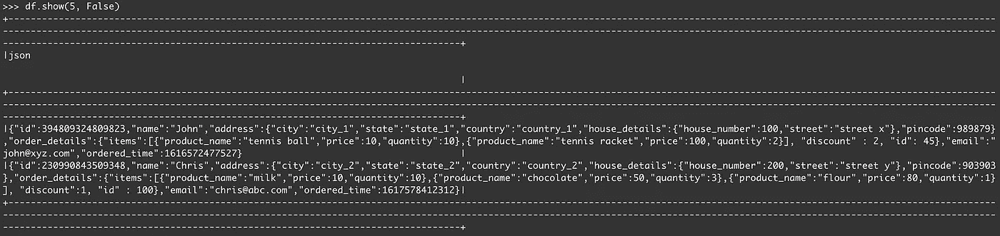
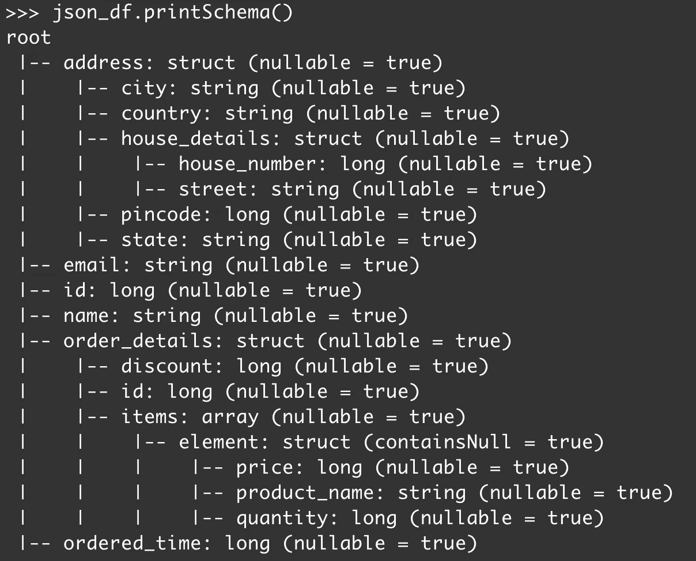
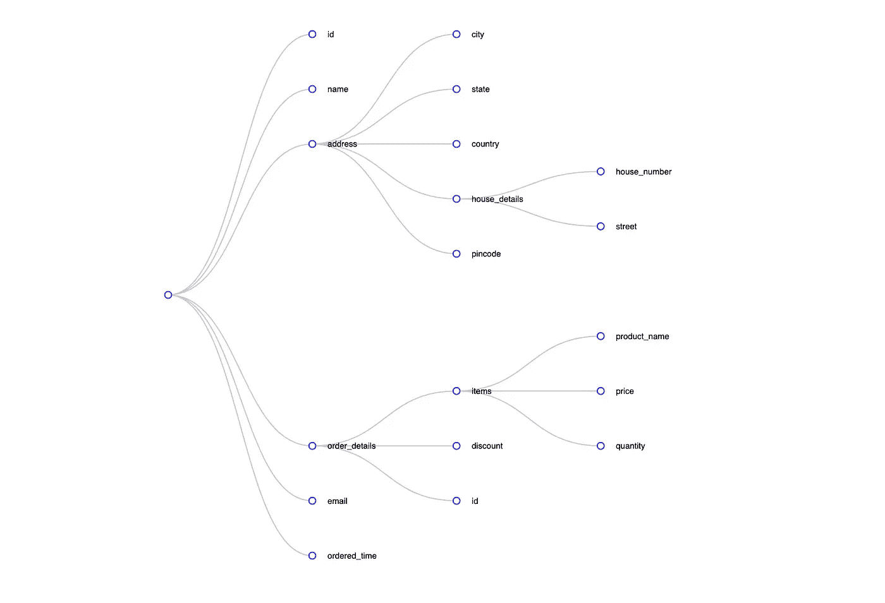
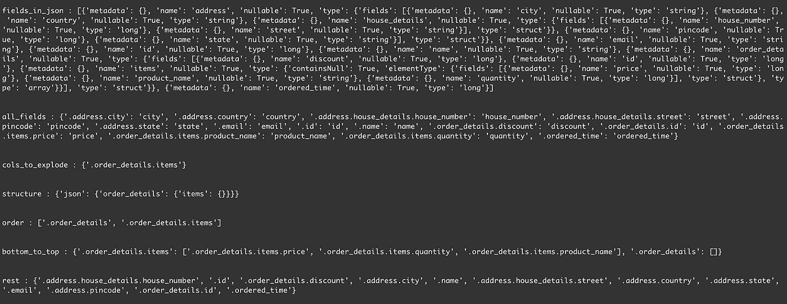
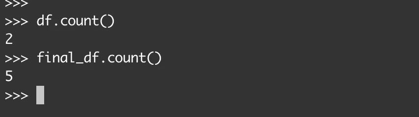
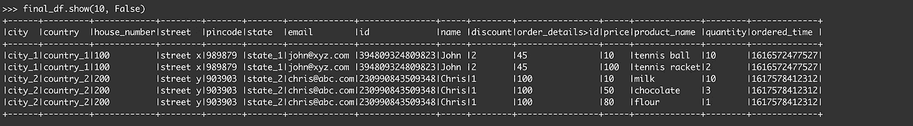

# 使用 PySpark 展平 JSON 记录

> 原文：<https://towardsdatascience.com/flattening-json-records-using-pyspark-b83137669def?source=collection_archive---------1----------------------->

## 使用 Apache PySpark 通过嵌套模式结构扁平化 JSON 数据


照片由[帕特里克·托马索](https://unsplash.com/@impatrickt?utm_source=medium&utm_medium=referral)在 [Unsplash](https://unsplash.com?utm_source=medium&utm_medium=referral) 上拍摄

# 介绍

JavaScript Object Notation (JSON)是一种基于文本的、灵活的、轻量级的数据交换格式，用于半结构化数据。它大量用于在服务器、web 应用程序和联网设备之间传输数据。

通常，由服务或产品生成的事件都是 JSON 格式的。这些 JSON 记录可以有多层嵌套、数组类型的字段，这些字段又有自己的模式。此外，这些字段中有些是必填的，有些是可选的。因此，检索模式并只提取所需的列变成了一项单调乏味的任务。

本文介绍了一种方法，可以最大限度地减少检索 JSON 记录的模式以提取特定列的工作量，并展平作为输入传递的整个 JSON 数据。

# 履行

假设两个人从一个在线交付平台订购了商品，生成的事件作为 ORC 文件被转储到 S3 的一个位置，这里是`s3://mybucket/orders/`。要读取这些记录，请执行这段代码:

```
df = spark.read.orc('s3://mybucket/orders/')
```

当您执行`df.show(5, False)`时，它最多显示 5 条记录，而不会截断每一列的输出。



JSON 记录

让我们打印 JSON 的模式并可视化它。为此，执行这段代码:

```
json_df = spark.read.json(df.rdd.map(lambda row: row.json))
json_df.printSchema()
```



JSON 模式

> **注意:**从一个路径中读取一个文件集合可以确保在那些文件中存储的所有记录上捕获一个全局模式。

JSON 模式可以被视为一棵树，其中每个字段都可以被视为一个节点。如果一个字段包含子字段，那么该节点可以被认为具有多个子节点。该模式的树如下所示:



JSON 模式的树形可视化

JSON 数据中的第一条记录属于一个名叫`John`的人，他订购了 2 件商品。第二条记录属于订购了 3 件商品的`Chris`。我们算法的期望是提取所有字段并生成总共 5 条记录，每条记录对应一个项目。

展平这些 JSON 记录的关键是获得:

1.  每个 ***叶节点*** 的路径(这些节点可以是 string、bigint 或 timestamp 等。类型，但不是结构类型或数组类型)
2.  ***展开顺序*** (数组类型时，提供列展开的顺序)。
3.  ***打开顺序*** (如果 struct-type 是 array-type 的父级，则提供打开列的顺序)。

## 代码实现

使用火花配置至关重要:

```
--conf spark.sql.caseSensitive=True
```

由于可能有不同的字段，考虑到 spark 的默认不区分大小写，具有相同的叶名称(例如产品& Product)是本质上不同的字段，但由于 spark 的默认不区分大小写属性，被认为是相同的。

首先导入必要的库:

```
import json
```

接下来，定义类变量:

类别变量

其中`get_fields_in_json`函数定义为:

get _ fields _ in _ json

下面给出了每个类变量的简要说明:

1.  `fields_in_json`:该变量包含模式中字段的元数据。
2.  `all_fields`:该变量包含叶字段的路径和将出现在扁平数据帧中的列名之间的 1-1 映射。
3.  `cols_to_explode`:该变量是包含数组类型字段路径的集合。
4.  `structure`:该变量是一个字典，用于逐步节点遍历到`cols_to_explode`中的数组类型字段。
5.  `order`:这是一个包含数组类型字段展开顺序的列表。*如果数组类型在结构类型内部，则结构类型必须首先打开，因此必须出现在数组类型之前。*
6.  `bottom_to_top`:这包含一个字典，其中每个键映射到每个数组类型/结构类型字段的互斥叶字段列表*(如果结构类型字段是数组类型字段的父字段)。*
7.  `rest`:包含可直接访问的字段，无论有无点符号。

然后，所有这些类变量都用于执行字段的分解/打开。但是这些类变量是如何计算的呢？让我们逐步分析一下。

**步骤 1:** 当从`AutoFlatten`类的对象调用`compute`函数时，类变量得到更新，其中 compute 函数定义如下:

计算

每个类变量看起来都像这样:



类别变量(图像)

**步骤 2:**`unnest_dict`函数递归地解除`json_schema` 中字典的嵌套，每当遇到叶节点时，将字段的层次路径映射到`all_fields`字典中的列名(在 `*is_leaf*` *函数*中完成*检查)。此外，它还存储了`cols_to_explode`集合中数组类型字段的路径。*

是叶子

unnest_dict

**步骤 3:** 接下来，通过检查`all_fields`的元素是否以`cols_to_explode`中的任何元素开始来获得所有的叶字段，并将其存储在`all_cols_in_explode_cols`中。

**步骤 4:** 使用`all_cols_in_explode_cols`，`rest`被计算，其包含使用或不使用点符号可直接访问的字段，使用简单的集合差运算。

**步骤 5:** 现在，使用`cols_to_explode`来计算`structure`，该`cols_to_explode`用于逐步遍历节点以到达数组类型字段。

获取 _ 结构

**步骤 6:** 接下来，对`structure`执行 BFS 遍历，以获得数组分解必须发生的顺序，该顺序存储在`order`类变量中。

提取 _ 订单

**第 7 步:**最后用`order`和`all_cols_in_explode_cols`获取`order`中每个元素的所有 ***互斥字段*** 。为此，使用自下而上的方法，即`order`列表被反转，并且`order`中每个字段内的叶字段被映射并存储在`bottom_to_top`中。*注意* `*'.order_details'*` *键在* `*bottom_to_top*` *中没有元素它。如果它下面有叶节点，这些节点将可以直接访问并出现在* `*rest*` *中。*

结合所有的函数，这个类看起来像这样:

AutoFlatten 类

为了利用类变量来打开/分解，执行以下代码块:

这里，从 S3 路径读取 JSON 记录，并计算全局模式。然后，在创建初始化所有类变量的`AutoFlatten`类的对象时，传递这个模式。当从`AutoFlatten`类的对象调用`compute`函数时，类变量被更新。

打开/分解时，所有第一级列被选中，并且`rest`中的列尚未出现。目标名称上有一个计数器，它对重复的目标列名称进行计数。任何计数大于 1 的目标列名都被重命名为`<path_to_target_field>`，每个级别用一个`>`隔开。这些字段的所有路径都被添加到`visited`路径集中。

然后检查`order`是否为空。空的`order`列表意味着模式中没有数组类型的字段，反之亦然。如果`order`列表不为空，则遍历`order`中的每个元素，并基于其类型数组/结构*(仅当数组类型字段是结构类型字段的子字段时出现)*，分别展开/打开列，并且仅选择那些尚未出现的列。此外，重复的目标列名由`<path_to_target_field>`替换，每个级别由`>`分隔，这些字段的路径被添加到`visited`路径集中。

我们来看看`final_df`里出现了哪些栏目。

```
>>> final_df.columns
['city', 'country', 'house_number', 'street', 'pincode', 'state', 'email', 'id', 'name', 'discount', 'order_details>id', 'price', 'product_name', 'quantity', 'ordered_time']
```

由于`order_details`字段中的`id`是重复的，因此将其重命名为`order_details>id`。

查看初始数据帧`df`和`final_df`数据帧的计数，我们知道阵列爆炸已经正确发生。



数据帧计数

现在让我们通过查看属于`final_df`数据帧的记录来进行验证。



最终 _ 测向数据帧

如您所见，购买的每件商品都有一条记录，并且该算法按预期工作。

# 注意事项

使用这种方法时，需要记住一些事情。

1.  所有的目标列名都是通过使用 JSON 模式的元数据中的叶节点名来检索的。
2.  如果您在受约束的环境中工作，则在执行拼合后，必须根据合规标准更改列名。
3.  合并`regexp_replace`、`epoch to timestamp conversion`、`string to timestamp conversion`等被视为对从每一列提取的原始数据的定制转换。因此，它必须在执行*自动展平*操作后由开发者定义。
4.  注意不要暴露个人身份信息(PII)列，因为此机制会暴露所有列。您必须对这些列执行定制操作，比如散列。

就是这样！我希望这能帮助那些希望简化 JSON 数据而不需要定义和传递模式来提取所需字段的人，以及那些希望学习新知识的人。

感谢 [Sandesh](https://medium.com/u/819a37e8be1b?source=post_page-----b83137669def--------------------------------) 在这件事上与我合作！

干杯！

**更新**:大家好，上面描述的操作是开始了解核心 autoflatten 机制的好方法。我已经为这里的设计了一个优化的方法(其关键或多或少是相同的),与文章中描述的方法相比，它避免了占用大量内存。您可以通过调用返回展平数据帧的`execute`函数开始。如果您有任何问题，请随时联系我！