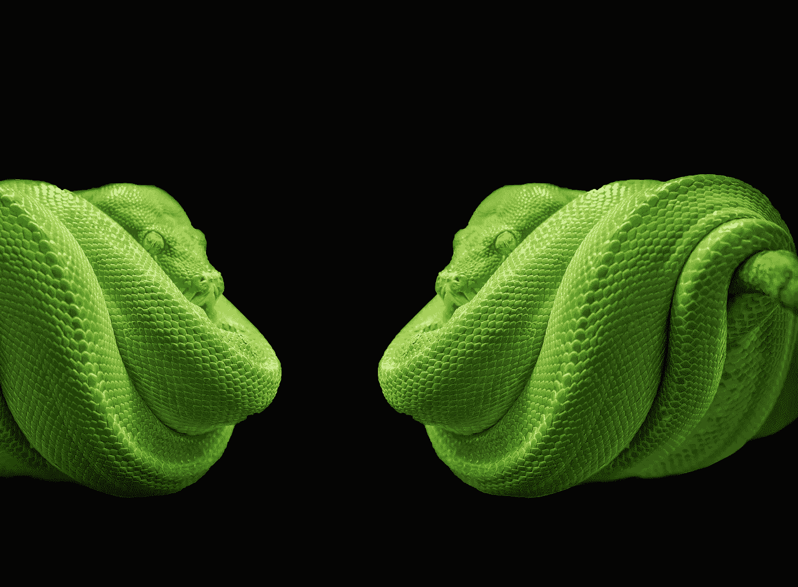
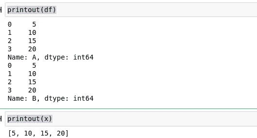

# 用 multipledispatch 实现 Python 中完美的参数多态性

> 原文：<https://towardsdatascience.com/flawless-parametric-polymorphism-in-python-with-multipledispatch-f26b75d69c5f?source=collection_archive---------23----------------------->

## 使用 Python 的多重调度模块使我的生活多样化



(图片由 [Pixabay](http://pixabay.com) 上的 [Blickpixel](https://pixabay.com/images/id-564817/) 拍摄)

# 介绍

在我对编程、数据科学和一般基于互联网的软件工程的探索中，我遇到了很多我喜欢的编程概念。我遇到了很多 API，很多很棒的工具，很多插件，还有很多我非常喜欢的应用程序。然而，每当我第一次熟悉它时，有一个泛型编程概念真的让我大吃一惊，那就是多重分派。

也就是说，虽然我以前使用过单一调度，当然也在几乎所有的范例中使用过，但是我以前真的从来没有在我的代码中使用过像多态性这样的想法。虽然世界上对多分派的介绍可能来自 ML 编程语言，但我对多态性的介绍是以一种叫做 Julia 的编程语言的形式出现的。本文还提供了一个笔记本，您可以使用它来查看 Python 中的多个调度会话的示例。以下是所用笔记本的链接:

<https://github.com/emmettgb/Emmetts-DS-NoteBooks/blob/master/Python3/Python%20Parametric%20Polymorphism.ipynb>  

# 朱莉娅

Julia 是一种编程语言，由 Viral B. Shaw 先生、Stephen Karpinski、Alan Edelman 和 Jeff Bezanson 领导，他们都是我认为的天才。这种语言很棒，因为它从类型到构造都很灵活且可伸缩。它主要是自己编写的，并且是 JIT 编译的。所有这些结合起来，使朱莉娅成为许多不同用途的强大选择。

这种新的编程语言让我印象深刻的是类型系统。Julia 下面的类型系统工作得非常好，在超严格和动态之间达到了很好的平衡，同时也表现得非常好，实际上允许你操作和转换类型。这真的是两全其美，这还是在我们开始深入研究 Julia 的主要特征之前，

> 多重分派范例。

不使用 Julia 的人不会意识到多重分派范例意味着什么，但是对于那些广泛使用过 Julia 的人来说，可以理解，使用多重分派，只需改变输入和输出，就可以完全定制类型。我有一篇关于我有多爱茱莉亚的文章，你可以在这里读到:

</how-julia-perfected-multiple-dispatch-16675db772c2>  

关于构造函数如何使用多重分派来改变 Julia 的范式，我有另外一个故事，附带一个视频，您可以在这里观看，它涵盖了多重分派 paraidgm 中的面向对象编程，以及另一篇深入研究构造函数的文章:

<https://medium.com/chifi-media/constructing-with-unknown-types-and-oop-in-julia-f3decc46d49> [## 在 Julia 中用未知类型和 OOP 来构造

medium.com](https://medium.com/chifi-media/constructing-with-unknown-types-and-oop-in-julia-f3decc46d49) </an-advanced-look-at-constructors-in-julia-5b428882dde8>  

朱莉娅的多重调度模式是多么令人惊讶，不谈恋爱是非常困难的。话虽如此，

> 我恋爱了。

# 朱莉娅有趣的位置

既然我已经永久地融入了这种令人惊叹的编程语言，我当然会跟踪它的进展。因此，我也对语言的不同方面、它的生态系统以及数据科学和软件世界的其他方面形成了自己的观点。我发现 Julia 现在处于一个非常有趣的位置——在这个领域介于 Python、R 和 Scala 之间。

朱莉娅现在似乎处于一个尴尬的阶段。编程语言仍然相当小众，那些使用它的人要么永远拿起它并爱上它，要么很快放下它。Julia 面临的最大问题是，该生态系统要赶上像 Python 这样的竞争生态系统还有很多工作要做。当然，Julia 的目标不是接管 Python，但是这种语言到底是如何在它旁边工作的呢？

鉴于 Julia 场景的不确定性，考虑到我编写了几种语言，而 Julia 和 Python 只是其中的两种，我想看看 Python 的一个模块可能会很酷，它采用了 Julia 的核心思想——多重调度，并将其实现到 Python 中。也许有些人会考虑使用这个包，因为它对某些用户来说肯定是有价值的。

# 该模块

我们将要学习的模块是 multipledispatch。这个模块的特别之处在于它的易用性。就像我们在 func-tools 中观察到的单一分派模型一样，这个模块允许使用一个简单的装饰器来改变类型与函数交互的方式。

</functools-an-underrated-python-package-405bbef2dd46>  

此外，如果你想学习更多关于装饰者的知识，并学习一些很酷的知识，我有另一篇文章是关于这个的:

</10-fabulous-python-decorators-ab674a732871> [## 10 个神话般的 Python 装饰者

towardsdatascience.com](/10-fabulous-python-decorators-ab674a732871) 

> 我真的很高兴我有足够多的文章向我的读者介绍更多我知道存在的知识，快乐学习！

# 使用多重分派

正如我上面简单提到的，使用这个模块非常简单。一旦模块被导入，我们可以简单地用我们想要分派到函数中的类型调用上面的函数。也就是说，解释如何实际使用该模块相对简单，只需导入该模块，然后在给定函数上方的装饰器中使用以下语法。另外，另一个旁注——我发现获得该文档的最好地方是 Github。当然，还有星选和叉选等。对于那些想要的人，这里有一个 Github 页面的链接:

<https://github.com/mrocklin/multipledispatch>  

每当我们导入这个模块时，我们不希望调用整个模块，这将破坏我们的修饰语法，只导入我们不需要的东西。这个库本质上提供了这一个模块和函数，所以我们真的没有必要或目的不直接导入它。

```
from multipledispatch import dispatch
```

既然已经导入了，让我们编写一个函数的快速示例集，以便在。我们的函数当然会有一个简单的指令，在这种情况下，它只会做一些基本的事情，比如按维度打印给定的类型。我们考虑一个一维数组，或者像我们 Pythonistas 所说的…

> 列表。

让我们写一个函数来打印出一个数组:

```
def printout(x : list):
    print(x)
x = [5, 10, 15, 20]
```

我们定义了一个新的函数 printout，它将简单地打印这个值。虽然我确定可能会有某种警方的指纹。DataFrame，接下来我们要做一个打印函数。然而，由于一个数据帧可以保存一个给定观察的多个维度，我们需要以不同于处理典型数组的方式来处理这种类型。

```
import pandas as pd
```

这是我想出的连续打印每个系列的小函数。

```
def printout(x : pd.DataFrame):
    for col in x:
        print(df[col])
```

现在，通过添加我们很酷的小 dispatch decorator，我们可以对这两种类型使用相同的打印输出调用。这将把我们的论点的类型，按照顺序和位置。

```
[@dispatch](http://twitter.com/dispatch)(list)
def printout(x : list):
    print(x)
```

我们为我们的熊猫数据框架做了同样的事情:

```
[@dispatch](http://twitter.com/dispatch)(pd.DataFrame)
def printout(x : pd.DataFrame):
    for col in x:
        print(df[col])
```

现在终于，同一个调用可以用于两者，并且将基于它们的类型调用不同的函数。

```
printout(df)
printout(x)
```



(图片由作者提供)

# 结论

参数多态真的很酷！—是我在 2019 年末写的一篇文章。准确地说，是 12 月 22 日，这意味着差不多两年前我在重复我今天重复的同一句话——

> 参数多态真的很酷！

另外，如果你想读那篇旧文章，你可以在这里读:

</parametric-polymorphism-is-really-cool-e6ac25f0fa53>  

到目前为止，参数多态性无疑是我最喜欢的编程概念之一。我认为能够以这种方式处理类型和函数真的很酷，因为它在代码中创造了很多流动性。当涉及到多重分派时，对方法的描述要详细得多，这鼓励了一种新的思维方式。多重分派通过别名和类型来定义方法，而不是通过别名定义方法。这给 Julia 带来了很多强大的能力，但也有一些非常激进的 Python 应用。

正如我在我的关于装饰者的文章中所说的，我喜欢装饰者是因为

*   有很多很棒的。
*   它们很容易使用。
*   它们会严重改变 Python 代码。

我希望这篇文章深入探讨了装饰者的可能性，甚至有可能启发一些未来装饰者的使用。我发现函数参数的类型转换在很大程度上除了文档之外一无是处，所以能够看到像这样操作方法以使 Python 适用于这种范式是非常好的。非常感谢您的阅读，我希望这篇文章能够启发大量新的 Pythonic 知识！