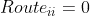
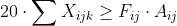
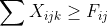
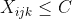
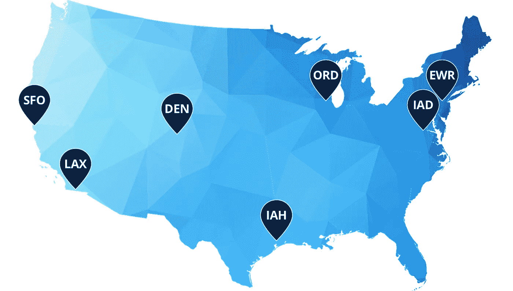
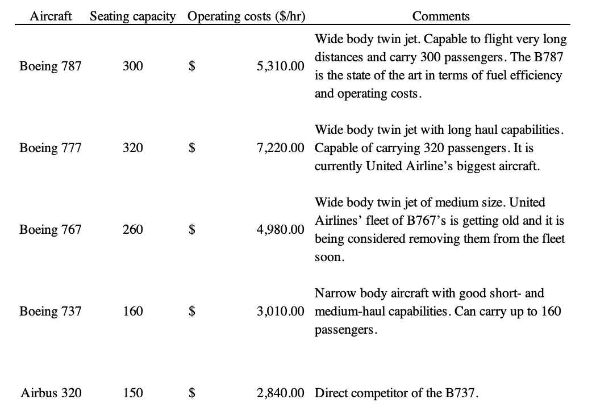
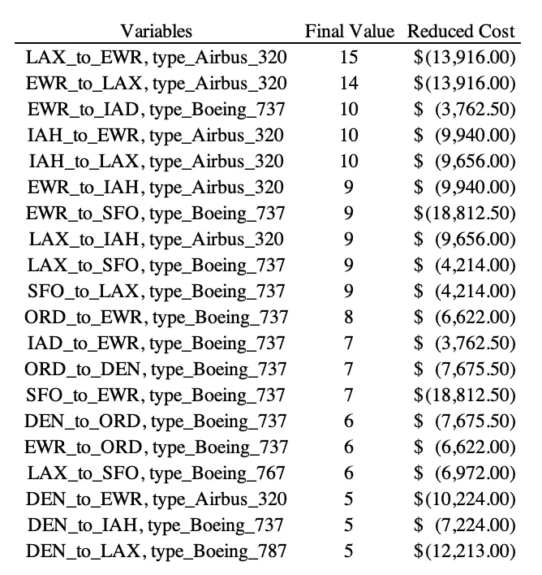
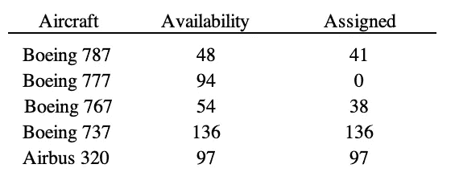
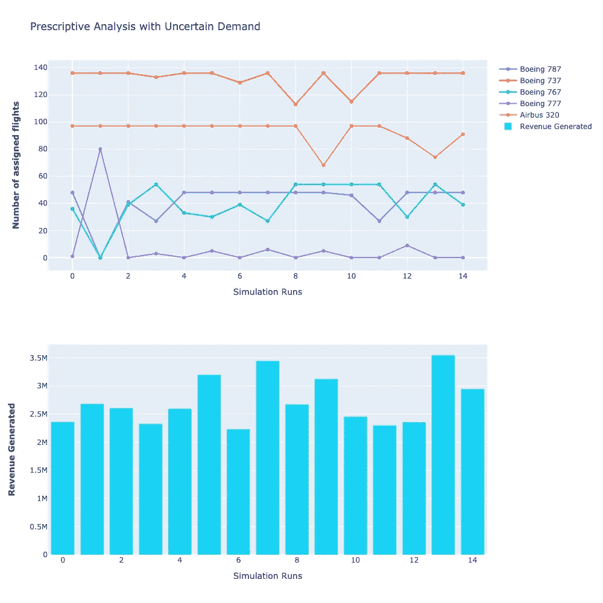

# 疫情期间的船队管理:一个优化问题

> 原文：<https://towardsdatascience.com/fleet-management-during-the-pandemic-an-optimization-problem-6a2572273c6f?source=collection_archive---------16----------------------->

## [行业笔记](https://towardsdatascience.com/tagged/notes-from-industry)

## 航空公司机队的理想配置是什么，才能实现利润最大化？

[梁杰森](https://unsplash.com/@ninjason)在 Unsplash 上

新冠肺炎的经济影响正被广泛地感受到，尤其是在航空业。航空公司已采取严厉措施，尽可能多地保留流动性，以便在中短期内盈利。这个项目的目标是使用航空公司的机队和目的地信息创建一个程序，以最大限度地提高其航班的效益。这意味着该模型试图找到既能增加收入又能降低成本的飞机和航线的最佳组合。对于这个项目，使用了美联航的机队数据和国内目的地。

## 目录

∘ [目录](#b25b)
∘ [问题描述及表述](#6732)
∘ [数值实现](#8ba1)
∘ [结果](#a758)
∘ [问题延伸:不确定需求](#38c8)
∘ [结论](#7865)
∘ [项目代码](#da12)
∘ [参考文献](#9d22)

## 问题描述和表述

为了使这个问题变得现实，重要的是要考虑到其他因素，这些因素也被称为约束。

第一个约束很简单，但对模型的正常运行很重要。简而言之，这种约束确保飞机不会服务于从给定机场到同一机场的航线。例如，一架飞机不能从丹佛飞往丹佛，因为这不会给公司带来任何价值。

*   其中 I 和 j 是机场(这里 i=j)

关于客户需求，覆盖两个机场的所有航班的座位总数必须高于或等于该航线的需求。

*   其中 X 是某一类型的平面总数
*   s 是座位的供应量

假设一架飞机每天总共只能在空中飞行 20 个小时(其余时间是周转时间)，那么该航线上所有飞机的所有这些小时的总和必须大于或等于两个目的地之间的飞行时间乘以两个机场之间每天需要的航班总数。每天 20 小时的限制可以解释为需要给机场员工时间给飞机加油，安排乘客登机并为下一次飞行做准备。

*   其中 F 是所需的每日航班频率

航班频率是一个需要添加到模型中的重要约束条件，也就是说，在两个目的地之间，每条航线都必须由机群覆盖一定的次数。例如，联合航空公司提供的所有航班中需求最高的芝加哥-纽瓦克航班。一些乘客对早上的航班感兴趣，而其他人可能对晚上的航班感兴趣。这个约束确保了当飞机被调度到目的地时，所有这些选项都被覆盖。

最后，这最后一个约束可能看起来微不足道，但如果不添加到模型中，很容易打乱航空公司的调度流程。这限制了公司可以使用的每种类型飞机的总数。简单地说，如果联合航空公司拥有 48 架波音 787，他们不能有超过 48 架飞机被分配到不同的航线。

## 数值实现

为了简化问题，本文只关注最大化 7 个枢纽城市的收入，这意味着优化总共 42 条航线上的飞机分布，因为客户可以从这 7 个地方中的一个出发，前往其他 6 个枢纽。7 个集线器如图 1 所示。

图 1:unitedaviate.com的联合航空枢纽(CLE 和口香糖被移除)

关于飞机的分配，截至 2020 年 10 月，联合航空公司的机队由 806 架飞机组成，全部由波音或空客制造。国内，美联航只用 5 架。表 1 包括每架飞机的座位容量、运营成本(美元/小时)以及联合航空公司为其国内航班预留的每种类型飞机的数量。

**注:本项目中使用的所有数据都是虚构的，仅代表近似值。**

表 1: *联合国产飞机描述*

**这是** [**代码**](https://github.com/arguz95/United/blob/main/Project_United.ipynb) **(GitHub)上的纸浆(Python)和结果。**

## 结果

在 Jupyter 上运行该程序后，我们得到了总平面分布和它们的路线。单个飞机类型分布的 20 个最大值如表 2 所示。最终值列描述了利润最大化所需的飞机总数。此外，通过降低成本一栏，可以解释为纽瓦克至旧金山的航班(使用波音 737)每次旅行的总收入为 18，812.50 美元，这使其成为该模型中利润最高的航线。另一方面，使用同样的飞机，每趟纽瓦克到丹佛的航班只能带来 3762.50 美元的利润，这是我们覆盖的所有航线中利润最少的一条。最后，表 3 显示了总需求和航线方案的可用和指定机队。

表 2: *美国联合航空公司飞行的前 20 条航线*

表 3:可用和分配的飞机

## 问题延伸:需求不确定

今天，航空业是世界上竞争最激烈的行业之一，每年创造数十亿美元的收入，累计利润率不到 1%。该行业的低利润率可能是由于公司获得的利润在很大程度上受到各种因素的不确定性的影响。价格和路线需求在短时间内变化很大，这迫使企业不断发展，并根据不断变化的趋势改变其战略。在新冠肺炎之后，事情变得更糟，因为世界各地实施的各种旅行限制导致需求骤降。

在这个项目中，历史数据被用来估计每条航线的平均需求以及与飞行相关的成本。但是，该模型没有考虑上述不确定性。为了使项目更能代表现实世界，我们开发了一个随机模型，作为解决方案的扩展，以考虑影响价格和需求可变性的因素。在这个模型中，我们假设每条路线的价格和需求以正态分布的方式变化，围绕我们在原始模型中设置的真实平均值。我们模拟了每架飞机每次飞行的需求和成本，正态分布，每条航线的成本和需求的标准偏差分别为 1000 和 100。在前疫情时代，我们可以将这些不确定的需求归因于工资膨胀和工会罢工等各种因素。根据美国运输局的数据，从 2007 年到 2017 年，航空旅行的需求稳步增长，增幅约为 15%。因此，劳动力需求上升，员工要求获得更高的服务报酬。这对联合航空公司的业务产生了重大影响，增加了极其多变的规划范围。这一点，再加上来自其他航空公司的竞争，使得每条航线的需求大相径庭，从而导致低利润率和脆弱性。

价格是另一个因经济影响而彻底改变的因素。石油、燃料、着陆费、餐饮和机组人员费用的价格是不可预测的，如果忽视它们的可变性，可能会给公司带来灾难。这里我们可以注意到的一点是，一个航班在空中运行得越多，公司支付的可变成本就越少。因此，像航班取消或不利的天气条件等情况可能会增加可变费用，并对利润产生影响。此外，不同的航班每海里的费用也不同。举例来说，一架喷气式飞机在海里方面会更贵，但是它可以飞得更快，从而减少飞行时间。

具备上述条件后，我们可以进行 14 次试验的模拟，每次对不同飞机的每条航线都有不同的需求和价格(见图 2)。从这次试验中，我们注意到，随着每架飞机每次试验的最佳飞行组合数的变化，最佳条件下的总利润在 200 万美元到 400 万美元之间。

图 2:14 个不同模拟的指定航班数量和产生的收入

这一模型让我们更好地理解经营航空公司业务所涉及的不确定性和风险，因为我们经常被迫预测最佳航班时刻表、乘客需求和每条航线可能产生的可变成本。这是优化和运筹学在航空领域至关重要的主要原因之一，各公司都在积极投资，以增强其分析能力，从而领先于竞争对手。

**这是随机模型的** [**代码**](https://github.com/arguz95/United/blob/main/Project_United_Stochastic.ipynb) **(GitHub)。**

## 结论

除了按照我们之前的分析建立每条航线所需的不同机队，我们对该航空公司的建议是暂时停飞波音 777，使用更高效的飞机，如波音 737 和空客 A320。我们相信，使用适当的时间安排和运营管理技术，美联航在困难时期仍能获得正利润。

尽管这个实验充满了真知灼见，但它并不完全适合现实世界，因为它并不完全代表联合航空公司开展业务的程度(例如，货运部门、飞机租赁合同、旅游套餐、忠诚计划和公司联盟)。有数百个二级机场和外部因素没有包括在这个模型中。

Unsplash 上的 DOMA goj OSI

## 项目代码

github:[https://github.com/arguz95/United](https://github.com/arguz95/United)

## 参考

[1] Garrow，l .，Lurkin，v .新冠肺炎如何影响和重塑航空业。j 收入定价管理 20，3–9(2021)。[https://doi.org/10.1057/s41272-020-00271-1](https://doi.org/10.1057/s41272-020-00271-1)(https://link . springer . com/article/10.1057/s 41272-020-00271-1 # citea)

[2][https://www . BCG . com/publications/2020/seven-trends-shape-airline-industry](https://www.bcg.com/publications/2020/seven-trends-reshape-airline-industry)

[3][https://to70 . com/how-to-use-uncertainty-to-make-better-plans/](https://to70.com/how-to-use-uncertainty-to-make-better-plans/)

[4][http://www . OECD . org/coronavirus/policy-responses/新冠肺炎和航空业影响和政策反应-26d521c1/](http://www.oecd.org/coronavirus/policy-responses/covid-19-and-the-aviation-industry-impact-and-policy-responses-26d521c1/)

***随时联系我们！***

 [## 阿诺·古兹曼-安妮-麦吉尔大学-加拿大| LinkedIn

### 我精力充沛，充满活力，通过促进沟通、团队合作和提供领导能力，有效地开展项目…

www.linkedin.com](https://www.linkedin.com/in/arnaud-guzman-ann%C3%A8s/)  [## 加拿大魁北克蒙特利尔大学管理学院

### 我是麦吉尔大学的一名分析学管理硕士，对数据科学和…

www.linkedin.com](https://www.linkedin.com/in/ramprakash-babu/)  [## 阿方索·卡韦略-UX/界面顾问-罗杰斯通讯| LinkedIn

### 查看阿方索·卡贝略在全球最大的职业社区 LinkedIn 上的个人资料。阿方索有 6 份工作列在…

www.linkedin.com](https://www.linkedin.com/in/alfonso-cabello/)  [## 朱尔斯·齐林斯基-麦吉尔大学助教| LinkedIn

### 在分析管理硕士学生专门在使用和解释数据使用机器学习…

www.linkedin.com](https://www.linkedin.com/in/jules-zielinski/)