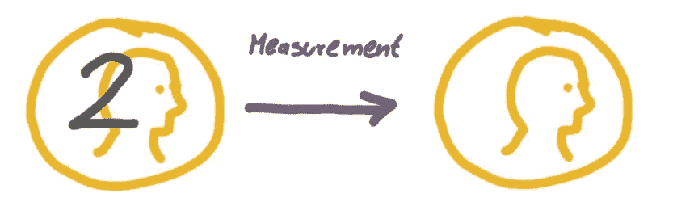
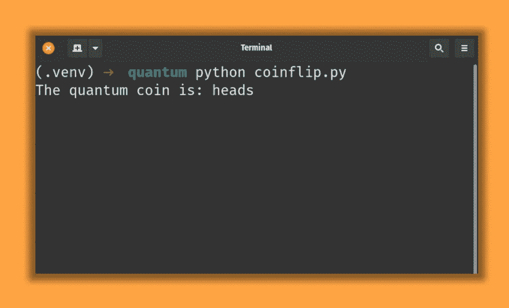
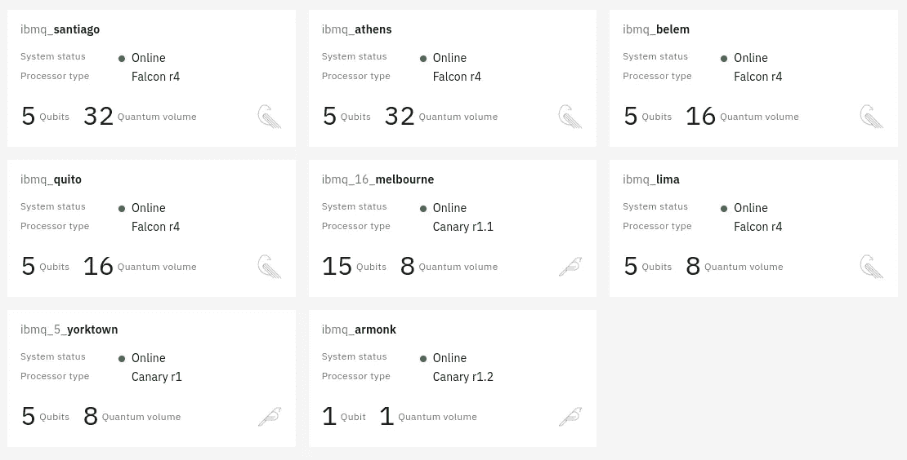

# Python 中的量子计算机抛硬币纯粹是一种乐趣

> 原文：<https://towardsdatascience.com/flip-a-coin-on-a-real-quantum-computer-in-python-df51e5f2367b?source=collection_archive---------12----------------------->

## 用一个有趣的自己动手的初学者实验产生真正的随机性。


图片作者([marcelmoos.com](https://marcelmoos.com))，图标作者 [mynamepong](https://www.flaticon.com/authors/mynamepong) 和 [Freepik](https://www.flaticon.com/authors/freepik)

普通计算机可以产生真正的随机数。这是传统计算机在不依赖外部资源的情况下无法做到的。传统计算机只能产生看似随机但实际上是根据固定规则计算出来的数字。这些数字被称为*伪随机*。如果我们生成足够多的伪随机数，我们会注意到它们最终会重复出现。


为了生成真正的随机数，传统计算机会测量外部事件，如大气噪音或你按键的准确时间。

相比之下，**量子计算机天生随机**这既是祸也是福。一方面，很难理解量子计算机是如何得出特定结果的。另一方面，随机量子现象是这些强大的计算机运行的原因。

那么为什么不使用量子计算机来做一次真正随机的硬币投掷呢？

> 用量子计算机来做抛硬币是不是有点矫枉过正？*最肯定！*
> 
> 但这也很有趣吗？*哦耶！*

所以让我们开始吧。你所需要的只是一个互联网连接和 python。下面是我们要做的事情:IBM 为每个人免费提供真正的量子计算机。

如果你想跟进，只需在 quantum-computing.ibm.com 创建一个账户，并获得你的 API 令牌与 IBM 的量子计算机进行交互。

我们将使用 [python 库 qiskit](https://qiskit.org/) 构建一个简单的量子电路，在 IBM 的量子计算机上执行。我们的量子电路将只由一个代表硬币的量子位组成。我们将操纵量子位处于 0(头)和 1(尾)的叠加状态。

> 就像薛定谔的猫同时又死又活一样，我们的硬币将同时是正面和反面。

当我们测量硬币时，当我们看一看，硬币将真正随机地以概率结束正面或反面。



首先，我们安装 python 库 *qiskit* :

```
pip install **qiskit**
```

然后我们用 qiskit 来构造我们的量子电路:

在第 4 行中，我们用一个量子位(我们的硬币)和一个经典位来创建量子电路，以存储测量结果。下一行将 [**阿达玛门**](https://en.wikipedia.org/wiki/Quantum_logic_gate#Hadamard_(H)_gate) 应用到我们的硬币上，**将硬币的正面和反面叠加在一起。**最后一行测量我们的硬币，并将结果存储在经典位中。

> 代码不执行操作，只是定义我们的量子电路应该是什么样子。

我们可以用下面的代码在 IBM 的量子计算机上执行这个电路:

代码首先用给定的密钥建立一个到 IBM Quantum API 的认证连接。然后，我们指定希望在名为“ibmq_armonk”的量子计算机上执行我们的电路。

参数“shots”指定我们只想执行一次循环——我们只想掷一次硬币。之后，代码从结果对象中提取硬币投掷的结果并打印出来。



量子硬币翻转的结果

我们在量子计算机“ibmq_armonk”上执行了我们的代码。IBM 提供多台量子计算机。在 IBM Quantum 平台上的仪表板中，我们可以看到哪些机器可用，它们有多少量子位，等等。取决于所选择的量子计算机有多忙，我们的掷硬币迟早会完成。



quantum-computing.ibm.com[的免费量子机器](https://quantum-computing.ibm.com)

在继续我们的日常工作之前，我们必须反思我们刚刚到底做了什么。**只需运行 python 代码，获得结果，然后忘记我们刚刚通过一次击键激活了哪些令人惊叹的技术，这太容易了。**

100 年前，量子力学刚刚发展起来，并困扰着这个星球上有史以来最聪明的头脑。今天，按下回车键，我们发出指令，绕地球运行一个量子回路。发送到一台量子计算机，其工作温度刚好高于绝对零度(-273.15°C 或 459.67°F)，比外层空间冷几个数量级。

我们向这样一台机器发送指令，以精确操纵单个孤立量子系统的状态，使其测量值与真正随机的硬币投掷相对应。如果这还不能让你起鸡皮疙瘩，我不知道还有什么可以。

觉得这个故事有趣？你可以在这里成为灵媒会员来支持我的写作:[medium.com/@mmsbrggr/membership](https://medium.com/@mmsbrggr/membership)。你将获得所有媒体的访问权，你的部分会员费将直接支持我的写作。

欢迎在 LinkedIn 上向我提出私人问题和评论。我*不是以任何方式隶属于 IBM 的*。如果你喜欢这篇文章，让我告诉你我的简讯:【marcelmoos.com/newsletter。