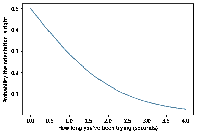
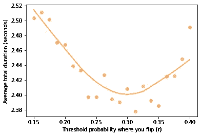
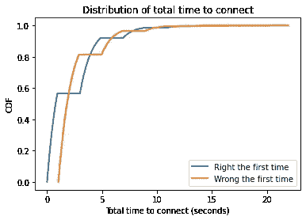
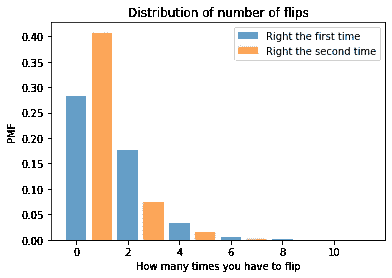

# 翻转 USB 连接器

> 原文：<https://towardsdatascience.com/flipping-usb-connectors-5ac65ea9f355?source=collection_archive---------23----------------------->

## [实践教程](https://towardsdatascience.com/tagged/hands-on-tutorials)

## 贝叶斯决策分析显示为什么你必须翻转 USB 连接器两次

艾伦·唐尼

我不是第一个观察到有时需要尝试几次才能插入 USB 连接器(特别是矩形的[A 型连接器](https://en.wikipedia.org/wiki/USB)，不可逆)。有关于它的[迷因](https://knowyourmeme.com/memes/usb-insertion-issues)，有关于它的[漫画](https://www.smbc-comics.com/?id=2388)，而且在 Quora 这样的网站上，[人](https://www.quora.com/Why-do-you-always-have-to-flip-a-USB-twice-when-trying-to-plug-it-in-Shouldn-t-it-have-gone-in-the-first-time-when-you-had-it-the-right-way) [有](https://www.quora.com/There-is-a-50-chance-of-plugging-in-a-USB-cable-the-right-way-on-the-first-try-Why-does-it-only-happen-20-of-the-time-when-I-do-it) [问](https://www.quora.com/Why-doesnt-the-USB-go-in-the-first-time-but-does-after-youve-turn-it-a-few-times) [关于](https://www.quora.com/People-that-can-plug-the-USB-in-on-their-first-try-How) [它](https://www.quora.com/Why-cant-we-plug-in-USB-devices-correctly-the-first-time)不止一次。

杰斯·贝利在 [Unsplash](https://unsplash.com/?utm_source=unsplash&utm_medium=referral&utm_content=creditCopyText) 上拍摄的照片

但我可能是第一个使用贝叶斯决策分析来找出插入 USB 连接器的最佳策略的人。具体来说，我算出了你翻第一面要试多久，再翻第二面要试多久，第三面要试多久，等等。

当然，我的分析是基于一些建模决策:

1.  让我们假设连接器处于正确方向的初始概率是 0.5；
2.  如果是，成功所需的时间遵循平均为 1.1 秒的[指数分布](https://en.wikipedia.org/wiki/Exponential_distribution)；
3.  翻转连接器需要 0.1 秒。

有了这些假设，我们就可以开始了。

# 贝叶斯定理

第一步是计算出连接器处于正确方向的概率，作为你尝试了多长时间的函数。

例如，假设连接器方向正确的先验概率为 0.5，而您已经尝试了 0.9 秒。你可能会开始怀疑自己是否做对了。

为了计算后验概率，我们将从 0.9 秒内无法连接的可能性开始，给定方向:

*   如果你站在错误的一边，你失败的可能性是 100%。
*   如果你在右边，可能性由指数分布的[生存函数](https://en.wikipedia.org/wiki/Survival_function)给出，即 exp(—*λt*，其中 *λ* 是速率参数， *t* 是时间。

因此，对于连接器方向正确的假设，似然比是 exp(*λt*):1。

现在可以方便地使用对数比形式的贝叶斯定理:

log*O*(*H*| D)= log*O*(*H*)+log*LR(D)*

在哪里

*   log *O* ( *H* )是假设的先验 log odds，在我们看到数据之前，
*   log *O* ( *H* |D)是假设的后验对数赔率，我们看到数据后，和
*   log *LR(D)* 是两种假设下数据的对数似然比。

由于似然比是 exp(–*λt*)，对数似然比是 *λt* ，因此我们可以写为:

log*O*(*H*| D)= log*O*(*H*)*λt*

给定后验对数概率，我们可以计算出你站在正确一边的概率，作为你尝试了多久的函数。下图显示了结果:

经过几秒钟的摆弄，你应该有理由相信连接器的方向是错误的。

我们可以从两个方向阅读这个图表:考虑到你已经摆弄了多长时间，你可以查找你在正确一边的概率。或者，给定一个目标概率，你可以查一下到达那里需要多长时间。这对下一步很有用。

# 战略

现在让我们来思考如何将信念转化为行动。我将从一个猜想开始:我怀疑最佳策略是在第一面尝试，直到正确定向的概率下降到某个阈值以下，我将它称为 *r* ，然后在第二面尝试，直到概率再次下降到该阈值以下，并根据需要重复。

为了实现这个策略，我们可以使用上一节的结果来计算在给定先验概率的情况下，后验概率降到阈值以下需要多长时间，我称之为 *p* 。

我编写了一个 Python 函数来模拟这个过程，同时跟踪总时间和翻转次数。以下是步骤:

1.  基于 *p* 和 *r* ，计算翻转前的*最大尝试时间*。
2.  如果我们站在错误的一边，我们就不会成功，所以将*最大时间*加到总数上，翻转连接器，然后转到步骤 1。
3.  否则，从指数分布中随机抽取一个*连接时间*。
4.  如果*连接时间*小于*最大时间*，则表示我们成功了，所以将*连接时间*加到总数上，然后返回总时间和翻转次数。
5.  否则，将*最大时间*加到总数上，翻转连接器，转到步骤 1。

模拟的细节在一个 Jupyter 笔记本里，你可以在 *Think Bayes* 网站或者在 Colab 上运行[阅读。](https://colab.research.google.com/github/AllenDowney/ThinkBayes2/blob/master/examples/usb.ipynb)

对于 *r* 的一系列值，我多次运行模拟，50%的时间从正确的方向开始，并计算连接的平均时间。结果如下:

圆点示出了不同阈值概率的模拟结果。该线显示了结果的局部回归。

当 *r* 接近 0.3 时，平均连接时间最小。这意味着我们应该继续尝试第一面，直到我们认为有 30%的机会方向是正确的——这需要大约 0.9 秒——然后尝试第二面。

在翻转之后，我们认为有 70%的机会方向是正确的。我们应该继续尝试，直到它再次下降到 30%——这需要大约 1.8 秒——然后再次翻转，重复直到我们连接上。

# 几个空翻？

现在我们用 *r* 的最优值来看看连接需要多长时间，要翻转多少次。

我从两个方向开始进行模拟，记录了总时间和翻转次数。下图显示了每个方向的总时间分布，以累积分布函数(CDF)表示。

如果我们从右边开始，平均时间是 2.2 秒，如果我们从错误的尺寸开始，平均时间是 2.6 秒。但有时需要两倍或更多的时间:如果我们从右边开始，第 90 百分位大约是 4.6 秒，否则是 5.6 秒。

这是翻转总数的分布。

第一次尝试连接的概率只有 28%，这意味着当我们以正确的方向开始时，我们几乎有一半的时间会翻转(50 次中有 22 次)。

最常见的结果是，我们翻转一次，大约 40%的时间。而臭名昭著的双翻的概率大概是 18%。

幸运的是，翻转三次或三次以上的情况很少见。

# 摘要

至此，我想我们已经解决了 USB 连接器的问题。

1.  我们使用贝叶斯定理(对数比数形式)来计算连接器方向正确的后验概率，这取决于您拨弄的时间。
2.  我们基于我的推测定义了一个策略，你应该继续摆弄，直到后验概率低于一个给定的阈值。
3.  给定连接(在正确方向上)的平均时间和翻转所需的时间，我们找到了最小化总连接时间的阈值概率。
4.  给定这个最优值，我们估计了总时间和翻转次数的分布。

这些结果解释了为什么翻转 USB 连接器不止一次是如此普遍，即使你从正确的方向开始。

可悲的是，我们的乐趣被越来越流行的 USB-C 连接器破坏了，这种连接器可以在两个方向上工作。

*这个例子是根据新二版中的方法* [*想贝叶斯*](https://greenteapress.com/wp/think-bayes/) *。关于贝叶斯决策分析的其他例子，参见* [*第九章*](https://allendowney.github.io/ThinkBayes2/chap09.html) *和* [*第十章*](https://allendowney.github.io/ThinkBayes2/chap10.html) *。*

*艾伦·唐尼(Allen Downey)是奥林学院的教授，著有《Think Python**、* [Think Stats](https://greenteapress.com/wp/think-stats-2e/) *以及其他关于软件和数据科学的书籍——所有这些都可以从* [*绿茶出版社*](https://greenteapress.com/wp/) *获得。他的博客* [可能想多了](https://www.allendowney.com/blog/) *，以关于贝叶斯统计和数据科学的文章为特色。*

*版权所有 2021 艾伦·唐尼。*

*许可:* [*归属-非商业性-共享 4.0 国际(CC BY-NC-SA 4.0)*](https://creativecommons.org/licenses/by-nc-sa/4.0/)