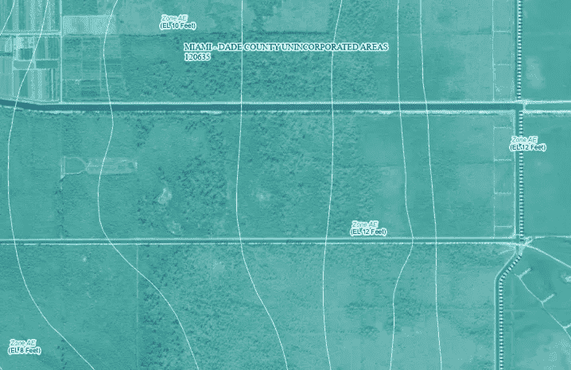

# 洪水:现代海岸线面临的新威胁

> 原文：<https://towardsdatascience.com/flooding-an-emerging-threat-to-the-modern-day-coastline-26581e81fb0e?source=collection_archive---------25----------------------->

## 气候变化如何影响房地产价值以及对现有投资组合的影响

图 0.1:作者提供的图片-洪水保险索赔支出如何因县而异，以及美国人口变化(净移民)如何因县而异。佛罗里达州和阿拉巴马州的申请人数最多，那里的人口也在增长。

图 0.2:作者图片:衡量 2010-2018 年房地产价值变化的指数；-3 表示数值下降幅度最大的区域；+3 表示值增加最多的区域。东海岸几乎所有的房产都在升值。

在本帖中，我们将进行一项案例研究，分析洪水对美国东海岸的社会和经济影响。极端洪水事件主要是由暴雨引起的，在最严重的情况下，会导致非常严重的财产损失。2012 年飓风桑迪造成了 700 亿美元的损失，并导致数百万人断电；哈维飓风造成了 1250 亿美元的损失；美国损失最大的飓风(截至 2021 年 2 月)是 2005 年的卡特里娜飓风，造成了 1610 亿美元的损失。

联邦紧急事务管理局(FEMA)是负责帮助社区从自然灾害的影响中恢复的联邦机构。作为帮助社区了解其当前和未来洪水事件风险的努力的一部分，他们开发了一种洪水风险制图工具，可生成如下图像:

(图片公开提供，由联邦应急管理局提供)图 0.3: [联邦应急管理局洪水风险区](https://hazards-fema.maps.arcgis.com/apps/webappviewer/index.html?id=8b0adb51996444d4879338b5529aa9cd)位于罗德岛州普罗维登斯(左)和迈阿密-戴德郡(右)。AE 区代表 1%的年洪水概率和 26%的 30 年期抵押贷款洪水概率。

似乎我们每天都发现新的信息来支持我们正在接近一个高潮临界点的论点，当[生活将在这个国家的大部分地区变得难以维持](https://www.nytimes.com/interactive/2020/09/15/magazine/climate-crisis-migration-america.html)。然而，科学和气候分析被如此成功地嘲笑、挑战和[否认](https://www.merchantsofdoubt.org/)，以至于许多美国人仍然认为政府投入了太多的资源 来解决这个问题。

我今天想研究的问题是:

> 美国那些特别容易遭受可怕洪水的地区的房地产价值是如何变化的？

从直觉上看，在洪水造成财产损失的概率为 1/4 的地区(超过 30 年)，财产价值应该会下降。或者也许不是——也许人们对洪水保险政策感到欣慰，这些政策承诺涵盖与洪水相关的损失，尽管长期以来保险公司在灾难发生时让其保单持有人束手无策，没有履行他们在 T2 的承诺。

如果你是一个有兴趣了解更多可用数据的读者，以了解洪水风险；或者，如果你是一个关心的公民，有兴趣了解更多关于气候变化的影响，并了解我们未来的世界可能是什么样子，这篇文章是给你的！

# 一.数据收集

最终，这项工作涉及汇总包含洪水损失、人口迁移、收入和房地产价值信息的多个数据集，同时考虑外部变量，如通货膨胀、人口密度以及各种地理位置的沿海与非沿海性质。总共收集和处理了 7 个数据集:

*   [洪灾损失](https://www.fema.gov/openfema-data-page/fima-nfip-redacted-claims-v1):(来源于 FEMA)
*   [房地产价值](https://www.zillow.com/research/data/)(来源于 Zillow)
*   [人口数据](https://factfinder.census.gov/faces/tableservices/jsf/pages/productview.xhtml?pid=PEP_2018_PEPANNRES&prodType=table)(来源于美国 Fact Finder 从“地理位置”中选择“县”；然后从“主题”中选择人员，然后选择“基本计数/评估”)
*   [通货膨胀数据](https://data.bls.gov/timeseries/CUUR0000SA0)(来源于 BLS)
*   [人口密度数据](https://www.cdc.gov/nchs/data_access/urban_rural.htm#Data_Files_and_Documentation)(来源于 CDC)
*   [沿海指标](https://www2.census.gov)(来源于美国人口普查；点击图书馆故事 2018/08 海岸线-县)
*   [收入数据集](https://data.world/tylerudite/2015-median-income-by-county/workspace/file?filename=2015+Median+Income+by+County.csv)(来源于数据世界)

设计了三个变量来执行这一分析。它们是:

*   **人口变化指数:**使用 2010 年至 2018 年的数据，计算出 3 年间总人口的变化百分比。人口是在美国县一级汇总的。每年的人口增量按人口密度分组，并按 z 值缩放(与蒙大拿州丹尼尔斯县相比，洛杉矶人口增加 1%意味着不同的事情)
*   **房地产价值指数:**计算为 Zillow 房产价值指数(ZHVI)在 3 年内的百分比变化。这些变化百分比按人口密度分组，并转换为 z 值(有了 z 值，我们可以对农村地区的房产价值变化与大城市的房产价值变化进行比较，农村地区往往更便宜)
*   **洪水保险索赔指数:**使用通货膨胀数据将历史洪水索赔支出调整为 2020 年初的美元。然后，对计算移民/ ZHVI 流量的相同 3 年期的调整后年度索赔进行汇总。这些县级索赔按县级人口进行划分，以标准化人口密度的影响。

为什么通量是以 3 年为周期计算的？只是因为每年人口和财产价值的变化往往是嘈杂的；与时间序列中的一年变化相比，从 n 年到 n+3 年的变化揭示了更强的正或负信号。

一个缺点是:理赔并不是洪水风险的最佳代理，因为，如前所述，保险公司通常会欺骗他们的客户，并编造理由来避免支付欠款。他们经常侥幸逃脱，因为大多数灾难受害者没有资源对保险巨头提起诉讼。如果任何人有兴趣进一步阅读这个主题，我强烈推荐纽约时报的文章[自然的赌场](https://www.nytimes.com/2007/08/26/magazine/26neworleans-t.html)，它讲述了保险公司如何在“无灾难”的情况下赌博，并最终出售远远超过他们在另一种情况下“灾难”的保单与此同时，保险公司严重低估了巨灾风险。当安德鲁飓风登陆时，人们一致认为损失不可能超过 60 亿美元。当灾难风险分析师卡伦·克拉克估计损失为 130 亿美元时，她被嘲笑为傻瓜。损失最终总计 155 亿美元。

因此，更好的洪水风险替代方法是收集实际的洪水数据，并围绕一段时间内测得的洪水水位设计一个指数。如果有人知道访问这些数据的好地方，我很乐意听听！

# 二。方法

理解财产价值如何改变(或不改变)以响应洪水事件的一般方法如下:

*   使用通货膨胀数据将历史洪水索赔支出标准化到一个通用等级
*   使用人口数据计算各县的移民趋势-某些县是否在稳步增长，或者是否存在导致人口下降的周期性“冲击”。这些“冲击”与洪水事件一致吗？
*   使用 Zillow 的 ZHVI 数据来追踪一段时间内的房地产价值

利用这些信息，我们可以想象哪里的洪水特别严重。迁移数据将告诉我们，人们总体上是离开这些地区还是向这些地区迁移。最后，财产价值数据将告诉我们，洪水热点地区的财产是增值还是贬值。

# 基础 EDA

在我们开始任何实际的分析之前，执行数据验证步骤来说服我们自己我们收集的数据是高质量的是很重要的。糟糕的数据+模糊的模型=无意义的见解。

## 验证迁移数据

为了验证我们的迁移数据，我们可以查看直方图。我们知道美国的人口一直在增长，所以我们预计这个直方图会偏于 0 以上。但是，由于我们跟踪的是县与县之间的变化，从技术上来说，一个县的发展不可能没有另一个县的衰落。所以我们预计会有一定程度的负迁移。一般来说，这个直方图通过了这些检查。

图 1 作者图片:移民的分布大致呈正态分布，略呈正态分布(表明总体人口增长；尽管一些县出现了人口下降的迹象)

图 2 作者图片:这是最终训练数据集的一个例子

图 3 作者图片:这是零膨胀数据集的极端情况，其中绝大多数保单的总理赔额为 0 美元。50 亿美元的数据点

## 验证索赔数据

为了验证我们的洪水索赔数据，我们可以看一个箱线图(图 3)。我们期望这里有一个零膨胀的情节:大多数保险单最终根本不会支付任何索赔。

此外，图 3 中最右边的数据点代表近 50 亿美元的索赔。这里需要注意的一个细微差别是，这并不代表一个特定的索赔，而是代表跨越 3 年期的总索赔数*(经通胀调整)*(在上面的数据集中表示为“时间组”))

如果我们仔细看看原始数据，它看起来像这样:其中 time_group 2018 包含 2016 年至 2018 年。我们可以看到，2017 年期间发生了重大损失；特别是在 2017 年 8 月 27 日(毁灭性的飓风哈维)

图 4 作者提供的图片:可视化图 3 中异常点背后的数据(了解 48 亿美元的索赔总额来自哪里)

在这一点上，我没有一个很好的方法来快速验证 ZHVI 数据，所以我将假设原始的财产价值数据是值得信赖的，足以继续进行。

# 三。分析

既然我们已经讨论了数据收集的基础知识，我们应该再次提醒自己我们进行这种分析的最终目标。

> 我们的主要目标是了解洪水事件是否对 a)人们选择居住地或 b)房产价值有任何影响

## 属性值

我通常喜欢在进行分析时建立一个简单的基线。首先，我们可以看一个简单的图表，比较当我们将县分为两组时，总索赔额是怎样的:财产贬值的县和财产升值的县:

图 5 作者图片:不清楚这两个群体实际上是否非常不同。洪水索赔对财产的价值是增加还是减少有影响吗？

对我来说，这两种分布看起来很相似…我看不出这里有什么明显的迹象表明仅仅基于洪水索赔的财产价值是否有显著的不同。为了更严格地测试这一点，我们可以使用一个**排列测试。**

对于任何不熟悉排列测试概念的读者来说，它本质上是一种通常应用于假设检验场景的方法。排列测试是 t 测试的一个很好的替代方法，因为它们不依赖于任何分布假设(t 测试假设您的数据是正态分布的)。你可以在这里了解更多关于排列测试[。排列测试是检验假设的好方法(有区别吗？)并且可以很好地与 bootstrapping 配对来估计该差异周围的置信区间。](https://medium.com/analytics-vidhya/permutation-test-as-an-alternative-to-two-sample-t-test-using-r-9f5da921bc95)

无需深入测试背后的细节，下面你可以看到我们的模拟测试统计数据的分布。假设索赔对迁移模式没有影响的零假设，我们可以观察我们的初始测试统计值在这个分布中的位置，我们获得了测试的最后一部分:神奇的 [p 值](https://www.jwilber.me/permutationtest/#)。r 有

图 6 作者图片:模拟测试统计分布(黑色)与实际测试统计分布(蓝色)

我们如何解读这个情节？首先，我将数据分成两组:

*   A 组:报告高额索赔(重大损害)的国家
*   B 组:报告低索赔(微不足道的损害)的国家

如果我们假设索赔对财产价值没有影响，那么我们期望看到 A 组和 B 组之间的差异落在黑色轮廓的分布中。实际差异(我们观察到的测试统计)用蓝色显示。我们可以计算观察我们的测试统计的概率，假设我们的可能差异的隐含分布为 0.011。(也称为 p 值)。

底线是什么？看起来洪水索赔对财产价值有显著的统计影响:更多的索赔导致更多的价值*贬值*。这种影响是否“实际上意义重大”完全是另一个问题。但是我们可以说，在洪灾损失严重的地区，房产往往价值较低。量化“到底少了多少”的置信区间需要差异的自举分布，我可能会在这篇文章的后续文章中讨论这一点。

## 移民

我想回答的第二个问题是:

> 在遭受洪水严重破坏的地方，人口在减少吗？

图 7 按作者分类的图像:人口发生正负变化的地区的人均人口要求的可视化

与上面的例子类似，不清楚声明是否会影响迁移。如我们所获得的那样重复排列测试，产生以下分布:

图 8 作者图片:我们可以拒绝声明对迁移模式没有影响的假设。

迁移信号比房地产信号强一些，但这里的底线与我们在上面的发现相似:

> 人们的迁移模式受到洪水模式的影响——更多的索赔导致更多的人口下降。

# 四。结论

我们最初的目标是了解在洪水保险赔付最高的地方，财产价值是否已经下降。这项工作的动机有两个方面:移民通过直接影响税收来影响各县。如果某些地区正在经历人口下降，从而失去税收，那么这些城市可能会面临未偿市政债券违约的风险(他们可能会在 30 年内偿还)。

对这个问题的快速总结是这样的:考虑三个参与者:“市政债券”、“市政当局”和“投资者”。你可以把市政债券想象成贷款，把市政当局想象成购房者，把投资者想象成银行。市政当局是一个城市或城镇，它总是需要贷款来建造桥梁、维修道路，并使他们的社区更加安全和健康。这些贷款的规模高达数百万(如果不是数十亿的话)美元，比一般银行通常发放贷款的资本要多得多。市政当局不是从银行贷款，而是从“投资者”——查尔斯·施瓦布和世界忠诚者——那里获得贷款。市政当局向投资者出售债券，与城市从大型金融服务机构获得贷款是一样的。

这些债券有助于城镇获得短期现金储备，也有助于投资者获得传统上低风险的资金保证回报。平均投资组合包括某种形式的市政债券:

图 9 作者图片:平均投资组合中的市政债券

细节可能很复杂，但简单来说，只要城镇人口保持不变(或理想情况下增长)，这对地方政府和债券发行人来说都很好。当社区从这些债券中欠下大量余额，并随后观察到人口下降时，问题就出现了。违约的风险增加了，不幸的是，这种风险由普通的美国投资组合来承担，他们大量持有这些看似低风险的债券。

那么我学到了什么？

*   在极易遭受洪水灾害的地区，税收收入面临风险——人们似乎正在离开这些地区。
*   在遭受严重洪灾的地区，房地产价值正在下降
*   尽管如此，似乎仍然存在差距。例如，东海岸的房地产价值图显示价值几乎全面上涨。尽管存在明显的风险，佛罗里达州的门罗县(东海岸索赔最多的县)似乎仍在适度升值。

图 10:作者图片；房地产价值指数与东海岸人均索赔。请注意，佛罗里达州门罗县拥有全国最高的人均索赔率。

为了应对佛罗里达州门罗县明显的洪水风险，人口自 2016 年以来一直在下降。然而，尽管人口减少和极端的洪水风险，房地产价值一直在稳步上升。

> 门罗县是一个典型的例子，在那里，当前的房地产价值错误地代表了气候变化将如何影响未来居民生活的现实。

图 11 作者提供的图片:门罗县的房产价值与预期相反，该县的人口在减少，总索赔额在上升

[全面的分析和完整的降价笔记本可以在这里访问](https://rpubs.com/thompsonjjet23/728719)

你觉得这个分析怎么样？任何关于如何改进的建议，或者任何可以进一步澄清的问题，都欢迎并鼓励在评论区发表！