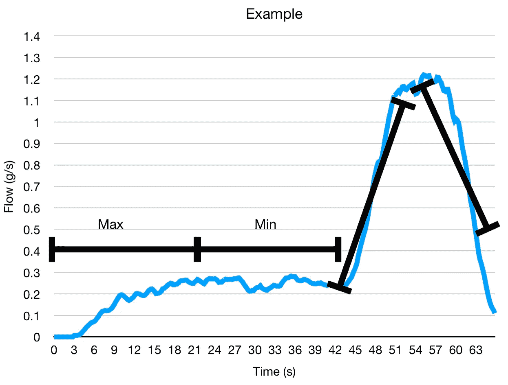

# 多杯浓缩咖啡的咖啡流量分析

> 原文：<https://towardsdatascience.com/flow-analysis-over-multiple-espresso-shots-8e36b2b27069?source=collection_archive---------33----------------------->

## 咖啡数据科学

## 充斥着咖啡数据

几个月前我得到了一个 Acaia Pyxis 标尺，我开始记录照片。我想要一个有两个原因:更准确地测量输出重量和检查流量。我的 Kim Express 没有足够的空间放秤，所以我需要一些小的东西。

在用这种尺度拍摄了 200 多张照片(准确地说是 232 张)之后，我收集了一些数据来帮助理解浓缩咖啡。然而，我没有从流量或连续重量数据中找到任何可以很好预测性能的指标。我希望我能找到一些可测量的东西来帮助改善拍摄，但我没有。

# 原始数据

对于每条测井曲线，我应用了一个中值滤波器，因为数据可能有点嘈杂，然后我使用 1 秒的时间间隔连续计算流量。

下面是两张对比照片:

所有图片由作者提供

您可以在这些图表中看到一个指示预输注结束(PI)的弯头。输液时流量大是由[压力脉动](/pressure-pulsing-for-better-espresso-62f09362211d)引起的。我们在这里只能看到平滑的流量记录:

我收集了很多数据。我主要是用音阶在合适的时候结束投篮。这是一个图表中的一组日志样本。

# 寻找线索

我以前没见过有人钻研流量曲线，所以我不得不编造一堆指标。我不知道什么会好，所以我把预输注(PI)和输注分开。我没有看脉动，而是看平滑的流动。

对于预注入，我将其减半，因为通常 PI 开始缓慢，然后加速。对于输液，我看着向上和向下的趋势，如下图所示，至于我的杠杆机器，我在整个拍摄过程中积极调整流量。

此外，我还查看了喝 1 克咖啡以及 2、3、4、5、6、7 和 8 克咖啡的时间。

[覆盖过滤器的时间(TCF)和 T10(达到 10 毫升的时间)](/pre-infusion-for-espresso-visual-cues-for-better-espresso-c23b2542152e?source=your_stories_page-------------------------------------)这两个变量我已经用了将近一年，以帮助在更高水平上跟踪流量的差异。它们和一杯好的浓缩咖啡有很好的相关性。

我的主要兴趣是看看是否有任何流量预测值与良好的口味或更高的提取率(即我的性能指标)有很好的关联。

# 绩效指标

我使用两个指标来评估技术之间的差异:最终得分和咖啡萃取。

[**最终得分**](https://towardsdatascience.com/@rmckeon/coffee-data-sheet-d95fd241e7f6) 是评分卡上 7 个指标(辛辣、浓郁、糖浆、甜味、酸味、苦味和回味)的平均值。当然，这些分数是主观的，但它们符合我的口味，帮助我提高了我的拍摄水平。分数有一些变化。我的目标是保持每个指标的一致性，但有时粒度很难确定。

**使用折射仪测量总溶解固体量(TDS)，该数值与咖啡的输出重量和输入重量相结合，用于确定提取到杯中的咖啡的百分比。**

# **分析**

**我首先研究了相关性。**

**[相关性](https://en.wikipedia.org/wiki/Correlation_coefficient)是衡量两个变量彼此相似程度的指标。高相关性并不意味着一个变量会引起另一个变量，而是当情况发生变化时，两个变量的涨跌幅度相同。相关性可以是正的(趋势相同)或负的(趋势相反)。0 表示没有相关性。**

**这是所有的数据，我把它们分解成可消化的块。**

****

**我们可以首先只看预输注和输注指标，很少混合。有许多强相关性，但就第一个 X 克的时间而言，EY 之间似乎有更强的负相关性。我怀疑这是因为 TCF 发生得更早。**

********

**我还对所有变量进行了排名，并根据 EY 和最终得分将它们分开。相关性最强的变量与 TCF 有关。似乎上坡的速度也对味道有影响，但比 TCF 少一点。**

********

**我观察了散点图中的一些变量，如 TCF、PI/TCF、第一个 8g 的时间和最大流速的时间。**

********

**TCF 有非常明显的趋势，但第一个 8g 的时间和最大流量的时间的趋势有一些有趣的趋势。**

********

# **预输注期间抽取 TDS 样本**

**在其中一些镜头中，我还在大约 5g 输出的预输注期间对镜头进行了采样。因为有了秤，我能够测量输出重量，然后我计算 TDS 和πEY。我研究了这些与其他变量的相关性。**

****

**最终 TDS 被 PI TDS 预测得相当好，同样，最终 EY 被 PI EY 预测得很好。**

****

**最终分数与皮氏 TDS 有很强的相关性，但与皮氏 EY 的相关性没有那么强。**

****

**然而，对于最终的 TDS 和 EY，这种差异有所减少。**

****

**虽然我对找到更好的度量标准抱有很高的期望，但是这些测试仍然是对我在 TCF 和圆周率上已经经历过的事情的再确认。我一直在收集这些数据，因为无论如何我都在测量输出重量，也许这对于区分不同的射击时间是有用的。**

**如果你愿意，可以在 Twitter 和 YouTube 上关注我，我会在那里发布不同机器上的浓缩咖啡视频和浓缩咖啡相关的东西。你也可以在 [LinkedIn](https://www.linkedin.com/in/robert-mckeon-aloe-01581595?source=post_page---------------------------) 上找到我。也可以关注我[中](https://towardsdatascience.com/@rmckeon/follow)。**

# **[我的进一步阅读](https://rmckeon.medium.com/story-collection-splash-page-e15025710347):**

**[浓缩咖啡系列文章](https://rmckeon.medium.com/a-collection-of-espresso-articles-de8a3abf9917?postPublishedType=repub)**

**[工作和学校故事集](https://rmckeon.medium.com/a-collection-of-work-and-school-stories-6b7ca5a58318?source=your_stories_page-------------------------------------)**

**[个人故事和关注点](https://rmckeon.medium.com/personal-stories-and-concerns-51bd8b3e63e6?source=your_stories_page-------------------------------------)**

**[乐高故事启动页面](https://rmckeon.medium.com/lego-story-splash-page-b91ba4f56bc7?source=your_stories_page-------------------------------------)**

**[摄影启动页面](https://rmckeon.medium.com/photography-splash-page-fe93297abc06?source=your_stories_page-------------------------------------)**

**[改进浓缩咖啡](https://rmckeon.medium.com/improving-espresso-splash-page-576c70e64d0d?source=your_stories_page-------------------------------------)**

**[断奏生活方式概述](https://rmckeon.medium.com/a-summary-of-the-staccato-lifestyle-dd1dc6d4b861?source=your_stories_page-------------------------------------)**

**[测量咖啡磨粒分布](https://rmckeon.medium.com/measuring-coffee-grind-distribution-d37a39ffc215?source=your_stories_page-------------------------------------)**

**[咖啡萃取](https://rmckeon.medium.com/coffee-extraction-splash-page-3e568df003ac?source=your_stories_page-------------------------------------)**

**[咖啡烘焙](https://rmckeon.medium.com/coffee-roasting-splash-page-780b0c3242ea?source=your_stories_page-------------------------------------)**

**[咖啡豆](https://rmckeon.medium.com/coffee-beans-splash-page-e52e1993274f?source=your_stories_page-------------------------------------)**

**[浓缩咖啡用纸质过滤器](https://rmckeon.medium.com/paper-filters-for-espresso-splash-page-f55fc553e98?source=your_stories_page-------------------------------------)**

**[浓缩咖啡篮及相关主题](https://rmckeon.medium.com/espresso-baskets-and-related-topics-splash-page-ff10f690a738?source=your_stories_page-------------------------------------)**

**[意式咖啡观点](https://rmckeon.medium.com/espresso-opinions-splash-page-5a89856d74da?source=your_stories_page-------------------------------------)**

**[透明 Portafilter 实验](https://rmckeon.medium.com/transparent-portafilter-experiments-splash-page-8fd3ae3a286d?source=your_stories_page-------------------------------------)**

**[杠杆机维护](https://rmckeon.medium.com/lever-machine-maintenance-splash-page-72c1e3102ff?source=your_stories_page-------------------------------------)**

**[咖啡评论与思考](https://rmckeon.medium.com/coffee-reviews-and-thoughts-splash-page-ca6840eb04f7?source=your_stories_page-------------------------------------)**

**[咖啡实验](https://rmckeon.medium.com/coffee-experiments-splash-page-671a77ba4d42?source=your_stories_page-------------------------------------)**