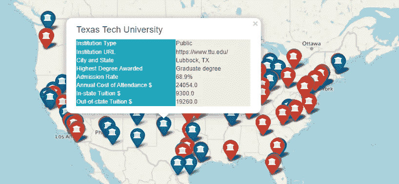
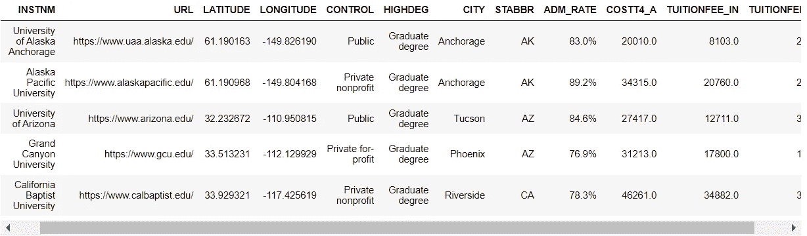
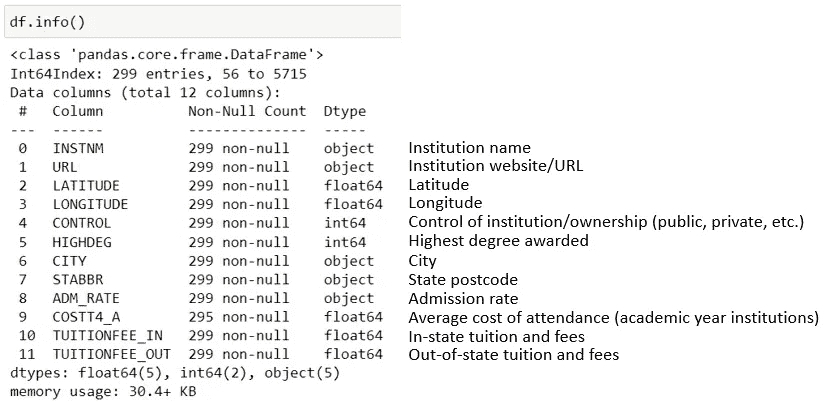
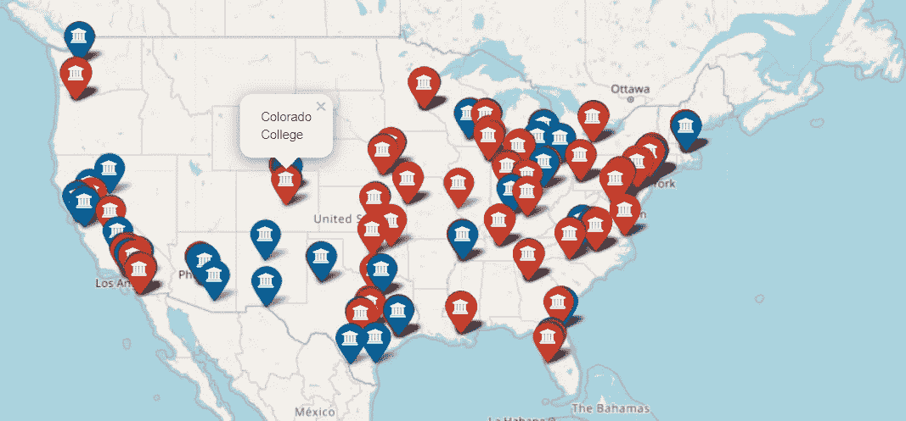
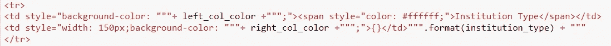
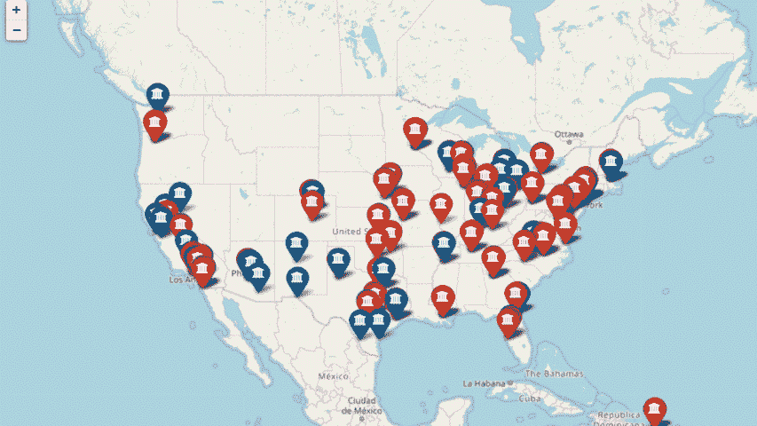

# 树叶地图:如何用 HTML 代码创建一个表格样式的弹出窗口

> 原文：<https://towardsdatascience.com/folium-map-how-to-create-a-table-style-pop-up-with-html-code-76903706b88a?source=collection_archive---------7----------------------->

## 逐步提高地理空间数据可视化技能的指南

照片由[安娜·施韦茨](https://www.pexels.com/@shvetsa?utm_content=attributionCopyText&utm_medium=referral&utm_source=pexels)从[派克斯](https://www.pexels.com/photo/earth-globe-with-googly-eyes-on-gray-background-5217882/)拍摄

# 介绍

yellow 是一个非常流行的 Python 可视化库，它是专门为创建地图和可视化地理空间数据而开发的。在*叶子*的官方[文档](http://python-visualization.github.io/folium/)页面上写着:

> `*folium*` *使用 Python 处理的数据在交互式活页地图上可视化变得容易。它既可以将数据绑定到地图上用于* `*choropleth*` *可视化，也可以将丰富的矢量/光栅/HTML 可视化作为标记传递到地图上。*

互联网上有很多关于*叶子*的基础知识的文章和教程，比如如何创建*叶子*地图对象，如何显示各种地图样式，如何添加标记等等。很多时候，我们需要超越这些基础，并使用额外的技术或技巧，使可视化更引人注目，对讲故事更有用。

在这篇文章中，我想与你分享我最近完成的一个 python 项目，在这个项目中，我使用 HTML 代码在*叶子*地图中创建了一个定制的、表格样式的弹出窗口。我用*叶子*和HTML 代码在互动地图上标出了美国大城市的主要大学。当用户点击地图上的一个标记时，会出现一个小窗口，用户可以在一个格式良好的表格样式的弹出窗口中查看关于该机构的附加信息。

带有表格样式弹出窗口的交互式地图如下所示:

带有自定义表格样式弹出窗口的交互式树叶地图

# 关于数据

这种可视化背后的数据是从一个原始的开放数据集创建的，该数据集可以从[DATA.ED.GOV](https://data.ed.gov/dataset/college-scorecard-all-data-files-through-6-2020/resources)下载。原始原始数据集包含 6000 多所高等教育机构的机构级数据以及填充美国教育部创建的大学记分卡仪表板的各种指标。

在本教程中，为了便于演示，我只选择了一小部分机构样本和一些常用指标。样本数据集如下所示:

可视化数据集(图片由作者提供)

df.info()和数据字典—按作者分类的图像

# 创建一个基本的树叶地图

首先，让我们通过创建一个基本的*叶子*地图来稍微热身并刷新我们的*叶子*知识。我们首先创建一个空的地图对象。然后，我们添加标记，将机构的位置叠加到地图上。最后，我们向每个标记添加一个简单的弹出窗口，当点击时显示机构的名称。

请注意，在第 10–17 行中，我们创建了一个颜色字段，公共和私人机构分别用蓝色和棕色表示。我们还创建了一个机构名称的标签，并将其分配给第 21 行的*弹出菜单*参数。当*叶子*为每个机构添加一个标记时，它将使用 *for* 循环遍历数据集，并对每个标记进行颜色编码以及在弹出窗口中添加每个机构的名称。

关于*叶子*的一个很好的小事情是你可以为标记选择定制的图标。例如，在第 22 行，我们可以指定 *icon='university'* 为每个标记指定一个好看的大学图标。

一张基本的树叶地图(图片由作者提供)

# 使用 HTML 创建带有表格样式弹出窗口的树叶地图

现在，我们想超越基础，尝试使用定制的表格格式使弹出窗口更漂亮一些，就像我们在前面的介绍中展示的那样。为此，我们将需要使用 HTML 代码来创建表格格式，然后将其传递给*leav . popup()。*

下面的代码定义了一个函数 *popup_html* ，它将使用 html 代码创建一个包含两列和一个表头的表格。表头显示机构名称。表格的左栏显示了我们希望包含在弹出窗口中的信息/指标；右栏显示了每个指标的实际值。我们还可以通过指定 HTML 颜色代码来选择任何列的颜色。

这一长段代码看起来很吓人，但实际上并没有那么复杂。对于每个指标(机构 url、机构类型、录取比率等)。)显示在弹出的表格中，HTML 代码结构总是一样的；只有指标名称和指标值需要在代码中相应地更改。

作者图片

现在让我们将 HTML 代码传递给*follow*并通过向标记添加表格样式的弹出窗口来重新创建地图。这是通过下面的代码实现的。具体来说，第 15–19 行使用 *for* 循环和 *popup_html* 函数创建 HTML 表格，然后使用*leav 将表格添加到地图上的标记中。标记()*。同样的概念和过程也可以用于创建定制的工具提示(对于工具提示，用户只需将鼠标悬停在标记上，工具提示就会出现，而不是单击标记)。

这就对了。现在，您已经使用*flour*和 HTML 代码创建了一个交互式地图，带有一个格式良好的弹出窗口。感谢您的阅读，希望您喜欢这篇文章。快乐学习！

带有自定义弹出窗口的交互式树叶地图

如果您对 HTML 完全陌生，并且在理解代码方面有困难，请阅读我最近发表的关于 HTML 基础知识以及如何使用它将动态图像、链接和表格添加到 read 地图弹出窗口的文章，其中有对代码的详细解释！

 [## 在树叶地图中使用 HTML:数据科学家综合指南

### 逐步了解如何使用 HTML 将动态图像、链接、文本和表格添加到叶子地图弹出窗口

towardsdatascience.com](/use-html-in-folium-maps-a-comprehensive-guide-for-data-scientists-3af10baf9190) 

## 参考列表和数据源:

1.  Github 中的官方文档页面:[http://python-visualization.github.io/folium/](http://python-visualization.github.io/folium/)
2.  大卫·贝克的《奇妙的叶子:[https://www.kaggle.com/dabaker/fancy-folium](https://www.kaggle.com/dabaker/fancy-folium)
3.  数据来源:美国教育部大学记分卡开放数据([https://data . ed . gov/dataset/College-score card-all-data-files-through-6-2020](https://data.ed.gov/dataset/college-scorecard-all-data-files-through-6-2020))

[*你可以通过这个推荐链接报名 Medium 来支持我。通过这个链接注册，我将收到你的会员介绍费的一部分。谢谢大家！*](https://medium.com/@insightsbees/membership)