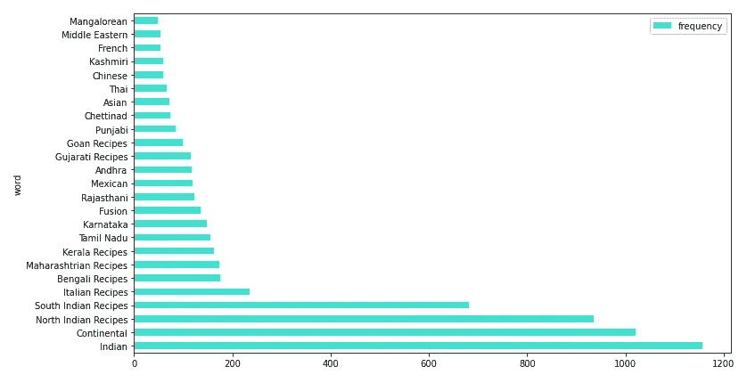
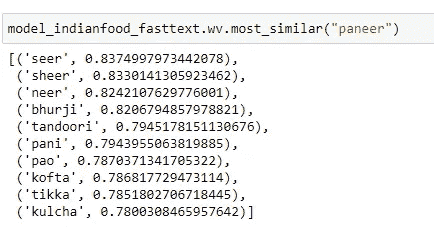
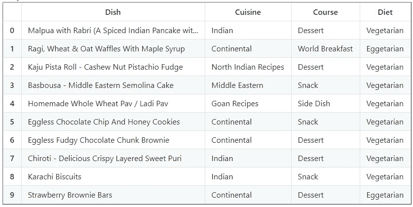
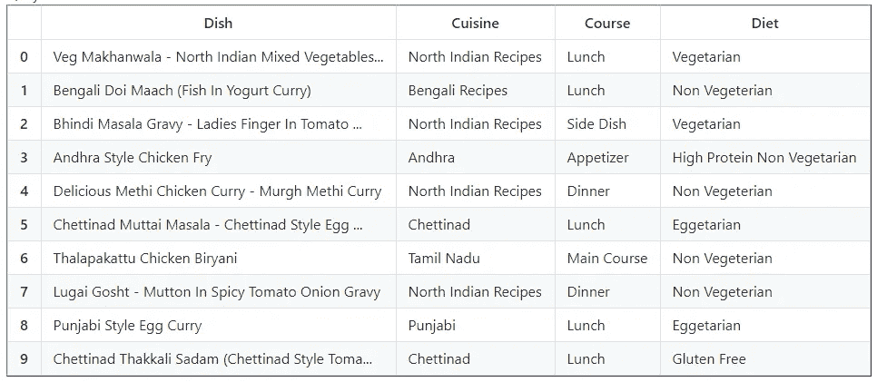
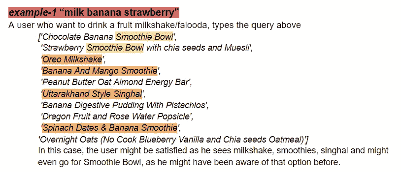
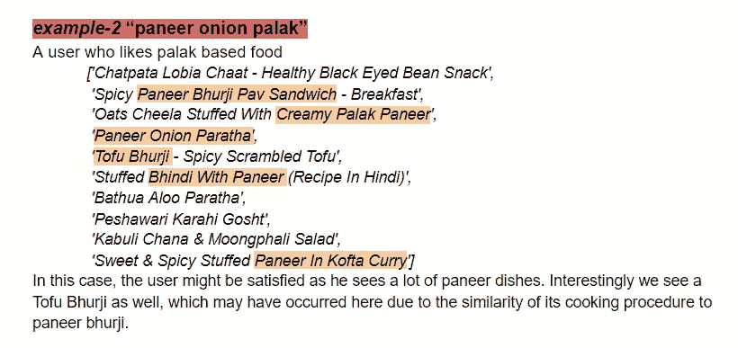
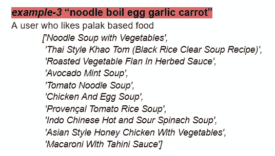

# 使用食谱嵌入的食品搜索:一个简单的基于嵌入的搜索引擎，使用 gensim，fastText 和 ElasticSearch

> 原文：<https://towardsdatascience.com/food-item-search-using-recipe-embeddings-a-simple-embedding-based-search-engine-using-gensim-29631fcf5953?source=collection_archive---------50----------------------->

这是构建搜索 ML 产品的介绍性课程。我们将使用一个工具(genSim)来训练一个语言模型(fastText)，然后将数据索引到一个可扩展的搜索基础设施(ElasticSearch)上，并编写一个自定义的搜索功能来尝试基于嵌入的搜索。

斯蒂芬·c·阿萨夫蒂在 [Unsplash](https://unsplash.com/s/photos/cooking-food?utm_source=unsplash&utm_medium=referral&utm_content=creditCopyText) 上拍摄的照片

**目的**在本教程中，我们将学习如何为某个用例创建一个简单的搜索应用程序。搜索无处不在，每个应用程序都有多个搜索栏和算法，都服务于不同的目的。想象一下，你正在创建一个送餐应用程序，或者更具体地说是一个烹饪应用程序，你想让你的用户发布食谱并实时搜索你的库存，因此你希望在主页上有一个搜索栏，作为用户来到你的平台时遇到的第一个搜索栏。

我们将此作为教程来学习。代码在我的 Github 里。

 [## arnab 64/食物搜索食谱嵌入

### 一个简单的基于嵌入的搜索引擎，使用了 gensim，fastText 和 ElasticSearch

github.com](https://github.com/arnab64/food-search-recipe-embeddings) 

笔记本:[https://github . com/arnab 64/food-search-recipe-embeddings/tree/main/src](https://github.com/arnab64/food-search-recipe-embeddings/tree/main/src)

**目标**显示一个食品列表，给出一个查询，从库存中按相似性降序排列。

*   工程:学习如何训练定制语言模型(Gensim)，并将其快速部署在可扩展的搜索基础设施(ElasticSearch)中。
*   数据:学习处理这种文本数据的复杂性，我指的是食品餐馆领域的数据，否则就是所有数据
*   产品/科学:了解如何评估解决方案的优劣，以及我们可以生成哪种架构或哪些额外的改进嵌入来在指标上表现得更好。[即将发布-教程]

**数据**数据来源:数据集是来源于 Kaggle 的公共领域数据集。 [6000 份印度食物食谱数据集](https://www.kaggle.com/kanishk307/6000-indian-food-recipes-dataset)

数据探索和预处理:为了训练嵌入和使用它们，已经按照文本字段的要求完成了所有必要的预处理。笔记本上有更多的细节。我主要使用了两栏*配料*和*配方*，以便能够在它们上面训练单词向量。使用的堆栈 *Gensim，ElasticSearch，Pandas*

烹饪直方图

**recipeEmbeddings:使用 Gensim** 建立一个关于食物食谱的快速文本语言模型由于这个数据集是一个食谱数据集，我们可以训练一个关于食谱的语言模型。菜肴是用特定的配料经过一系列特定步骤后的结果。事实上，食谱是由连续的结构组成的，这有利于对食物进行连续的处理。

在这里，我们试图构建一个食物/菜肴建议应用程序，我们希望嵌入可以做到这一点。我们正在试着推荐菜肴，我们有每一道菜的菜谱。因此，输入字段的性质已经是有序的，我们想要的输出将是一个相似性递减的菜肴列表。我们可以使用在菜肴食谱上训练的嵌入，然后使用其组成成分或食谱的嵌入来表示每个食品/菜肴。我们称之为食物嵌入。

因为，所有的食物项目将由供应商只上传到网站一次，并且由于上下文不变，每道菜的这些嵌入可以预先计算一次，并且每次我们都有一个新的语言模型，并且索引以便更快地检索。

出于我们的目的，我们在 recipe 列上训练一个快速文本模型。有关训练语言模型的更多细节，以及了解更多关于 word2vec 和 fastText 嵌入的信息，请查看这篇文章。

关于我实现这里提到的所有东西的细节，请查看我的知识库:[arnab 64](https://github.com/arnab64)/[food-search-recipe-embedding](https://github.com/arnab64/food-search-recipe-embeddings)

与经过培训的 LM 中的“paneer”(农家干酪)最相似的术语

现在，我们的任务是什么？

*   **暗示一道菜？** : *没有明确的查询*，我们可以根据他们过去的订单使用用户嵌入
*   **寻找一道菜？** : *提供显式查询*，基于距离创建查询嵌入和建议

在这个报告中，我已经执行了提到的第二个任务，即在运行时给定一个显式查询，我想使用嵌入来建议食品。

类似食物的一些结果，或者我们这里所说的*菜*，可以在下面看到。快速文本模型的训练非常简单，在 gensim 中完成。

基于训练嵌入的相似菜肴 1) `Homemade Easy Gulab Jamun` 2) `Kashmiri Style Chicken Pulao`

**我们如何从单词向量中得到食物项目嵌入？**菜谱是说明书的集合，说明书是文字的集合(食材、动作等)。现在，我们已经训练我们的语言模型能够学习单词的 n 维表示。

菜谱向量:简单的平均菜谱中的单词向量，因为我没有花太多时间。

你可以只在食物的标题上做同样的事情，但是标题提供的食物信息不如食谱多。因此，它可能没那么有用。尽管如此，我也尝试了其他方法，但为了简短起见，这里不做赘述。

**在现有数据的基础上添加了基于重复嵌入的食物向量**在 pandas 中，根据食谱和配料为每种食物新计算的向量已被添加为附加列。对于像食物这样的非用户文本特征，最好存储预先计算的嵌入，并随着数据的变化而更新。

在数据集中有了向量之后，我们可以使用这些向量+其他现有特征来执行分类任务，就像这里我们可以尝试预测给定名称的菜肴类型，从而评估嵌入的好坏。但是预测烹饪似乎不是一个值得花时间去研究的有趣问题。

使用 fastText 时，我们只使用上下文信息，而不使用顺序信息，也就是说，如果您在番茄后添加洋葱，这些嵌入很可能无法区分，反之亦然。我们可以使用基于注意力的方法来训练我们的定制语言模型，以捕捉食谱的顺序信息。然后，我们必须在 torch 或 tensorflow 中训练定制语言模型，然后使用该模型添加基于矢量的嵌入。fastText 用于在不浪费时间的情况下训练单词向量，或者我们可以使用在数十亿参数上训练的预训练单词嵌入，并找出一种方法来直接使用它们来驱动应用程序，从而节省工程工作并获得类似的结果。

照片由 [Unsplash](https://unsplash.com/s/photos/indian-food?utm_source=unsplash&utm_medium=referral&utm_content=creditCopyText) 上的 [Umesh Soni](https://unsplash.com/@umeshsonii?utm_source=unsplash&utm_medium=referral&utm_content=creditCopyText) 拍摄

**在 ElasticSearch 上使用新的密集向量索引食品数据集**我们将数据索引到 ElasticSearch 中，并探索其中的功能，最重要的是，我们希望建立一个搜索引擎，ElasticSearch 使它变得非常简单，并且可扩展，通过基于密集向量的操作，可以构建许多非常快速的智能应用程序。elasticSearch 可以处理几乎所有类型的数据，它是大规模可扩展的和快速的，很容易将你的搜索模型部署到产品中，并进行实验。

在这里，我使用 Python 中的 *ElasticSearch 客户端 API 将数据从 pandas 索引到 ElasticSearch。用 python 定义模式，并为索引中需要的所有列编写了从 pandas 到 JSON 的定制数据摄取函数。*

**Elastic Search 上基于密集向量的搜索** Elastic search 使数据一旦编入索引就可以通过 API 进行搜索。搜索查询的嵌入是以与我们对带有 recipe 的项目相同的方式导出的。我们读取预先训练的食谱单词模型，并获得单词在处理后的搜索查询中的嵌入，并取平均值。

**观察结果**下面的结果很有趣，它证明了配方数据的基本效用，并且它可以与其他数据集相结合，以使嵌入和模型更好。食谱遵循一种全球通用的格式，在印度食谱遵循一种结构。这也是一个多语言问题，因为相同的食谱可能存在于网络上的不同语言中，这些基于嵌入的方法使得能够构建适用于任何语言的应用程序变得更加容易，这对于像印度这样的多元文化市场中的应用程序来说无疑是有帮助的。

Elasticsearch 上的搜索执行—示例 1

我的见解:这是一个非常小的数据集，嵌入是在这个数据集上训练的(大约 6000 个实例)，我们可能有庞大的真实数据，因此更好，或者训练更智能的嵌入。然而，尽管使用这个，我们可以建立一个可行的搜索应用程序，它看起来并不太糟糕。

由于我们直接使用基于食谱的向量来搜索每一个食品，我相信当我们提供本质上是配料的搜索查询时，我们的应用程序会工作得很好。像:“面粉油烤番茄奶酪橄榄牛至”-比萨饼或面包条与番茄沙拉等。

*对于食品名称搜索，我们可能需要训练另一个将查询映射到食谱的模型。“披萨”——“四块奶酪和蘑菇披萨，鸡肉香蒜酱披萨，芝士松饼”*

查询建议示例。

在这里(例-3)我们看到，我们已经检索了许多多种菜系的汤菜。

用户不会列出正在查询的食材，他们更可能会搜索菜名。这种方法也适用于这种情况，但是我们的嵌入并不是为这种情况而设计的。

例如，搜索结果为“*”的烤鸡看起来像这样。*

**【辣椒粉烤鸡串】，**

**‘烤盼儿玉米串’，**

**‘鸡丁卡玉米卷配奶酪蒜味蛋黄酱’，**

**‘烤鱼脆片(烤箱中煎鱼)’，**

**‘甜菜根鸡排’，**

**‘鸡马莱 Kabab’，**

**‘土豆卷’，**

**‘迷迭香和百里香鸡’，**

**‘辣味猕猴桃酱配羊乳酪’，**

**‘脆皮蔬菜天妇罗’]**

*结果还不错，实际上相当多样，但很相似。*

*因此，为了能够使用基于食物名称的搜索，我们只需添加另一个从搜索查询映射到唯一“食物食谱”的模型，甚至可能使用一种连续的训练。*

***评估和后续步骤**到目前为止，我还没有办法评估这些向量的优劣。我在这一点上放下了工作。但这是一次很好的入门学习经历，让我们了解处理食品的应用程序中的数据科学问题。我很确定实际问题要复杂得多，规模也更大。*

*至于下一步，我将尝试结合其他数据集，找出更好的嵌入信息的方法，并解决另一个任务。请随意贡献或联系令人兴奋的东西。*

*谢谢大家！*