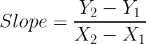
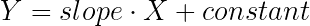

# 基于博弈论的食物选择

> 原文：<https://towardsdatascience.com/food-selection-with-game-theory-e06c8d064604?source=collection_archive---------30----------------------->

## 用博弈论解决两个朋友之间的餐馆选择冲突。

虽然 2020 年没有像过去那样给我们很多出去吃饭的机会，但无论何时，我们都花了很长时间来决定去哪里吃饭！这是一个众所周知的百万美元问题。我的这两个朋友相当挑剔(虽然比我少一点，但我的目标是让他们看起来很糟糕，:D)，在过去的 8 年里，我很少和他们一起吃饭，但根据我的经验，我们必须额外花半个小时来讨论食物大战。

照片由[瑞秋·帕克](https://unsplash.com/@therachelstory?utm_source=medium&utm_medium=referral)在 [Unsplash](https://unsplash.com?utm_source=medium&utm_medium=referral)

我决定通过理解底层模式并找到一种快速达成妥协的方法来结束这一切。

> 假设:给定我的朋友在某一天的食物偏好，我们能很快找到选择什么菜来最大化满足感吗？

# 一点博弈论的背景知识

我不会在这里长篇大论地谈论这个理论，我会尽量简洁明了。

**博弈论**是研究描述理性决策者( ***【我的两个朋友】*** )之间互动( ***食物选择*** )的数学模型。很公平！

游戏的结果——预测游戏结果的一种方法是确定每个玩家的优势策略。优势策略是对给定玩家来说最好的策略，而不管其他玩家的选择如何( ***无论什么菜都能满足我朋友们当前的渴望***)——所以不管朋友#2 做什么，朋友#1 的优势策略就是朋友#1 的最优策略。

玩家(**朋友**)选择的一套优势策略(**美食**)被称为**纳什均衡。这被称为均衡，因为任何一方都不会因为改变他/她的选择而获得额外的利益。**

> 简而言之，纳什均衡是一条法律，即使没有警察，也没有人想打破这条法律。违法对个人没有任何好处，他们不会获得任何额外的东西。人们观察交通信号并根据灯的颜色停车/前行就是这样一种现象。

# 好了，理论到此为止，让我们进入应用程序。

你可以点击这里查看 GitHub 中的代码。

我不打算使用 Nashpy，而是使用基本的 python 功能来看看是否可以实现一个结果。

让我们创建我们的**收益**矩阵。在这种情况下，这将是两个朋友对他们想吃的各种美食的评级。

上周五测量的各种美食的支付矩阵

任务是找到给定收益矩阵的优势策略，结束食物战争。

让我们在散点图上画出收益矩阵:

作者图片

上面的曲线描述了一个人在品尝各种美食时的满足感。属于曲线最高部分的坐标属于两个朋友的最高收益。如果 x 代表瓦伦的收益，y 代表柯蒂的收益，那么我们必须最大化 xy。

为此，我们需要找到通过点(1，4)和(3，2)的直线的方程。线的斜率由下式给出:

斜率为-1。

该直线的方程可以很容易地由下式求出:

方程式是 *y = -x + 5*

*xy = x(-x + 5) = -x + 5x*

取 xy 相对于 x 的一阶导数:

因此，在 x = 5/2 时，xy 最大(等于上述导数，-2x + 5 等于 0)。x = 5/2 时 y 的值也是 5/2。

上面线上的绿点是折中点。它位于中国和意大利支付的坐标线上，离意大利食物更近。

但这到底意味着什么呢？我们应该吃中国菜和意大利菜的混合体吗？比萨饼上的面条听起来很奇怪，但我吃过非常奇怪的比萨饼，茄子、山羊奶酪和土豆怎么样？是的，我吃了，因为那是我唯一的素食选择。

# 解释

上面的解决方案是混合的，所以我们要么找一家既供应中餐又供应意大利餐的餐馆，要么如果我们想从中意混合食物的冲击中拯救自己，让我们找到获得纯解决方案的可能性。

对他们两个来说，占优点都是 5/2。

对于 Kirti，5/2 = p(2) + (1-p)(4)

解决这个问题，我们得到 p = 3/4

如果我们解出凡荣，就会得到同样的解。

# 结论

> p = 3/4 意味着每 4 次我们对中国和意大利食物有这样的偏好，我们就会去意大利餐馆 3 次，去中国餐馆 1 次。

最后，我相信我们有办法解决他们之间的冲突。:)我要做的就是随身带着笔记本电脑，或者创建一个可以运行这个程序的小 app。

顺便说一句……在我完成这个分析后，已经过了午夜，现在没有食品配送服务在运行。所以，今晚我不吃中国菜或意大利菜。

又是拉面！顺便说一下，对于那些不知道拉面是日本的人来说，它被认为是上个世纪日本最伟大的发明。

火影忍者和他最喜欢的拉面(图片来源:Giphy)