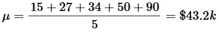
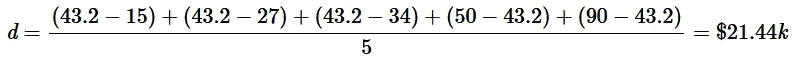
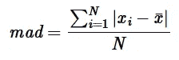
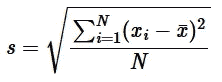
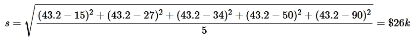
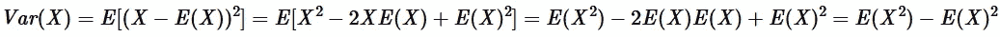

# 被标准差愚弄

> 原文：<https://towardsdatascience.com/fooled-by-standard-deviation-6ed52f83d591?source=collection_archive---------40----------------------->

## 直觉价值和不确定性的替代测量

罗伯特·鲁杰罗在 [Unsplash](https://unsplash.com?utm_source=medium&utm_medium=referral) 上的照片

上次，我看了英国收入分布的统计平均值，以说明平均值的潜在弱点。概括一下，你可以在这里看到<https://medium.com/@rohan.tangri/fooled-by-the-average-f254ff9bc08c>**。这一次，我们将看看标准差和一个可以根据情况使用的替代方法，即**平均绝对偏差**。**

# **一个常见的误解**

**当被问及标准差描述了什么时，许多人会说它给出了样本与平均值的平均距离。让我们考虑一个简单的例子。假设我们有 5 个人，他们的年收入是:{$15k，$27k，$34k，$50k，$90k}。现在，直观地说，我们如何测量收入与平均值的平均偏差？首先，我们需要计算样本均值:**

****

**作者图片**

**接下来，我们需要从上面的样本平均值中获得每个样本点的平均距离:**

****

**图片由作者提供:注意括号中的术语始终为正数！**

**看起来不错！实际上，我们这里刚刚计算的是**平均绝对偏差**，它清楚地描述了最初的定义。样本统计公式如下:**

****

**作者图片:由 **x_i** 和 mean **hat{x}** 定义的 **N** 个样本的样本平均绝对偏差**

**现在让我们来看看样本标准差公式:**

****

**作者图片:由 **x_i** 和均值 **hat{x}** 定义的 **N** 样本的样本标准差**

**马上，我们可以看到这看起来不像平均绝对偏差计算。还应该注意的是，为了简单起见，我们通过除以 **N** 而不是 **N-1** 来使用有偏估计量:**

****

**作者图片**

**我们得到的结果是一个非常不同的数字，我们高出 20%以上！发生了什么事？不同之处在于两种计算都主张正偏差。对于标准差，我们求差的平方使其为正，然后求平方根，而不是只求差的绝对值。然而，这造成了离群值的偏差，因为大数平方本身变得更大，使得厚尾分布的标准偏差根本不能反映平均值的平均偏差。另一方面，当处理细尾分布时，偏差很小，标准偏差确实更符合样本远离平均值的平均距离的近似值，但它仍然不完全符合(例如高斯分布)。**

# **重新定义标准差**

**到目前为止，我们已经看到，如果您想要一个度量来告诉您样本与平均值的平均距离，您应该使用平均绝对偏差。那么，**标准差告诉我们什么？**嗯，它给出了一个直观的值，为**分布的扩散**作为一个整体。你可能认为这听起来和平均距离平均值一样，但是有细微的差别。现在，我们可以辨别样本在一组样本中的排列，以及它们之间的差异。让我们考虑另一个例子。假设有两组数字，{1，1，7}和{0，2，7}。这两组的平均值为 3，平均绝对偏差为 2.67。然而，第一组具有 2.83 的标准偏差，而第二组具有 2.94 的标准偏差。直观地说，第二组有更广泛的价值观。这被标准偏差捕获，但是随着平均绝对偏差丢失。**

**通过平方算子，标准差还具有非常有用的数学性质，它构成了许多统计学和概率论的基础。一个很好的例子是我们如何简化随机变量的方差:**

****

**图片作者:方差的简化，注意标准差就是简单的方差的平方根！**

**最后，对于完美的高斯分布，标准偏差实际上比平均绝对偏差更有效。然而，一旦离群值和厚尾值开始出现，这种情况很快就会消失，可以说在现实场景中，平均绝对偏差实际上更有效。**

**同样，在使用指标和统计数据得出结论之前，理解它们是如何得出的非常重要。在引用偏差统计数据之前，一定要理解数据的分布，并准确地理解你要传达的信息。**

**如果您觉得这篇文章有用，请考虑:**

*   **跟踪我🙌**
*   **[**订阅我的邮件通知**](https://medium.com/subscribe/@rohan.tangri) 永不错过上传📧**
*   **使用我的媒介 [**推荐链接**](https://medium.com/@rohan.tangri/membership) 直接支持我并获得无限量的优质文章🤗**

**推广的方式，我希望这篇文章是一个有趣的阅读，并让我知道你的想法！！**