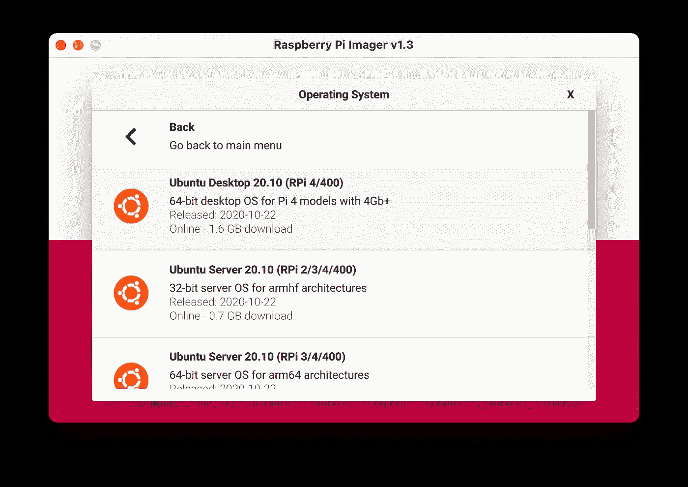

# 简单指南:如何在你的树莓 Pi 中安装 Ubuntu

> 原文：<https://towardsdatascience.com/foolproof-guides-how-to-install-ubuntu-in-your-raspberry-pi-2316ac13afcf?source=collection_archive---------18----------------------->

## 借助广泛的应用和软件包生态系统，释放您的 Raspberry Pi 的威力


加里·罗基特在 [Unsplash](https://unsplash.com?utm_source=medium&utm_medium=referral) 上的照片

有很多原因让你想把 Ubuntu 放到你的 Raspberry Pi 中，而不是官方的 Raspbian 操作系统。在我的情况下，我通常使用 Raspberry Pi 作为小型机器人和人工智能项目的低功率便携式计算机。许多驱动程序、包和依赖项只有在 Ubuntu(如 ROS2🤖或者 OpenCV👀)但在拉斯边不是。

在这篇文章中，我想通过不同的常见步骤来成功地为 ARM 64 位架构设置带有最新版本 Ubuntu 的 Raspberry Pi 4 或 Raspberry Pi 3，目前是 **Ubuntu 20.10 Groovy Gorilla** 和 **Ubuntu 20.04 Focal Fossa** 。

# 第一步:刻录你的 Ubuntu 操作系统镜像

首先你需要选择你的 Ubuntu 版本。根据您的需求，您可能想要一个完整的桌面版，或者只是命令行登录。为了获得完整的桌面体验，我推荐你至少有一个 4Gb 内存的 Raspberry Pi 4 和 ***Ubuntu 20.10 桌面*** 版。对于 Raspberry Pi 3，我可能会继续使用 Ubuntu Server 20.04 LTS 和没有图形界面的控制台访问。

选择最新的兼容操作系统并将图像刻录到 SD 卡中的最简单方法是使用官方的 [Raspberry Pi Imager](https://www.raspberrypi.org/software/) 应用程序。它包括一个更新的兼容操作系统的集合，适用于所有型号的 Raspberry Pi。你可以去 Ubuntu 版块选择你需要的版本。确保您始终为桌面版或服务器版选择 64 位版本。



树莓 Pi 的 Ubuntu 图片列表。作者图片

要刻录图像，请使用至少 16GB 的 SD。因为 Raspberry Pi 不仅会使用 SD 卡进行存储，还会使用 SD 卡中的交换内存来扩展可用内存，所以使用快速 SD 卡非常重要(级别越高越好)。 *Raspberry Pi Imager* 应用程序将为您处理所有刻录步骤:格式化、写入和验证图像。

启动新的操作系统，第一次登录，检查一切正常。在 Ubuntu 中默认登录的用户是 ***ubuntu*** 密码是 ***ubuntu*** 。

# 第二步:设置 WiFi

第一项任务是通过 WiFi 设置互联网接入。假设您目前离线，最直接的方法是直接编辑*网络计划*配置文件:

```
$ sudo nano /etc/netplan/50-cloud-init.yaml
```

我们需要添加 wifi 适配器配置。在**后键入这几行*以太网:*配置和**配置并以同样的缩进:

```
wifis: 
    wlan0: 
        optional: true 
        access-points: 
            “SSID-NAME-HERE”: 
                password: “PASSWORD-HERE” 
        dhcp4: true
```

现在您可以应用来自*网络计划*的新配置，并检查是否有任何错误:

```
$ sudo netplan generate
$ sudo netplan apply
```

检查 *wlan0* 接口是否已成功连接并已分配 IP:

```
$ ip addr show
# or just `ip a` or just `hostname -I` for a minimalistic approach
```

当 Ubuntu OS 第一次连接到互联网时，需要一些时间在后台运行更新。如果 *apt* 或 *apt-get* 命令被锁定几分钟，不要感到惊讶。

# 步骤 3:设置本地主机名访问

在一个 wifi 网络中有几台具有不断变化的动态 IP 的机器，使得每次都很难连接到它们。我们希望能够访问每台带有本地主机名地址的机器。这在 Linux 和 Mac 系统中工作得很好，对于 Windows 你需要额外的工作，比如安装 [Bonjour for Windows](https://developer.apple.com/bonjour/) 。首先，我们需要修改您机器的主机名:

```
# Set host name to `ubuntu` (this is the default anyway)
$ sudo hostnamectl set-hostname ubuntu
```

然后，我们安装 avahi 守护程序并启用自动发现服务:

```
# install avahi and enable daemon
$ sudo apt install -y avahi-daemon
```

现在你可以使用 ***ubuntu.local*** 访问你的 Ubuntu 机器，而不是使用你网络内部的动态 IP。

# 步骤 4:设置 SSH

启用本地主机名和连接后，我们希望能够远程登录到机器。根据你的 Ubuntu 版本，SSH 服务可以默认激活。但为了以防万一，我们尝试安装 SSH 服务器包，并允许它的流量集成 Ubuntu 防火墙:

```
$ sudo apt install openssh-server
# Allow Ubuntu firewall to accept ssh connections
$ sudo ufw allow ssh
```

如果 SSH 启动，您应该能够使用默认用户名和主机名从远程机器登录:

```
$ ssh ubuntu@ubuntu.local
```

# 步骤 5:设置交换内存大小

交换内存允许操作系统使用 SD 卡中的存储空间作为运行进程的额外内存。这对于在 Raspberry Pi 系统中激活是非常重要的，因为电量非常有限，我们会很快耗尽内存！首先我们需要安装配置管理器包(根据你的 Ubuntu 版本可能已经安装了):

```
$ sudo apt-get install zram-config
```

现在我们可以编辑交换内存设置文件了。

```
$ sudo nano /usr/bin/init-zram-swapping
```

你应该在定义了 ***mem*** 变量的地方找一行，然后把这个值乘以你想要分配给内存交换的 SD 卡中的千兆字节。通常 5GB 是个好数字:

```
# Inside /usr/bin/init-zram-swapping
# Multiply the available swap memory size. 5Gb should be good enough
mem=$(((totalmem / 2 / ${NRDEVICES}) * 1024 * 5))
```

重启 Raspberry Pi 并使用***htop****命令检查新的可用交换内存:*

```
*$ sudo reboot
. . .
$ htop*
```

# *步骤 7:启用树莓相机(可选)*

*你可能想激活你的官方树莓皮相机。通常在 Raspbian 中你可以使用 *raspi-config* 来编辑一些固件配置。但是在 Ubuntu 中，我们可以直接编辑固件配置文件:*

```
*$ sudo nano /boot/firmware/config.txt*
```

*要激活相机并增加 GPU 内存大小，请在 ***【所有】*** 下添加这些行:*

```
*start_x=1
gpu_mem=128*
```

*在 Raspberry Pi 4 中，您可能不需要修改 GPU 内存大小。重新启动并尝试保存相机中的图片:*

```
*$ raspistill -o cam.jpg*
```

# *步骤 8:启用 i2c(可选)*

*同样，对于相机，您可能希望激活 **i2c** 通信，例如，如果您正在使用扩展帽。在 Ubuntu **中，i2c** 通常是默认激活的，但只对根用户有效。您只需将您的用户添加到 *i2c* 组:*

```
*$ sudo usermod -aG i2c ubuntu*
```

*注销并再次登录，并根据 **i2c** 组检查您的新权限:*

```
*$ i2cdetect -y 1*
```

*如果您有权限运行它，I2C**已经为您的用户成功启用。***

*一如既往地让我知道你是否有任何问题或意见，以提高这篇文章的质量。享受你的新 Ubuntu 系统！*