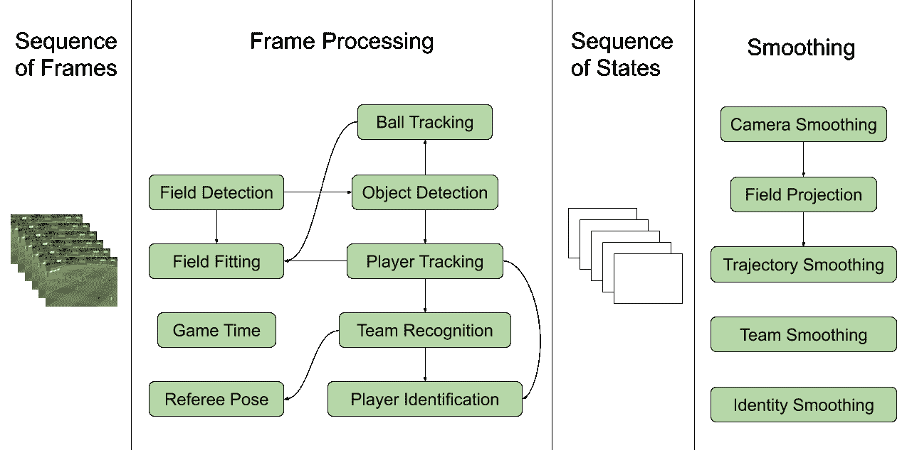
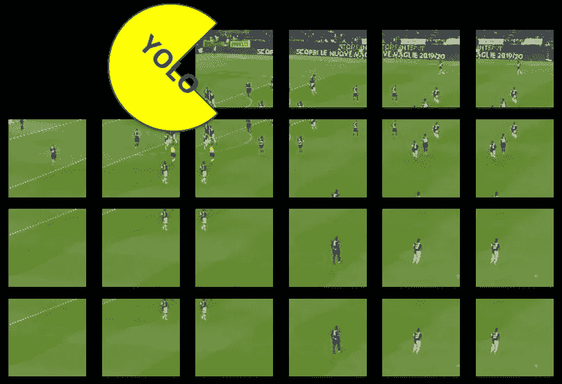
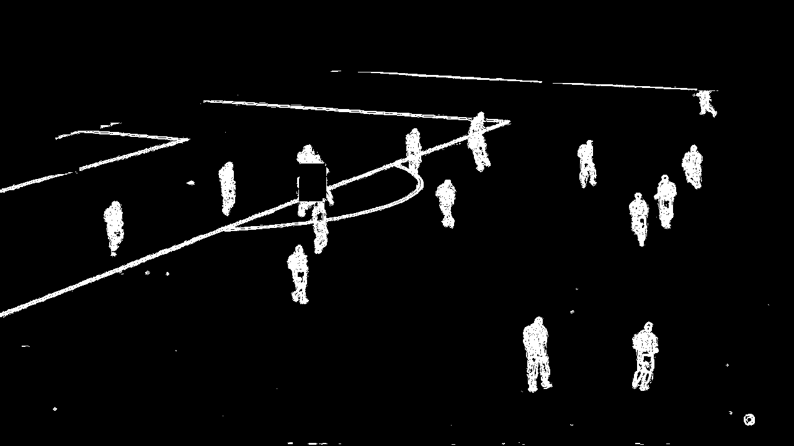
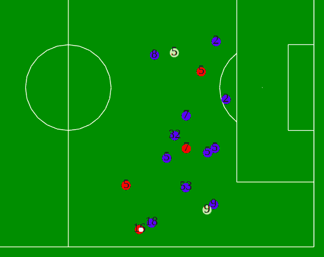
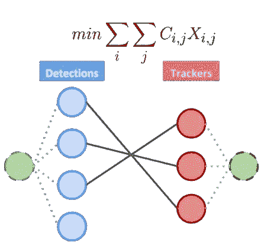
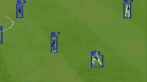
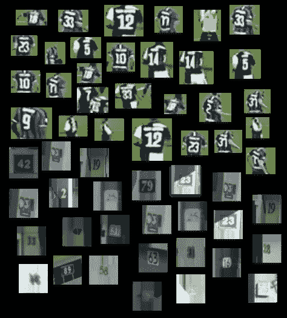
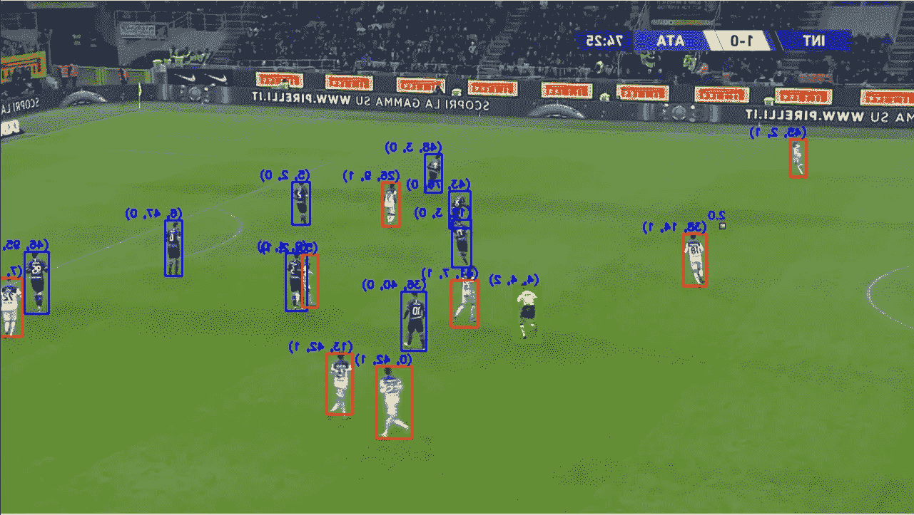

# 基于机器学习的足球比赛视频分析

> 原文：<https://towardsdatascience.com/football-games-analysis-from-video-stream-with-machine-learning-745e62b36295?source=collection_archive---------5----------------------->

## 使用 ML 和传统 CV 技术从视频馈送中理解足球比赛的场景。

19 年前的足球日。照片来自 Unsplash 的 [@jesusance](https://unsplash.com/@jesusance) 。

足球是世界上最受欢迎的运动之一，它能够在最高级别的联赛中的一场比赛中吸引数百万爱好者的注意:数百万(x2)的眼睛注视着同样的图像，显示 22 名球员争夺一个球的所有权。

嗯，这并不是观看一场足球比赛的全部，如果我们分析一场比赛中我们能够处理的数据量，我们可能会得到一个提示。

足球分析正是这样做的，在这篇文章中，我想分享我自己在解决该领域的一个子问题方面的经验:**从单个类似广播的摄像机记录的足球比赛视频流中提取尽可能多的知识。**

此外，一定要看看我朋友的作品 [@matteoronchetti](http://twitter.com/matteoronchetti) ，我和他一起完成了这个有趣而富有挑战性的项目！

# 问题是

这个问题本身已经非常*不适定*了，因为从前景突然变化的单个移动摄像机中提取位置和语义信息肯定不是一个简单的方法，因为你可能通过在场地周围放置多个固定摄像机来解决一个更简单的问题。但是，考虑到明显的预算和许可限制，你可能不会被允许在一个真实的体育场里做这些。

尽管如此，有多种方法可以在预算范围内处理(至少大致如此)这样的视频数据，而且不用离开你舒适的椅子。

# 方法

我们像任何教科书(优秀的)软件工程师一样处理任务:我们将问题分解成更小、更易管理和更具体的问题。

我们提出了如下的划分:

*   **参考系统**和单应性估计(如何*将*玩家位置从摄像机视角投影到 2D 平面)。
*   **物体检测**(又名球员/球/裁判是什么，在哪里)。
*   **物体跟踪**(又名如何跨帧跟踪实体)。
*   **玩家识别**(也就是我如何跨帧识别玩家)。
*   **团队认可度**(我怎么弄清楚一个球员为哪个团队效力)。

因此，让我们按照“位置到语义”的顺序，在进入每个任务的细节之前，从系统的整体架构开始。

我们在输入中得到一系列的帧，我们使用对象*检测*(字段和实体)依次处理每一帧；一旦我们有了一系列近乎连续的探测，我们就可以开始*追踪*每个实体。与此同时，我们用摄像机估算场地的位置，我们*将每个实体的位置从框架投影*到俯仰坐标。此外，我们可以通过*识别*和*将*分配到一个团队来跟踪每个玩家。

系统的整体架构。图片作者。

然后我们一帧一帧地重复，直到视频结束。在这一点上，我们有一个阶段，我们称之为*平滑*，在这个阶段中，我们基本上允许自己回顾到目前为止我们一帧一帧提取的所有知识，我们“进行向后调整”，以便使轨迹和检测在整个序列中更加连贯。

现在让我们试着一步一步地跟踪从一个框架被送入系统的那一刻起，系统内部发生了什么。

# 目标检测

当从 ML 的角度处理这样的问题时，你可能注意到的第一件事是很难找到质量不错的可用标记数据。因此，是时候抛出一个最著名的反对探测器了: *YoloV3* 。

YOLO 网被喂了一帧游戏用滑动窗口的方法。图片作者。

你很快就会发现，简单地裁剪框架，并期望预先训练的网络提供良好的结果是行不通的。因为我们在这里高度优先考虑准确性而不是速度，所以我们使用滑动窗口向 YOLO 提供原始分辨率图像，以使网络在整个帧上一点一点地工作。你用这种方法得到的结果会更好，让你可以持续地发现球员/裁判和球。

是的，如果你想知道的话，COCO 数据集(YOLO 接受训练的数据集)有一个足球类。

作为一个简短的考虑，我们假设几乎整个系统都有(相当)可靠的检测，因此准确性是重中之重。足够幸运的是，这可能是一个让你有更多自由的任务，因为你有很大的可能性来获得一个超级可靠和高效的探测器，这里没有限制。你可能想从头开始训练你自己的超光探测器，提取预先训练好的网络，利用空间邻接，最大化并行化...我们的时间非常紧张，所以我们几乎没有触及这些选项的表面。

# 参照系

这可能是最具挑战性的任务，因为它需要估计单应性，这种单应性是将球员的位置从相对于球场的框架绝对坐标系投影出来所需要的。

球场的预遮罩图像。图片作者。

为了做到这一点，我们屏蔽了图片中描述的帧，删除了在前面步骤中检测到的所有对象，并且*将球场的当前帧与一组预先计算的球场图像进行匹配*，这些图像来自于球场的简单模型，从不同的旋转和平移角度拍摄。为了有效地匹配，我们利用了一个索引，并将输入视为一个“查询”。

使用一个简单的 Flask 服务器，将图片中的玩家投影到 2D 渲染的区域。图片作者。

为场地找到正确的匹配可以让你建立单应矩阵，它可以把你从 YOLO 得到的检测框投射到球场上。为了构建矩阵 tho，你还需要知道*和* *在哪里*你正在看图片，也就是相机的 3D 坐标。这很难实时估计，但幸运的是，每个体育场都有一个或多或少固定的位置来转播比赛(注意，摄像机几乎可以自由地平行于场地移动)。

# 目标跟踪

到目前为止，我们只是对每一帧应用了相同的步骤，没有时间上的联系，但如果我们想随着时间的推移保持当前的检测状态，以便能够识别每个玩家的*轨迹*，并实际理解涉及同一实体的后续检测，同时仍然对检测器不时出现的故障具有鲁棒性，会怎么样呢？

为此，我们需要一个跟踪器，准确地说是一个多跟踪器，并选择将其实现为卡尔曼滤波器。

二分图中的最小权重匹配，将观察分配给预测。图片作者。

跟踪器完全基于位置(实际上不*见*帧),并接收来自 YOLO 的一系列探测位置作为观测值，通过将分配问题公式化为二分图中的最小权重匹配，将这些位置与被跟踪的对象进行匹配(卡尔曼预测)。

用位置信息跟踪玩家。作者 GIF。

之后，一个简单的跟踪逻辑定义被跟踪对象的生命周期(活动/不活动),并确保用观测值更新卡尔曼状态。

# 玩家识别

这实际上是这样一种情况，一个简单但出色的从头实现被证明比您可能尝试的任何现成解决方案都要有效得多。

从门牌号码到球衣号码，都可以做得十分相似。图片作者。

我们训练了一个 CNN 来识别你在球衣背面看到的数字，通过增加流行的街景房屋号码(SVHN)数据集，具有相当好的准确性和偏斜容限。正如我们上面提到的，找到像样的和可访问的足球比赛的标签图像被证明是太难了。这就是为什么我们必须变得有创造性，我们相信这是一个应用领域适应的很好的例子。

一旦你能够检测到一个玩家的号码，你就能够给他们分配一个 id，并且你可以利用上述相同的跟踪逻辑来使 id 的分配更有弹性(前面提到的平滑)。

此外，请记住，一旦你知道了玩家的队伍(下一个)或者有了额外的外部信息(比如队伍阵容和烘烤师)，可能的数字的*分布*可以被进一步限制。

# 团队认可

你有两个由在球场上穿着相同球衣的球员(加上裁判)组成的球队:在我看来，这是利用古老的 K-means 算法的完美设置。

你可能会在这里做一些更奇特的事情，把所有东西都转换到光谱域，但是你仍然可以在 HSV 颜色空间上使用球员边界框聚类两个队，并且用一个 *tf-idf 加权*从每个边界框中过滤出场地的绿色来完成所有事情，从而获得良好的结果。

团队识别算法的结果。图片作者。

页（page 的缩写）s:应用任何异常值检测技术，裁判都可以被检测为两个团队集群之一中的特殊“异常值”。例如，DBSCAN 产生了良好的结果。

# 结果呢

我们用一些可视化的结果来结束这篇文章，这些结果有望总结我们在这里描述的所有步骤。不幸的是，我们无法真正深入地涵盖每一个细节，但我们仍然希望您能够跟随并对该方法有一个直觉，并可能享受这个过程。

对于任何建议、问题或只是聊天，不要犹豫，联系我在 nicolo.lucchesi@gmail.com 或@nick_lucche 在 Twitter 上。

感谢阅读，祝你在球场上好运！