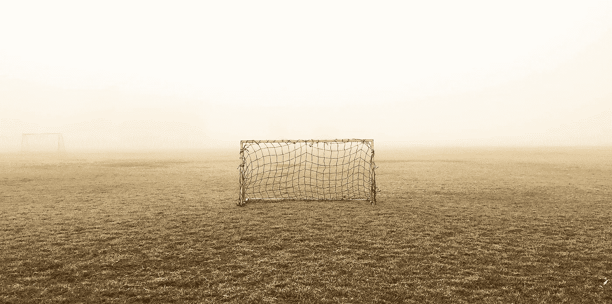
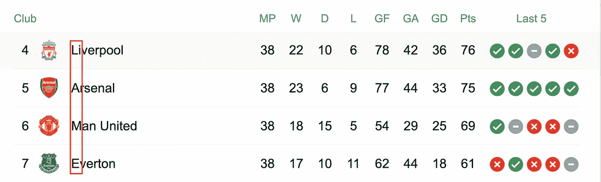
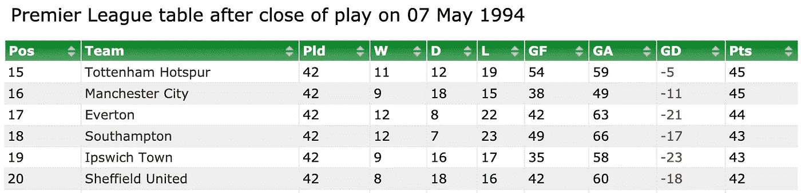
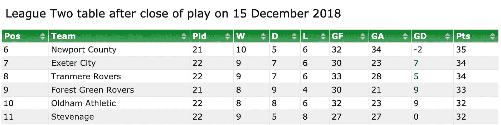
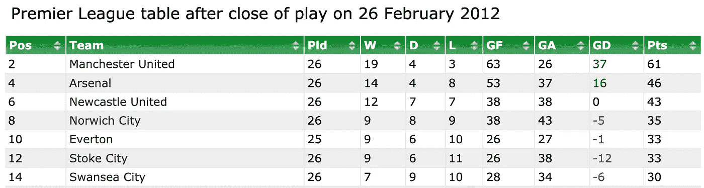
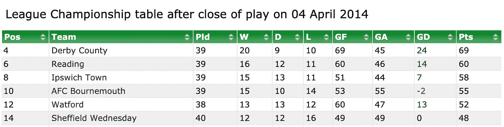

# 足球桌面艺术

> 原文：<https://towardsdatascience.com/football-table-acrostics-c4e360d13802?source=collection_archive---------47----------------------->



图片来自 [Pixabay](https://pixabay.com/?utm_source=link-attribution&utm_medium=referral&utm_campaign=image&utm_content=1838313) 的[像素](https://pixabay.com/users/pexels-2286921/?utm_source=link-attribution&utm_medium=referral&utm_campaign=image&utm_content=1838313)

## 足球表中名字的第一个字母拼出的最长的单词是什么？

如果给它无限的时间，一只猴子随机打字[几乎可以肯定](https://en.wikipedia.org/wiki/Almost_surely)写出莎士比亚的全部作品。

在我们的问题设置中，我们没有无限的时间，也没有无限的猴子，但是我们有足球桌，而且很多。

如果还是不清楚，那么换个更冗长的问题，我们想知道在联赛排名表中球队名字的连续首字母中最长的英文单词是什么？这里有一个例子:



就像问题陈述一样，2016/17 赛季结束表的缩写拼写为“跛脚”

# 数据

我从维护良好的 Github 存储库中下载了所有的数据。利用这些数据，我用每一组比赛日的结果反复构建了比赛日结束表。这项分析涵盖了 28 个国家的多个联赛。数据集中最早的赛季是 1963/64 年的[德甲](https://en.wikipedia.org/wiki/1963%E2%80%9364_Bundesliga)。

总而言之，我收集了 **54，095** 个比赛日结束时的排行榜。

# 方法学

对于每张表，我生成了长度超过 5 个字母的团队名称的每组连续首字母。

对于一个比赛日表的每一组连续字母，我将它们与英语单词的 nltk 语料库进行交叉比较。

这在整个英语单词语料库中产生了超过 1400 万次查找。

# 结果

有很多 6 个字符的单词是有效的，我们要找的是 7 个字符的单词。那些是传说中的干草垛中的针。总之，我们发现了 4 个有效实例(和一个无效实例……)。

注意，除了搜索连续的离合点之外，我还扩展了搜索空间，包括反向离合点、两跳离合点和反向两跳离合点。

## 整齐

从上到下按顺序出现的字符串。例如:



有序离合拼读" [TMESIS](https://www.merriam-webster.com/dictionary/tmesis) "

**7 个字母的离合字符**

```
🄼🄰🄻🄻🄰🄲🄰    [France Ligue 2]               [2013-09-21]
🄿🄾🄰🄻🄸🄺🄴    [Greece League 1]              [2008-02-20]  ❌ 
    ^^^ I can't find a well sourced definition - scrubbed. 
```

**6 个字母的离合符号**

```
🅂🄲🄰🅁🄲🄴    [Spain Segunda División 2019-20][2020-02-29]
🅂🄴🄰🅂🄾🄽    [Superliga  2016-2017]          [2016-09-24]
🅂🄺🄰🅃🄴🅁    [Turkey League 1]               [2013-09-23
```

## 以相反的顺序

从下到上按顺序出现的字符串。例如:



逆序离合符咒“[软化](https://www.merriam-webster.com/dictionary/soften)

**7 个字母的离合音**

```
🄲🄷🄰🄽🄲🄴🄻    [Premier League 2015-2016]     [2015-10-17]
```

**6 个字母的离合字符**

```
🅁🄴🄰🅂🄾🄽    [Superliga 2018-2019]           [2018-10-08]
🅅🄰🄲🄰🄽🅃    [Italy League 2]                [2018-05-18]
🄲🄻🄰🅄🅂🄴    [Italy League 1]                [2007-03-17]
```

## 按顺序，每隔一个字母

每两个小组中从上到下依次出现的字符串。例如:



每隔一个字母，依次拼成“ [MANNESS](https://www.merriam-webster.com/dictionary/manness#:~:text=%3A%20the%20distinctive%20or%20differential%20characteristics%20of%20man) ”。注意团队位置在 2 中上升。

**7 个字母的离合字符**

```
🄼🄰🄽🄽🄴🅂🅂    [Premier League 2011-12]       [2012-02-26]
🄻🄰🄿🅂🄰🄽🄰    [France Ligue 2]               [2018-04-05]
```

**6 个字母的离合字符**

```
🅂🄰🄻🅃🄴🄳     [Premier League 2000-01]        [2001-04-11]
🄻🄰🄶🄶🄴🅁     [Superliga 2018-2019]           [2019-09-02]
```

## 以相反的顺序，每隔一个字母

每两个小组按从下到上的顺序出现的字符串。例如:



每隔一个字母，按字母顺序拼成“ [SWAIRD](https://www.dsl.ac.uk/entry/snd/swaird) ”(一个延伸，真的)

**6 个字母的离合字符**

不幸的是，没有找到这种格式的 7 个字母的离合字符。最有趣的 6 个字母组合是**哀叹**和**赞同**。

```
🄱🄴🄼🄾🄰🄽    [Superliga  2012-2013]            [2012-11-23]
🄰🅂🅂🄴🄽🅃    [Superliga 2018-2019]             [2019-02-25]
```

# 词典

## 7 个字母

> ***马六甲* :** /məˈlakə/ ( *名词)——一种用于手杖和伞柄的*棕色手杖。*🌂*
> 
> *:/ˈmannəs/(名词)——:人与众不同的或与众不同的特征。*👨🏻‍🦰**
> 
> ****lap Sana***:*/lapsənə/*(名词)——lap Sana 是向日葵科开花植物的一个属。它原产于欧洲和亚洲北部。尼普勒草是这一属植物的通用名。*🌻**
> 
> ****圣坛* :** /ˈtʃɑːns(ə)l/(名词)——教堂靠近圣坛的部分，为神职人员和唱诗班保留，通常用台阶或屏风与中殿隔开。 *⛪️**

**注意，虽然它在 nltk 语料库中，但我删除了“poalike ”,因为我找不到合理的定义。*

*所以你走吧。4 14，000，000 次查找中的 7 个字母的字母缩写！我挑战任何人去战胜它！*

*感谢阅读。*