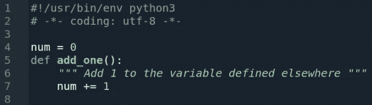
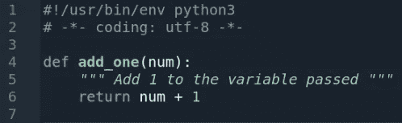
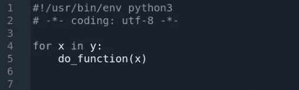

# 我们应该教数据科学家更像开发者一样思考吗？(第二部分)

> 原文：<https://towardsdatascience.com/for-more-scalable-ai-should-we-teach-data-scientists-to-think-more-like-developers-part-2-bbad759d649b?source=collection_archive---------54----------------------->

由 pressfoto 制作的科技照片—[www.freepik.com](http://www.freepik.com)

[在这份关于如何编排机器学习操作化(MLOps)的混乱芭蕾的两部分报告的第一部分](/should-we-encourage-data-scientists-to-think-more-like-developers-e9767bc24dbd)中，我们谈到了在企业中编纂数据科学的“科学”部分的可能性，认为这样做肯定会扼杀其发现的核心使命。在第二部分中，我们将尝试通过简短讨论一个极其相关的编程范例来至少部分推翻这一概念，数据科学家现在可以使用该范例来帮助他们自己以及他们现在和未来的同事。这个范例就是函数式编程。

函数式编程的一个非常简短的历史可以追溯到 20 世纪 30 年代，当时数学家阿隆佐·邱奇发明了 lambda 演算，这是一个使用函数来表达计算的数学逻辑的正式系统。二十多年后，这种抽象的数学理论进入了列表处理器(Lisp)编程语言。作为目前使用的第二古老的语言(比 Fortran 年轻一岁)，Lisp 仍然是一种有影响力的、几乎令人尊敬的语言，尤其是在人工智能研究社区中。

从那时起，Lisp 极大地影响了数据科学中使用的许多流行语言，特别是 Python、R 和 Scala，所有这些语言都借鉴了 Lisp 的函数性质。这些语言(当然还有许多其他语言)向 Lisp 的列表友好语法致敬，这可以从几乎普遍采用列表理解中看出，其中列表可以使用其他列表作为起点来构建。Lisp 本身继续在许多流行的方言(如 Common Lisp)中茁壮成长，或者以许多衍生语言(如 Haskell 和 Clojure)的形式发展，所有这些都可以在现代数据中心架构中愉快地运行。

但是到目前为止，这些语言最重要的共同点可以直接追溯到 lambda 演算，表现为开发人员能够编写由离散函数组成的程序，这些函数不会改变或依赖于程序的更广泛状态。简而言之，像 Python、R、Scala 和 Haskell 这样的语言(甚至 JavaScript 和最近的 C++)都鼓励开发人员编写高度模块化的代码。这使得调试、维护、重构和重用更加容易。最重要的是，函数式编程产生的代码可以随时适应代码、数据和环境的变化，而不会产生无法预料的后果——这是高度实验性和协作性的数据科学领域中最受欢迎的属性。

# (非)函数式编程的危险

在企业中的任何一天，数据科学家可能会打开一个 Jupyter 笔记本，用 Python 编写一组复杂的数据准备例程，这些例程采用一些全局变量，如在几个笔记本单元中乘坐过山车的熊猫数据帧，将数据、逻辑和变量交织在一起，形成一个高度可延展的相互依赖的过程语句和函数的汤。

对于特定的用户和特定的任务集，最终的笔记本电脑可能在那一天工作得非常好，但随着时间的推移，它能否成为企业日复一日依赖的强化数据管道？其他团队成员能理解代码吗？它能在其他项目中重用吗？更糟糕的是，笔记本是否返回了预期的结果？它可以干净地执行，但是如果一个或多个变量从一个函数或单元意外地改变到另一个函数或单元，则产生的数据集可能包含计算不正确的条目，例如，迫使数据科学家回溯他/她的步骤，以找出隐藏在可塑汤内的意外结果。

上面的场景听起来可能有些极端，但是它在企业中经常发生，即使该企业正在工具和平台上投资 MLOps。最终，由个人数据分析师、ML 工程师、数据科学家和其他同事编写的代码成为所有企业人工智能项目的命脉。如果代码难以理解、调试或重用，或者如果其输出不可再现或不可解释，那么没有任何 MLOps 工具可以挽回在根除代码级问题时所损失的时间，也不能挽回损失的收入或暴露的安全、隐私和治理风险。

# 实践中的函数编程

通过采用函数式编程范式，从事数据科学项目的开发人员可以通过更好地划分每个函数来回避这些问题。基本的想法是根据要做什么而不是要执行的任务来思考。传统上，程序员可以编写一个函数，如下例所示(见图 1)。

**图 1:传统结构化函数**

资料来源:Omdia

此任务将函数与外部定义的变量联系起来。对“num”变量的更改可能会以意想不到的方式改变该函数的工作方式。相比之下，一个更具功能性的方法应该类似于下面的例子(参见图 2)。

**图 2:编写函数的更实用的方法**

资料来源:Omdia

在这里，该函数简单地定义了通过将传递的值转换为返回值来完成什么。现在和将来都不需要担心依赖关系。该函数只是将数字 1 加到传递的变量上，而不是直接修改变量。

因为函数是 Python 中的一级对象，所以该语言本身包括许多高阶函数，开发人员可以使用这些函数来创建不修改或不依赖于程序整体状态的非过程化代码。这些函数包括“filter()”、“map()”和“reduce()”函数，这些函数对于那些沉浸在 Hadoop 大数据世界中的人来说是很熟悉的。有了这些函数，而不是像本例中那样在几行代码中遍历一个列表(参见图 3)。

**图 Python 中的传统迭代**

资料来源:Omdia

开发人员可以编写与下例相同的迭代(参见图 4)。

**图 Python 中的高级迭代函数**

资料来源:Omdia

这个函数基本上将 do_function 映射到列表“y”。尽管与列表理解相比，这些内置函数不被认为是 Pythonic 迭代器，但是它们非常有效。在幕后，“map()”简化了数据科学家寻求遍历非常大的列表或数据帧时有时会非常耗费资源的过程。通过 Apache Spark 这样的并行化架构运行“map()”函数，性能优势将呈指数级增长。相比之下，功能性较差的基于循环的迭代替代方案会带来本地 RAM 不足的风险，并且会在一次非常大的数据转换中丢失所有数据。

# 企业的下一步

企业是否需要严格执行函数式编程，就像他们可能采用敏捷开发这样的软件方法一样，在敏捷开发中，开发人员的参与是一件要么全有要么全无的事情？对于每个开发者来说，函数式编程本身是一种*做*还是*不做*的练习？谢天谢地，没有。函数式编程是一种可以一行一行、一个任务一个任务、一个项目一个项目地采用的思维模式。

开发人员可以挑选如何以及何时更具功能性的编码方法是最合适的。如果对于一个给定的任务,“map()”比列表理解更有意义，那也没关系。如果一个 Jupyter 笔记本包含一些纯粹的功能性代码和一些不那么纯粹的功能性代码，那也没关系。数据工程师、ML 工程师、数据科学家和许多其他专家能够并且应该总是拥有为手边的过程选择正确的工具和正确的方法的优势。

旨在服务于长期流程(如数据管道)的代码、需要经得起同事们仔细检查的代码以及必须经受严格单元测试的代码肯定可以从函数式编程中受益。同样的道理也适用于任何使代码更易读、更易调试、更易复制、更易于重用的东西。

这样，我认为函数式编程应该在人工智能驱动的企业中被视为一种哲学，而不是一种实践。像斯多葛主义和柏拉图主义等希腊哲学一样，函数式编程应该被视为一套基本原则，可以全部或部分地遵循，作为提高一个人生活质量的手段——或者在数据科学的情况下，提高一个人的软件质量。

正如正确的代码文档和变量/函数命名约定一样，毫无疑问，不同的开发人员会有不同的风格，一般来说，遵守公司的指导方针也是如此。最重要的是，开发人员在编写代码时开始采用“做什么”的哲学，而不是“T2 如何做”。通过这种方式，函数式编程的整体价值主张可以交付增量价值，即随着时间的推移而积累的价值。

如果对函数式编程的投资导致一个人工智能项目更短的上市时间，或者如果它允许一家公司在生产中只维持一个人工智能项目，那么这项投资将是值得的。[正如第一部分](/should-we-encourage-data-scientists-to-think-more-like-developers-e9767bc24dbd)中提到的，尽管最初数据科学家和其他人工智能实践者需要做更多的工作，但这一简单的开发实践可以为希望将人工智能作为核心竞争力的公司带来巨大的变化，不仅仅是在一两个部门，而是在整个公司。

*注:这篇文章摘自一篇最初出现在* [*Omdia VisionAIres 社区*](https://community.visionaires.ai/) *的文章。*