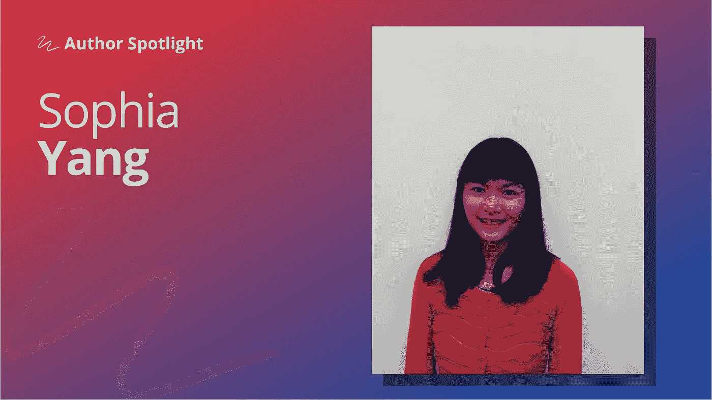

# 对于新的数据科学家来说，领域知识有时比技术技能更重要

> 原文：<https://towardsdatascience.com/for-new-data-scientists-domain-knowledge-is-sometimes-more-important-than-technical-skills-90e103a8c4da?source=collection_archive---------12----------------------->

## [作者聚焦](https://towardsdatascience.com/tagged/author-spotlights)

## *索菲亚·杨谈到持续学习和寻找优秀同事和导师的重要性。*

*在 Author Spotlight 系列中，TDS 编辑与我们社区的成员谈论他们在数据科学领域的职业道路、他们的写作以及他们的灵感来源。今天，我们很高兴与大家分享* [*杨*](https://medium.com/u/ae9cae9cbcd2?source=post_page-----90e103a8c4da--------------------------------) *与本*<https://medium.com/u/e6ad8abedec9?source=post_page-----90e103a8c4da-------------------------------->**的对话。**

**

*照片由索菲亚·杨提供*

*[Sophia](https://sophiamyang.medium.com/) 是 Anaconda，Inc .的高级数据科学家，负责管理关键指标、数据管道和模型，并使用数据科学来帮助公司各部门制定决策。她还是多个开源库的作者，如 condastats、cranlogs、PyPowerUp、intake-stripe 和 intake-salesforce。她拥有德克萨斯大学奥斯汀分校的统计学硕士学位和教育心理学博士学位。*

## ***首先:你是如何决定进入数据科学领域的？***

*我的背景是统计学和心理学。我在研究生院接受了很多因果推断、实验设计和统计建模方面的培训。我使用实验、调查数据和纵向历史数据来建立统计模型，并产生关于人类行为的见解。我喜欢和数据打交道，毕业后我想继续和数据打交道。因此，对我来说，过渡到数据科学是非常自然的。*

## ***回顾过去，开始数据科学职业生涯时，最困难的方面是什么？***

*当我第一次开始我的数据科学工作时，我在技术和业务领域都遇到了一些挑战。但我没有把它们视为挑战，而是把它们视为成长的机会。*

*从技术上讲，我受过统计学的训练，但没受过多少计算机科学的训练。所以，说到 GPU，并行编程，大数据处理等等，我都没有准备，不知道怎么做。幸运的是，我在公司有很好的导师，我非常渴望学习所有我以前没有的技术技能。我也上了一些相关的网络课程，帮助我学习和成长。*

*从商业角度来看，从学术界到商界的心态转变可能具有挑战性。行业项目可能与研究项目非常不同。发表论文不再是目标。您经常处于紧张的时间表中，并且您的工作经常与收入和财务后果相关联。不得不说，我喜欢改变，拥抱改变。能够看到我的项目的直接影响比发表学术论文更有意义。*

## ***根据你自己的经验，你会给正在该领域迈出第一步的有抱负的数据科学家什么建议？***

*我认为领域知识有时比技术技能更重要。因此，我会鼓励人们首先尝试在自己的领域做数据科学。提出一个有意义的数据科学问题，你有兴趣在你的领域甚至日常工作中解决，建立假设，收集你需要的数据，并从那里开始。*

*另一件事是永远不要停止学习。数据科学领域有太多东西需要学习。幸运的是，还有许多学习资源、聚会和会议可以帮助人们学习。还有，我认为找到榜样很重要，和你想成为的人在一起，向他们学习。每天都在学习和成长。随着时间的推移，你会越来越像你想成为的那个人。*

## ***你最喜欢现在这个职位的什么？***

*我有很好的导师和同事。是人们让工作环境变得愉快。*

*就项目而言，作为我们公司仅有的两名数据科学家之一，我与各种各样的利益相关者一起参与各种项目。我与产品、销售和营销部门密切合作，了解用户趋势、产品特性，并发现商机。我真的很喜欢端到端地处理我的项目。我定义项目的范围，编写 ETL 管道，创建可视化，构建模型，部署仪表板和模型，然后将结果转化为业务。*

## ***你的公开写作和你的其他专业活动有什么关系？是什么激励你开始的？***

*起初，我只是想记录我所学到的或做的事情，作为给自己的笔记。然后，当我将来需要做类似的事情时，我可以回到我的笔记，并确切地知道该怎么做。*

*写了几篇文章后，我意识到写作是一种很好的学习方式。人们总是说教学是最好的学习方式。我认为写作也是最好的学习方法。即使是我认为自己非常了解的话题，在研究和写作的过程中，我也能学到很多东西。*

## ***最后，展望未来，您希望在未来几年内看到数据科学社区发生什么变化？***

*我们的首席执行官王蒙杰总是说“数据科学是素养，而不是工作。”我认为越来越多的人将成为数据科学素养。Python 和 R 是新的 excel。每个人都将能够在自己的领域中谈论数据科学和使用数据科学工具。*

*好奇想了解 Sophia 的工作和项目吗？在[媒体](https://sophiamyang.medium.com/)、[推特](https://twitter.com/sophiamyang)、 [LinkedIn](https://www.linkedin.com/in/sophiamyang/) 上关注她。以下是 Sophia 收集的关于数据科学的*帖子中的一些我们最喜欢的，这些帖子从面向行业的教程到清晰、初学者友好的讲解。**

*   *" [**从零开始的多类逻辑回归**](/multiclass-logistic-regression-from-scratch-9cc0007da372)"(2021 年 4 月， *TDS* )
    "很多人一直在使用多类逻辑回归，但并不真正知道它是如何工作的，"因此 Sophia 编写了一个全面的演练，并用 Python 实现完成。*
*   *" [**数据科学家的测试**](/testing-for-data-scientists-1223fcad4ac2)"(2021 年 1 月， *TDS* )
    软件测试对开发者来说是家常便饭，但在数据科学家中却是不太常见的做法。在这篇文章中，Sophia 介绍了两个工具——Pytest 和 Hypothesis——它们使得单元测试变得容易。*
*   *"</customer-lifetime-value-in-a-discrete-time-contractual-setting-math-and-python-implementation-af3ef606cefe>**(2020 年 8 月， *TDS* )
    在这里，索菲亚利用她的行业经验，解释了商业世界中最重要的指标之一:客户终身价值(LTV)。她包括了一个数学和 Python 实现。***
*   ***" [**Jupyter 面向数据科学家的工作流程**](/jupyter-workflow-for-data-scientists-d1ce05d67717)"(2020 年 12 月， *TDS* )
    Jupyter 笔记本在数据科学世界里随处可见，但相当一部分从业者不喜欢使用；Sophia 分享了一个实用的工作流程，帮助她从设置到部署利用该工具的强大功能。***

***请继续关注我们即将推出的下一位专题作者。如果你对你想在这个空间看到的人有建议，请在评论中给我们留言！***