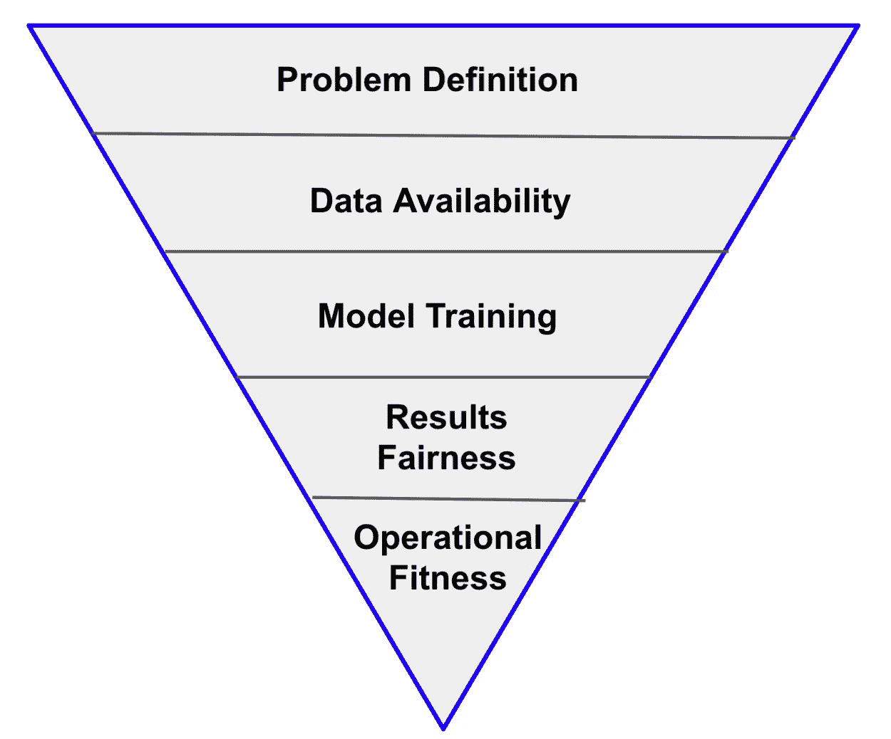

# 对于成功的人工智能项目，庆祝你的墓地

> 原文：<https://towardsdatascience.com/for-successful-ai-projects-celebrate-your-graveyard-5e29945a70ad?source=collection_archive---------18----------------------->

## 如何在人工智能项目中快速失败

图片来源: [Unsplash](https://unsplash.com/photos/_EAJp24cdog)

人工智能团队在定义新的项目指南时投入了大量的严谨性。但对于扼杀现有项目来说，情况就不一样了。在没有明确指导方针的情况下，团队让不可行的项目拖上几个月。

他们在项目评审会议上大肆炫耀，以免成为坏消息的传播者。通过简化过程来快速失败不可行的项目，团队可以显著提高他们在人工智能计划中的整体成功。

AI 项目不同于传统的软件项目。他们有更多的未知:正确数据集的可用性，满足所需精度阈值的模型训练，生产中建议的公平性和健壮性，等等。

为了快速失败，人工智能计划应该作为类似于营销和销售漏斗的转换漏斗来管理。项目从五阶段漏斗的顶部开始，可以在任何阶段落下，要么被暂时搁置，要么被永久暂停并添加到 AI 墓地。人工智能漏斗的每个阶段都定义了一组清晰的未知因素，并通过一系列有时限的成功标准进行验证。

**AI 项目漏斗有五个阶段:**

作者图片

# 1.问题定义:“如果我们建了，他们会来吗？”

这是漏斗的顶端。人工智能项目不仅在初始开发阶段，而且在持续的监控和改进阶段都需要大量的投资。这使得验证正在解决的问题相对于潜在的商业价值是否真正值得解决变得非常重要。即使问题值得解决，也不一定需要 AI。可能有更简单的人类编码的启发式方法来解决这个问题。

开发人工智能解决方案只是成功的一半。另一半是如何实际使用和集成解决方案。例如，在开发预测客户流失的人工智能解决方案时，需要清楚地了解如何将流失预测纳入客户支持团队的工作流程。如果没有这种级别的集成清晰度，一个完美强大的人工智能项目将无法交付商业价值。

**要成功退出这个阶段，以下断言需要为真:**

*   如果成功交付，人工智能项目将产生切实的商业价值。
*   没有更便宜的替代方案可以解决具有所需精度阈值的问题。
*   有一条清晰的路径可以将人工智能建议整合到现有流程中以产生影响。

以我的经验来看，项目的早期阶段有着比现实更高的期望值。杀死一个形式不良的项目可以避免团队构建“寻找问题的解决方案”

# 2.数据可用性:“我们拥有构建它的数据。”

在漏斗的这个阶段，我们已经验证了问题值得解决。我们现在需要确认数据的可用性，以建立人工智能项目所需的感知、学习和推理能力。数据需求因人工智能项目的类型而异——项目构建分类智能的要求将不同于提供建议或排名的要求。

数据可用性广义上解释为具有正确的质量、数量和特性。正确的质量是指数据样本是我们试图建模的现象的准确反映，并满足诸如[独立和同分布](https://en.wikipedia.org/wiki/Independent_and_identically_distributed_random_variables)的属性。常见的质量检查包括发现数据收集错误、不一致的语义和标记样本中的错误。正确的数量是指需要可用的数据量。一个常见的误解是训练 ML 模型需要大量的数据。这并不总是正确的。使用预先构建的迁移学习模型，可以从很少的数据开始。此外，更多的数据并不总是意味着有用的数据。例如，10 年的历史数据可能不能真实反映当前的客户行为。最后，需要有正确的特性来构建模型。这是典型的涉及 ML 模型设计的迭代。

**要成功退出此阶段，以下断言需要为真:**

*   所需要素的数据集可用
*   相应的数据集满足质量要求
*   这些数据集中有足够的历史数据样本

根据我的经验，项目经常在这个阶段被搁置。缺少所需的功能，应用程序团队可能需要几个月的时间来收集数据集。

# **3。模型培训—“项目符合准确性阈值”**

在这个阶段，我们已经确认了数据是可用的，并且已经迭代了 ML 模型特征。现在，是时候验证一个模型是否真的能够满足所需的精度阈值了。训练是一个迭代过程，其中 ML 算法、模型配置、数据集、输入要素的不同组合被反复尝试，目标是满足精度阈值。培训是资源密集型的，在给定大数据集的情况下，基础设施容量可能成为限制因素。此阶段验证使用现有基础架构资源或在可行的云预算内构建模型是否可行。

在训练阶段，当团队已经获得高得令人难以置信的精确数字时，就有可能出现“假警报”!在兴奋之前，仔细检查训练和验证数据集是否有重复样本是很重要的。此外，有时初始测试可能是有希望的，但可能不会推广到整个数据集。在训练之前对数据集进行随机化有助于避免准确性变化的过山车。

**为了成功退出这一阶段，**人工智能项目在训练后能够达到要求的精度阈值。

# **4。结果公平性——“生成的结果不是垃圾输入，垃圾输出。”**

我们已经确认该项目可以满足精度阈值。现在，是时候验证生成的结果实际上是公平的 w.r.t .偏见，可解释性，以及对隐私和数据权利法规的遵从性。

确保人工智能推荐的公平性是一个重要的[研究课题](https://ai.google/responsibilities/responsible-ai-practices/)。大多数数据集天生就有偏见，可能无法捕捉所有可用的属性。理解数据集的原始目的和假设非常重要。另一种常见的偏见形式是代表性不足，例如，贷款承销应用程序没有针对特定类别的用户或收入范围场景进行培训。评估模型性能很重要，不仅是为了整体准确性，也是为了各种数据切片。

人工智能解决方案仅仅精确是不够的——它们需要[可解释](https://www.darpa.mil/program/explainable-artificial-intelligence)，即算法如何得出结论。一些使用自动化决策工具的受监管行业需要向其客户提供有关生成结果的有意义的信息。可解释性可以以不同的形式支持:结果可视化、特征相关性、假设分析、模型因果可解释性。

**要成功退出这个阶段，以下断言需要为真:**

*   结果对偏差有适当的限制和解释
*   人工智能项目使用的数据符合用户隐私和合规性规定，如 [GDPR](https://en.wikipedia.org/wiki/General_Data_Protection_Regulation) 、 [CCPA](https://oag.ca.gov/privacy/ccpa) 。

# **5。运营健康—“已准备好投入生产—不是一个科学项目”**

最后一个阶段是确认操作适应性。并非所有的项目都需要同样的操作严谨性。我根据训练和推理是在线还是离线，将项目分成一个 2x2 的矩阵。离线训练和推理是最容易的，而在线训练需要强大的数据管道和监控。

运营适应性有三个核心维度:模型复杂性、数据管道稳健性和再培训治理。复杂的模型在生产中很难维护和调试。关键是在简单性和准确性之间找到恰当的平衡。与更精确的复杂模型相比，不太精确的简单模型，但由于过度拟合，可能无法推广到新的数据样本。类似地，由于不断变化的数据模式、质量问题和非标准的业务度量，数据管道的管理也很复杂。最后，重新训练需要考虑由于数据分布和特征语义的变化而导致的准确性变化(称为[概念漂移](https://en.wikipedia.org/wiki/Concept_drift))。

**要成功退出此阶段，以下断言需要为真:**

*   模型已经过优化，在复杂性和准确性之间取得了恰当的平衡
*   数据管道是健壮的，具有所需的监控级别
*   为模型再训练实施正确水平的数据和概念漂移监控

总而言之，要在人工智能项目中取得成功，团队需要快速失败！5 阶段转换漏斗为人工智能团队提供了一个词汇表，用于向业务团队传达项目的状态，用一系列已知的未知因素取代他们对这些项目的黑箱认知。该漏斗还有助于识别项目中的常见下降阶段，这些阶段是潜在的改进领域。在一个快速失败的文化中，人工智能的墓地因其学到的可以应用于未来项目的经验而闻名。

[***关注***](https://medium.com/@modern-cdo) ***获取我即将发布的关于 Data+AI 的博客通知。管理数据+人工智能在生产中的策略，勾选*** [***解开数据***](https://www.unraveldata.com/)

**文章原载于**[**TechCrunch**](https://techcrunch.com/2021/07/07/for-successful-ai-projects-celebrate-your-graveyard-and-be-prepared-to-fail-fast/)