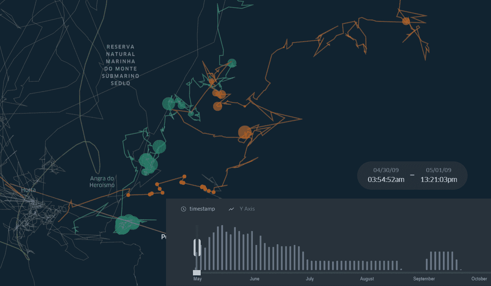
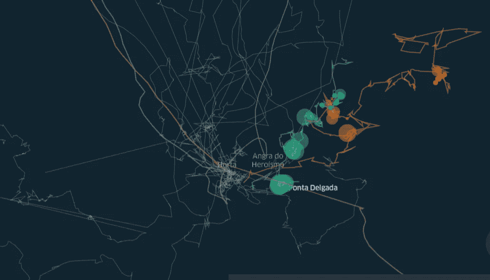

# 大鲸迁徙路线中觅食点的检测

> 原文：<https://towardsdatascience.com/foraging-spots-detection-in-great-whales-migration-routes-19ee4540930e?source=collection_archive---------39----------------------->

## [变更数据](https://towardsdatascience.com/tagged/data-for-change)

## 大鲸追踪记录中的停止检测与移动的熊猫



图片由作者提供。中纬度大鲸觅食点探测

在这个演示中，我将解释如何在北大西洋大鲸的迁徙路线中发现**觅食点**。在由 [**席尔瓦等人(2013)**](https://journals.plos.org/plosone/article?id=10.1371/journal.pone.0076507#s3) 撰写的论文中，作者解释说，巨头鲸长时间保持在中纬度觅食[1]。在这里，我们将预设参数，可以找到这些提到的中纬度地区的点，这是指相对更接近亚速尔群岛。在第一篇评论中，我发表了 **"** [**大鲸迁徙路线的时间过滤器**](/time-filter-for-great-whales-migration-routes-32c429ac6bb9) **"** ，你可以根据 2009 年这一年的过滤器来可视化大鲸的移动模式。

在 Silva 等人(2013 年)的出版物中，作者使用状态空间模型(SSSM)来识别动物行为。在这篇综述中，我将测试 python 库中开发的一种不同的方法，该方法使用时间和搜索电台参数来移动熊猫。事实上，分析结果正如预期的那样，它检测到了动物在中纬度地区的行为。**请注意！**动物行为的参数很关键，必须由生物专家提供。在我的演示中，由于我的生物和生态研究背景，我表达了我对动物行为的常识，但考虑到我是地理空间方法论方面的专家，而不是生物学方面的。

> [最终演示在这里](https://bryanvallejo16.github.io/whale-tracking-azores-II/)

在 800 米的搜索范围内，用于觅食点检测分析的参数在 5 分钟和 110 分钟之间。如果您想查看不同参数的更多分析，您可以参考文章 [**蓝鲸 GPS 跟踪中的觅食点**](/stop-detection-in-blue-whales-gps-tracking-movingpandas-0-6-55a4b893a592) 和 [**鸟类迁徙 GPS 轨迹中的停止检测—移动熊猫& KeplerGl**](/stop-detection-in-gps-tracks-movingpandas-keplergl-point-map-with-stops-duration-in-bird-664064b3ccbc) **。**

> “这个演示是北大西洋大鲸洄游路线运动分析的第二部分。还有更多的观点需要审查，如停止分段。在第三篇综述中，我将发布一个带有停止分割分析的演示，以证实大鲸的觅食行为”

在下一张地图中，你将看到参数是如何(根据我的常识)显示中纬度大鲸鱼的**觅食行为的。研究提到，为了节省迁徙的能量，巨头鲸更喜欢在亚速尔群岛附近的**觅食**【1】。**


图片由作者提供。在大鲸迁徙路线的中纬度发现觅食点

目前，很高兴知道算法正在工作，并且确实代表了大鲸鱼专家对它们迁徙路线的看法。但从科学的角度来看，不断质疑和批评这些结果，而不是把它们作为基本真理，总是好的。这就是为什么我将在第三个与觅食点分割相关的演示中继续分析大鲸鱼的迁徙路线，以更批判性和可视化的方式确认鲸鱼的觅食行为。

> “如果你对动物行为分析感兴趣，有一种软件正在开发中，可以帮助动物跟踪研究。看看[野生动物追踪器](http://www.gis4-wildlife.com)”

动物行为分析是保护区管理决策的重要手段。它有助于回答以下问题:保护区的适当界限是什么？为什么我们必须保护指定的范围？在保护区内，我们必须对渔业进行哪些监管？

# 数据

本演示中使用的数据集对应于[亚速尔群岛大鲸卫星遥测程序](https://www.movebank.org/cms/webapp?gwt_fragment=page=studies,path=study72289508)。它可以在 Movebank 中找到，并且是在非商业性知识共享许可下使用。

# **练习**

请注意，这个分析对应于已经发表的 [**巨鲸迁徙路线**](/time-filter-for-great-whales-migration-routes-32c429ac6bb9) **时间过滤器的第二部分。**因此，您可能需要引用相同的名称，但无论哪种方式，您都可以遵循以下文本。

首先，我们导入库

```
import pandas as pd
import geopandas as gpd
import movingpandas as mpd
from shapely.geometry import Point
from datetime import datetime, timedelta
from keplergl import KeplerGl
```

然后，我们读取数据集

```
fp = r’data/azores_great_whales.geojson’
geodata = gpd.read_file(fp, driver=’GeoJSON’)
```

我们准备`geodata`桌

```
# preparing data
geodata[‘t’] = pd.to_datetime(geodata[‘timestamp’])
geodata = geodata.set_index(‘t’)# setting individuals
geodata[‘id_whale’] = [‘w’+str(idwhale) for idwhale in geodata[‘ind_ident’].to_list()]# time attributes
geodata[‘year’] = geodata.index.year
geodata[‘month’] = geodata.index.month
```

我们准备一个`geostops`表，包含我们想要的 2019 年的子集

```
# prepare tables for visualization
geostops = geodata[[‘timestamp’, ‘long’, ‘lat’,’id_whale’, ‘year’, ‘geometry’]]subset = [2009]geostops = geostops.loc[geostops[‘year’].isin(subset)]geostops[‘year_id’] = [‘Year ‘+str(year) for year in geostops[‘year’].to_list()]
```

在这一部分中，我们定义了基于参数**分钟**和以公里为单位的**搜索电台**返回**觅食站**的函数

```
def get_stop_point_traj_collection(moving_df, traject_id_column, Minutes, searchradio):

 all_stop_points = gpd.GeoDataFrame()

 # create a traj collection with movingpandas
 traj_collection = mpd.TrajectoryCollection(moving_df, traject_id_column)

 for i in range(len(traj_collection)):
 # create a stop detector
 detector = mpd.TrajectoryStopDetector(traj_collection.trajectories[i])

 # stop points
 stop_points = detector.get_stop_points(min_duration=timedelta(minutes=Minutes), max_diameter=searchradio)

 # add ID
 stop_points[‘tag_id’] = [tag.split(‘_’)[0] for tag in stop_points.index.to_list()]

 all_stop_points= all_stop_points.append(stop_points)

 return all_stop_points
```

现在我们用`geostops`表应用该函数

```
whale_stops = get_stop_point_traj_collection(geostops, ‘id_whale’, 5, 800)
```

然后，我们计算在觅食点停留的时间

```
# Duration of stops
whale_stops[‘duration_m’] = (whale_stops[‘end_time’]-whale_stops[‘start_time’]).dt.total_seconds()/60# Between 5 and 110
whale_stops = whale_stops.loc[whale_stops[‘duration_m’]<=110]# remove datetime format for whale stops
whale_stops[[‘start_time’, ‘end_time’]] = whale_stops[[‘start_time’, ‘end_time’]].astype(str)
```

# **可视化**

为了可视化，我们使用开普勒格尔。我们继续创建一个实例并添加数据。

```
# Create KeplerGl instance
m = KeplerGl(height=600)m.add_data(whale_stops, ‘Whale stops’)
```

最后，你保存地图并像我一样使用在觅食点花费的时间来配置它。栏目是`duration_m`

```
m.save_to_html(file_name=’index.html’)
```



图片由作者提供。中纬度地区的觅食点

# 结论

正如演示所展示的，该算法正在检测中纬度的觅食点，考虑到参数表征了大鲸鱼的觅食行为。这不是一个基本事实，它可能真的需要由海洋生物学领域的专家来分析。这只是一个演示如何使用该算法的练习。

# 建议

当你使用这种算法时，进行测试。参数的变化会在不同的位置产生不同的结果，因此您可能需要通过 critic view 真正观察和定义适当的参数。正如我之前建议的，与海洋生物学领域的专家一起测试这种算法是合适的。然而，通过观察轨迹中的移动，你已经可以知道巨型哺乳动物是在四处寻找食物还是在直线移动，所以这是很好的指导。

如果你有更多的问题，或者在你的分析或项目中需要帮助，你可以在我的个人简介中找到我。

# 参考

[1]席尔瓦·马、彼尔托·R、琼森·I、鲍姆加特纳·MF、桑多斯·RS(2013 年)。北大西洋的蓝鲸和长须鲸暂停春季迁徙，前往中纬度地区觅食:为旅途积蓄能量？ PLoS ONE 8(10): e76507。[https://doi.org/10.1371/journal.pone.0076507](https://doi.org/10.1371/journal.pone.0076507)