# 生存分析:浴盆形寿命中死亡率的力量

> 原文：<https://towardsdatascience.com/force-of-mortality-in-bathtub-shaped-lifetimes-b0425cb66925?source=collection_archive---------22----------------------->

## Python 中的参数生存分析简介

墨西哥万圣节亡灵节 Pixabay 上的免费照片

本教程将介绍**生存分析**及其广泛的范围。生存分析适用于处理时间相关数据的所有领域:医学、生物学、工程学、市场营销、金融和许多其他领域。数据科学家作为生存分析师的角色，会涉及到与临床试验、客户流失、罗马皇帝暴死前的时间、产品或系统的故障率以及无数其他情况相关的问题:“什么时候会发生，失败的风险或成功的机会有多大？”在第一章的介绍之后，我们将在第二章探索一些例子——然后用浴缸形状的寿命来完成教程。

*   什么是生存分析？
*   死亡率和危险率的力量
*   —系统故障
*   通过实例进行参数生存分析
*   —示例:指数寿命模型
*   —示例:威布尔寿命模型
*   —浴缸形状的寿命

# 1.什么是生存分析？

## 1.1 事件时间分析——概念

首先:什么是*死亡之力*？它是生存到某一时刻后，在该时刻死亡的条件概率。在精算学中也称为*死亡强度*或*瞬时死亡率*。在不太关心预测向来世过渡的领域，它更好地被称为**风险率** *。*

这听起来好像我们将要讨论的数据科学方法只涉及一种类型的问题:从保险公司的角度看，生物退出的时间。

远非如此。我们希望从中提取分析洞见的事件类别出现在不同的领域，如医学治疗和临床试验、社会学、产品开发、人寿保险、生物学和生态学、工程学、刑事累犯、信用风险、政治学(例如:独裁统治的生存时间)和历史(例如，罗马皇帝暴力死亡的平均时间是多项研究的主题:“[最危险的职业”](https://www.nature.com/articles/s41599-019-0366-y)；以及[罗马帝国:生存分析|皇家学会](https://royalsocietypublishing.org/doi/10.1098/rsos.210850))。

[朱利叶斯·凯撒遇刺，戈登·约翰逊 Pixabay 上的免费矢量图](https://pixabay.com/vectors/julius-caesar-assassination-painting-4877717/)作者 GDJ

换句话说，生存分析的方法可以处理任何可以想象的情况。生存分析是对时间序列分析的补充。

生存分析的重点是关注目标事件发生前的**时间——故障时间、生存时间或事件时间 *—* 及其相关风险。**

它超越了死亡或系统故障的预测，也可以指不太确定的事件类型。感兴趣的事件可以是沿时间轴的任何现象:

*   第一次和第二次分娩的时间间隔
*   离婚前的时间:结婚和离婚的生存分析 [(researchgate)](https://www.researchgate.net/publication/316648517_SURVIVAL_ANALYSIS_ON_MARRIAGE_AND_DIVORCE_IN_THE_KUMASI_METROPOLIS)
*   再次犯罪的时间:[返回监狱的人](https://journals.sagepub.com/doi/10.3818/JRP.8.2.2006.57)
*   故障前时间:设备在其目标使用寿命或保修期内发生故障的风险
*   药物治疗或临床试验:药物的代谢吸收率；癌症治疗或移植后的 5 年存活率；任何疾病痊愈前的时间；接种疫苗后达到最大抗体计数的时间；抗体计数降至阈值以下的时间
*   输水管道的生存分析(awa.asn.au)
*   生物或生态事件发生的时间:[昆虫种群发展的统一生存分析方法(nature.com)](https://www.nature.com/articles/s41598-021-87264-1)；猎物的隐藏时间；捕食者的等待时间
*   客户流失或员工流失率:一定比例的客户或员工将离开企业或不再续订的时间
*   公司债务违约的时间
*   直到一半的单身女性候选人没有收到玫瑰，必须回家

在工程中，生存分析通常被称为*可靠性*分析。在经济学中，*久期建模*。在社会学中，*事件历史*分析。

表达生存分析通用范围的更全面的同义词是**时间-事件分析。**感兴趣的事件可以是任何依赖于时间的事件。

生存分析的方法有三种基本类型:

*   非参数:例如，Kaplan-Meier 估计量——它不假设风险函数的形状，也不假设协变量或外生回归变量的影响
*   半参数:例如，Cox 模型——它对风险函数的形状没有任何假设；但它确实对协变量以及它们如何影响风险函数做出了假设
*   参数:关于风险函数的假设由概率分布表示，如指数、威布尔、对数逻辑、Gompertz、极值、瑞利或对数正态模型

在今天的教程中，我们将重点放在参数生存分析上。从概率分布的其他应用中，我们已经知道了它的相当多的工具。

[安卡皮克斯公司的怀表时光之沙 Pixabay 上的免费照片](https://pixabay.com/photos/pocket-watch-time-sand-clock-3156771/)

## 1.2 参数生存分析的要素

在我们计算具体的例子之前，我们需要学习一些将成为我们焦点的技术术语:我们希望从数据中提取的分析描述符。

以下一些术语是由可靠性分析和精算学创造的。请记住，这两个字段所称的*故障*也可以表示其他字段中任何感兴趣的中立*事件*。对于精算师和可靠性工程师来说，感兴趣的事件恰好是系统的故障:机械的、电子的或生物的。你可能需要调整你的思维过程，将这些传统词汇翻译成更适合你要研究的事件的词汇。但是功能工具将适用于所有类型的时间相关事件。

*   **CDF(t):累积分布函数** =寿命分布函数=表示到时间 t 将失效的所有单元的分数；相反，表示一个随机抽取的单元在时间 t 前失败的概率。我们也可以读为“事件”，而不是“失败”:在时间 t 前将受到感兴趣的事件影响的单元。
*   **pdf(t):概率密度函数** =事件密度=单位时间内的故障率
*   **SF(t)或 R(t):生存、幸存或可靠性函数**= CDF = 1 的简单补数— CDF(t) =所有幸存机组的分数(保持运行；或者不受感兴趣的事件影响)至少 t 小时=事件将在时间 t 之后发生的概率
*   **直到时间 t 的故障或事件**:
*   —如果 N 是样本数，则 CDF(t) * N 是直到时间 t 的故障(事件)数；
*   —而 SF(t) * N 是幸存者的数量:在时间 t 时仍在运行的单位。
*   **AFR** (t1，t2):时间间隔【T1，t2】内的**平均故障率**，简单来说就是间隔内统计的故障次数除以以月或天为单位测量的时间跨度
*   **h(t):风险函数，**瞬时失效率，或死亡率。这是我们将要研究的生命周期模型的核心因素。
*   —也简称为危险率或**故障率。**我们需要意识到，风险函数不一定是像平均故障率 AFR 那样的常数。危险函数是一条曲线，可以根据其潜在“危险过程”的行为随时变化，因此其瞬时故障率绰号。
*   —它测量在时间 t 之前仍然存在，但在下一个时刻 t*将失效的单元的故障率
*   —危险率表示系统达到一定年龄时发生故障的倾向。它是一个条件故障率:在 t 时刻的故障，假设一个单元已经存活到 t
*   —注意，危险函数不能解释为概率——它在区间[0；∞)是无限的。h(t)是故障分布的概率密度函数。
*   —它可以计算为概率密度函数 pdf(t)和生存函数 SF(t)的商:

作者图片

*   **H(t):累积危险函数**。类似于概率密度函数和累积概率函数之间的关系，可以对危险率 h(t)进行积分以获得 H(t)。
*   在可靠性分析中，故障率通常用特定的技术术语来表示:
*   —1.0%/K = %每“千小时”的故障率= 1000 小时内 1%的故障率
*   — 1.0 PPM/K =每千小时每百万的部件数(故障数)= 1000 小时内一百万个部件中有一个故障
*   — 1.0 拟合=故障时间=每 10 亿小时 1 次故障
*   **平均无故障时间 MTTF** :整个群体无故障前所有时间跨度的平均值
*   **一个单元存活 t 小时后的平均剩余寿命**

# 2.通过实例进行参数生存分析

在这一章中，我们将通过几个例子，提取我们在第一章中讨论过的描述符，并解释它们。

## 2.1 故障率的形状

一个生存模型区别于其他模型的核心属性是其失败率的形状。我们区分:

*   恒定故障率
*   单调递增速率
*   单调递减率
*   不稳定的故障率，其中包括所谓的浴缸形状

我们将计算每种情况的例子。

## 2.2 系统故障:乘法法则

[齿轮蒸汽朋克，苏珊·米尔克 Pixabay 上的免费照片](https://pixabay.com/photos/gear-gear-wheels-steampunk-rusty-1127518/)

让我们以一个由 N 个组成元素组成的系统为例，例如控制第一艘前往火星的宇宙飞船中的火箭发动机的 12 个电子电路。每个电路在不同的升压阶段执行不同的任务。但是如果 12 个*中的任何一个*失灵，整个推进系统将会失灵。

假设任何电路在其操作使用的目标时间窗口内具有 0.999 的生存概率。他们最终的失败是不相关的，他们会独立地失败。单个组件的生存函数返回 SF(t) = 0.999。推进系统发生灾难的概率有多大？独立事件的乘法法则告诉我们，整个系统到时间 t 的生存概率是 S(t) = (0.999) = 98.8%。如果系统依赖于 100 而不是 12 个组件，其生存函数值将减少到(0.999) ⁰⁰ = 90.4%。

一艘宇宙飞船依赖成千上万的关键任务部件。因此，冗余成为一个不可避免的防护栏:我们的简化示例意味着，一个只有 100 个关键组件的系统将需要至少 9.6%的备份，前提是它们是独立的。但是，如果第一个组件的缺陷会触发相邻组件的级联，那么冗余储备就必须更高。

## 2.2 指数分布

指数分布是参数失效时间模型中最基本的变量。它假设一个**常数**失效率，λ>0。

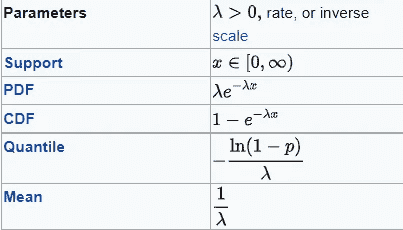

[指数分布—维基百科](https://en.wikipedia.org/wiki/Exponential_distribution)

为了在 SciPy 中实例化指数分布，我们需要将 SciPy 的*标度*参数定义为故障率*λ的*倒数*。* SciPy 对其所有分布使用比例参数；指数分布也不例外。然而，一个更典型的指数分布的定义，如维基百科所示，会用失败率*和*来参数化它(也称为*的倒数*)。

*   SciPy: expon(loc，scale)，其中 scale = (1 /故障率λ)

比例参数代表*平均故障间隔时间*。

为了获得危险函数 h(t ),我们应用我们在第 1.2 章中看到的定义:

*   h(t) = pdf(t) / (1 — CDF(t))

如果你看一下上面显示公式的截图，你会看到这个商将简化为 h(t) = lambda。

指数分布是具有非时变失效率的寿命分布的唯一情况。这种恒定性就是指数随机过程的定义。在任何时间 t，新的缺陷出现在相同的水平λ。指数分布是无记忆的。

这当然是一个大胆的假设。但是，如果分析集中在一个足够窄的时间窗口，以排除磨损效应，它可以与现实相一致；也排除了所谓的婴儿死亡阶段——一个新过程启动后，但在通过消除其早期缺陷而稳定下来之前的时间窗口。因此，指数分布可以应用于我们将在下面进一步讨论的所谓浴盆曲线模型的中心部分。

我们飞往火星的宇宙飞船的一种电路板将在发射后几个小时打开。它们将在升空过程中免受机械应力的影响。这次旅行，包括返回地球，将需要 36 个月。制造商知道这段时间太短，不会因化学或机械老化而导致磨损。但在航行过程中，宇宙辐射会随机击中一些电路。实验室中的辐射测试让我们预计电路将以 0.06%/K 的速率烧毁。该速率将是恒定的，因为在第一天之后，当宇宙飞船离开距离地球 58，000 公里的范艾伦辐射带时，辐射暴露量将仅发生最小量的变化。

翻译:每“千小时”0.06% = 0.06/(100 * 1000)。这是我们可以插入到模型中的故障率λ。在 SciPy 的符号中，我们使用它的倒数 1/lambda 作为比例参数:1，666，667。同样的 1.67 米小时也代表任何电路的平均无故障时间。

在第 6 行，我们将我们想要分析的时间范围制成表格。

第 7 行实例化了 SciPy 的指数分布。位置参数被设置为零:电路可以在它们被接通时立即烧断，在时间零之后没有等待期。比例参数设置为速率λ的倒数。

在第 8 行中，我们通过在累积分布函数中插入时间 T 的范围来评估累积分布函数。我们在第 9 行的字典中收集时间 T 和 cdf 结果。然后，第 10 行中的列表“理解”打印词典。

第 15 行根据指数分布计算平均失效时间，并确认它等于 1/λ。

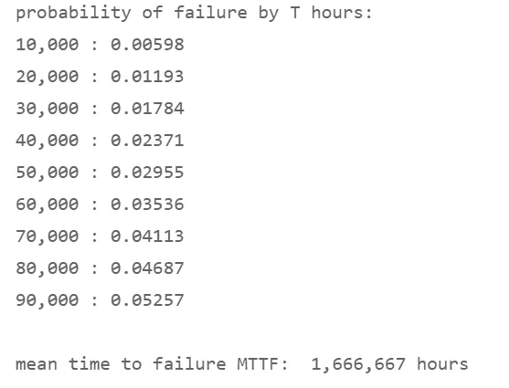

作者图片

在运行 20，000 小时后，即航行 833 天后，1.19%的电路将遭受高能粒子的击倒。这表明，低于 2%的储备将能够抵消辐射风险。

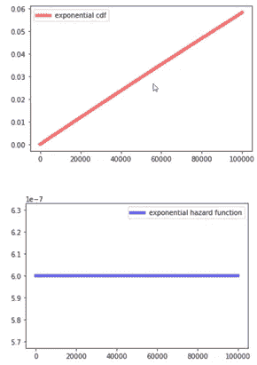

作者图片

不出所料，我们观察到 cdf 曲线中的累积故障呈线性上升；和恒定危险函数。

这证实了指数分布以恒定的失效率运行。

[背景绿板，公共域图片 Pixabay 上的免费照片](https://pixabay.com/photos/background-green-board-business-219809/)

我们的下一个评估计算分位数。多少小时后，1.0%的电路会显示蓝屏错误？在第 2 行到第 5 行，我们准备了一个概率范围，我们将把它提供给第 6 行的百分点函数。第 6 到 8 行收集字典中的分位数和相关概率，第 9 行的 list comprehension 逐行打印。

该表报告了 16，751 小时的 1%分位数。

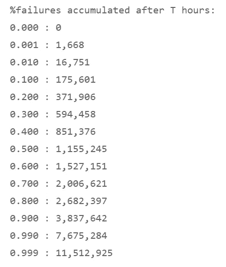

作者图片

**系统故障**

在第 2.2 章中，我提到了乘法法则:如果一个系统的 N 个组件中只有一个失效，那么这个系统的生存概率等于特定组件生存函数的乘积。如果 N 个组件在时间 T 时仍以概率 S 起作用，那么系统在时间 T 时的生存概率 S 将是个体生存概率的乘积。

作者图片

而系统的*失效率*是各个失效率的*之和*。如果所有 N 个部件的故障率都相同，那么系统(我们的宇宙飞船)的故障率将为 N *λ，也遵循指数分布。其平均无故障时间 MTTF 将是 1/(N *λ)的倒数。这被称为*指数闭包性质。*

让我们把这转化为我们的例子。如果宇宙飞船运行 100 个独立的、相同的电路板，每个电路板的 lambda 比率报告为 0.06%/K，并且当第一个到期时系统将会崩溃，那么飞船在运行 T 小时内在太空中倾覆的风险会有多大？

作者图片

系统的故障率 LL 仅仅是单个故障率 l 的 N 倍。在运行 5000 小时后，飞行 7 个月后，太空沉船的风险已经达到近 26%——除非备份电路可以在第一个火花开始飞起来时立即启动。

**分配拟合**

在演习开始时，我们报告说，实验室的辐射测试提供了一个失败率。具有单一参数的指数分布是从观测数据中最容易得到的模型。我们通过将失败次数除以观察小时数来获得参数估计值。

**审查**

当我们考虑*截尾*时，失效率的计算变得更加复杂。

当电路被测试 T 个小时后，其中一些电路将被记录下它们失效的准确时间 T。幸存者将在稍后的某个时间耗尽精力。但我们无法确定它们何时到期。这种源数据问题被称为类型 I 的*右删失:*测试时间 T 是固定的，但是一些单元将存活超过 T 的未知时间。

另一个不同的测试——一个在时间上开放的测试，但是当第 k 个缺陷被观察到时就会结束，无论它何时出现——报告*II 型截尾*结果。

在这两种情况下，我们都必须调整估计的故障率，以获得对所有电路总数的更准确的估计。审查是我将在下一篇文章中讨论的一个方面。

## 2.3 威布尔分布

指数模型基于这样的假设，即没有磨损机制会随着时间的推移而提高故障率。这是一个应该仔细推敲的假设。在我们的宇宙飞船例子中，我们有理由假设这将是一个碰运气的游戏:一个电路可能会也可能不会被单个高能粒子的碰撞所破坏。

但是，较小的辐射损伤的积累可能会成为一个磨损过程，需要我们的生命周期模型中不断增加的终止率。

[火星红色星球，由 WikiImages 拍摄 Pixabay 上的免费照片](https://pixabay.com/photos/mars-red-planet-planet-space-11012/)

到达火星后，我们的设备将暴露在沙尘暴和陡峭的温差中。这些肯定会导致缺陷的增加。

1951 年，瑞典工程师恩斯特·威布尔发展了现在以他的名字命名的分布。这是对各行各业需要一个能够描述真实世界流程的模型的响应，而真实世界的流程通常不会表现出恒定的故障率。威布尔分布可以反映

*   剔除有缺陷的部件时，加工速度降低(形状参数< 1);
*   and also wear-out or aging processes with increasing rates (shape parameter > 1)。
*   如果威布尔形状参数设置为 1，则分布简化为一种特殊情况:指数分布。
*   如果形状设置为 2，它还包括瑞利分布作为另一种特殊情况，这将产生线性增加的危险率。

[SciPy . stats . Weibull _ min—SciPy v 1 . 7 . 1 手册](https://docs.scipy.org/doc/scipy/reference/generated/scipy.stats.weibull_min.html)

SciPy 提供名为 *weibull_min 的 Weibull 模型。*维基百科用形状和比例参数来定义它。在 SciPy 中，您可以通过在形状和比例之间插入一个位置参数，将其转换为一个三参数威布尔分布。形状和比例必须是正数。

*   该位置设置 x 轴上观测开始的最小时间。
*   标度是最大值和最小值之差；换句话说，最大时间 *tmax* =位置+规模。标度参数也被称为*特征寿命*:最小和最大时间之间的跨度。

与指数情况下的λ不同，威布尔风险函数不能从单个参数中读出。它依赖于时间，并受形状和比例的影响:

作者图片

最初，我们将假设我们已经确定我们将在火星表面上使用的电路板的寿命将遵循威布尔分布。寿命显示出增加的故障率。稍后，我们将研究分布拟合来证实最初的假设。

估计特征寿命为 50，000 小时。形状参数为 1.5。我们将位置参数设置为 0——没有等待时间:一旦电路所在的设备暴露在恶劣环境中，电路就可能停止工作。

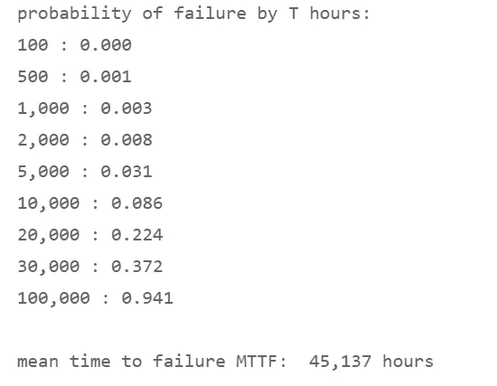

作者图片

作者图片

在磨损阶段，危险函数的斜率变得更陡。

**形状**

威布尔**形状**参数控制曲线的上升或下降。

*   0 < shape < 1 : decreasing hazard rate
*   shape = 1 : constant failure rate
*   shape > 1:增加危险率
*   形状= 2:瑞利分布:风险率线性增加
*   3 ≤形状≤4:CDF 曲线开始类似于正态分布的钟形曲线，尽管具有不同的偏斜度和峰度

**特征寿命**

缩放参数充当一种锚点:

作者图片

我们知道，68%遵循正态分布的观察值位于其平均值的 1 个标准差以内。在任何威布尔分布的情况下，不管形状参数如何，63.2%的观测值低于其特征寿命。

**系统故障**

如果一个系统由 N 个可以用相同的威布尔形状参数建模的独立元件组成，并且当第一个元件损坏时系统将崩溃，那么系统的危险率也遵循具有该形状参数的威布尔分布。

系统的特征寿命是一个更复杂的表达式:

作者图片

我们的任务如下:

[wiki images 拍摄的火星漫游太空旅行 Pixabay 上的免费照片](https://pixabay.com/photos/mars-mars-rover-space-travel-rover-67522/)

我们的火星探测器依靠四块电路板来控制仪器。它们的寿命曲线可以用威布尔形状参数来建模，制造商在测试期间将所有四块板的威布尔形状参数固定为 1.5。这些主板都有不同的典型寿命，有 8，000、10，000、11，000 和 14，000 小时，因为它们包含不同数量的处理器。数字越大，棋盘越早到达临界点。

我们可以期待火星车具有哪些耐力？

作者图片

列表 comprehension Chars 通过实现上面所示的公式来计算漫游者的特征寿命:4058 小时。

描述火星车的威布尔模型告诉我们，它预测的平均到期时间只有 3664 小时。

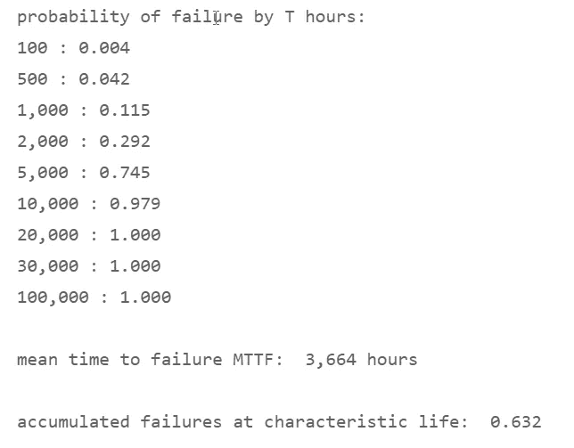

作者图片

**拟合威布尔分布**

在本章开始时，我们假设制造商已经为我们确定了形状和特征寿命。现在让我们快速了解一下分布拟合。制造商的工程团队已经向我们提供了他们测试的原始数据，将由我们来确定与他们的数据相匹配的寿命分布。

在这个练习中，我创建了一个由 100 个观察值组成的合成集合:威布尔分布的变量，夹杂着一些随机抖动。然后我会演示 SciPy 的分布钳工法。

我之前的一篇文章([概率分布和用 Python 的 SciPy |走向数据科学的分布拟合](/probability-distributions-with-pythons-scipy-3da89bf60565))讨论了一个自动拟合脚本，它针对源数据测试了 60 种不同的候选分布。今天，我们把任务限制在寻找一个分布的参数，威布尔模型。

观察数据的数组在脚本中被称为 randWW。

*   在应用 SciPy 的拟合函数之前，我计算了概率为 0.632 的分位数。记住，这个分位数对应于威布尔分布的特征寿命。我将把它作为初步猜测提供给装配工。
*   在拟合函数中，我们将位置参数设置为零。 *floc* 中的前缀 f 告诉装配工保持用户定义值不变。根据经验，我建议尽可能修正位置值。你可能已经预先知道，失效过程将从零开始，就像我们的例子一样。如果不是，将*观察值*的最小值设置为位置参数。否则，装配工可能很难得出一个合理的结果。

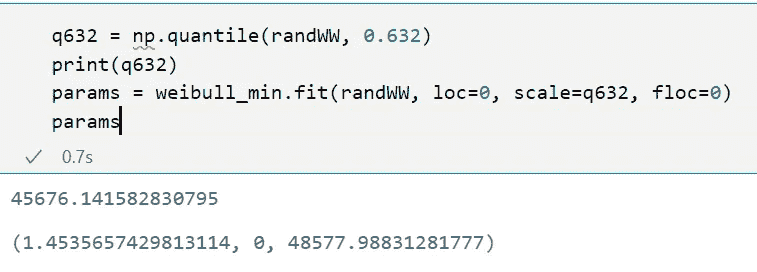

作者图片

拟合函数将返回最小化预测误差的参数元组。在这种情况下，形状为 1.45 小时，特征寿命为 48，578 小时。

我们称之为 SciPy 的 Kolmogorov-Smirnov 拟合优度测试。

作者图片

其结果，0.401 的高 p 值，证实了观测数据与装配员发现的威布尔参数化密切相关。拟合是中等质量的(尽管它远远超过通常的 0.05 的显著性水平)，而不是完美的，因为 100 的样本量很小，因此容易出现异常值。

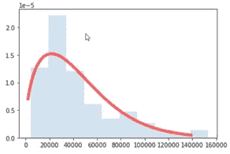

作者图片

**从单调到浴缸**

威布尔过程模拟单调增加、减少或恒定的失效率。在其通常的参数化中，它没有反映最典型的失效过程:所谓的浴盆曲线。让我们试试看。

## 2.4 浴盆形寿命

[Go Game，Alexas _ Fotos—pix abay 上的免费图片](https://pixabay.com/illustrations/pokemon-pokemon-go-game-smartphone-1597290/)

许多过程和系统呈现出类似浴缸轮廓的寿命曲线。

*   它们早期的特点是废弃和浪费率下降。新产品或新生产流程在其初始阶段会经历一个高报废率的磨合或学习阶段。
*   随着时间的推移，质量控制措施会剔除薄弱环节或易出故障的流程步骤。更坚固的部件将决定下一阶段更低的故障率。
*   随后，末期将呈现出递增的终止率，该终止率沿浴缸形状的右壁上升。这是磨合期。组件或系统——机械的、电子的或生物的——在老化过程中会继续加速退化。

by tubath _ curve . jpg:wyatts 衍生作品:MC sush(talk)—tubath _ curve . jpg，公共领域，【https://commons.wikimedia.org/w/index.php?curid=7458336 

*   中心阶段的特点是相对平坦的故障率。磨损导致的退化和系统初期解决的初始结构问题都不会对所谓的稳定故障期产生太大影响。失败确实会发生，但却是随机的。

## 2.4.1 指数化威布尔分布

指数化威布尔分布是少数几种足够灵活的分布之一，可以画出浴缸形状的风险函数。它将第二个形状参数，即指数因子，添加到威布尔-最小分布中。附加参数扩展了 is 曲线的灵活性，可以模拟恒定、递增、递减或浴缸形状。

方便的是，SciPy 通过它的子类 *exponweib* 使它可用。如果它的指数参数设置为 1，那么指数化威布尔就简化为它的特殊情况，威布尔最小分布。

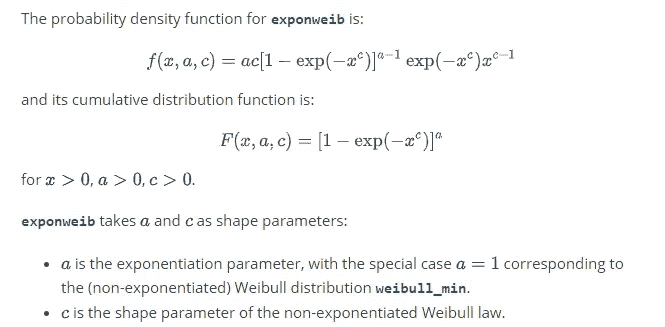

[SciPy . stats . expon weib—SciPy v 1 . 7 . 1 手册](https://docs.scipy.org/doc/scipy/reference/generated/scipy.stats.exponweib.html)

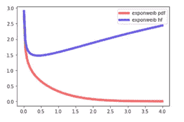

作者图片

然而，出于实际目的，我发现很难找到一个参数组合，使蓝色危险函数的尖肘进一步向右移动。开始时故障率的急剧下降很难通过调整参数来克服，并且不太适合下降阶段持续更长时间的许多现实情况。

## 2.4.3 霍尔特分布

Hjorth 分布提供了一个适应性更强的浴缸曲线。

由于它在 SciPy 的目录中不可用，我们将其实现为一个新的发行版子类，该子类继承自 SciPy 的 *rv_continuous* 类。我们需要六行代码来完成它。

第 1 行显示的继承提供了很大的便利:我们只需要定义概率密度函数 pdf 或者累积分布函数 cdf(第 7 到 11 行)。然后，SciPy 的父类可以接管并通过数值积分或微分计算所有其他属性，如矩、百分点函数和生存函数。

Hjorth 分布取位置参数 m > 0，尺度 s > 0，形状参数 f ≥ 0。

如果形状参数被设置为零，则 Hjorth 分布被简化为 Rayleigh 分布。如果威布尔形状设置为 2，瑞利分布是威布尔分布的特殊情况。因此，Weibull 和 Hjorth 分布是一种表兄弟，两次删除。

作者图片

我们的重点是危险函数，为此我们正在寻找一个产生浴缸形状的设置。我们从位置 m = 20，比例 s = 1，形状 f = 0.1 开始

作者图片

在第 11 行代码中，我们将风险函数计算为概率密度函数和生存函数的商，这两个函数都来自我们的新子类 *hjorth_gen* 。

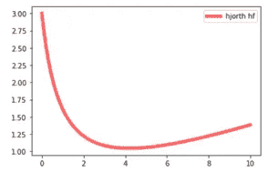

作者图片

我们有浴缸了。参数元组(m，s，f) = (20，1，0.1)为我们提供了风险率的蓝色曲线。

类似地，参数 tuple (3，1，3)会产生一个形状，它的右尾部有一个更适度的增加(左边是红色)。

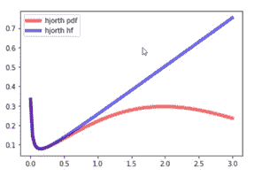

作者图片

元组(2，47，0.33)将描绘浴盆曲线的更陡峭的增加。

现在我们可以开始评估 Hjorth 分布，其方式与我们评估其他具有恒定或单调失效率特征的分布的方式相同。

# 3.结论

我们已经知道，我们现有的概率分布知识可以转移到我们在参数生存分析中遇到的任务。

我们还没有触及可能影响我们的源数据的复杂性:删截和截断，这是生存分析中的两个核心问题，但我们在其他数据科学领域不太经常遇到。这将是未来文章中的一个主题。

Jupyter 笔记本可以在 GitHub 上下载:[h3ik0th/param survival:SciPy 参数生存分析教程(github.com)](https://github.com/h3ik0th/paramsurvival)