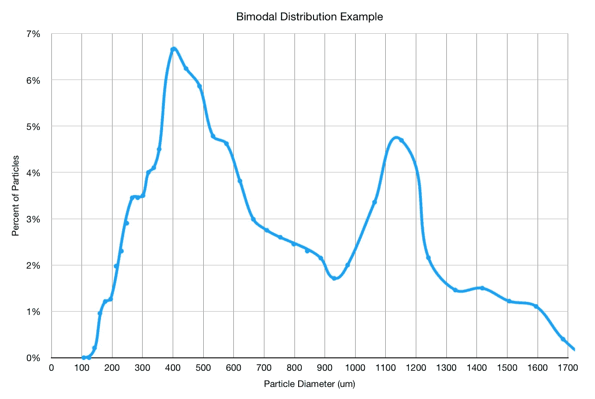
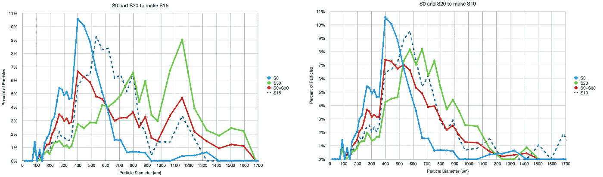
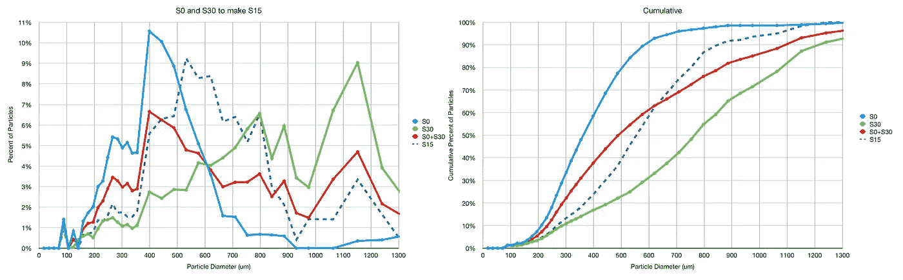
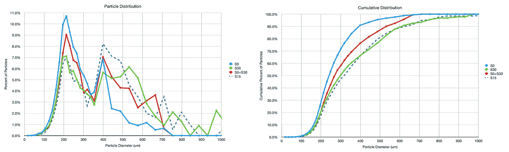
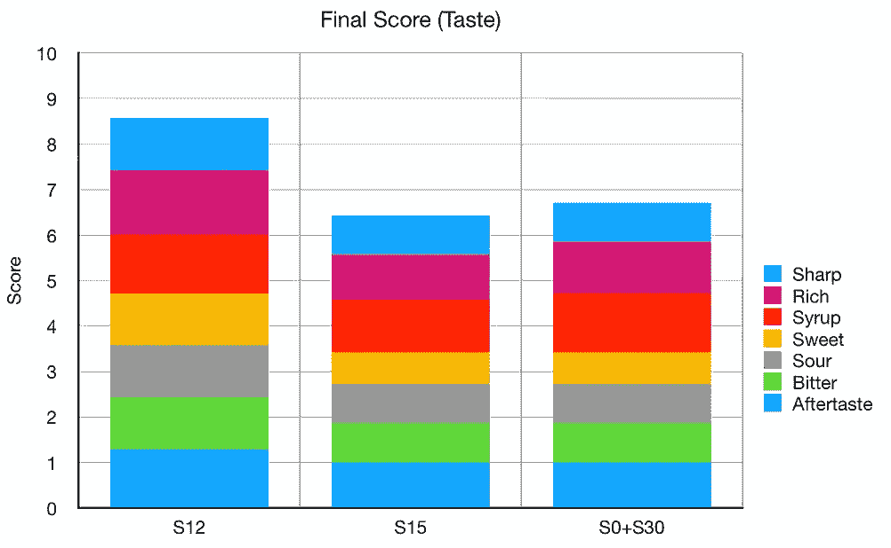
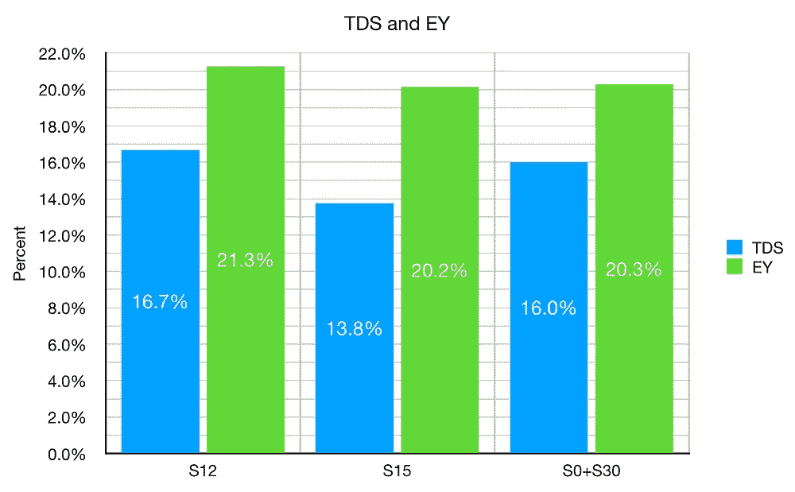
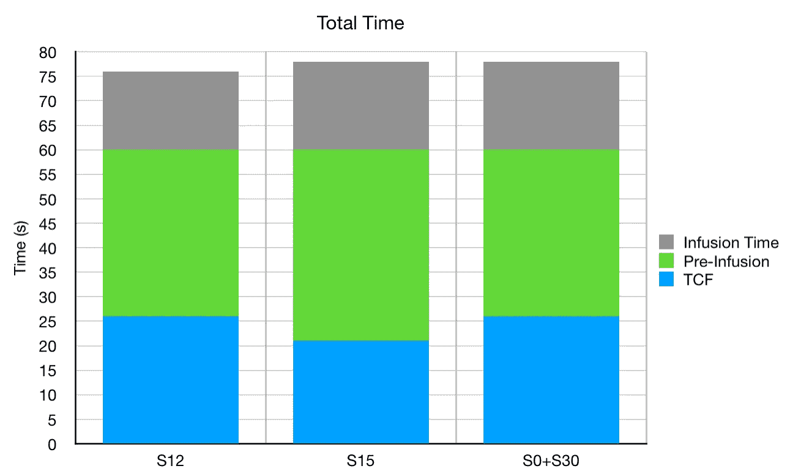

# 浓缩咖啡的强制双峰咖啡分布

> 原文：<https://towardsdatascience.com/forcing-bimodal-coffee-distribution-for-espresso-ee9e898e8424?source=collection_archive---------38----------------------->

## 咖啡数据科学

## 如果你试着打一个坏球会发生什么？

当讨论咖啡磨粒时，存在双峰分布或分布中的两个主峰的问题。这意味着你有很多不同大小的粒子。更高端的研磨机减少了分布，以适应更高斯的曲线，这种增加的均匀性被视为一件好事，正如在浓缩咖啡拍摄中所经历的那样。

假分布显示理想化的双峰分布。并不总是这么干净。

所以我很好奇，如果我强迫一个双峰分布，会如何影响口味？

这种兴趣部分源于想知道你是否能把一个糟糕的磨工变得体面。劣质研磨机的一个问题是，它们磨得太细或太粗——它们没有更好的调整。然而，如果你以不均匀的比率组合两个研磨级别，你能近似一个更好的研磨设置吗？

# 理论的

我开始考虑利用利基市场将两种截然不同的研磨粒度结合起来。所以我查看了这些设置的一些已知粒子分布(S0 和 S30S0 和 S20)，以了解如果我在 mix 的两个设置下研磨，或者只是在两者之间的设置下研磨，分布会有什么不同？

组合 S0 和 S30 看起来是更好的选择，因为它给出了比组合 S0 和 S20 更双峰的分布。而且，S0+S30 比 S15 更双峰。我们可以在这里仔细看看:

# 在实践中

所以我在 S0，S15，S30 磨了一些豆子。然后我混合了 S0 和 S30。结果略有不同。S15 仍然具有与 S30 相似的分布。

# 绩效指标

我使用两个指标来评估技术之间的差异:最终得分和咖啡萃取。

[**最终得分**](https://towardsdatascience.com/@rmckeon/coffee-data-sheet-d95fd241e7f6) 是评分卡上 7 个指标(辛辣、浓郁、糖浆、甜味、酸味、苦味和回味)的平均值。当然，这些分数是主观的，但它们符合我的口味，帮助我提高了我的拍摄水平。分数有一些变化。我的目标是保持每个指标的一致性，但有时粒度很难确定。

# 拉镜头

我拍了些照片。我还拉了一个 S12 的镜头作为参考，因为 S12 通常是一个很好的设置，我已经在多次漫游中拨入。在这种情况下，比 S15 更好。S15 和 S0+S30 在味道上表现相似，但是 S0+S30 能够具有更高的 EY。

就拍摄时间而言，他们都有相似的时间。

我很感兴趣为什么 S0+S30 的 TDS 比 S15 高。假设研磨[分布随着研磨设置线性变化](/linearity-of-a-coffee-grinder-9bed5b84b4be)，这并不完全正确。我感到惊讶的是，味道与 S15 相似，因为我预计味道会因 S30 的粗糙而不同。正如[涡轮增压](https://strivefortone.com/2020/09/19/low-pressure-turbo-shots-and-the-perfect-espresso/)所经历的那样，较粗的研磨可能导致较高的提取率。

至于接下来的步骤，我认为用筛子筛出研磨分布中两个峰之间的音符并真正形成双峰分布会很有趣。

如果你愿意，请在 [Twitter](https://mobile.twitter.com/espressofun?source=post_page---------------------------) 和 [YouTube](https://m.youtube.com/channel/UClgcmAtBMTmVVGANjtntXTw?source=post_page---------------------------) 上关注我，我会在那里发布不同机器上的浓缩咖啡照片和浓缩咖啡相关的视频。你也可以在 [LinkedIn](https://www.linkedin.com/in/robert-mckeon-aloe-01581595?source=post_page---------------------------) 上找到我。也可以在[媒](https://towardsdatascience.com/@rmckeon/follow)和[订阅](https://rmckeon.medium.com/subscribe)关注我。

# [我的进一步阅读](https://rmckeon.medium.com/story-collection-splash-page-e15025710347):

[浓缩咖啡系列文章](https://rmckeon.medium.com/a-collection-of-espresso-articles-de8a3abf9917?postPublishedType=repub)

[工作和学校故事集](https://rmckeon.medium.com/a-collection-of-work-and-school-stories-6b7ca5a58318?source=your_stories_page-------------------------------------)

个人故事和关注点

[乐高故事启动页面](https://rmckeon.medium.com/lego-story-splash-page-b91ba4f56bc7?source=your_stories_page-------------------------------------)

[摄影启动页面](https://rmckeon.medium.com/photography-splash-page-fe93297abc06?source=your_stories_page-------------------------------------)

[使用图像处理测量咖啡研磨颗粒分布](https://link.medium.com/9Az9gAfWXdb)

[改良浓缩咖啡](https://rmckeon.medium.com/improving-espresso-splash-page-576c70e64d0d?source=your_stories_page-------------------------------------)

[断奏生活方式概述](https://rmckeon.medium.com/a-summary-of-the-staccato-lifestyle-dd1dc6d4b861?source=your_stories_page-------------------------------------)

[测量咖啡研磨分布](https://rmckeon.medium.com/measuring-coffee-grind-distribution-d37a39ffc215?source=your_stories_page-------------------------------------)

[咖啡萃取](https://rmckeon.medium.com/coffee-extraction-splash-page-3e568df003ac?source=your_stories_page-------------------------------------)

[咖啡烘焙](https://rmckeon.medium.com/coffee-roasting-splash-page-780b0c3242ea?source=your_stories_page-------------------------------------)

[咖啡豆](https://rmckeon.medium.com/coffee-beans-splash-page-e52e1993274f?source=your_stories_page-------------------------------------)

[浓缩咖啡用纸质过滤器](https://rmckeon.medium.com/paper-filters-for-espresso-splash-page-f55fc553e98?source=your_stories_page-------------------------------------)

[浓缩咖啡篮及相关主题](https://rmckeon.medium.com/espresso-baskets-and-related-topics-splash-page-ff10f690a738?source=your_stories_page-------------------------------------)

[意式咖啡观点](https://rmckeon.medium.com/espresso-opinions-splash-page-5a89856d74da?source=your_stories_page-------------------------------------)

[透明 Portafilter 实验](https://rmckeon.medium.com/transparent-portafilter-experiments-splash-page-8fd3ae3a286d?source=your_stories_page-------------------------------------)

[杠杆机维修](https://rmckeon.medium.com/lever-machine-maintenance-splash-page-72c1e3102ff?source=your_stories_page-------------------------------------)

[咖啡评论和想法](https://rmckeon.medium.com/coffee-reviews-and-thoughts-splash-page-ca6840eb04f7?source=your_stories_page-------------------------------------)

[咖啡实验](https://rmckeon.medium.com/coffee-experiments-splash-page-671a77ba4d42?source=your_stories_page-------------------------------------)