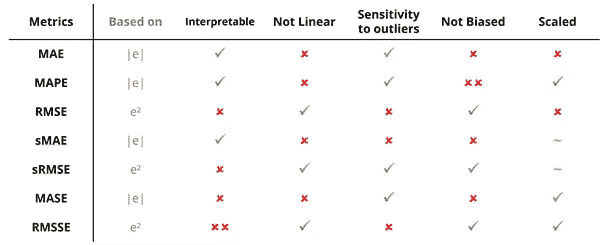

# 预测 KPI:如何评估产品组合的准确性

> 原文：<https://towardsdatascience.com/forecast-kpi-how-to-assess-the-accuracy-of-a-product-portfolio-bc38135a6d2a?source=collection_archive---------9----------------------->

## MAPE、MAE 和 RMSE 等预测 KPI 不适合评估产品组合的准确性。让我们来看看几个新的指标:MASE、RMSSE、WMASE 和 WRMSSE。

作为预测者，我们的工具箱中有许多指标来评估预测的质量。每个指标(偏差、平均误差和 RMSE)都有利弊。但总的来说，当比较同一产品的两个模型时，我们知道实现较低偏差、MAE 和 RMSE 的模型是最好的。

实际上，供应链对逐个比较 SKU*达到的精确度不感兴趣。因此，问题不在于逐个评估每个 SKU 获得的精度；但是如何评估整个产品组合的预测模型(或过程)的整体质量。在跟踪预测附加值时，预测模型和需求预测流程整体上也是如此(FVA，如(吉利兰，2010 年)所述)。*

简而言之，由于我们只能改进我们可以衡量的东西，我们必须有一个衡量标准来评估产品组合预测的质量。

# 评估产品组合的准确性时的准确性幻象

让我们用一个例子来说明在看产品组合时，三个通常的度量标准(偏差、MAE 和 RMSE)的不相关性。

假设你负责预测六种产品。它们不可互换，同等重要(有价值)，没有季节性，需要不同的供应资源。*(测量偏差只对一组可互换的项目有意义；或者如果他们都使用相同的受限资源——作为共同的供应商或生产流程。)*你要根据他们预测第 6 期需求的历史表现，选择你最喜欢的预测模型(A、B、C 或 D)(为简明起见，我们只看一期)。在表 1 中，A、B、C 和 D 之间的差异用蓝色突出显示。

表 1 预测比较。

在表 2 中可以看到在第 6 阶段达到的常用指标(偏差、平均误差和 RMSE)。

表 2

与任何其他预测相比，预测 C 以相当大的优势胜出(它具有最低的 MAE 和 RMSE，其偏差最接近于零)。此外，预测 A 在所有指标上都是最差的。

根据我的咨询经验，大多数供应链经理会通过查看 MAE 和 Bias 来评估预测质量。根据这两个指标，他们应该选择预测 C 作为第 6 阶段的最佳预测。

这是最明智的选择吗？

让我们比较一下预测 A 和其他三个挑战者。

*   预测 B 在产品#4 上犯了一个巨大的错误(这甚至可能导致对供应商的一些牛鞭效应),在产品#6 上犯了一个较小的错误。这对 MAE 没有影响，因为总绝对误差仍然相同(A 和 B 表现相同)。看看 RMSE，预测 A 更糟，因为它在第 6 项上犯了一个巨大的错误(这是因为 RMSE 对更重大的错误很敏感)。尽管如此，作为一名供应链从业者，我认为预测 A 比预测 b 更好。后者在第 4 项上有很大的误差(第 6 项上较小的误差没有补偿它)。
*   与观察到的通常需求范围相比，预测 C 在项目#1、#3 和#5 上产生相对较大的误差。它仅改进了项目#6 的预测，但是考虑到观察到的需求变化和项目#6 的平均值，这不是这样的改进。同样，在实践中，大多数供应链计划者通常更喜欢 A 而不是 c。
*   预测 D 对产品#3 做出了更差的预测，其误差已经很大了(绝对误差已经是 14)。更大的误差可能会导致更多的销售损失。另一方面，D 对产品#4 做出了更好的预测，但它已经是准确的了(对于每期销售约 13 个单位的产品，误差为 2 个单位)。这种额外的准确性可能不会导致更少的过时成本，只是略微节省了持有成本。我认为 A 和 D 很接近，但 A 应该是首选。

简而言之，我们看到通常的度量三重奏(Bias、MAE 和 RMSE)不适于区分产品组合中好的和坏的预测。更糟糕的是，在某些情况下，这三人组会建议我们选择最糟糕的预测(我称之为*准确性幻影*)。

## 机器学习弱点

这种准确性幻影尤其糟糕，因为我们通常使用 MAE 或 RMSE 来训练机器学习算法。随着机器学习算法优化整个*数据集的误差，它们将更喜欢预测 C 而不是预测 A(因为 C 具有较低的 MAE 和 RMSE)。[【1】](#_ftn1)另一方面，统计模型通常独立地优化每个时间序列*，从此完全避免了准确性的幻影。机器学习从业者应该特别关注选择正确的度量标准，避免这种准确性幻觉。**

*[【1】](#_ftnref1)我这里假设我们训练的是全局机器学习算法。也就是说，一次对所有产品训练一个算法(与为每个时间序列训练一个单独的模型相反)。*

# *对完美投资组合度量的不可能的追求*

*我们需要找到一个新的(一组)指标来充分评估产品组合预测的质量。*

**完美的*指标应该是:*

*   ***可操作的。**供应链是一个不断做出决策的生命体。为了做出适当的决策，供应链需要得到可靠的预测流程的支持。从今以后，预测指标应该使预测者(和计划者)能够提高供应链的计划能力。通常，计划者会查看最大的预测违规者，以执行纠正措施。*可操作的*指标是指向*有意义的*违规者的指标。*
*   ***(容易)解释的。**你希望使用计划者和管理层都能理解的简单指标。简单来说，你想通过查看一个简单的 KPI 来知道预测是好是坏。*
*   ***不是线性的。小的预测误差会导致库存过多或消耗少量安全库存。重大预测误差会导致库存积压或销售损失。从数学上来说，我们说供应链成本不是线性的:错 50 个单位比错 5 个单位要糟糕十倍以上。由于供应链成本不是线性的，因此错误惩罚也应该是线性的。***
*   ***对异常值不敏感。**供应链需求数据集通常充满异常值:我们不希望我们的指标对这些数据反应过度。*

> ***异常值敏感度与惩罚重大错误** 我们需要在抵制异常值的指标(通常是基于绝对误差的指标)和惩罚更重大错误的指标(通常是基于平方误差的指标)之间进行权衡。一个解决办法是使用多个指标的平均值。*

*   ***不偏不倚。**任何非对称指标(即，不会对超出和低于预测的指标进行同等惩罚)都会导致有偏差的需求估计。有偏见的预测会损害其他计划者和供应链职能部门对你的预测的信任(并最终损害其依从性)。简而言之，如果你持续超出预测 5%，很快生产计划员将生产 95%的计划，供应计划员将订购 95%的所需原材料，等等。这将助长不信任的恶性循环。我经常听到这样一个问题，“我们是否应该高估需求，因为丢失一件商品的成本要高于多买一件商品的成本？”库存政策、服务水平目标和生产目标应考虑供应可变性、预测误差、交付周期、各种成本和盈利能力，而不仅仅是(vande put，2020)中解释的需求预测。你的需求预测应该是对未来需求的无偏估计。然后你可以根据其他众多因素或多或少地生产。简而言之，正确的服务水平目标应该适当地保护您免于缺货，而不是有偏见的预测。*
*   ***加权。**并非所有产品都同等重要。有些价值更高，有些带来更多利润或承担更多风险。这些关键产品应该得到更多的关注(无论是来自规划者还是机器学习算法)。简而言之，关键产品上的错误应该比无关紧要的 SKU 上的错误受到更多的惩罚。不知何故，我们希望在指标中整合优先化理念，这是许多计划者使用的 ABC 分析的核心。*

> ***加权指标**
> 我们可以很容易地对任何指标进行加权，将每个误差乘以所需的权重，如(Vandeput，2021)中所述。数学上，我们有:*加权误差= w x 误差*其中 w 是产品的重量。为了表示加权度量的使用，我们在其名称前添加字母 W(例如，WMAE 或 WRMSE)。*

*   ***按比例缩放。**我们应该惩罚与在每个时间序列中观察到的通常需求相比大的*预测误差。如果预期需求为每期 10 件的时间序列比通常需求为每期 100 件的时间序列出现 50 件的偏差，则应受到更多惩罚。请注意，我们可以对每件物品进行称重。权重与产品的重要性有关，而比例则与每种产品的需求量有关。
    我们将在下一部分讨论衡量指标。**
*   ***不可破解。**最后，预测者不应该人为地做出错误的预测，从而得出更好的指标。除此之外，我们应该注意没有一个项目得到负的*权重(如上所述)。如果您将每种产品的权重设置为其单位利润，您可能会遇到这样的情况:某些项目在总准确性指标中的权重为负。这意味着对该项目的预测越差，指标就越好。**

# *缩放指标:MAPE、sMAE、MASE 和 RMSSE*

*将预测误差换算成“正常需求”非常简单。让我们讨论一下如何衡量每种产品的预测误差的三个想法。*

## *想法 1:根据预测范围内的需求进行扩展(MAPE)*

*我们可以通过将每个产品的预测误差除以其观察到的需求(在预测范围内观察到的)来进行简单的缩放。这是 MAPE 背后的(坏)想法。我们将 MAPE 定义为:*

**

*其中预测范围从时段 *n+1* 开始，直到 *n+h.**

***局限性***

*   *如(Vandeput，2021)所述，使用 MAPE 会导致选择有偏差和扭曲的预测。*
*   *在预测范围内，我们有零需求的风险，导致不确定的预测误差。*
*   *由于 MAPE 使用*未来*需求来衡量预测误差——从而揭示未来的一些情况——这一指标不能用于训练机器学习算法。*

## *想法 2:基于历史需求的扩展(sMAE)*

*另一个想法是根据每个项目的历史平均需求来调整。我们将获得一个度量，如缩放平均绝对误差(sMAE)，如(彼得罗保罗斯等人，2015 年)中所述:*

**

*sMAE 已经比 MAPE 好了，因为我们避免了除以 0 的风险和(大规模)有偏见的预测的风险。因为我们只使用历史信息来衡量误差，所以我们可以在机器学习算法中使用 sMAE。*

***限制***

*   *正如(Svetunkov，2019 年)和(Hyndman 等人，2006 年)所解释的那样，如果你有需求趋势(供应链中几乎总是如此)，基于每个项目的历史平均值来衡量每个项目的误差可能会造成扭曲。*
*   *对于季节性产品，为了避免在计算历史平均值时偏离比例，您必须始终密切注意包括整个季节性周期。*

## *想法 3:基于历史(原始)误差(MASE 和 RMSSE)的缩放*

*我们可以将预测误差换算成历史需求平均值，而不是历史水平的原始误差。简而言之，我们将根据每一项的*可预测性*来衡量每一项。为此，我们将使用(Hyndman 等人，2006 年)中介绍的平均绝对对称误差(MASE)和(MOFC，2020 年)中介绍的均方根对称误差(RMSSE)。*

****

*历史的地平线一直延伸到时期*n*；并且预测范围从时段 *n+1* 开始，直到 *n+h.**

***解读。** MASE 和 RMSSE 可以解释为预测误差与每个项目可预测性之间的比值(任何小于 1 的值都意味着模型在增值)。我们可以将 1 — MASE(或 1 — RMSSE)解读为与原始基准相比误差减少的百分比(任何负值都意味着模型比基准差)。RMSSE 和 MASE 应被解释为模型相对于原始预测的加权预测增加值(用%表示，越低越好)。*

*正如(Vandeput，2021)中所建议的，RMSSE 的降低可以解释为最大*误差的降低。MASE 的减少可以表示为总误差的减少。**

***加权。**在一个数据集上平均一个缩放指标(MAPE、sMAE、sRMSE、MASE 或 RMSSE)将**而不是**产生一个有意义的指标。你可能会比较*等级的*苹果和*等级的*梨:每一种产品都被认为同等重要，每一个销量都被标准化了。这是没有意义的:在大批量、高价值的产品上实现低规模的指标比在小批量、低价值的产品上实现良好的准确性更重要。因此，我们应该权衡衡量标准，将产品的重要性*和*总销量考虑在内。不幸的是，对于如何衡量销售量的衡量指标，没有什么灵丹妙药。一种方法是根据每个 SKU 的(最近)历史需求量对其进行加权。这是在(财政部，2020 年)中所做的，其中每个 SKU 根据其最后 4 周的收入进行加权。*

**

***限制***

*   *RMSSE 和 MASE 不适合季节性产品。由于与非季节性产品相比，历史需求期间的天真误差会被任意夸大，因此季节性产品在 RMSSE/MASE 中的权重较低。(Hyndman 等人，2006 年)提出的一个可能的解决方案是使用季节性的简单基准，而不是常规的简单基准。*
*   *由于比例是基于历史可变性的，任何具有历史异常值的项目都将被认为是(非常)不重要的。一个可能的解决方案是计算相似项目的平均可预测性，并将其用于每个项目。*
*   *在实践中，实现 MASE 和 RMSSE 并不简单，因为您需要计算历史上天真的 MAE 和 RMSE(如果您的所有时间序列不在同一时间点开始，这可能会变得更加棘手)。*
*   *此外，它们都缺乏可解释性和绝对的复杂性——尤其是考虑到权重时——这使得它们不适合一般的供应链会议。*

## *实践中的 MASE 和 RMSSE*

**

*表 3 有原始误差的历史需求*

*我们获得了表 4 中所示的指标，其中预测 D 实现了最少的 MASE 和 RMSSE。为了简明起见，没有报告 MAPE、sMAE 和 sRMSE，因为基于前面讨论的限制，它们不应该被使用。*

**

*表 4 使用加权比例指标预测 KPI*

# *结论*

**

*表 5 指标比较*

*我们看到通常的度量三人组(Bias、MAE 和 RMSE)不适合评估产品组合的预测质量。这对于机器学习模型来说是一个重要的问题，因为它们优化了整个数据集的指标。在讨论了*完美*指标的特征后，我们看到加权、缩放的指标(WMASE 或 WRMSSE)可能会对产品组合预测的质量产生新的影响。但是，这两个新指标还不是我们追求的完美指标。研究仍在继续。*

*与此同时，我会建议公司依赖一套*加权*指标(如偏差、WMAE 和 WRMSSE ),而不是通常的 MAE/偏差组合。使用一套不同的指标也将使计划者能够关注更有意义的违规者，从而使供应链能够做出更好的决策。*

# *文献学*

***吉利兰迈克尔**商业预测交易:揭露神话，消除不良做法，提供切实可行的解决方案:约翰威利& Sons，2010。*

***Hyndman Rob J .和 Koehler Anne B.** 对预测准确性的另一种衡量。国际预测杂志，2006 年，第 679-688 页。*

*商务部 M5 申办 2020 年奥运会。[https://mofc.unic.ac.cy/m5-competition/.](https://mofc.unic.ac.cy/m5-competition/.)*

***彼得罗保罗斯·福蒂斯和考伦茨·尼古拉奥斯**间歇性需求的预测组合:运筹学学会杂志，2015 年，第 66 卷。*

*你确定你是精确的吗？测量点预测的准确性，2009 年。[https://forecasting . svetunkov . ru/en/2019/08/25/are-you-sure-you-precision-measuring-accuracy-of-point-forecasts/。](https://forecasting.svetunkov.ru/en/2019/08/25/are-you-sure-youre-precise-measuring-accuracy-of-point-forecasts/.)*

***Vandeput Nicolas** 供应链预测的数据科学。柏林，波士顿:德·格鲁埃特，2021。*

*库存优化:模型和模拟。柏林，波士顿:德·格鲁埃特，2020。*

## *👉让我们在 LinkedIn 上联系吧！*

# *关于作者*

*icolas Vandeput 是一名供应链数据科学家，擅长需求预测和库存优化。他在 2016 年创立了自己的咨询公司 [SupChains](http://www.supchains.com/) ，并在 2018 年共同创立了 [SKU 科学](https://bit.ly/3ozydFN)——一个快速、简单、实惠的需求预测平台。尼古拉斯对教育充满热情，他既是一个狂热的学习者，也喜欢在大学教学:自 2014 年以来，他一直在比利时布鲁塞尔为硕士学生教授预测和库存优化。自 2020 年以来，他还在法国巴黎的 CentraleSupelec 教授这两门课程。他于 2018 年出版了 [*供应链预测的数据科学*](https://www.amazon.com/Data-Science-Supply-Chain-Forecasting/dp/3110671107)(2021 年第 2 版)和 2020 年出版了 [*库存优化:模型与模拟*](https://www.amazon.com/Inventory-Optimization-Simulations-Nicolas-Vandeput/dp/3110673916) 。*

**