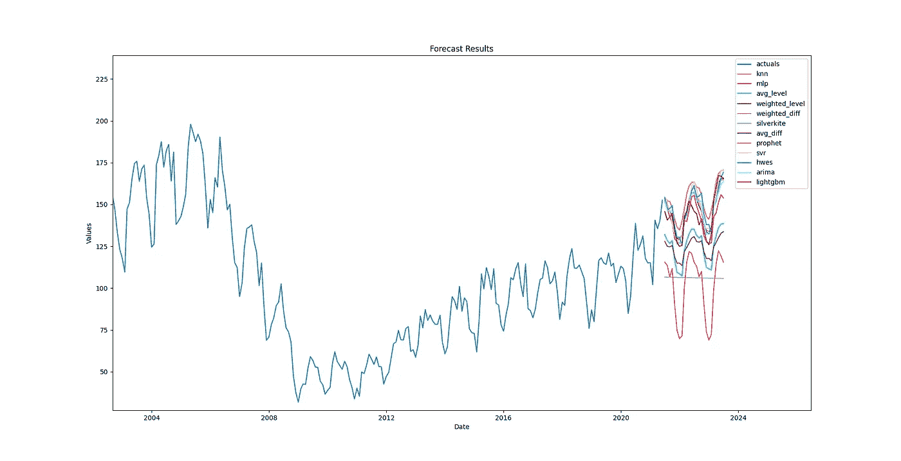

# 预测不同的水平:介绍 Scalecast Pt。3

> 原文：<https://towardsdatascience.com/forecast-on-3-levels-introducing-scalecast-pt-3-eb725e0be6c9?source=collection_archive---------25----------------------->

## 直接比较基于静态和非静态数据运行的模型


照片由 [Chor 曾](https://unsplash.com/@chortsang?utm_source=medium&utm_medium=referral)在 [Unsplash](https://unsplash.com?utm_source=medium&utm_medium=referral) 拍摄

欢迎回到 scalecast 系列的最后部分。[第 1 部分](/introducing-scalecast-a-forecasting-library-pt-1-33b556d9b019)介绍了对一个系列的预测。第 2 部分将该方法扩展到许多系列。这一部分展示了如何在不同的层次上对相同的序列进行建模，并公平而容易地比较结果。

[](https://github.com/mikekeith52/scalecast) [## GitHub - mikekeith52/scalecast:一个灵活的、代码最少的预测对象。

### 一个灵活的、代码最少的预测对象。通过在…上创建帐户，为 mikekeith52/scalecast 开发做出贡献

github.com](https://github.com/mikekeith52/scalecast) 

注意:这篇文章最初是为了展示 scalecast 早期版本的差异和均衡特性而写的。此后，自动化和更复杂的系列转换被引入。参见 [scalecast 入门笔记本](https://scalecast-examples.readthedocs.io/en/latest/misc/introduction/Introduction2.html#Transformations)。这里写的大部分内容在 scalecast 的当前版本中仍然是可能的。

## 为什么要在意等级？

在预测任何给定的时间序列之前，必须对其进行一些考虑，以确保它是平稳的，这意味着它的均值和方差不会随时间随机变化。否则，您将尝试建模的大部分内容将是随机的。像 [Prophet](https://facebook.github.io/prophet/) 和 [Silverkite](https://engineering.linkedin.com/blog/2021/greykite--a-flexible--intuitive--and-fast-forecasting-library) 这样的模型通过使用分段函数来处理非平稳数据——Prophet 使用贝叶斯回归方法，而 Silverkite 使用带正则化的线性模型。ARIMA 代表自回归综合移动平均线；在这种情况下,“集成”指的是 ARIMA 内部处理非平稳性的机制。指数平滑法对近期观测值的权重大于早期观测值。通过以上所有方式，可以处理非平稳趋势，以便评估准确的预测。

其他常用于预测的机器学习模型，如决策树、非分段线性回归函数、k 近邻、支持向量机和神经网络，都没有考虑非平稳数据。无论如何，如果您试图向他们提供这样的数据，随机趋势变化会严重影响模型，导致噪声被解释为信号和虚假结果。你可能很幸运，仍然获得看似不错的预测，但你的模型可能无法推广到未来的许多阶段。

为了补救这一点，我们可以在将一个系列的一阶或二阶差输入到特定的模型中之前获取它；时间序列中的每一次观察都变成了前一次观察和它本身的差异。因此，大部分噪声被从序列中剥离出来，留下可以建模的周期性信号，如季节性、滞后效应和/或特定协变量。这种策略的唯一缺点是失去了可解释性，并且需要更多的后端工作来使预测对其他人有用。

确定你的数据是否稳定的一个好的统计测试是增强的 Dickey Fuller。它的零假设是，你给它的数据不是平稳的，如果你想安全，这也应该是你处理时间序列时的默认假设。当你的数据不是稳定的时候，假设你的数据是稳定的比反之更严重，至少这是我的经济学老师总是告诉我的。

## 在不同级别上运行模型

当您想要比较考虑平稳性的模型和不考虑平稳性的模型的预测结果时，您会怎么做？为了安全起见，一个答案是用静态数据运行所有模型，但更动态的方法是对水平数据运行一些序列，对差异数据运行其他序列。然后，可以根据每个模型在级别数据上的表现来比较误差和准确性指标。

执行这个策略可能很有挑战性，但是使用 scalecast 时很容易(参见示例中使用的完整脚本[这里](https://github.com/mikekeith52/scalecast-examples/blob/main/misc/housing/housing.ipynb))。首先，安装软件包并满足其他需求:

```
pip install scalecast
pip install pandas-datareader
pip install lightgbm
pip install fbprophet
pip install greykite
```

接下来，导入库并加载数据:

我们在[第一部分](/introducing-scalecast-a-forecasting-library-pt-1-33b556d9b019)中很好地检验了这些数据。这一次我们使用相同的预处理步骤——对序列求差分，使其稳定；规定测试和验证周期；并添加季节回归、自回归项、时间趋势和一些其他变量。

让我们将四种模型应用于差异数据——K-最近邻、支持向量机、光梯度增强机和多层感知器。我们还可以选择四个模型，无论数据是否平稳，它们都应该工作良好:ARIMA、霍尔特-温特斯指数平滑、脸书先知和 LinkedIn SilverKite。我们将后四个应用于原始级别的数据。我们还为这两种模型类型中的每一种添加了两个组合模型，总共剩下四个组合模型。

为了调整这些模型，我们在工作目录中放置了一个 [Grids.py](https://scalecast.readthedocs.io/en/latest/Forecaster/GridGenerator.html) 文件。一种简单的方法是使用:

```
from scalecast import GridGenerator
GridGenerator.get_example_grids()
```

当运行您自己的应用程序时，我们鼓励您在您认为合适的时候手动修改这个文件中的网格。

## 直观比较结果

当比较结果时，分析的有趣部分就来了。首先，为了简洁起见，让我们选择一个可以信任的错误/准确性指标(比较几个指标可能更有趣，但这超出了本文的范围)。由于预测是在不同的水平上进行的，我们应该选择一个对所有序列都有意义的预测。我喜欢 LevelTestSetMape。当向组织中的高级决策者交付预测时，人们通常最关心的是预期结果与实际结果之间的差距。当你能快速说出一个百分点的时候，这是很受欢迎的——这样，就不会对比例或统计数据产生混淆。平均绝对百分比误差(MAPE)允许我们这样做，LevelTestSetMAPE 通常对您可能预测的任何系列进行公正的评估。让我们来看看绘制的预测，根据这个指标从最好到最差排序:



作者图片

k-最近邻返回了最好的结果(0.07 MAPE)，其次是多级感知器(0.08 MAPE)，两者都在差异数据上运行，但在这里直观地显示在级别数据上。在水平数据上运行的最佳模型是简单平均组合模型(0.08 MAPE)，然而，从视觉上看，该模型的评估比直观的要低很多。让我们仔细看看这些测试集的结果:


作者图片

看起来对`avg_lvl`有利的测试集指标是由于 ARIMA 模型对该特定数据段的评估远远高于其他级别的模型(注意——实际上是由于 scalecast 版本 0.9.1 中解决的代码错误)。对于我的最终预测，我既不相信 ARIMA 模型，也不相信组合模型——它们的表现不可靠，也不总是超出样本。有时候你会看到这样奇怪的东西；一些模型在相反的方向上相差甚远，这使得组合模型乍一看似乎是合理的。但在做最后决定时，你必须运用常识。

有趣的是，在水平数据上运行的模型比其他模型表现得更差。银雀回报了 0.17 的 MAPE 和 0.23 的先知。也许更重要的是，他们的结果看起来不可信。尽管这些模型有处理非平稳性的机制，但在平稳数据上运行它们仍然是一个好主意。如果我们那样做了，我们可能会取得更好的结果。另一种选择是花更多的时间处理它们的变点参数(分段函数在序列中变化的点)，看看是否有办法让它们更有效地捕捉序列趋势的变化。当观察拟合值(样本内预测)时，我们可以看到在水平数据上运行的模型可能出错的地方:


作者图片

我们看到，先知没有能够在系列中找到任何变化点，始终遵循一个趋势。它不够动态，无法可靠地预测这些数据。SilverKite 也始终遵循一个趋势，并且无法获得该系列的任何季节性，可能是过度正规化了。另外两个看起来可能装得太多了。

虽然不是所有基于差异数据评估的模型都比那些没有差异的模型好，但差异被证明是该过程的一个重要部分。我们简单地利用平稳数据，很容易地得出了两个非常可信的预测(KNN 和 MLP)。

最后，我认为探索最佳表现模型的选定超参数是很有趣的:

```
knn HyperParams: {'n_neighbors': 11, 'weights': 'uniform'}
mlp HyperParams: {'activation': 'relu', 'hidden_layer_sizes': (25, 25), 'solver': 'adam', 'random_state': 20}
```

了解这些信息是在未来的预测迭代中获得更好结果的起点。

## 结论

在探索这些结果的过程中，我们看到了一个在不同级别进行预测的例子，并对尝试这样做时可能面临的潜在挑战有了更好的了解。scalecast 软件包简化了这一过程。

感谢您的关注。scalecast 系列到此结束。这个包可以做很多事情，希望你可以更容易地访问它的一些功能。自从最初的系列文章结束以来，我已经写了很多关于这个包的文章。关注我，获取更多预测和数据科学文章。