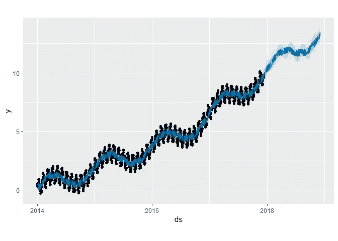
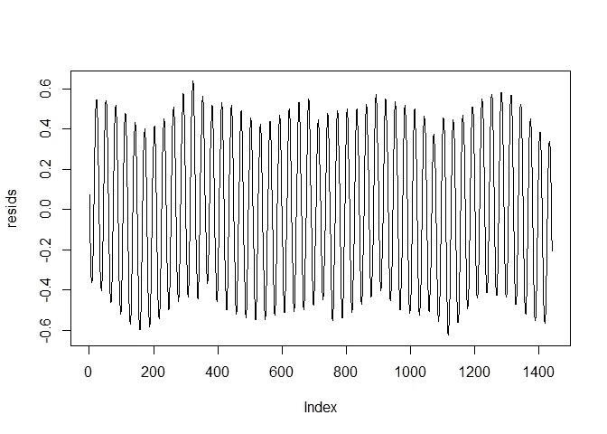
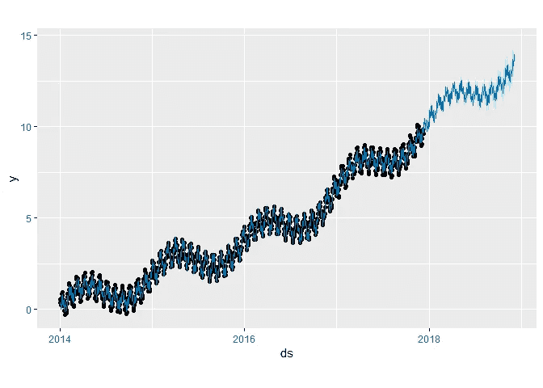
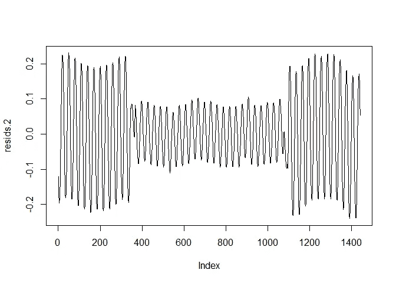
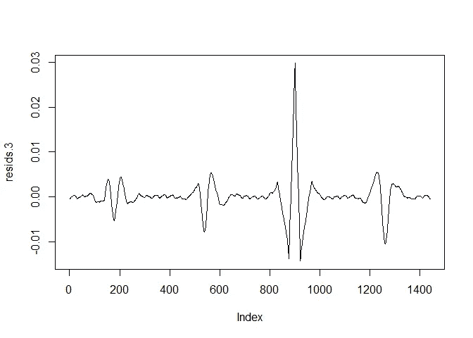
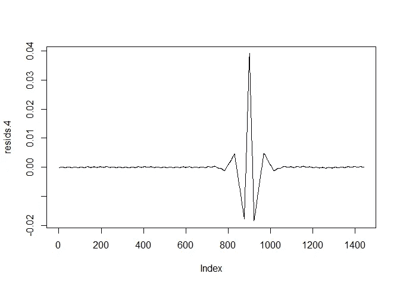
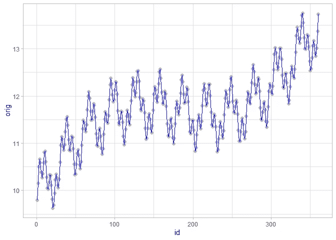

# 脸书预言家的尺度预报——一个关于其优点和局限性的案例研究

> 原文：<https://towardsdatascience.com/forecasting-at-scale-with-facebook-prophet-a-case-study-on-its-merits-limitations-b24a694dd7c7?source=collection_archive---------16----------------------->

## 领域知识仍然是机器学习应用中的决定性因素

# 背景

时间序列预测通常是一项复杂的任务，因为单变量数据的结构通常包含许多未观察到的因素。标准模型，如 [ARIMA](https://en.wikipedia.org/wiki/Autoregressive_integrated_moving_average) 或滤波器，如[卡尔曼滤波器](https://en.wikipedia.org/wiki/Kalman_filter)是复杂的模型，经常需要调整，这需要对基础理论有严格的理解。

具有良好领域知识但缺乏统计知识的从业者希望利用机器学习和预测方法来为他们的业务决策提供信息。因此，许多软件包和库试图通过提供自动化解决方案来弥合这一差距。

这篇文章的目的是调查脸书的一个很有前途的图书馆，叫做[先知](https://facebook.github.io/prophet/)。Prophet 的承诺是大规模自动生成预测。

# 结果

不幸的是，即使是在实验室环境下，人们对一台引擎能够在没有任何交互作用的情况下进行大规模可靠预测的希望也太高了。然而，经过一些调整后，这个库运行良好，并能识别测试数据中的所有元素。因此，只要对这个领域有一点了解，这个库就会产生有用的结果

# 情况

为了进行设置，加载预测库、漂亮图形的 ggplot 和一些时间序列魔术的 zoo。

现在生成数据。我们将使用 5 年的数据，包括三种不同的季节模式和前半段时间后的变化趋势。

通过识别 sin *(2π/b)* 的周期长度为 b，三角函数可用于生成季节模式。换句话说，每个 *b* 周期，模式都会重复。我们将使用年度模式 *(b=360)* 、月周期 *(b=30)* 和周周期 *(b=7)* 。

该趋势将在半个观察周期后被提升，以测试 FB Prophet 是否能够发现这种结构变化。我们会看到，它确实在这个挑战中做得很好。

先知可以捕捉的其他特征是趋势饱和度和特殊事件，如假期。但是这里不讨论这些。

该模型将根据前四年的数据进行训练。第五年的数据用于评估模型的性能。

首先，我们在没有进一步信息的情况下运行 Prophet:

要从中创建预测，需要调用保存预测的数据框:

数据和预测的吻合度(图片由作者提供)

从这个情节中，很容易理解拟合度是可以提高的。季节的高峰没有被很好地捕捉。为了更好地理解发生了什么，让我们看看残差:

剩余剧情(图片由作者提供)

残差的范围相当宽，并且可以看到清晰的结构。所以模型里少了一个成分。让我们试着明确地说明每年的季节性:

数据和预测的吻合度(图片由作者提供)

看起来更好，但仍不完美。请记住，模型数据是在没有噪声的情况下生成的，因此模型应该能够以几乎 100%的准确度拟合数据。

然而，这次残差显示了一个不同的问题:

剩余剧情(图片由作者提供)

这是为什么领域知识很重要的主要例子。因为我们知道底层数据的频率，所以我们可以用参数 *period* 来指定它。

为此，我们设置了不带季节组件的模型，并手动添加它们:

剩余剧情(图片由作者提供)

这看起来更好，除了围绕趋势变化发生的突破。但是，残差中还是有结构的。这里的问题是过拟合，这是由参数*傅立叶级数*引起的。该参数的标准值为 *10* 。

Prophet 使用[傅立叶变换](https://en.wikipedia.org/wiki/Fourier_transform)来估计季节性成分。基本思想是任何任意信号都可以用足够数量的正弦曲线来近似。傅立叶阶参数指定了这里应该使用多少个。因为我们只使用一条 *sin* 曲线创建了每个组件，所以真正的顺序是 1。

所以让我们看看当我们告诉先知这个模型的这个方面时会发生什么:

残差图

残差现在看起来好多了，除了趋势变化时的干扰，但这并不奇怪，因为它突然打破了数据的良好规则模式。

现在让我们看看样本外预测，看看训练数据集的良好拟合是否转化为良好的预测:

真实数据(灰色)和拟合(蓝色)//(图片由作者提供)

预测现在完全符合真实数据！

# 外卖

自动预测对于大规模商业应用来说是一个方便的特性。然而，这些方法并不总是现成的。我们必须从数据生成过程中编织大量的知识，以创建一个良好的模型拟合。

如果没有这些见解，模型仍然是有用的，但仍然不精确，尽管数据生成过程遵循与数据探索方法完全相同的逻辑。