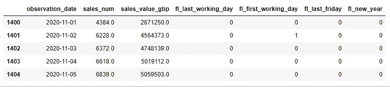
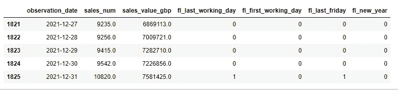
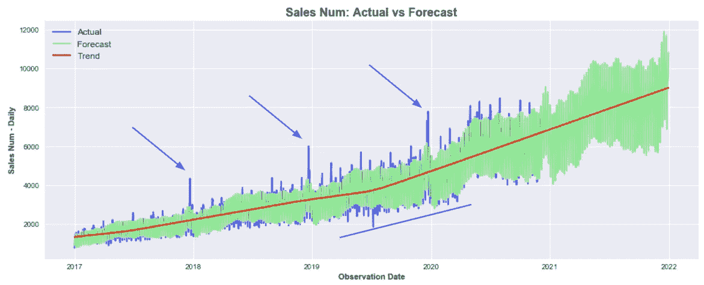
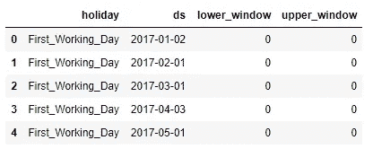
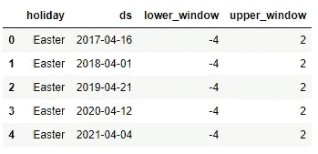
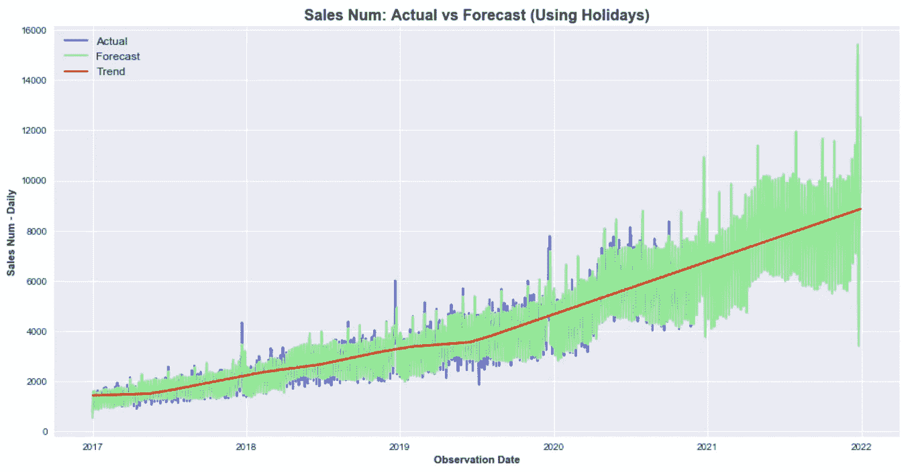
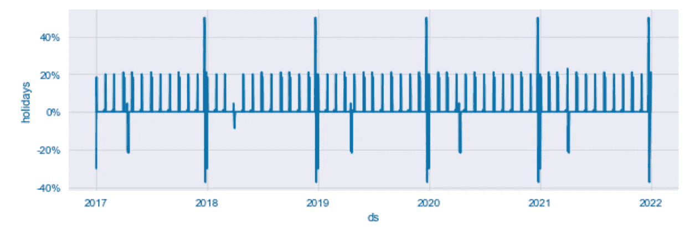
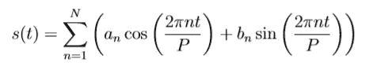

# 使用 Prophet 用 Python 预测业务 KPIs 第 2 部分

> 原文：<https://towardsdatascience.com/forecasting-business-kpis-with-python-using-prophet-part-2-e969739c9029?source=collection_archive---------33----------------------->

## [预测](https://towardsdatascience.com/tagged/forecasting) | [巨蟒](https://towardsdatascience.com/tagged/python) | [办公时间](https://towardsdatascience.com/tagged/office-hours)

## 了解如何通过使用 Prophet 预测未来绩效来为您的企业增值


照片由[米切尔罗](https://unsplash.com/@mitchel3uo?utm_source=medium&utm_medium=referral)在 [Unsplash](https://unsplash.com?utm_source=medium&utm_medium=referral) 上拍摄

*更新:你们中的许多人联系我，要求提供有价值的资源，以了解更多关于使用 Python****进行时间序列预测的信息。下面我分享两个我亲自参加的课程，强烈建议你扩展这方面的知识:***

*   [**Python 进行时间序列分析(使用 ARIMA、萨里马克斯、瓦尔马、先知)** 15 个多小时的内容](https://click.linksynergy.com/deeplink?id=533LxfDBSaM&mid=39197&murl=https%3A%2F%2Fwww.udemy.com%2Fcourse%2Fpython-for-time-series-data-analysis%2F)
*   [**【ETS，ARIMA】**](https://imp.i115008.net/7m5y6g)**→***非常高质量的课程！*

希望你也会发现它们有用！现在欣赏:D 的文章

# 介绍

在本教程的第一部分( [**使用 Prophet 用 Python 预测业务 KPI-第一部分**](/business-kpis-forecasting-with-python-using-prophet-part-1-1b8a97d45e3c?sk=05db16a3b677c55871141f6d7d6d1186) )，我们使用[脸书的 Prophet 库](https://facebook.github.io/prophet/)构建了一个简单的预测模型，来预测未来 426 天的两个每日 KPI(***销售数字*** & ***销售值 GBP)*** 。最终预测被分配给原始数据帧中的空未来日期，以获得以下结果( [GitHub](https://github.com/anbento0490/code_tutorials/tree/master/Business%20KPIs%20Forecast) ):

```
df.loc[(df['observation_date'] > cutoff_date )].head()
df.loc[(df[‘observation_date’] > cutoff_date )].tail()
```



原 DF 负责人



原始 DF 的尾部:两个空字段被预测替换

我们还试图评估模型性能，获得 6.73%的 **MAPE** 。尽管这对于我们的第一个模型来说是一个公平的结果，但是通过重叠预测值和实际值，我们注意到我们的预测仍然没有很好地响应观察到的销售量的突然峰值和下降:



图表 1:重叠的实际值与预测值

因为模型不能很好地拟合许多过去观察到的值，所以有理由认为未来的值也是如此。为此，在本文中，我们将改进原始拟合，引入**假日**和定制的**季节成分**，并调整另外三个参数( ***傅立叶顺序、*** ***变点先验比例*** 和 ***变点范围*** )。

</business-kpis-forecasting-with-python-using-prophet-part-1-1b8a97d45e3c>  

# 添加假日

在 Prophet 中，术语 ***【假日】*** 不应从字面上理解，因为它更广泛地表示产生明显偏离其模式的趋势的不寻常事件，一旦事件结束，这些事件就会回到正轨。从该描述中可以看出，将假日添加到模型中相当于包括额外的回归量(通过 `Prophet.add_regressor()` *方法*实现的*)，然而，这两个类别之间的主要区别在于:*

*   **当我们希望对限定在特定日期的意外事件建模时，应使用额外的回归变量****；**
*   ****假期**应在趋势偏离是周期性的，并且可能在事件日期之前开始并在事件日期之后继续时使用。这意味着当添加假日时，我们将被允许指定一个 ***下部窗口*** 和一个 ***上部窗口*** 来模拟围绕事件本身的潜在异常。**

**使用我们的领域知识，我们确定了六个我们希望作为假日传递给模型的事件:**

*   *****当月第一个工作日*** :由二进制字段`fl_first_working_day`表示；**
*   *****当月最后一个工作日*** :用二进制字段`fl_last_working_day`表示；**
*   **本月最后一个星期五的*:用二进制字段`fl_last_friday_day`表示；***
*   ******元旦*** :由二进制字段`fl_new_year`表示；***
*   ******窗口中的复活节[-4，+2]*** :这些日期将被手动估算；***
*   *****窗口中的圣诞节[-3，+3]** :这些日期也将手动输入；***

***为了在模型中使用这些事件，我们首先需要创建一个`holidays`数据帧，如下所示:***

***创建假日数据框架***

******上面的代码中发生了什么*？*****

***首先，我们创建了四个列表(最初的`df`中每面旗一个)，包括日期为`flag = 1`。然后，这些列表被用来构建尽可能多的单个数据框架，其数量与我们希望建模的事件数量一样多。每个数据帧应包括四列，即`holiday`、`ds`、`lower_window`和`upper_window`。***

***特别要注意的是，在标记的情况下，`ds`列是通过自动传递步骤一中的日期列表创建的，而对于`Easter`和`Christmas`来说，日期是手动估算的。在这两种情况下， **Prophet 要求每个假日不仅要包含过去的数据，还要包含要预测的日期范围的数据。**最终，`holidays` DF 应该如下图所示:***

******

***假日总监***

******

***假日的尾巴***

***通过在我们的原始模型中包括`holidays` DF，我们得到:***

***如果我们现在重新运行同一时期的预测，并为`sales_num` KPI 计算 **MAPE** ，结果是 **5.28%** 。这意味着**通过考虑影响业务的周期性事件，我们能够将平均绝对百分比误差降低近 22%*****

```
*Output: 5.2806026397*
```

***当实际值和预测值重叠时，模型拟合`df_train`数据集的方式的改进变得很明显，如图 1 所示:***

******

***图表 2:重叠的实际值与预测值(使用节假日)***

***在结束本节之前，值得强调的是，如果我们要预测某个特定国家的 KPI，我们可能还想添加该市场的国家节日(*允许的国家代码的完整列表* [*此处*](https://github.com/dr-prodigy/python-holidays) ):***

```
*model.add_country_holidays(country_name = 'GB')*
```

***此外，如果我们希望显示`holidays` DF 的样子，我们可以使用组件图轻松实现:***

```
*model.plot_components(forecast)*
```

******

***图表 3:节假日中的周期性事件***

# ***添加季节性***

***我们模型的性能有所改善，但在季节性方面仍有一些工作要做。例如，我们的领域知识也告诉我们，企业经历了一个明显的 ***月季节性*** ，但是当前的模型没有考虑到这个信息。***

***幸运的是，Prophet 允许我们关闭标准的`weekly_seasonality`和`yearly_seasonality`，添加我们定制的季节。这种方法给了我们更多的控制，因为我们可以为每个季节设定一个精确的`period`以及`fourier_order`:***

***实际上，为了模拟多时期的季节性，`fbprophet`依赖于标准的傅立叶级数(如 [*中所述的*本文**](https://peerj.com/preprints/3190/) ):***

******

***傅立叶级数数学表示***

***其中，P 是一个季节的正常时间段(*，例如，当数据集粒度以天为单位*时，P = 365.25 表示年度数据，P = 7 表示周数据)。在公式中，N 参数代表需要选择的`fourier_order`，以适应季节性。一般来说，通过增加 N，可以提高我们拟合快速变化的季节模式的能力，以及过度拟合训练数据集的风险。***

***出于这个原因，在区间[5，20]中选择一个`fourier_order`通常是一个好的实践，这个选择过程可以采用一个模型选择程序自动进行，如 AIC(第二部分广泛讨论的一个主题)。对于我们的模型，我发现`[5, 14, 10]`是每周、每月和每年季节性的最佳值。这意味着该模型将更具反应性，以适应每月和每年级别的重复变化，而在每周级别的反应性较低。***

***使用这些参数运行`model`，导致 **MAPE 为 3.6%** ，与第一部分中介绍的初始模型相比，减少了 **46.5%** 。我们所要做的就是添加定制的季节性并找到正确的组合参数。***

# ***添加“先前比例”参数***

***在这一点上，我们应该对我们的模型相当满意，但在结束本教程之前，我想再介绍三个参数，它们可以帮助我们进一步降低 MAPE:***

*   *****季节性先验比例(默认为 10)** :该参数用于调整季节性成分的强度，意味着较高的值允许模型适应较大的季节性波动，较小的值抑制季节性。它可以作为通用参数添加，也可以作为`add_seasonality()` ( *如下图所示*)的一部分为个别季节指定。在我们的例子中，值 15 适用于所有季节，将 **MAPE** 略微降低到 **3.59%** 。***
*   *****节假日优先比例(默认为 10):** 此参数调整模型中节假日组件的强度，确定节假日对预测的影响。对于我们的模型，默认值是导致最低 MAPE 的值。***
*   *****变点优先比例(默认值= 0.05):** 该参数调节自动变点选择的灵活性，意味着较高的值将允许更多的变点，较低的值将减少允许的变点数量。我发现，在某些情况下，将默认值增加一倍(**从 0.05 增加到 0.1** ，可以提高模型的精确度，进而降低 MAPE。然而，对于我们的模型来说，情况并非如此，默认值会产生最佳结果。***

# ***结论***

***在本教程的第二部分，我们学习了如何使用**节假日**、**定制季节性**和更多的**高级参数**来提高我们模型的预测准确性。这些调整导致**最终 MAPE 为 3.59%** 从最初的 6.73%下降了 46.5%。用于得出该结果的最终模型如下所示:***

***在本指南关于预测业务 KPI 的最后一部分(**第三部分**)中，我们将学习如何实施更高级的技术来执行模型评估，以及如何使用 AIC 作为基准来自动选择最佳的可能参数组合。***

***我希望这篇文章对你有用&继续学习！***

***给我的读者一个提示:这篇文章包括附属链接，如果你购买的话，我可以免费给你一点佣金。***

# ***你可能也喜欢***

***</10-algorithms-to-solve-before-your-python-coding-interview-feb74fb9bc27>  </3-ways-to-compute-a-weighted-average-in-python-4e066de7a719>  </8-popular-sql-window-functions-replicated-in-python-e17e6b34d5d7> ***