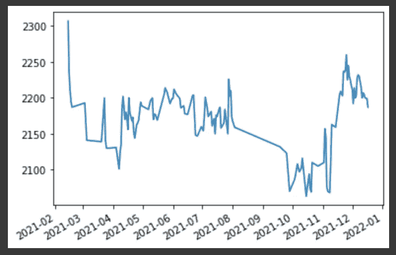
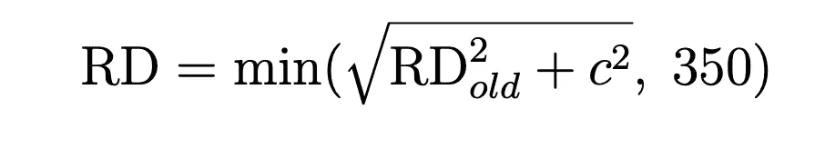
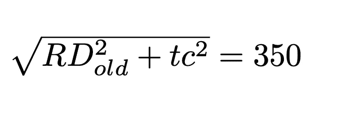
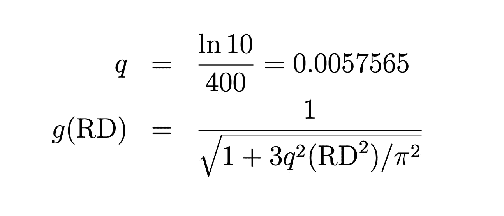
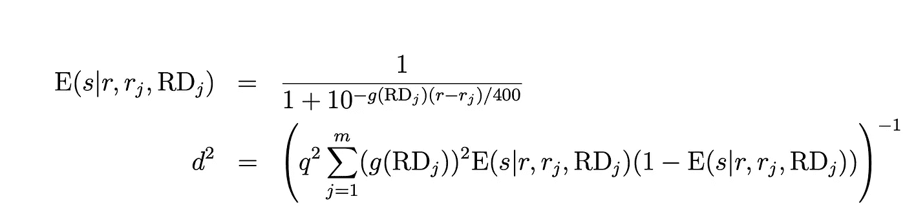
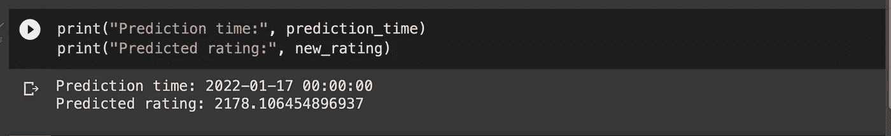
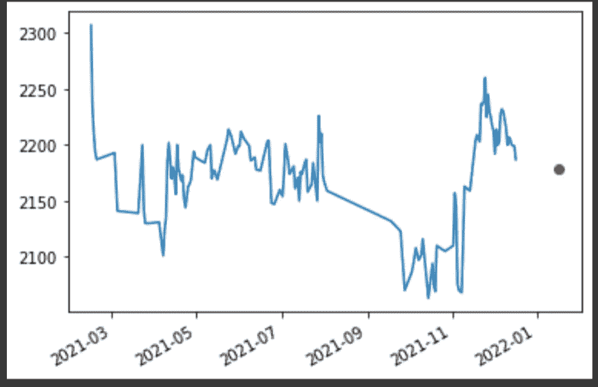

# 基于时间序列的象棋 Elo 预测

> 原文：<https://towardsdatascience.com/forecasting-chess-elo-on-a-time-series-7e448a2d161e?source=collection_archive---------33----------------------->

## 使用 Glicko 评级系统对您未来的象棋评级进行预测。


哈桑·帕夏在 [Unsplash](http://unsplash.com) 上的照片

不久前，我偶然看到了这个[视频](https://www.youtube.com/watch?v=OnCQ3J6ZKL4)【1】由 [1littlecoder](https://www.youtube.com/channel/UCpV_X0VrL8-jg3t6wYGS-1g) 制作，展示了如何使用 berserk，Lichess API 的 Python 客户端，来提取关于你的象棋游戏的信息。作为 Lichess 的常客，我想建立一个预测模型，根据以前玩过的游戏对我的象棋评分进行预测。如果你也是 Lichess 的普通用户，你可以模仿我的方法，看看是否能提取出一些有趣的东西。

第一步，安装 berserk，导入。然后，你想从 Lichess 那里得到你的个人信物。为此，点击右上角的 Lichess 配置文件，进入首选项，然后点击左下角的 API 访问令牌。获得 API 令牌后，只需使用最后两行进行身份验证。关于 berserk 包的完整文档，你也可以看看这个。

```
!pip install berserk
import berserk
token = "YOUR_PERSONAL_TOKEN"
session = berserk.TokenSession(token)
client = berserk.Client(session=session)
```

现在，我已经导入了一些有用的库，如 NumPy、Matplotlib 和 datetime。然后，我使用类用户的 get_rating_history 方法提取我对子弹棋的评分。接下来，我使用 create_bullet_list 将它们存储在一个列表中。

```
import numpy as np
import matplotlib.pyplot as plt
import datetime
%matplotlib inlineentries_of_bullet_ratings = \ client.users.get_rating_history("bibimbap123")[0]["points"]def create_bullet_list(bullet_ratings):
    lst = []
    for entry in bullet_ratings:
        lst.append(entry[3])
    return lstratings = create_bullet_list(entries_of_bullet_ratings)
```

下面的代码将创建一个日期时间列表，首先提取所玩游戏的日期(times_list)，将它们存储为元组列表(tuple_to_str)，然后将它们转换为日期时间数据类型(str_to_datetime)。

```
import calendar
from dateutil import parserdef times_list(bullet_ratings):
    tl = []
    for entry in bullet_ratings:
        tl.append((str(entry[0]), calendar.month_name[entry[1]+1], \                 
                   str(entry[2])))
    return tl
times = times_list(entries_of_bullet_ratings) def tuple_to_str(time):
    l = []
    for entry in time:
        l.append(', '.join(entry))
    return lstr_times = tuple_to_str(times) def str_to_datetime(time):
    l = []
    for entry in time:
        l.append(parser.parse(entry))
    return ldtime = str_to_datetime(str_times)
```

接下来，让我们绘制时间序列，以了解从 2021 年 2 月(我创建账户的那一天)到 2021 年 12 月，我的评级进展的大致情况。

```
fig, ax = plt.subplots()
fig.autofmt_xdate()
plt.plot(dtime, ratings)
plt.show()
```



从 2021 年 2 月到 2021 年 12 月的评级进展。图片作者。

好了，现在，为了建立模型，我使用了这张[纸](http://www.glicko.net/glicko/glicko.pdf)【2】，它展示了评级计算背后的数学原理。第一件事是检索我的最新评级和我的最新评级偏差。本文解释说，评级偏差本质上是对评级不确定性的一种度量。

```
# Latest rating
old_rating = ratings[-1]# Latest rating deviation
rating_deviation_old = \
client.users.get_public_data("bibimbap123")["perfs"]["bullet"]["rd"]
```

现在，我进行了以下计算来计算新的评级偏差。



来源:[http://www.glicko.net/glicko/glicko.pdf](http://www.glicko.net/glicko/glicko.pdf)

然而，我需要使用下面的等式*来求解 *c* 。*



来源:http://www.glicko.net/glicko/glicko.pdf

这里 *t* 代表我的等级变得像新玩家一样不可靠所需的时间(以等级周期为单位)。评级期被定义为所有游戏被视为同时进行的一段时间。对于这个项目，我决定使用每月评级周期，并设置 *t = 60。这表明，在我的评级变得像新手一样不可靠之前，需要 60 个月(5 年)的时间。*

```
rating_period = 1# Calculate c
c = np.sqrt((350**2-rating_deviation_old**2)/(rating_period * 60)) # Calculate RDrating_deviation_current = \
min(np.sqrt(rating_deviation_old**2+c**2), 350)
```

现在，这是后期评级和后期评级偏差的大计算。后期评级将是我们的预测。


来源:[http://www.glicko.net/glicko/glicko.pdf](http://www.glicko.net/glicko/glicko.pdf)

我要处理的第一件事是*r’*中的求和。这里， *m* 代表我在一个特定时间段(1 个月)内面对的对手数量。首先，我需要计算四件事:

1.  每月平均游戏次数( *m* )
2.  对手平均评级
3.  平均对手评分偏差
4.  平均结果

为了计算 1)，我将做如下假设:我在一年内玩的对手的平均数量除以 12 反映了我每个月玩的对手的数量。

对于 2)，我只是在我的 Lichess 个人资料中查找；我没有找到通过 API 提取的方法。

对于 3)，我假设 RD 是 50，因为这是活跃玩家的常见 RD。

对于 4)，我用总胜率除以总游戏数来计算我的胜率。在这里，get_public_data 方法允许我提取玩的游戏总数和赢的游戏总数。

```
# 1) Take total amount of games played in one year and divide them by 12entries_of_bullet_ratings = \
client.users.get_rating_history("bibimbap123")[0]["points"]
d = {1: 0, 2:0, 3:0,4:0, 5:0, 6:0, 7:0, 8:0, 9:0, 10:0, 11:0, 12:0}
for key in d:
    for time in dtime:
        if time.month == key:
            d[key] += 1
#Round up
average_number_of_games = int(sum(d)/12) + 1# 2) Their average rating
opponent_average_rating = 2145# 3) Their average rating deviation
opponent_average_RD = 50# 4) Calculate the average win_rate
win_rate = client.users.get_public_data("bibimbap123")["count"]["win"]/\
client.users.get_public_data("bibimbap123")["count"]["all"]
```

请注意，这些计算意味着我基本上是在和相同数量、相同评分和评分偏差的对手比赛。因此，求和可以用乘以对手数量来代替。

除此之外，我们还要计算另外四个值: *q，d，g(RD_j)，E(s|r)。*文中没有明确解释这些的含义。然而，幸运的是，公式已经给了我们，所以我们只需要插上塞子，咕嘟咕嘟地喝。



来源:[http://www.glicko.net/glicko/glicko.pdf](http://www.glicko.net/glicko/glicko.pdf)



来源:[http://www.glicko.net/glicko/glicko.pdf](http://www.glicko.net/glicko/glicko.pdf)

我的代码显示如下:

```
q = 0.0057565g_RD = 1/(np.sqrt(1+3*q**2*(rating_deviation_current**2)/np.pi**2))E_sr = 1/(1+10**(-g_RD*(old_rating - opponent_average_rating)/400))d_squared = 1/(average_number_of_games * q **2 * \
               (g_RD ** 2) * E_sr * (1- E_sr))new_rating = old_rating + average_number_of_games * \ q/(((1/rating_deviation_current**2) + 1/d_squared)) * g_RD * \(win_rate - E_sr)new_RD = np.sqrt(1/(1/rating_deviation_current ** 2 + 1/d_squared))
```

最后一步是绘制预测图。因为我将一个评级周期视为一个月，所以这个预测评级将正好是我玩最后一个游戏后的一个月。在这里，我想确保如果我的最后一场比赛是在第 12 个月(12 月)，那么预测将在第 1 个月(1 月)而不是第 13 个月，因为那不存在。

```
last_game_time = dtime[-1]prediction_month = last_game_time.month+1prediction_time = last_game_timeif prediction_month == 13:
    prediction_time = \
    prediction_time.replace(year = last_game_time.year + 1)             
    prediction_time = prediction_time.replace(month = 1)else:
    prediction_time = \
    prediction_time.replace(month = last_game_time.month + 1)
```

预测评级和预测时间显示如下。我们可以从这张图推断出我最后一局是在 2021 年 12 月 17 日。



预测时间和预测评级。图片作者。



时间序列图上 1 月 17 日的预测评分(红点)。图片作者。

随着我玩的游戏越来越多，这个程序将对我未来的评分做出越来越新的预测，这使得看到我的实际评分和预测评分相差多少变得很有趣。在未来，看看我们如何能最小化这种差异是值得的。

## 参考

[1]1littlecoder，用 Python 从 Lichess API 中提取象棋数据(2020)，[https://www.youtube.com/watch?v=OnCQ3J6ZKL4](https://www.youtube.com/watch?v=OnCQ3J6ZKL4)

[2]M. E .格利克曼，[格利克体系](http://www.glicko.net/glicko/glicko.pdf) (1995)，http://www.glicko.net/glicko/glicko.pdf