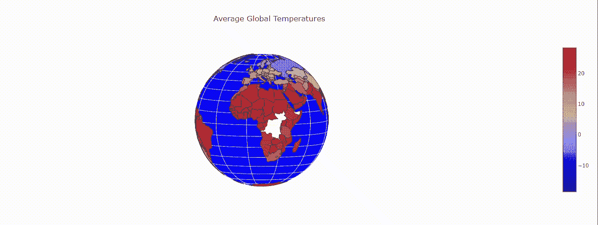
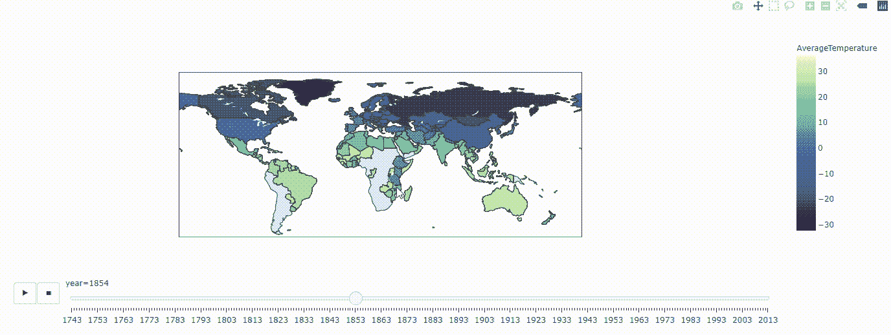
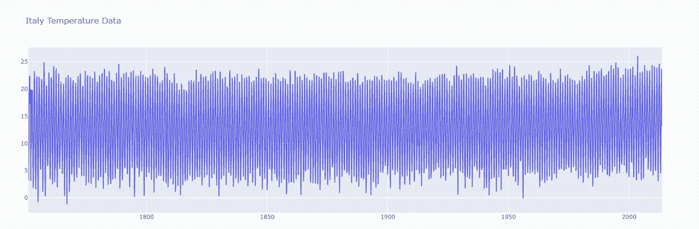
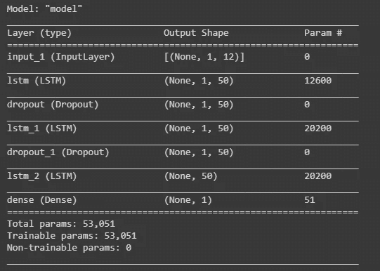
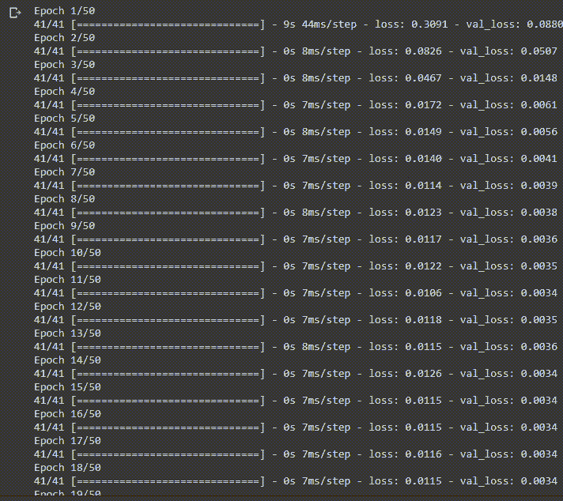
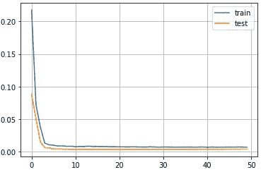
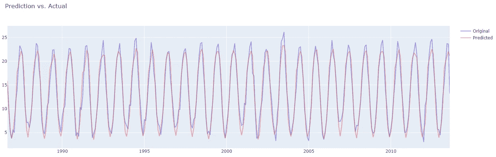

# 用长短期记忆网络预测意大利的气候变化

> 原文：<https://towardsdatascience.com/forecasting-climate-change-in-italy-with-long-short-term-memory-networks-eef4990d7b8c?source=collection_archive---------16----------------------->

## [变更数据](https://towardsdatascience.com/tagged/data-for-change)

## 用于预测温度趋势的深度学习

恩里克·费雷拉在 Unsplash 上拍摄的照片

## **简介**

我们生活在一个对人类充满挑战的时代，其中最大的挑战之一就是气候变化。那么，在这个充满变化和困难的时代，数据科学在气候变化中的作用有多重要呢？从我个人的角度来看，在不久的将来，数据科学在气候变化中的作用会越来越大。但是让我解释一下为什么。

例如，考虑组织如何通过使用监测碳排放的传感器来减少碳足迹，或者数据科学家如何使用卫星数据和跟踪实时天气变化，并使用机器学习模型来防止灾难性事件。

再想想机器学习在电力消耗或农业方面的应用。通过考虑当地天气、气候模式或家庭行为的算法，数据科学家可以实时预测我们长期需要多少能源。

在农业领域，使用能够感知土壤湿度和养分的物联网设备，结合天气数据，农民可以更好地控制灌溉和施肥系统。

还有许多其他可能性，如使用算法来改善电动汽车的电池能量管理，采用卫星图像和计算机视觉技术来防止大规模的树木覆盖损失。

然后，正如你所看到的，数据科学在气候变化问题中发挥了重要作用，在这篇文章中，我将向你展示我如何使用深度学习模型来预测我所居住的国家意大利的气温趋势。

在本文中，我将向您展示:

*   我做的数据可视化是为了理解温度数据
*   长短期记忆网络的直观介绍
*   如何建立 LSTM 网络

你可以在我的[谷歌实验室](https://colab.research.google.com/github/moryba/Climate_Analysis/blob/main/climate_analysis.ipynb)或者我的 [GitHub](https://github.com/moryba/Climate_Analysis) 上找到完整的代码。

所以，让我们开始吧！

## 第一部分:数据可视化

作者图片

在上图中，您可以看到数据集中所有国家的全球平均温度。我用下面的代码构建了这个地图。

然后，为了对这些年的气温变化有一个时间线的概述，我写了这段代码，以建立一个从 1743 年到 2013 年各国气温变化的地图。

出局:

作者图片

为了追踪意大利逐月和逐年的平均气温，我构建了如下图表:

出局:

作者图片

这一部分以图表的形式展示了我的主要发现，如果你想看到构建这个图表的整个过程，我建议你看看我的 Google Colabo [这里](https://colab.research.google.com/github/moryba/Climate_Analysis/blob/main/climate_analysis.ipynb)或者我的 GitHub 简介[这里](https://github.com/moryba/Climate_Analysis)。

## 第二部分:对 LSTM 的直观解读

在开始解释什么是长短期记忆网络之前，让我用几句话来给你一个传统神经网络和递归神经网络的局限性的概述。

在传统的神经网络中，如果我们在不同的时间将输入输入到模型中，我们将获得独立的输出。事实上，第二个输出(t)没有关于前一个输出(t-1)的信息，这意味着第一个输出对第二个输出没有影响。如果我们需要建立一个能够从过去的输出中学习的模型，以便做出更准确的预测，这是一个很大的限制。这个问题的解决方案是递归神经网络。

为了直观地理解什么是 RNN，当你看你最喜欢的网飞电视剧时想想。每次看新一集的时候，你都需要记住前几集才能理解后面几集。RNN 以同样的方式工作，它记住过去的输出，并使用它们来更好地理解后面将要发生的事情。因此，过去的产出和未来的产出之间存在相关性。

您还需要知道，rnn 使用反向传播算法进行训练，该算法适用于每个时间戳。在反向传播期间，RNNs 尝试计算误差，该误差由实际输出和模型输出之间的差给出，并将其提高到 2 的幂。但是，当 RNNs 通过递归神经网络的所有多层传播误差时，我们会发现 RNNs 的性能在训练期间会非常差，因为我们的梯度变得越来越小。

为了解决这个问题，我们需要梯度值，当它们向后时保持不变。为此，我们需要一个长短期记忆网络。

LSTM 网络可以控制何时让输入进入神经元，以及何时记住前一个时间戳中计算的内容。此外，LSTM 网络还可以控制何时让输出传递下一个时间戳。

因此，LSTM 神经元与 RNN 普通神经元的区别在于，它有可能自己决定电流输入。正如你所观察到的，整个过程都是受我们大脑工作方式的启发，这太神奇了。

如果你想更深入地了解 LSTM，我建议你读一读克里斯托弗·奥拉写的这篇文章 [*了解 LSTM 网络*](https://colah.github.io/posts/2015-08-Understanding-LSTMs/) 。这篇文章对我理解 LSTM 网络帮助很大。

## 第三部分:用 LSTM 网络建立模型

在这一部分中，我将向您展示如何准备和构建模型来预测意大利的气温趋势。我将重点介绍如何构建模型，而不是准备过程。如果你想看完整的代码，你可以去我的 GitHub 档案。

为了构建模型，我们将使用 Keras API。如您所见，第一个变量是训练集的输入。然后我们有我们的网络层，其中第一层被输入，包含 50 个单元。然后，我们有辍学层，允许网络概括，而不是记忆。接下来，我们有另一层 LSTM，和另一个辍学层。

之后，我们有输出变量，该变量增加了具有一个神经元的密集全连接人工神经网络，并且激活函数将是线性的。

在函数的最后，我构建了模型，并用 adam optimizer 和均方误差对模型进行了编译。

现在，我们可以用训练数据训练我们的模型，并查看摘要

出局:

作者图片

正如你在上面的总结中看到的，有 LSTM 层、下降层和密集层。

最后，我们可以用训练数据(train_x，train_y)拟合模型，并传递验证数据(test_x，test_y)

出局:

作者图片

输出向我们展示了整个培训过程中损失和错误的进展。在下图中，您可以看到训练和测试集中的损失趋势。

作者图片

相反，在下图中，您可以看到原始数据集与预测值的对比。因此，该模型能够捕捉趋势，但它需要一些改进，以捕捉发生的细节。

作者图片

## 结论

我希望这篇文章能帮助你对气候变化问题产生更多的兴趣，并理解数据科学在解决气候变化问题方面的潜力。

我用于这个模型的数据集可以在 [Kaggle](https://www.kaggle.com/berkeleyearth/climate-change-earth-surface-temperature-data) 中找到，你可以在我的 G [oogle Colab](https://colab.research.google.com/github/moryba/Climate_Analysis/blob/main/climate_analysis.ipynb) 或 [GitHub](https://github.com/moryba/Climate_Analysis) 中找到完整的代码。所以，你可以试着建立你的模型，了解气候如何随时间变化。

无论如何，对于那些有兴趣深入了解大数据在气候变化中的应用的人，我建议阅读 NASA 发表的文章*气候科学中的大数据挑战*你可以在这里找到。这篇文章很有见地，可以为您详细解释气候数据分析的基础设施。

感谢你阅读这篇文章。您还可以通过其他方式与我保持联系并关注我的工作:

*   [订阅](https://upscri.be/wxv1zi)我的时事通讯。
*   也可以通过我的电报群 [*数据科学初学者*](https://t.me/DataScienceForBeginners) 联系。