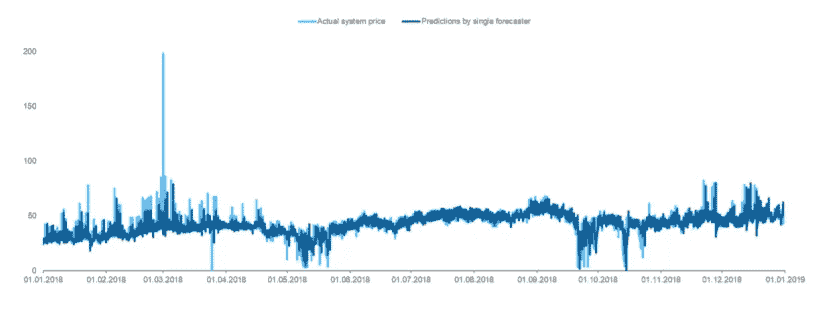

# 用人工神经网络预测电价——第一部分

> 原文：<https://towardsdatascience.com/forecasting-electricity-prices-with-artificial-neuronal-networks-part-1-e210409b5f84?source=collection_archive---------15----------------------->

马克西姆·霍普曼在 [Unsplash](https://unsplash.com/s/photos/trading?utm_source=unsplash&utm_medium=referral&utm_content=creditCopyText) 上的照片

## 介绍基于人工神经网络预测电价的新“Python-How-to”系列。

# 介绍

2019 年，我写了关于借助人工神经元网络(“ann”)预测电价的硕士论文。我的论文的想法是由 Lago，De Ridder，Vrancx 和 De Schutter 写的一篇研究论文激发的。这篇论文发表于一年前，提出如果人工神经网络不是预测一个市场而是同时预测两个相互连接的市场，那么用人工神经网络预测电价的准确性可以提高。由于他们的方法仅基于法国和比利时的电力市场，我构建了一个实验来测试他们关于北欧和德国电力市场的论文。

它失败得很惨。我设法建立并训练了各自的人工神经网络，但我无法衡量预测单一市场和多个市场价格的网络之间的任何性能提高。事实证明，这两个市场之间没有显著的电力交易。因此，人工神经网络无法做出更好的预测，因为两个市场的互联对整体价格的影响非常小。糟糕，这是我应该早点检查的。

2018 年 Nord Pool 价格预测与实际对比——单一预测者。图片由作者提供。

然而，尽管我失败了，我还是取得了一些有趣的结果。我的最后一个单一市场预测者获得了略低于 10.00 的 MAPE 分数，这意味着平均而言，预测的价格只相差 10%。网络的标准偏差为每预测兆瓦时 5.57 欧元。尽管所达到的精度还没有高到商业上有用的程度，但我仍然认为结果令人惊讶——尤其是考虑到所使用的人工神经网络结构非常简单，并且是在我过时的游戏笔记本电脑上训练的。

我的实验是基于 2018 年的价格。北欧电力市场 Nord Pool 的平均价格为每兆瓦时 33.43 欧元。三年后的今天，2021 年的平均价格为每兆瓦时 58.64 欧元，增长了近 100%。然而，Nord Pool 并不是唯一有这种现象的公司。整个欧洲的能源价格持续上涨。波兰等一些州受到的冲击尤其严重，仅在 2021 年一年，价格就上涨了 90%。⁴有些人可能会说欧洲正处于能源危机之中。

由于当前的发展，我很好奇我的人工神经网络在当前环境下是否会有类似的表现。因此，我决定开始一个“如何”系列，探索人们如何基于人工神经网络预测电价的可能性。

***注来自《走向数据科学》的编辑:*** *虽然我们允许独立作者根据我们的* [*规则和指导方针*](/questions-96667b06af5) *发表文章，但我们不认可每个作者的贡献。你不应该在没有寻求专业建议的情况下依赖一个作者的作品。详见我们的* [*读者术语*](/readers-terms-b5d780a700a4) *。*

# 系列内容

该系列将涵盖电力市场的必要理论，并包括用于数据分析和人工神经网络建模的 Python 编码指令。人工神经网络的必要理论知识将不包括在内。然而，如果你想刷新你的记忆，我会在此过程中发表更多的文章，你可以在那里阅读。

本系列的目的是为您提供一个关于如何进行基于人工神经网络的电价预测的全面指南，以便您可以在自己的场景中使用它。以下大纲将为您提供后续部分的更详细概述。我将随着每一个新零件的发布更新大纲:

## 第二部分:欧洲电力市场简介

每个数据科学项目都基于真实的用例。在预测任何电价之前，我们需要了解欧洲电力市场是如何运作的。读完这一部分，你将有足够的知识来进行有意义的数据分析，并建立一个工作预测模型。

## 第 3 部分:探索性数据分析

在构建我们的 ANN 之前，我们将讨论数据及其使用权，并在 Python 和相关库的帮助下进行探索性数据分析。我们将可视化我们的结果，并讨论它们对我们实验的潜在影响。

## 第 4 部分:我们的人工神经网络预测器的部署

在这一步中，我们将设计和训练我们的人工神经元网络。我们将使用 Keras 用 Python 编写我们的 ANN 并进行预测。

## 第五部分:结果讨论

是时候看结果了。我们将尽可能中立地描述和验证它们，看看我们的结果是否可靠。

## 第 6 部分:评论和进一步讨论

每个项目都需要严格的审查。在这里，我们将采取不同的观点，并试图撕裂我们的结果。我们将以一些关于如何改进我们的设置的建议来结束这个系列。

# 下一步是什么？

如果您有兴趣阅读更多内容，请随时查看该系列的第 2 部分。这篇文章深入解释了欧洲电力市场的价格形成过程。

# 来源

1.  拉戈，德·里德，弗兰克斯和德·舒特。2018.预测欧洲日前电价:考虑市场一体化的重要性。阿姆斯特丹:爱思唯尔。
2.  诺德泳池。2021.“Elspot 价格 2021 每日欧元”。最后修改时间 2021 年 12 月 16 日。[https://www . nordpoolgroup . com/4a f83 f/global assets/market data-excel-files/els pot-prices _ 2021 _ daily _ EUR . xls](https://www.nordpoolgroup.com/4af83f/globalassets/marketdata-excel-files/elspot-prices_2021_daily_eur.xls)
3.  彭博。2021.“欧洲能源危机将持续，因为电力价格创纪录”。最后更改 2021 年 12 月 8 日。[https://www . Bloomberg . com/news/articles/2021-12-08/energy-crunch-sends-benchmark-European-power-prices-to-record](https://www.bloomberg.com/news/articles/2021-12-08/energy-crunch-sends-benchmark-european-power-prices-to-record)
4.  notes 复合材料。2021.“波兰的电价一年内几乎翻了一番”。最后修改时间 2021 年 10 月 7 日。[https://notes fropland . com/2021/10/07/波兰的电力价格几乎一年翻了一番/](https://notesfrompoland.com/2021/10/07/electricity-prices-in-poland-almost-double-in-a-year/)