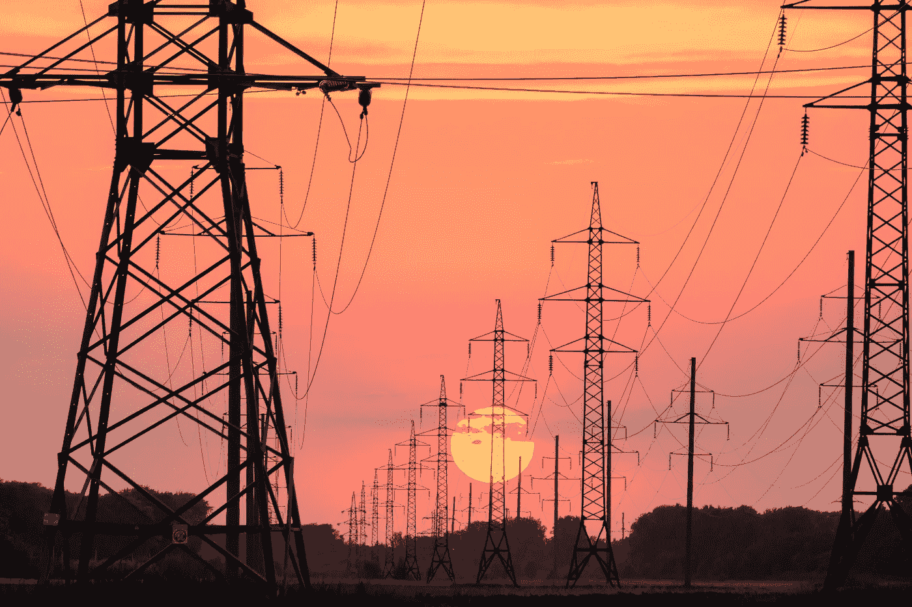
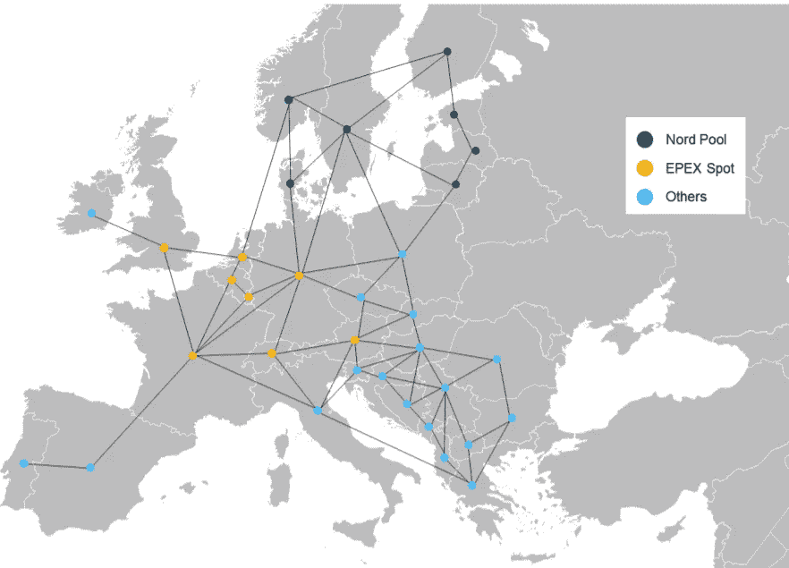
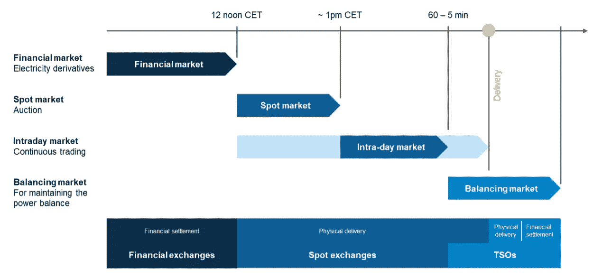
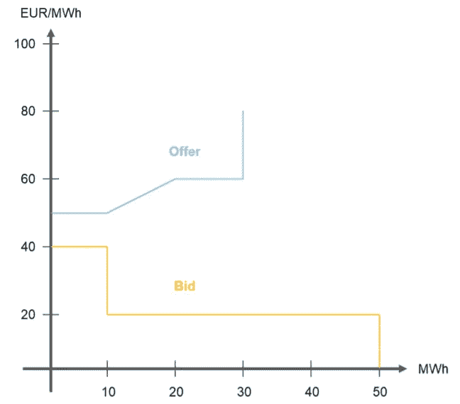
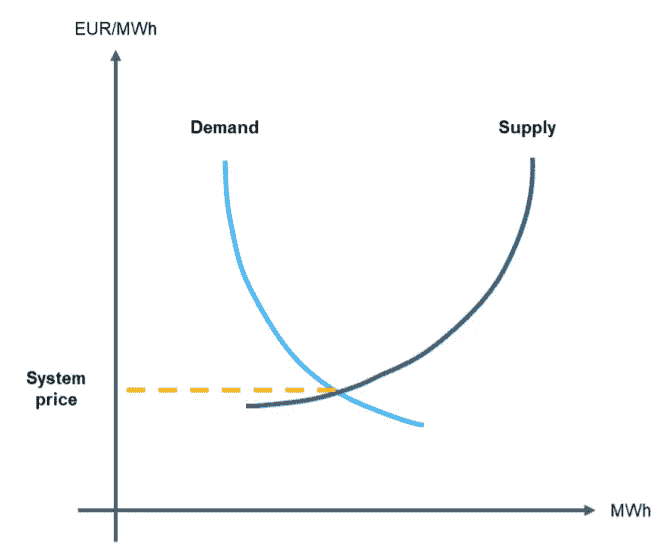
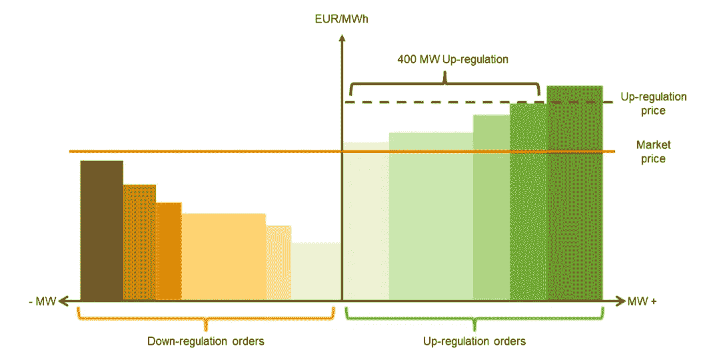
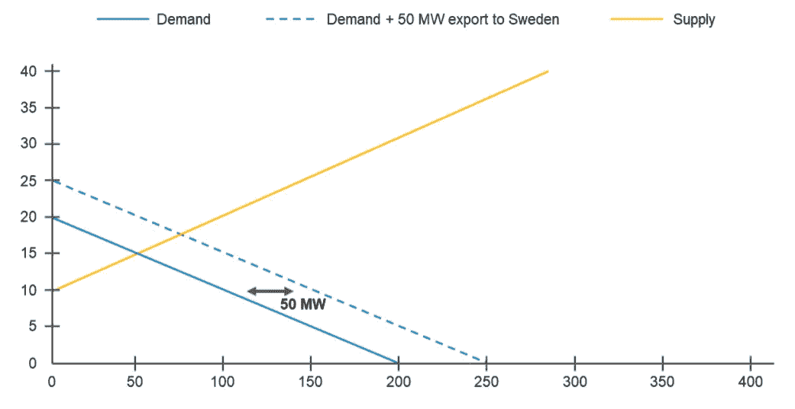

# 用人工神经网络预测电价——第二部分

> 原文：<https://towardsdatascience.com/forecasting-electricity-prices-with-artificial-neuronal-networks-part-2-424cda162c7f?source=collection_archive---------10----------------------->

安德烈·梅特列夫在 [Unsplash](https://unsplash.com/s/photos/power-grid?utm_source=unsplash&utm_medium=referral&utm_content=creditCopyText) 上拍摄的照片。

## 对欧洲电力市场以及如何从中赚钱的温和介绍。

我最近开始了一个“Python-How-to”系列[，讲述在人工神经元](https://mauricebuettgenbach.medium.com/forecasting-electricity-prices-with-artificial-neuronal-networks-part-1-e210409b5f84)的帮助下预测电价。顾名思义，本系列的目标是构建一个成功预测电价的人工神经网络(ANN)。然而，在我们开始编码之前，我们有一些跨学科的研究要做。

# 每个数据科学项目都需要一个商业案例

这与电力市场无关，但我怎么强调这一点都不为过。数据需要产生价值。如果不是这样，数据只会增加成本，让利益相关者感到沮丧。同样的原则也需要应用于数据科学。如果操作得当，数据科学项目将消耗大量内部和外部资源。你需要确保你的实验结果会为你的业务或研究领域带来价值。否则，你只是在浪费自己的时间，并可能在 AWS 计算能力上花费数千美元。如果你想有几个可能发生的例子，如果你没有做适当的研究，我可以向你推荐[这篇文章](/5-ai-failures-you-probably-should-know-about-417ddebbc323)。

因此，本系列的这一部分将只专注于向我们介绍欧洲电力市场。最后，我们希望了解市场如何运作，以及我们的商业案例会是什么样子。所以…我们走吧！

# 快速历史课

1980 年代初，由于基础设施在现代社会中日益重要，大多数发达国家和一些新兴市场开始放开其基础设施部门。结果，能源变成了像粮食或石油一样的商品，并分别形成了市场。今天，这些市场通常被称为能源市场。能源市场通常是指单个国家或地区，包括电力或天然气等一般形式的能源交易。电力市场仅描述国家或地区内的电力交易。它们通常由电力交易所运营，电力交易所是通过买卖竞价实现电力交易的系统。

今天，欧洲能源市场分为 19 个主要的电力交易所。欧洲最大的电力交易所是 EEX 集团，该集团包括 EEX 和 PXE 的金融电力合同平台，以及日前电力市场 EPEX Spot 和天然气平台 Powernext。第二大电力交易所是 Nord Pool，它经营现货和日内电力市场。Nord Pool 报告称，2018 年的交易量为 524 万亿瓦时。Nord Pool 目前服务于北欧以及德国、英国、荷兰、比利时、法国和波兰市场。下图显示了电流分布和交换机的互连。

2018 年欧洲日前市场耦合。图片由作者提供。

# 欧洲电力市场的结构

欧洲电力市场理论上分为金融市场、日前市场(以下简称现货市场)、日内市场和监管市场。

欧洲电力市场的理论分割。图片由作者提供。

## 金融市场

金融市场由各自的交易所经营，这些交易所通常与电力交易所分开。在这方面，金融市场主要用于价格对冲和风险管理。交易最频繁的产品是所谓的“期货”，例如每日、每周、每月或每年的期货。下面的例子说明了电力期货合约的原理。

德国的一家零售商和一家生产商签订了一份 4 兆瓦时的期货合同，套期保值价格为 65 欧元/兆瓦时。给出了交货的具体月份。双方有相互保险和相互义务。假设约定月份的平均系统价格为 66 欧元/兆瓦时。德国现货市场的高价对零售商不利。然而，由于生产商同意以 65 欧元/兆瓦时的价格出售电力，零售商将节省 4 欧元(1 欧元/兆瓦时* 4 兆瓦时= 4 欧元)。

*然而，假设本月的平均系统价格为 63 欧元/兆瓦时。现货市场的低价将对生产商不利。在这种情况下，零售商补偿生产商。他付给他 8 欧元(2 欧元/兆瓦时* 4 兆瓦时= 8 欧元)。*

期货合约通过比较特定时期的套期保值价格和平均系统价格来结算。差价乘以合同量。在这一点上需要注意的是，期货合同只管理货币的交换。没有电力供应。

## 现货市场

第二天交付的电力在现货市场交易(也称为“日前市场”)。市场参与者在交割日期的前一天中午之前以电子方式发送他们的投标。现货市场没有中间交易。第二天的每个小时都有人出价。下面的例子说明了这个过程。

如果一家德国零售商假设他的顾客在一个特定的小时内消费了 50 兆瓦时，他会在相应的时间段和数量下订单。如果零售商拥有他的发电厂，他有几个选择:

*   *他从现货市场购买 50 兆瓦时的电力，自己不生产*
*   *他买了一些电，其余的自己生产*
*   他自己正好生产 50 兆瓦时
*   *他生产超过 50 兆瓦时的电力，并将多余的电力出售给现货市场*
*   *他从现货市场购买所有电力，并在现货市场出售生产的 50 兆瓦时电力*

*在本例中，零售商向德国现货市场下了以下订单。如果每小时的价格为 20 欧元/兆瓦时或更低，他购买 50 兆瓦时。如果价格为 40 欧元/兆瓦时，零售商购买 10 兆瓦时，自己生产剩余的 40 兆瓦时。如果价格为 50 欧元兆瓦时，零售商将出售 10 兆瓦时。如果价格在 50 到 60 欧元/兆瓦时之间，他将根据他的边际成本下降曲线出售电力。如果价格为 60 欧元/兆瓦时或以上，他将出售 30 兆瓦时。*

德国现货市场上特定小时的示例性买价/卖价。图片由作者提供。

在现货市场上，所有的买卖订单被汇总，形成相应的供需曲线(见下图)。两条曲线的交点对应于各自小时的系统价格。现货市场计算每小时的价格。这种价格形成方式也被称为“双重拍卖”,因为买方和卖方都必须投标。因此，现货市场也被称为“日前拍卖市场”。

示例性总供给和需求曲线。图片由作者提供。

提交投标后，各交易所计算并公布日前价格。同时，交易所通知市场参与者他们在第二天的各个小时购买和/或出售了多少电力。这些报告被转发给传输系统运营商(“TSOs”)。tso 使用这些信息来计算平衡功率。

## 当天的市场

除了现货市场，电力也在日内市场交易。日内市场是连续的，电力可以在交割前 5 分钟进行交易。然而，这个时间窗口取决于交换。⁴

日内市场是现货市场的补充。尽管现货市场的供需平衡在很大程度上得到了保证，但在收盘和第二天交割之间可能会发生一些事件。例如，这种事件可能是法国的核电厂可能不得不关闭，或者德国的强风可能导致欧洲风能产量显著增加。在日内市场上，市场参与者可以交易电量来再次平衡市场。

为了做到这一点，欧洲中部时间下午 2 点到 3 点将公布当天市场的自由容量。价格是根据“先到先得”的原则确定的。在这里，最佳价格(最高买价和最低卖价)受到青睐。

## 平衡市场

平衡市场由 TSOs 管理，通过向不同的市场参与者购买和出售电力来平衡供需，从而确保输电系统的频率稳定。平衡市场上的价格通常在交货前 15 分钟确定。然而，这个时间可能因国家而异，因为它取决于现有的基础设施。平衡市场位于日内市场之后。⁴

欧洲电网具有 50Hz 的交流电，需要维持该交流电以确保电网的稳定性。可能发生的情况是，在现货市场上交易的电能在交付时不能满足实际生产或需求。如果生产者的发电量少于或购买者的用电量超过了现货市场上约定的量(超额需求)，电网的交流电就会降到 50Hz 以下。TSOs 必须确保生产商向电网输送更多的电力。在这种情况下，没有达到目标的供应商必须为所谓的监管权力买单，才能履行他们的协议。其他发电商通过提供短缺的电力获得报酬，或者一些买家通过减少电力需求获得报酬。⁵

如果现货市场上约定的电量供应过多或使用过少(过量供应)，那么交流电就会升至 50Hz 以上。为了防止这种情况发生，使用下调权力来保持市场的平衡。多余的供应卖给想要增加购买量的买家，或者卖给购买多余供应以减少产量的生产商。⁵

向上调节力和向下调节力也被称为“调节力”或“平衡力”。监管电力的价格不同于电力的现货价格。“调控价格”由优序形成。如果需要上调电力，即电力供应过剩的生产商可以向 TSO 提供电力。TSO 然后开始激活具有最低价格的订单，直到达到所需的电力水平。最后一个向上的订单设定调节价。低于上调价格的订单获利，这是最终调整价格与现货价格之间的差异造成的。下调价格遵循同样的方法。⁶

下图说明了这一过程。绿色矩形显示上调订单，如具有可用产能的生产商。黄色矩形显示下调订单，例如可以减少消费的零售商。所有订单都按价格递增排序。假设需要 400 MW 的上调。所有上调指令从最低价格开始激活，直到达到 400 MW。最后一笔订单的价格决定了调控价格。所有低于规定价格的订单的利润等于规定价格和现货价格之间的差额。⁶

平衡市场中的说明性定价。图片由作者提供。

*假设关于上面的例子，一个零售商在现货市场上购买了 100 兆瓦时，但是他的顾客只消费了 85 兆瓦时。在这种情况下，零售商将把剩余的 15 兆瓦时出售给 TSO。如果 TSO 必须在这一小时购买上调电力，零售商将获得上调价格(与例如..向 TSO 出售过剩电力的生产商)。由于调节价格高于现货价格，零售商将从他的过剩能量中获得更高的利润。⁵*

*然而，如果 TSO 必须购买下调电力，他将根据下调价格(与生产商从 TSO 购买超额电力的价格相同)向零售商付款。在这种情况下，零售商将会亏损，因为调节价格低于现货价格。⁵*

当 tso 出售管制权时，价格的确定方式与他们购买管制权时相同。如果在相应的小时内有上调，tso 将开具上调价格的发票。如果存在下调，tso 将开具下调价格的发票。这是另一个 example:⁶

*假设零售商的一个供应商是一个生产商，他的太阳能发电场就在交货前坏了。由于现货市场和盘中市场已经关闭，生产商无法从其他供应商那里购买电力。然而，零售商仍然必须向生产商付款，即使生产商没有产生一个 MWh。在这种情况下，TSO 将监管权出售给生产商，生产商将监管权转售给零售商。⁶*

如果生产商未能按照计划发电，他们必须与 tso 解决监管权问题。然而，生产商的价格是不同的。在上调监管的情况下，发电量过多的生产商只能获得现货价格。在上调电价的一个小时内，发电量过少的生产商将被收取上调电价的费用。在下调时段，发电量过多的生产商将获得下调价格。生产量过少的生产商将按照市场价开具发票。⁶

## 额外收获:拥堵管理和市场耦合

除了计算日前价格之外，现货市场也被用于阻塞管理。当输电线路的容量不足以根据市场需求传输电力时，电力系统就会发生拥塞。需要阻塞管理来确保电网的稳定性和区域或市场之间的电能供应。实现阻塞管理的方法有很多，然而，在欧洲最常用的方法是所谓的“隐式拍卖”。在隐性拍卖中，输电容量包含在电力拍卖中。⁷

现货市场可以由几个区域组成(例如在北欧地区，现货市场由 15 个单独的投标区域组成)。一些地区可能能源过剩，而另一些地区能源不足。在这种情况下，逆差地区依赖于来自顺差地区的进口。如果两个地区之间没有足够的传输能力，就会出现瓶颈和价格差异。因此，过剩地区的价格低于短缺地区，因为可用的能源多于消耗的能源。由于区域差异，这些价格也被称为“区域价格”。如果竞价区域之间的功率流动在 TSOs 设定的容量限制内，则这些不同竞价系统中的区域价格是相同的。以下示例说明了通过隐式拍卖形成区域价格的过程:

从挪威向瑞典出口 50 MW 的示例。图片由作者提供。

假设挪威是盈余地区，瑞典是赤字地区，供给和需求曲线是任意选择的。如果两个地区之间没有输电能力，价格就会不同。在这个假设的例子中，挪威的价格是 15 欧元/兆瓦时，瑞典的价格是 20 欧元/兆瓦时。

从挪威向瑞典进口 50 MW 的示例。图片由作者提供。

*假设挪威和瑞典之间的输电容量为 50 MW。随着产能的增加，瑞典的价格将降至约 17.50 欧元/兆瓦时。随着消费量的增加，挪威的价格将升至约 17.50 欧元/兆瓦时。*

因此，地区价格包括电力成本和输电成本。因此，阻塞管理以这样一种方式使用可用的传输容量，使得投标区域之间的价格差异尽可能地平衡。

此外，另一种形式的阻塞管理被整合到现货价格的形成中。所谓的“市场耦合”使用隐性拍卖，即市场参与者不直接分配跨境容量，而是通过在其交易所提交电力投标。然后，交易所利用边界点的可用容量来最小化两个或更多市场之间的价格差异。⁸

在市场耦合中，通过使用“EUPHEMIA”算法的隐式拍卖，各个交易所的所有出价被聚集和协调。EUPHEMIA 计算每个投标区域的市场出清价格，并确定各个区域之间的电力流量。该电流然后被用作各个交易所的本地价格计算的输入。

因此，相应的系统价格由它们的竞价区域的隐含拍卖以及连接的电力交易所的隐含拍卖形成。因此，计算系统价格的复杂性随着耦合市场数量的增加而增加。根据跨境交易电量对系统价格的影响，潜在因素的影响也会增加。因此，在电价预测中很难正确考虑市场耦合的影响。

# 我们的商业案例

欧洲电力市场的价格形成非常复杂，并且因市场而异。每个市场都带来了商机。例如，如果我们能够预测长期价格并击败期货市场，我们就可以创造收入。

然而，在我们的案例中，我们将关注欧洲最大的电力市场——现货市场。具体来说，我们将构建一个 ANN 来预测 Nord Pool 现货市场第二天每小时的价格。如果成功，我们的人工神经网络的输出数据可以出售给市场参与者，反过来，可以使用这些信息来提出更有效的购买/出售出价。

不幸的是，在这一点上我不得不发出警告。虽然这可能是一个真实的场景，但是请注意，这仅仅是本教程系列中的一个虚构的例子。在完成本系列文章时，您可能不会期望得到一个成熟的 ETL 数据服务，它会让您变得富有。我们的商业案例的经济成功取决于本系列中未涉及的许多不同的变量。

# 下一步是什么？

在本系列的下一部分，我们将对 Nord Pool 现货市场进行探索性的数据分析。我们将更详细地了解市场机制、不同的投标领域、电力组合和数据来源。在第三部分结束时，我们将确定用于训练人工神经网络的时间序列数据。

一旦下一部分完成，我将更新这一部分。然而，这将花费更长的时间，因为我已经计划了更多的文章。

# 来源

1.  施耐德和耶格尔。2003.国家理论中的基础设施私有化:经验综述和对竞争性理论解释的讨论，101–137。康斯坦茨:康斯坦茨大学。
2.  卡明斯基。2012.能源市场，20–47 和 199–253。伦敦:敏锐的媒体
3.  诺德泳池。2017.北欧电力交易所和自由化电力市场的北欧模式。北池 AS
4.  下一个 Kraftwerke。2019.“日内交易”维森。最后修改时间 2019 年 7 月 10 日。[https://www.next-kraftwerke.de/wissen/intraday-handel](https://www.next-kraftwerke.de/wissen/intraday-handel)
5.  丝凯特。1999.北欧电力交易所 Nord Pool 的监管电力市场:计量经济学分析，295–308。阿姆斯特丹:爱思唯尔。
6.  昂格尔。2018.可再生能源和常规能源，跨国界的相互作用，以及北部电力市场的电价，1–22。雷克雅未克:冰岛大学
7.  莫泽。2018.单一欧洲电力市场——我们站在哪里，5–17。亚琛:亚琛大学。
8.  EPEX 斑点。2019.“新的日前价格耦合:问题与答案”文档。最后修改时间 2019 年 3 月 28 日。http://static.epexspot.com/document/22770/NWE%20-% 20 个问题% 20 和% 20 个答案
9.  恩特索。2019.“物理能量和能量流”能量统计。最后修改时间 2019 年 06 月 03 日。【https://www.entsoe.eu/data/power-stats/ 