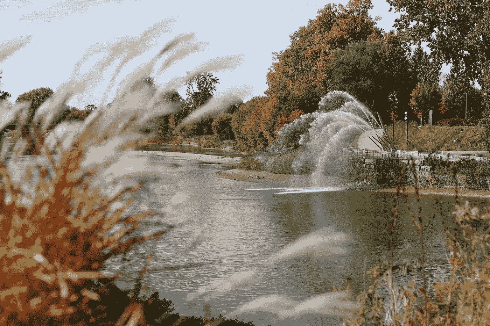
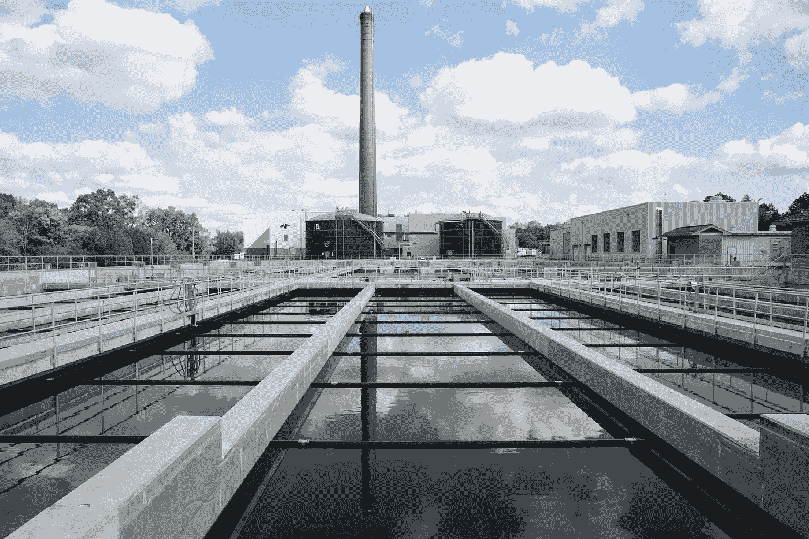
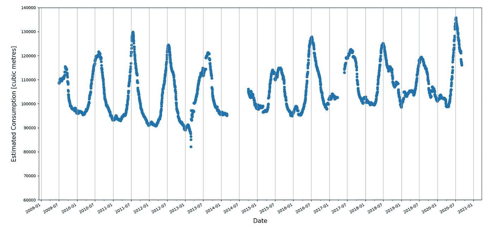
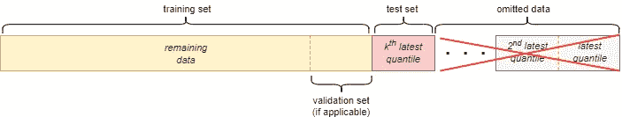
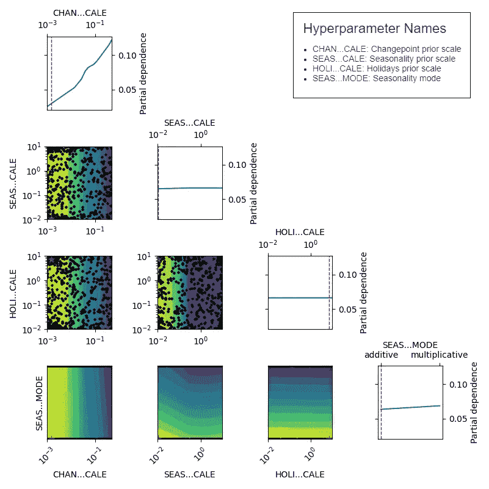
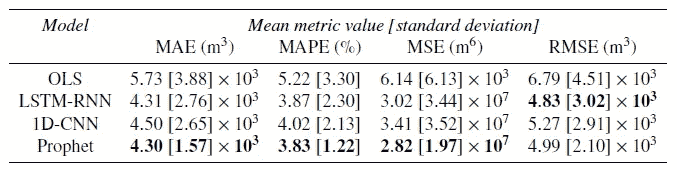
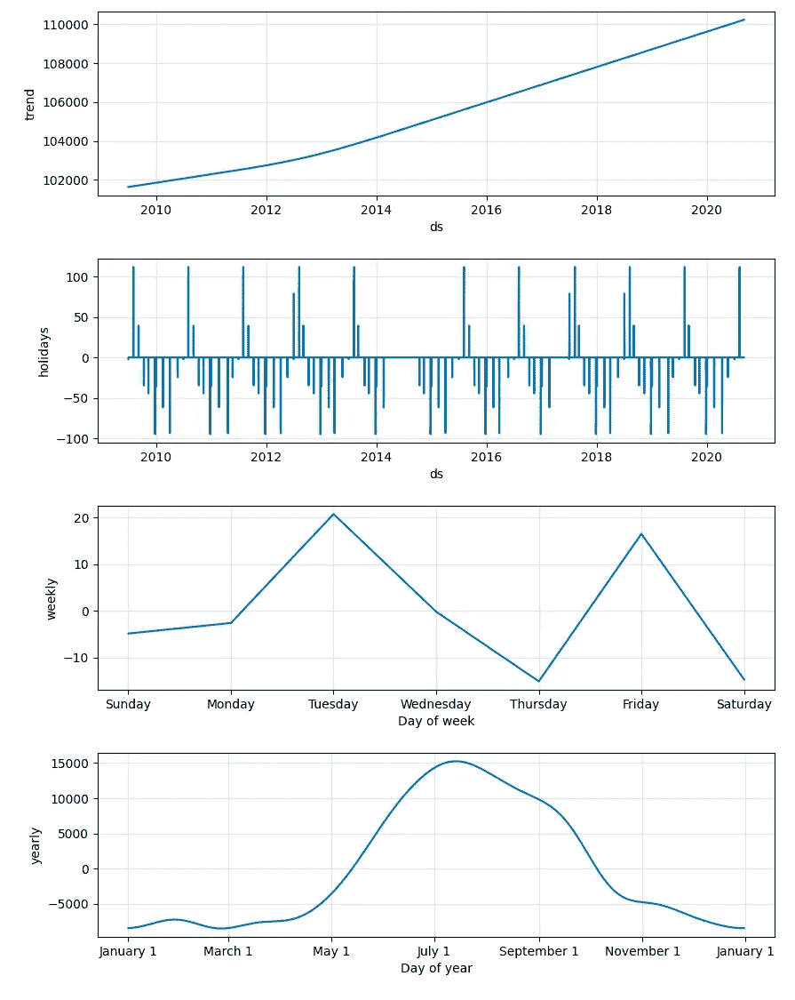
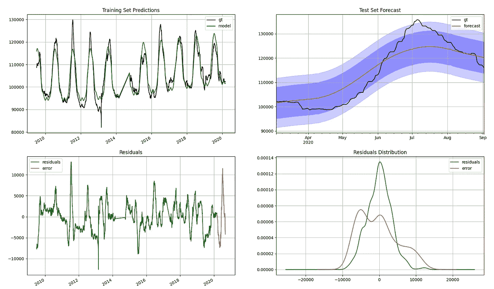
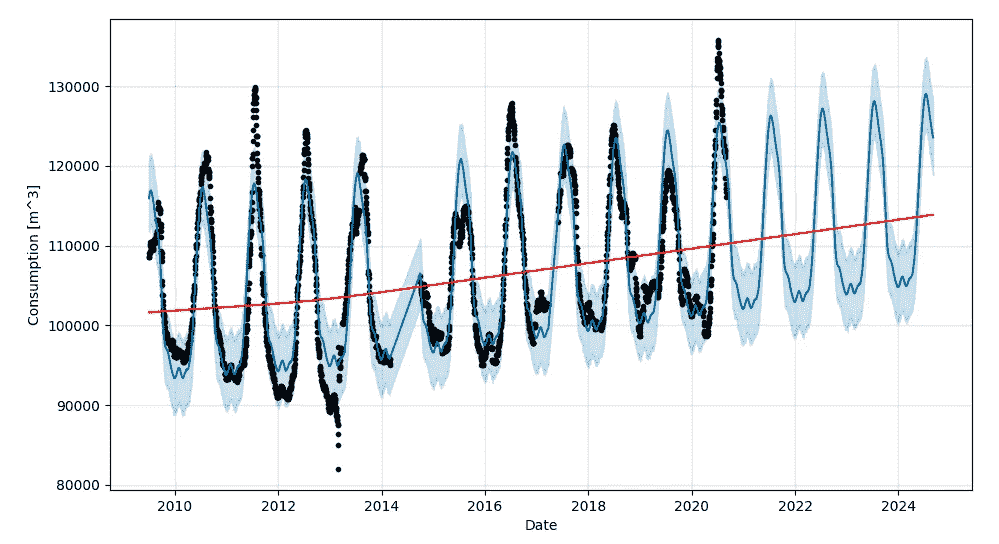

# 城市长期日需水量预测

> 原文：<https://towardsdatascience.com/forecasting-long-term-daily-municipal-water-demand-e299fb1a1928?source=collection_archive---------18----------------------->

加拿大伦敦泰晤士河。图片由妮可·奥斯本拍摄。

## 使用 Prophet 进行可解释、准确、快速的预测

Blake VanBerlo 是一名数据科学家，支持加拿大伦敦市的市政人工智能应用实验室。该实验室由信息技术服务部管理。布莱克关于我们开源人工智能项目的帖子。有关其他主要城市利益相关方的联系方式，请参见下面的“联系方式”部分。

# 摘要

加拿大伦敦市政府完成了一个应用机器学习项目，重点是获取全市长期水需求的每日预测(参见[源代码](https://github.com/aildnont/water-forecast))。本文叙述了该项目的生命周期，从研究到部署。最终的系统将一个 Prophet 模型与全市用水量的每日估计值相匹配，从而对未来四年做出可解释的预测。

# 介绍

预测是市政府的一项普通工作。其中一项任务是预测长期(即未来数年)的总需水量。合理可信的预测有助于城市进行水收入预测，从而实现可靠的预算。它们还可用于确定和规划对水基础设施能力的重大投资。此外，对这种预测的分析可以表征对消费模式的丰富见解(例如季节变化)。比较对各种费率类别的客户(例如，住宅、商业、工业等)的预测还可以有助于更好地理解不同人群的不断变化的需求，甚至更准确地预测收入。

伦敦金融城的市政人工智能应用实验室和水需求团队寻求调查是否可以为长期水需求预测任务开发更准确的预测模型。

本文将描述(1)预测问题，(2)使用的数据集，(3)搜索有效预测模型的过程，(4)如何部署模型以供未来重用，(5)可能的后续步骤，以及(6)市政当局如何轻松复制这种方法。

地点在加拿大伦敦。图片由妮可·奥斯本拍摄。

# 问题

在文献中，需水量预测通常分为两类:短期和长期。前者通常发生在几小时到几天的范围内。短期预测的一些努力已经被记录在案，通常使用历史用水量和天气数据等特征(见[1-5]中的例子)。长期预测是指确定几年(甚至几十年)内的大致消耗量的预测。这些方法可能使用各种特征，如历史消费、气候模式、国内模式和经济因素(见[1，6–8])。

水需求管理团队最感兴趣的是对未来至少 4 年进行预测，这与该市 4 年的多年预算规划周期相对应。具体来说，该问题被定义为:

> 预测至少未来 4 年内任何日期的日用水量(单位:立方米)。

我们非常灵活地处理这个问题，随着调查的深入，我们缩小了解决方案的范围。

# 资料组

我们能够获得 2009 年年中和 2020 年年中之间所有客户的账单数据。总的来说，我们只剩下 10 年多一点的账单数据。不幸的是，我们缺少两个日期范围的数据:2014 年 3 月 1 日至 2014 年 9 月 30 日，2017 年 3 月 25 日至 2017 年 5 月 31 日。稍后我们将讨论缺失数据是如何成为我们选择模型的一个因素的。

数据以一系列 CSV 文件的形式提供给我们，每个季度一次(或多或少)。每一行都包含一个客户在一个计费周期内的总用水量，以及其他相关属性。也就是说，每个账单周期每个地址有 1 条记录。每个计费周期都有一个开始日期和一个结束日期。账单周期约为一个月，但在数据集中差异很大。使情况更加复杂的是，客户之间的计费周期相互抵消。计费周期的差异与以下事实有关:该信息来自于在城市中行驶的车辆的数字仪表读数，被动地收集数据，这意味着对任何一个客户的收集不一定以一个月的确切间隔进行。我们留下了一个需要解决的逻辑问题:我们如何准确地表示特定时间段内全市的用水量？

回想一下，我们的目标是为特定日期的全市用水量生成一个预测。也就是说，我们的目标是将消耗数据从提供的格式转换为一系列全市用水量的每日估计值。我们将时间步长选择为 1 天，以最大化数据集的粒度，并将训练数据量增加约 30 倍。为了估计特定历史日期的每日消耗量，我们设计了以下方法:

1.  在数据集中找到包含日期 *d.* 的账单周期集
2.  将集合中每个计费周期的消耗量除以其天数。
3.  对步骤 2 的结果求和。

最终结果是现有历史范围内每日估计消费量的时间序列数据集。鉴于业务成果是提供系统范围内消耗的长期预测，我们有信心使用上述程序来估计日常消耗。上述过程中固有的假设是，在整个计费周期内，每个客户的日消耗量是恒定的。请注意，这种假设将消除任何模型在短时间尺度上捕捉变化的能力(例如工作日和假日影响)。

根据水费数据计算出的全市日用水量估计值(立方米)。图片作者。

我们还转换了所有非消耗特征(例如，水表类型、土地面积、建筑分类等)，以创建每个日期的每个特征值的综合度量。对于数字特征，我们为账单周期超过日期 *d.* 的所有客户创建了平均值和标准差特征，我们还为日期 *d.* 的数据集中分类特征的值的出现次数创建了特征

## 候选模型

对于我们的预测任务，我们考虑了四种可供选择的建模技术。在这项工作之前，水需求团队一直在使用基于使用类别、临时模型和最近的线性回归的外推组合来产生用水量预测；因此，线性回归被列为基线。这些技术列举如下:

*   普通最小二乘线性回归(缩写 *OLS*
*   一种递归神经网络，具有一个 LSTM 层，后面是两个完全连接的层(缩写为 *LSTM-RNN* )
*   一个卷积神经网络，有一个 1 维卷积层，后面是两个完全连接的层(缩写为 *1D-CNN* )
*   先知，有每年的季节性

我们向任何不熟悉先知的读者推荐它的创造者的[论文](https://peerj.com/preprints/3190/)【1】。简而言之，Prophet 是分段线性趋势函数、周期函数和特定于假日的函数的组合。

初步实验表明，非消费特征对该模型产生的预测几乎没有影响。我们的理论是，这可能是因为它们在数据集中相当长的时间内处于停滞状态。考虑总仪表类型比率或土地面积的平均值和标准偏差不会每天发生显著变化。此外，水需求团队对单变量消耗模型最感兴趣。因此，我们放弃了非消费特征，而专注于使用消费数据的单变量预测。

## 评估方法

为了达到模型性能的公平表示，所有的训练实验都使用类似于 Tashman 和 Leonard [10]提出的滚动原点交叉验证策略进行。由于我们在 2017 年有缺失数据，而神经网络不能很好地处理缺失数据，我们从 2017 年 6 月 1 日起，在连续数据的子集上评估了四个模型。在此阶段，对数据集的 4 个最新六等分进行滚动原点交叉验证。

作者对折叠 k .图像的训练/验证/测试分割。

对每个候选模型进行贝叶斯超参数优化，以使它们有最好的机会进行最终评估。通过运行交叉验证，并使用测试集的平均绝对百分比误差(MAPE)作为目标，对研究的每个特定超参数组合进行评估。对于每个模型，我们检查了目标上每个参数的部分依赖图，并相应地选择了最佳超参数。请参见下面的 Prophet 示例。

Prophet 的部分相关图(PDP ),根据贝叶斯超参数优化的结果创建。较亮的区域对应于较低的物镜值。黑点对应于优化的每次迭代的超参数值，红星表示最佳迭代。对角线上的图形是一维 PDP。红线表示最佳迭代。图片作者。

## 表演

然后，我们使用最佳超参数对每个模型进行交叉验证。性能指标列表包括平均绝对误差(MAE)、MAPE、均方误差(MSE)和均方根误差(RMSE)。下表总结了每个候选模型的结果。

每个候选模型的测试集性能指标，在所有交叉验证试验中取平均值。粗体表示每个指标的最佳值。图片作者。

总的来说，Prophet 拥有最好的性能指标。然而，LSTM-RNN 紧随其后。Prophet 最小化了对利益相关者最重要的指标，即 MAPE。Prophet 还具有最低的 MSE，这可能表明它能更好地处理高方差。

## 可解释性

由于预测将用于辅助决策，可能会影响市政预算、政策制定和费率等级定义，因此水务经理需要了解模型做出预测的原因。在四个候选模型中，有一半是内在不可解释的。LSTM-RNN 和 1D-CNN 都是神经网络模型，被认为是黑盒模型。如果要选择这些模型中的一个，可能需要使用可解释性算法来为每个预测产生解释，这将需要额外的工作并增加生产中的计算成本。

OLS 和先知，另一方面，是天生的解释。线性回归模型很容易理解，因为它们的系数直接对应于每个特征对最终预测的相对影响。如前所述，拟合的先知模型是简单函数的组合。在这个项目中，拟合的 Prophet 模型是线性分段趋势、年度傅立叶级数函数、周傅立叶级数函数和假日的参数化映射函数的总和。可以获得并保存每个功能的参数。这四个组成部分可以分开并绘制如下:

最终 Prophet 模型的组件根据所有可用数据进行训练。顶部的两个图中显示了训练集中所有日期的趋势和假日部分(在 x 轴上标记为“ds”)。底部的两个图形显示了拟合的年度和周周期函数的一个周期。图片作者。

上图也揭示了一些关于伦敦用水模式的有趣见解。水需求的总体趋势一直在稳步增长，这与该地区不断增长的居住人口相对应。请注意，在温暖的夏季会出现使用高峰，而在寒冷的冬季会有所下降。我们对消费量每周明显变化的真实性持谨慎态度。首先，请注意图表的比例非常小。人们认为，一周内的消费量确实存在显著的周变化。该模型没有考虑到这一点并不奇怪，因为如上所述，每日估计值是在不相交的计费周期内平均的，这可能会消除任何重大的工作日变化。节假日也有类似的影响，因为在预处理过程中对计费周期进行平均会消除大部分节假日影响。

## 最终型号选择

除了性能稍差之外，神经网络模型缺乏可解释性也是它们被选为最终模型的主要障碍。Prophet 的另一个好处是它的训练速度(我们的数据集需要几分钟)。此外，在拟合 Prophet 时，可以使用整个数据集，而不管缺失消费数据的间隔。Prophet 卓越的性能指标、低计算成本和固有的可解释性使其成为自然选择。

下图展示了 Prophet 在由最新数据组成的测试集上表现良好的能力。

**左上:** Prophet 对训练集的预测与地面真实日消耗量(即“gt”)进行对比。**右上:** Prophet 对 6 个月测试集的预测与来自测试集的地面真实消耗的比较。**左下:**残差(训练集 MAE)和测试集误差(MAE)。**右下:**残差和测试误差的分布。消耗量以立方米表示。图片作者。

由于这项调查是在 2020 年底进行的，测试集恰好完全落在新冠肺炎疫情的头几个月。在此期间，水消费模式异常(见 2020 年的显著峰值)。

## 预言家预测

为了进行预测，Prophet 推断未来的最新线性趋势，添加了年度周期函数、周周期函数和假日函数。不确定性区间是基于趋势在未来发生变化的可能性而创建的。由于拟合模型在训练集上包括非常少的趋势变点，不确定性区间相当窄。

我们根据所有可用数据(未使用测试集)对 Prophet 进行了训练，并得出了以下 4 年预测:

预测表明，伦敦的水需求将在未来几年继续增加。预测中的波峰和波谷分别对应夏季和冬季需求的增加和减少。原则上，这种预测可以无限期延长，但依赖对未来太远年份的预测是不明智的，因为不知道未来的重大事件是否会导致趋势的重大变化。

# 部署和支持

水盲管理团队的目标是，只要有新的原始数据可用，就继续生成新的预测。每季度将计费数据下载到数据库中。因此，将通过对所有可用数据(包括新季度的数据)拟合 Prophet 模型来生成新的 4 年预测。

## 云架构

该模型是使用微软 Azure 云计算服务部署的。部署场景分为两个任务。首先，模型将在所有可用数据的前 90%上进行训练，并在剩余的 10%上进行测试，保存模型性能记录以供业务批准。第二，根据所有可用的训练数据对模型进行训练，并生成 4 年预测，以及模型的每个功能组件的数字(即趋势、年度、周、假期)。开发了一个 Azure 机器学习管道来执行这些任务。所有数据都存储在 [Azure Blob 存储器中。](https://azure.microsoft.com/en-us/services/storage/blobs/)

该管道由以下步骤组成:

1.  预处理最近一个季度的数据，并将其附加到所有历史日期的每日消耗量估计值中。
2.  针对前 90%的单变量消耗数据训练 Prophet 模型，并在测试集上保存性能指标。然后对所有消耗数据训练一个 Prophet 模型，保存该模型的功能组件，并使用该模型创建一个 4 年预测。

一个 [PowerBI](https://powerbi.microsoft.com/) 仪表盘消耗汇总的原始数据和模型做出的预测。每当最新的季度消费数据被上传到原始数据的 Azure blob 容器时，管道就会被 Azure Logic 应用程序自动触发。

加拿大伦敦童话花园被水淹没的溜冰场上的溜冰者。图片由妮可·奥斯本拍摄。

# 后续步骤

未来的一个潜在任务是分析为按费率等级分层的客户子集产生的预测。该市根据不同的收费等级向用户收取不同的水费。费率等级目前包括:住宅、商业、工业、公共机构和消防线。比较每个等级的预言家预测将是一个有趣的研究问题，并可能有助于城市的等级政策制定。这种预测还将提供更详细的市政供水收入的长期估计。

如前所述，气候经常被用作获取长期需水量预测的一个特征。未来的研究可能包括气候特征，并描述气候变化对城市水需求的影响及其对未来水需求的影响。

# 我的城市如何使用这个？

如果你有城市用水的历史记录，你的城市可以采用这种方法。这里我们提供一些开始的建议。

首先，您所在的城市需要一个由以下专业人员组成的团队:

*   IT 经理:管理和支持参与项目的所有员工；最好熟悉数据科学基础知识
*   *数据科学家:*领导研发工作；应具备数据科学专业知识和经验；如果云服务是您生产模型的最终部署路径，最好有云服务方面的经验
*   *水需求经理/团队:*确定项目需求，充当应用领域专家，并评估由数据科学成员产生的性能/可解释性工件
*   *数据工程师:*导航对消费数据的访问。在我们的案例中，我们的水需求经理和伦敦水电的团队履行了这一职能。

要获得我们的代码，您可以克隆我们的[公共 GitHub 库](https://github.com/aildnont/water-forecast)。存储库的首页包括详细的代码文档。请注意，我们的原始消费数据可能与您的数据格式不同，因此您可能需要努力将原始数据转换为时间序列消费数据集。

我们已经提交了一份详细说明我们方法的论文，正在等待发表的决定。如果论文被接受，我们将更新这篇文章以提供论文的链接。

# 接触

**马特·罗斯**
人工智能经理
信息技术服务
伦敦金融城
[maross@london.ca](mailto:maross@london.ca)

**Blake van berlo**数据科学家
伦敦金融城市政人工智能应用实验室
vanberloblake@gmail.com

**夏伟**
水需求经理
水务工程
伦敦金融城
[dhsia@london.ca](mailto:dhsia@london.ca)

图片来自 [Pixabay](https://pixabay.com/?utm_source=link-attribution&amp;utm_medium=referral&amp;utm_campaign=image&amp;utm_content=3401513) 的 [Renee Gaudet](https://pixabay.com/users/rgaudet17-8831873/)

# 参考

[1] H. Liu，[用 ANN 和 SD 模型进行城市短期和长期需水量预测](https://era.library.ualberta.ca/items/6684834f-fa7a-414d-a2c9-8e061a8332e0) (2020)，阿尔伯塔大学

[2] J. Adamowski，H. Fung Chan，S. O. Prasher，B. Ozga-Zielinski 和 A. Sliusarieva，[加拿大蒙特利尔城市需水量预测的多元线性和非线性回归、自回归综合移动平均、人工神经网络和小波人工神经网络方法的比较](https://agupubs.onlinelibrary.wiley.com/doi/full/10.1029/2010WR009945) (2012)，水资源研究

[3] S. Shah，M. Hosseini，Z. B. Miled，R. Shafer 和 S. Berube，[印第安纳州中部需水量预测模型](https://www.aaai.org/ocs/index.php/AAAI/AAAI18/paper/viewFile/16511/16392) (2018)，第 32 届 AAAI 人工智能会议

[4] L. Shvartser，U. Shamir 和 M. Feldman，[用模式识别方法预测每小时需水量](https://ascelibrary.org/doi/10.1061/%28ASCE%290733-9496%281993%29119%3A6%28611%29) (1993)，水资源规划与管理杂志

[5]杜，赵，薛，:M: [基于自回归滑动平均模型和马尔可夫链误差修正的日用水量预测新模型](https://www.mdpi.com/2073-4441/12/3/760) (2020)，水(瑞)

[6] C. Qi 和 N. Chang，[不确定经济影响下城市区域市政需水量估算的系统动力学建模](https://www.sciencedirect.com/science/article/pii/S0301479711000272) (2011)，环境管理杂志。

[7] K. Wang 和 e . r . Davies，[基于终端用户模拟模型的市政水规划和管理](https://www.sciencedirect.com/science/article/abs/pii/S136481521730556X) (2018)环境建模&软件

[8] M. Shrestha，S. Manandhar 和 S. Shrestha，[利用人工神经网络预测气候变化下的需水量:尼泊尔加德满都河谷的案例研究](https://iwaponline.com/ws/article/20/5/1823/74282/Forecasting-water-demand-under-climate-change) (2020)，水科学与技术:供水

[9] S .泰勒和 b .勒森，[大规模预测](https://www.tandfonline.com/doi/abs/10.1080/00031305.2017.1380080#:~:text=Forecasting%20is%20a%20common%20data,goal%20setting%2C%20and%20anomaly%20detection.&text=To%20address%20these%20challenges%2C%20we,%2Dthe%2Dloop%20performance%20analysis.) (2018)，美国统计学家

[10] L. J. Tashman，[预测准确性的样本外检验:分析和评论](https://www.sciencedirect.com/science/article/abs/pii/S0169207000000650) (2000 年)，《国际预测杂志》。