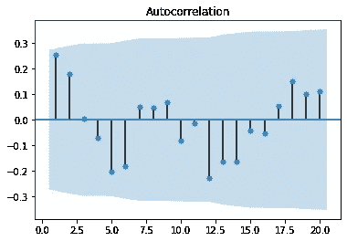
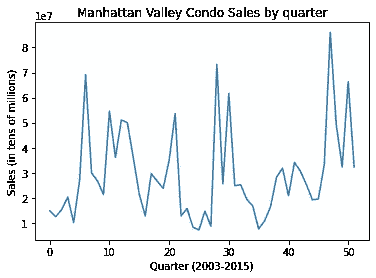
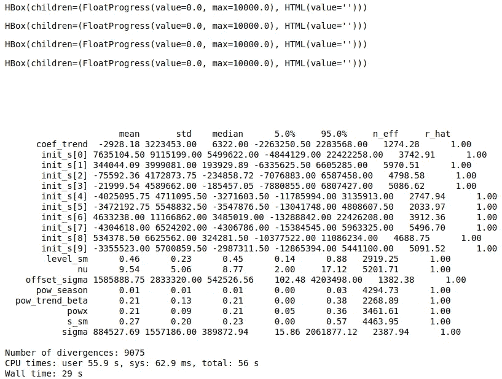
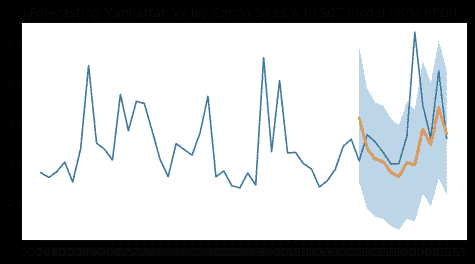

# 用 NumPyro 预测曼哈顿山谷公寓的销售

> 原文：<https://towardsdatascience.com/forecasting-manhattan-valley-condo-sales-with-numpyro-9ac6e6fb8182?source=collection_archive---------20----------------------->

## 使用贝叶斯方法生成基于概率的预测


来源:图片来自 [Pixabay](https://pixabay.com/photos/apartments-condos-flats-balconies-924786/)

[NumPyro](https://num.pyro.ai/en/stable/getting_started.html) 是一个日益流行的概率编程工具，用于贝叶斯分析。与其他贝叶斯库相比，使用 NumPyro 的一个主要优势是速度。NumPyro 由 [JAX](https://github.com/google/jax) 提供支持，这允许使用自动签名来区分原生 Python 和 NumPy 函数。更重要的是，XLA 可以用于在 GPU 和 TPU 上运行 NumPy 程序，这使得性能特别快。

NumPyro 本身构建于 PyTorch 之上，而 PyMC3(另一个特别流行的贝叶斯库)构建于 Theano 之上。

除了使用 NumPyro 的速度优势之外，该库还提供了大量的概率编程工具——在这个例子中，我们将研究时间序列预测的用例。

在这个例子中，NumPyro 将用于预测曼哈顿山谷每季度的总公寓销售量。

# **数据**

数据来源于[纽约公开数据](https://data.cityofnewyork.us/Housing-Development/NYC-Calendar-Sales-Archive-/uzf5-f8n2)，曼哈顿山谷的公寓——电梯公寓——的销售价格是从 2003 年到 2015 年按季度汇总的。

在处理时间序列时，一个很好的经验法则是时间序列越长，数据就越有意义。

让我们以房地产销售为背景来考虑这个问题。

在曼哈顿谷——有时会发生非常昂贵的房产销售，这可能会极大地扭曲该时期的总销售额。例如，2004 年公寓的平均价格为 825，983 美元，但最贵的公寓售价超过 45，388，000 美元！

在这方面，在这种情况下，使用每月时间序列会导致 2004 年 7 月出现异常大的峰值(当时出售了价值 4500 万美元的房产)。使用季度数据有助于在一定程度上消除这些异常。

当按季度合并销售数据时，我们会发现，在某些季度，总体销售会出现明显的高峰。


来源:Jupyter 笔记本输出

# **时间序列**

当使用传统的时间序列模型(如 ARIMA 模型)时，一个特别重要的考虑因素是特定序列的季节性趋势。如果一个时间序列以一定的时间间隔显示出重复的模式(不同于这些重复模式随机发生的循环时间序列)，那么这使得该序列更容易预测。

我们可以看到，严格地说，在这种情况下，时间序列不遵循季节模式，或者至少不是一个重要的模式。自相关滞后低于证明的 95%置信区间(蓝色阴影)。



来源:Jupyter 笔记本输出

也就是说，使用贝叶斯分析的目的是提供一个概率预测。换句话说，虽然我们无法确切知道一个时间序列是否遵循特定的模式，但我们可以对它是否遵循特定模式进行概率评估。

在上面的自相关函数中，我们可以看到相关性大约在每 9 个滞后时达到峰值。

从图表本身来看，我们看到销售似乎在大约每 8-10 个季度达到峰值。



来源:Jupyter 笔记本输出

从这个角度来看，让我们假设一个季节性因素为 **10** 来进行预测。请注意，在运行模型时，确实可以尝试不同的季节因素来确定哪些因素提供了最佳预测。

# 使用季节性全球趋势(SGT)模型进行预测

在这个例子中，使用了由 [num.pyro.ai](https://num.pyro.ai/en/stable/tutorials/time_series_forecasting.html) 网站提供的模板——它复制了最初在 r

SGT 模型使用学生的 t 分布代替正态分布来表示可能性，因为前者的尾部更重。

该模型由趋势和季节组件组成，并且该模型使用所谓的**级别**和 **s** 组件来更新趋势值。

例如，如在 SGT 模型的函数下定义的，level_sm 和 s_sm 都定义如下:

```
level_sm = numpyro.sample("level_sm", dist.Beta(1, 2))
    s_sm = numpyro.sample("s_sm", dist.Uniform(0, 1))
```

本质上，这只是表示贝塔分布和均匀分布都作为**连续概率分布**，模型的随机成分根据计算的概率随时间更新。

这是该模型的主要优势之一。例如，我们在自相关函数中看到，模型中可能存在某种季节性模式——但还没有显示出具有统计显著性。可能的情况是，在更长的一段时间内，我们可能会观察到一个显著的季节性模式——但只是没有足够的数据来调查是否是这样。但是，该模型可用于定义在特定时期观察季节模式的概率，并相应地生成基于概率的预测。

该模型还可以更擅长处理不确定性——我们可能无法肯定地说公寓销售何时会出现大幅增长——但我们可以尝试给出一个概率。

假设我们在设计的数据集上总共有 52 个季度，前 40 个季度将用于训练目的，其余 12 个季度用于测试目的。

```
y_train, y_test = jnp.array(data[:40], dtype=jnp.float32), data[40:]
```

在定义函数、训练和测试集时，可以生成 5000 个 MCMC(马尔可夫链蒙特卡罗)样本。 [NUTS](https://github.com/mfouesneau/NUTS) (或 No-U-Turn 采样器)是一种加速采样过程的方法，它避免了通过随机游走方法生成样本，而是选择识别可能的候选点，从而更快地生成目标分布。

该模型运行如下:

```
%%time
kernel = NUTS(sgt)
mcmc = MCMC(kernel, num_warmup=5000, num_samples=5000, num_chains=4)
mcmc.run(random.PRNGKey(0), y_train, seasonality=10)
mcmc.print_summary()
samples = mcmc.get_samples()
```

该模型生成以下结果:



来源:Jupyter 笔记本输出

现在，可以进行预测，并且可以估计预测的准确性。

```
>>> predictive = Predictive(sgt, samples, return_sites=["y_forecast"])
>>> forecast_marginal = predictive(random.PRNGKey(1), y_train, seasonality=10, future=12)[
>>>     "y_forecast"
>>> ]>>> y_pred = jnp.mean(forecast_marginal, axis=0)
>>> sMAPE = jnp.mean(jnp.abs(y_pred - y_test) / (y_pred + y_test)) * 200
>>> msqrt = jnp.sqrt(jnp.mean((y_pred - y_test) ** 2))
>>> print("sMAPE: {:.2f}, rmse: {:.2f}".format(sMAPE, msqrt))sMAPE: 38.90, rmse: 22167788.00
```

让我们看一下预测图，试图更好地理解这些数字。



来源:Jupyter 笔记本输出

我们可以看到，该模型总体上捕捉到了整体趋势，即测试集中前几个季度的销售额下降，随后出现显著上升趋势。虽然主要预测(橙色线)没有捕捉到某个特定季度的公寓销售大幅飙升，但概率区(浅蓝色)大致表明，未来可能会出现大幅飙升。

在 RMSE(均方根误差)的基础上，22，167，788 的 RMSE 与通过测试集计算的 37，448，102 的总平均销售额相比是显著的。

然而，由于 RMSE 受到异常值的显著影响，我们可以预计在这种情况下这个数字会很大。当查看原始[示例](https://num.pyro.ai/en/stable/tutorials/time_series_forecasting.html)中所示的 lynx 数据集分析时，计算出的 RMSE 1249.29 与测试集中计算出的平均值 1978.41 相比也非常显著。

在这方面，贝叶斯主导的时间序列模型具有价值，因为它可以帮助提供一系列情景的预测，并消除处理较小数据集时固有的不确定性。在这种特殊情况下，该模型非常有用，因为虽然我们无法确定地定义季节性因素，但我们可以使用基于概率的方法来估计趋势和季节性因素的波动。

# 结论

总之，在这个例子中，您已经看到了 NumPyro 如何用于:

*   定义 SGT(季节性、全球趋势)模型
*   使用这样的模型来随着时间更新概率估计
*   利用不掉头采样器生成 MCMC 样本
*   生成概率导向的预测并确定其准确性

非常感谢您的时间，任何问题或反馈都非常欢迎。你可以在 michael-grogan.com 找到更多我的内容。

*免责声明:本文是在“原样”的基础上编写的，没有担保。它旨在提供数据科学概念的概述，不应被解释为专业建议。本文中的发现和解释是作者的发现和解释，不被本文中提到的任何第三方认可或隶属于任何第三方。*