# 使用高斯过程预测葡萄牙新的新冠肺炎病例

> 原文：<https://towardsdatascience.com/forecasting-new-covid19-cases-in-portugal-using-gaussian-processes-1956d3315beb?source=collection_archive---------18----------------------->

## [实践教程](https://towardsdatascience.com/tagged/hands-on-tutorials)

## 使用 Python 和贝叶斯统计预测 30 天的新病例

# 1.介绍

我更喜欢在不同的主题和不同的背景下做这个分析。今天，葡萄牙是每百万人中新增新冠肺炎病例绝对数量最多的国家[【1】](https://ourworldindata.org/grapher/rate-of-daily-new-confirmed-cases-of-covid-19-positive-rate?tab=table&yScale=linear&time=earliest..latest)。我不想让这成为一篇政治文章，但是遏制病毒的传播是非常必要的。这需要更多的政治勇气来采取必要的措施，另一方面，需要普通民众更加严格的行为，尊重既定的封锁规则。

既然我已经把这些想法抛开了，让我们把注意力集中在科学工作上。新冠肺炎数据集可能是有史以来分析最多的，各种模型都被用来预测它的行为。疫情的扩散有一个已知的动态，通常很好地符合房室模型。然而，在这种情况下，我们有一个前所未有的全球传播，有许多因素影响它。例如，各国正在采取不同的措施来阻止传播，其中一些措施对新病例的数量产生了较大的影响，而另一些措施则影响不大。这是一个边做边学的过程，尽可能利用科学来帮助政治决策。

本文的范围是对葡萄牙新病例数量的预测。我们将试着展望未来 30 天，看看会有什么不同的情况摆在我们面前。为了克服手头的困难模式，我们将使用高斯过程，这是众所周知的非常灵活。

这篇文章是科学练习；请不要根据其结果采取任何行动。

像往常一样，你可以在我的 [GitHub](https://github.com/luisroque/bayesian_time_series) 上找到所有代码。

# 2.高斯过程

本节给出高斯过程背后的理论的一些背景。如果您对该应用程序更感兴趣，请随意跳过它。

高斯过程是一种贝叶斯非参数方法。通常，在贝叶斯框架中，我们感兴趣的是推断用于拟合数据(可能性)的第二个分布的参数分布。在这种情况下，我们直接推断函数的分布。

更实际地说，高斯过程是一种随机过程，其中我们将随机变量(或函数)f 分配给有限数量的离散训练点，即我们的 x。这些变量的联合分布也是高斯分布:

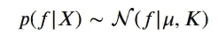

其中μ=(m(x_1)，…，m(x_N))是均值函数，K_ij=k(x_i，x_j)是定义协方差矩阵的核函数，f=(f(x_1)，…，f(x_N)是函数值的实现。例如，如果内核认为 x_i 和 x_j 是相似的，则在这些点 f(x_i)和 f(x_j)处的函数值可以预期具有相似的值。

## 2.1 多元高斯分布

高斯过程的基础是多元高斯分布，多元高斯分布是高斯分布的多维推广(参见[【2】](https://distill.pub/2019/visual-exploration-gaussian-processes/)进行交互解释)。在多元情况下，分布由平均向量μ和对称正定协方差矩阵σ定义。前者代表每个随机变量的期望值，而后者描述了两种现象:它的对角线表示每个维度的方差，非对角线表示所有随机变量之间的协方差。它基本上衡量随机变量如何一起变化。

多元高斯分布具有以下联合概率密度:

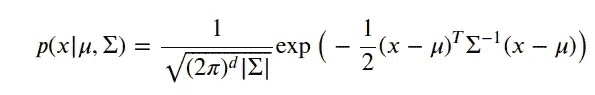

其中 x 是大小为 d 的随机向量，而|σ|是 dxd 矩阵σ的行列式。

为了更好地理解这些参数如何改变分布，让我们在二维高斯分布上画两个简单的例子。在第一个例子中，变量是独立的，在第二个例子中，变量是协变的(参见非对角线值)。

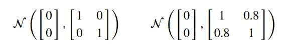

这可以概括为:

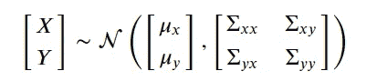

```
import matplotlib.pyplot as plt
import numpy as np
import matplotlib.gridspec as gridspec
import pandas as pd
import pymc3 as pm
import theano.tensor as tt
import arviz as az
from numpy.linalg import inv
from numpy.linalg import det
from scipy.optimize import minimize

pd.options.mode.chained_assignment = Nonedef multivariate_normal(x, d, mean, covariance):
    return (1\. / (np.sqrt((2*np.pi)**d * np.linalg.det(covariance))) 
            * np.exp(-(np.linalg.solve(covariance, x-mean).T.dot(x-mean))/2))def calculate_pdf(mean, covariance, d):
    x_ = 100
    xs = np.linspace(-5, 5, x_)
    ys = np.linspace(-5, 5, x_)
    x, y = np.meshgrid(xs, ys)
    pdf = np.zeros((x_, x_))
    for i in range(x_):
        for j in range(x_):
            pdf[i,j] = multivariate_normal(
                np.matrix([[x[i,j]], [y[i,j]]]), 
                d, mean, covariance)
    return x, y, pdffig, ax = plt.subplots(nrows=1, ncols=2, figsize=(8,4), sharey=True)
d = 2 

mean_ind = np.matrix([[0.], [0.]])
covariance_ind = np.matrix([
    [1., 0.], 
    [0., 1.]])
x, y, p = calculate_pdf(
    mean_ind, covariance_ind, d)

ax[0].contourf(x, y, p, 100)
ax[0].set_xlabel('$X$', fontsize=13)
ax[0].set_ylabel('$Y$', fontsize=13)
ax[0].axis([-2.5, 2.5, -2.5, 2.5])

mean_corr = np.matrix([[0.], [0.]])
covariance_corr = np.matrix([
    [1., 0.8], 
    [0.8, 1.]])
x, y, p = calculate_pdf(
    mean_corr, covariance_corr, d)

con = ax[1].contourf(x, y, p, 100)
ax[1].set_xlabel('$X$', fontsize=13)
ax[1].set_ylabel('$Y$', fontsize=13)
ax[1].axis([-2.5, 2.5, -2.5, 2.5])

ax[0].set_title('Independent variables', fontsize=12)
ax[1].set_title('Correlated variables', fontsize=12)

fig.subplots_adjust(right=0.8)
cbar_ax = fig.add_axes([0.85, 0.15, 0.02, 0.7])
cbar = fig.colorbar(con, cax=cbar_ax)
cbar.ax.set_ylabel('$p(x, y)$', fontsize=13)
plt.show()
```

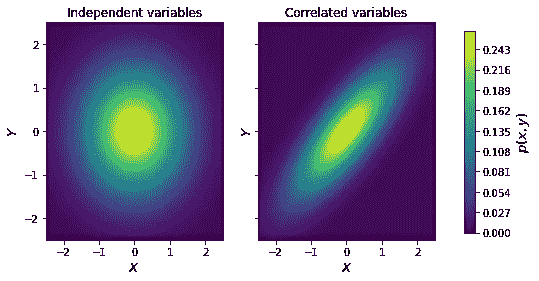

多元高斯是如此有用，由于它的代数性质，确保我们也得到高斯分布时边缘化和条件。

边缘化意味着从原始变量集中整合出变量。结果是变量子集的分布，而不参考我们整合出来的变量。所以如果我们只对 X 的概率密度感兴趣:

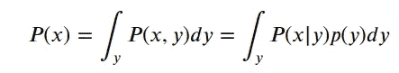

如前所述，这也会导致高斯分布:

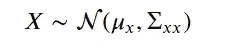

```
def univariate_normal(x, mean, variance):
    return ((1\. / np.sqrt(2 * np.pi * variance)) * 
            np.exp(-(x - mean)**2 / (2 * variance)))fig = plt.figure(figsize=(7, 7))
gs = gridspec.GridSpec(
    2, 1, height_ratios=[2, 1])
plt.suptitle('Marginal distributions', y=0.93)

ax1 = plt.subplot(gs[0])
x, y, p = calculate_pdf(mean_corr, covariance_corr, d)
con = ax1.contourf(x, y, p, 100)
ax1.set_xlabel('$x$', fontsize=13)
ax1.set_ylabel('$y$', fontsize=13)
ax1.axis([-2.5, 2.5, -2.5, 2.5])

ax2 = plt.subplot(gs[1])
x = np.linspace(-5, 5, 100)
px = univariate_normal(x, mean_corr[0,0], covariance_corr[0, 0])
ax2.plot(x, px, '--', label=f'$p(x)$')
ax2.legend(loc=0)
ax2.set_ylabel('density', fontsize=13)
ax2.yaxis.set_label_position('right')
ax2.set_xlim(-2.5, 2.5);
```


条件反射时也是如此，条件反射是一个变量依赖于另一个变量的概率。

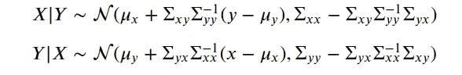

让我们为我们的例子计算 p(X|y=1 ):

```
y_cond = 1.
mean_x_cond_y = mean_corr[0,0] + (covariance_corr[0, 1]*(1/covariance_corr[1, 1])*(1 - mean_corr[1, 0]))
cov_x_cond_y = covariance_corr[0,0] - covariance_corr[0,1]*(1/covariance_corr[1,0]) * covariance_corr[0,1]fig = plt.figure(figsize=(7, 7))
gs = gridspec.GridSpec(
    2, 1, height_ratios=[2, 1])
plt.suptitle('Conditional distributions', y=0.93)

ax1 = plt.subplot(gs[0])
x, y, p = calculate_pdf(mean_corr, covariance_corr, d)
con = ax1.contourf(x, y, p, 100)
ax1.set_xlabel('$x$', fontsize=13)
ax1.set_ylabel('$y$', fontsize=13)
ax1.axis([-2.5, 2.5, -2.5, 2.5])
ax1.plot([-2.5, 2.5], [y_cond, y_cond], color='lightblue', linestyle='dashed')

ax2 = plt.subplot(gs[1])
x = np.linspace(-5, 5, num=100)
px = univariate_normal(x, mean_x_cond_y, cov_x_cond_y)
ax2.plot(x, px, '--', label=f'$p(x|y=1)$')
ax2.legend(loc=0)
ax2.set_ylabel('density', fontsize=13)
ax2.yaxis.set_label_position('right')
ax2.set_xlim(-2.5, 2.5);
```

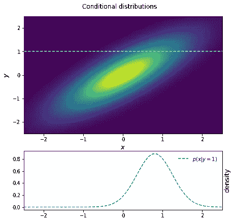

## 2.2 高斯过程回归

现在我们已经了解了多元高斯性质，是时候将它们结合起来解决回归问题了。首先，我们需要介绍一些概念。

执行高斯过程回归的基本思想是，我们的高斯过程会将概率分配给可能符合我们数据的无限函数。这种概率表达了模型的不确定性，这为我们提供了一个强有力的指示，表明我们应该在多大程度上信任点预测，即所得概率分布的平均值。

## 2.3 内核

内核定义了我们能够从函数分布中抽取的函数类型。虽然高斯过程是非参数方法，但核函数有参数，允许我们控制特定类型函数的形状。让我们做一个例子来理解这意味着什么。

最常用的核之一是平方指数核:

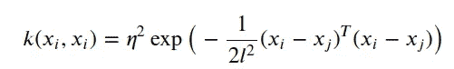

其中长度 l 控制函数的平滑度，η控制函数的振幅。

```
az.style.use('arviz-darkgrid')
def sq_e_kernel(x1, x2, l=1.0, η=1.0):
    sqdist = np.sum(x1**2,1).reshape(-1,1) + np.sum(x2**2, 1) - 2 * np.dot(x1, x2.T)
    return η**2 * np.exp(-0.5 / l**2 * sqdist)# Finite number of points
X = np.arange(0, 100).reshape(-1, 1)

cov = sq_e_kernel(X, X, l=5)
m = plt.imshow(cov, cmap="inferno", interpolation='none')
plt.colorbar(m);
```

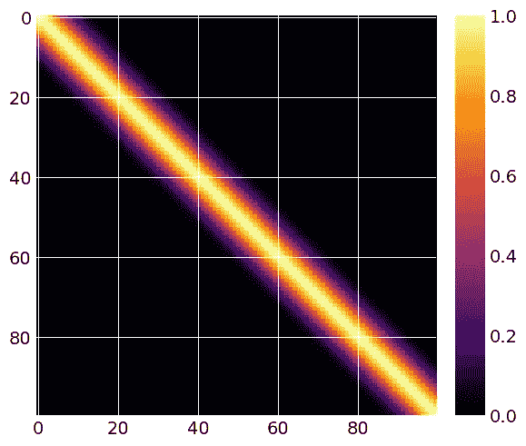

如果我们绘制协方差函数的第一条线，我们可以看到基于该函数产生的点之间距离的指数衰减。

```
plt.plot(cov[:,0]);
```

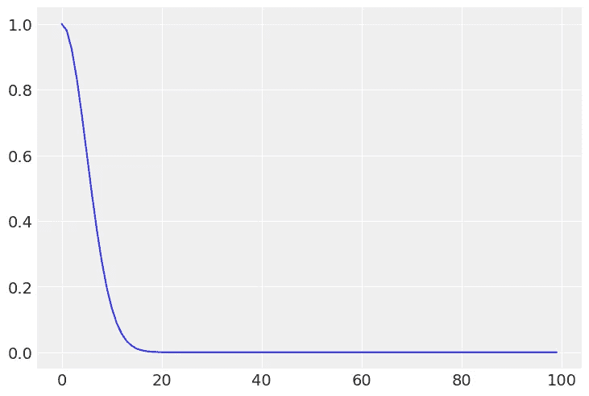

## 2.4 先前

我们上面定义的是多元分布的协方差矩阵。这意味着我们终于可以访问我们功能的实现了；我们需要从多元高斯分布中取样。我们可以在不实际观察任何训练点的情况下进行采样。这在进行预先预测检查时非常有用——我们将使用这一贝叶斯特性来分析新冠肺炎数据。

让我们为高斯过程定义μ=0。我们将看到，我们可以通过不同的核或核的组合，仅使用协方差矩阵来模拟各种行为。让μ=0 是一种标准的做法。

```
samples = np.random.multivariate_normal(np.zeros(100), cov, size=3)
plt.plot(samples.T);
```

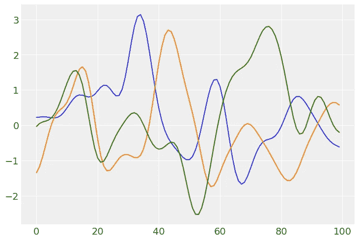

我们可以控制核的参数或核的组合来重塑结果函数。下面，您可以使用平方指数内核找到 3 种不同的参数组合。

```
_, ax = plt.subplots(3, 2)
ax = ax.ravel()

l_p = [0.1, 2, 10]
η_p = [10, 2, 2]

for i in range(6):
    cov = sq_e_kernel(X, X, η=η_p[i//2], l=l_p[i//2])
    if not i%2:
        ax[i].imshow(cov, cmap="inferno", interpolation='none')
        samples = np.random.multivariate_normal(np.zeros(100), cov, size=3)
    else:
        ax[i].plot(samples.T)
```

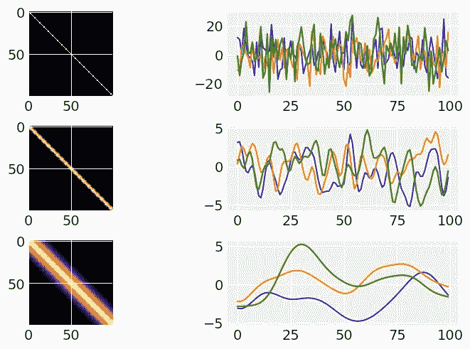

## 2.5 后部

为了完成理论介绍，我们需要插入我们的测试点，也就是我们想要估计新函数的新点。这就是我们使用多元高斯的条件属性的地方，正如我们在上面看到的，它也产生高斯分布。


在上面的表达式中，我们假设训练数据和预测中都没有噪声。在我们的训练数据中包括噪声是通过独立地将噪声添加到每个观察值中来实现的，

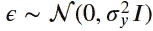

为了考虑预测中的噪声，我们将其添加到 K_**的对角线上。

如果在第一种情况下不考虑误差项，则调节的函数集合将精确地通过每个训练点。在后一种情况下，包含噪声可以被视为在我们当前的核中添加一个白噪声核，这有助于在我们的预测中建模小的不规则性。

```
def posterior(X_s, X_train, Y_train, l=1.0, η=1.0, noise_train=1e-8, noise_predict=1e-8):

    K = sq_e_kernel(X_train, X_train, l, η) + noise_train**2 * np.eye(len(X_train))
    K_s = sq_e_kernel(X_train, X_s, l, η)
    K_ss = sq_e_kernel(X_s, X_s, l, η) + noise_predict**2 * np.eye(len(X_s))
    K_inv = inv(K)

    mu_s = K_s.T.dot(K_inv).dot(Y_train)
    cov_s = K_ss - K_s.T.dot(K_inv).dot(K_s)

    return mu_s, cov_s
```

让我们用后验函数来决定新点 X_*上的先验。首先，我们在没有任何噪声的情况下定义我们的训练数据，并且在不考虑任何噪声的情况下拟合预测。

```
X_train = np.arange(0,16).reshape(-1,1)
Y_train = np.sin(X_train)

X = np.linspace(0, 20, 100).reshape(-1, 1)
mu_new, cov_new = posterior(X, X_train, Y_train, noise_train=0, noise_predict=0)

samples = np.random.multivariate_normal(mu_new.ravel(), cov_new, 3)
uncertainty = 1.96 * np.sqrt(np.diag(cov_new))
plt.plot(X.ravel(),samples.T)
plt.fill_between(X.ravel(), mu_new.ravel() + uncertainty, mu_new.ravel() - uncertainty, alpha=0.1);
```

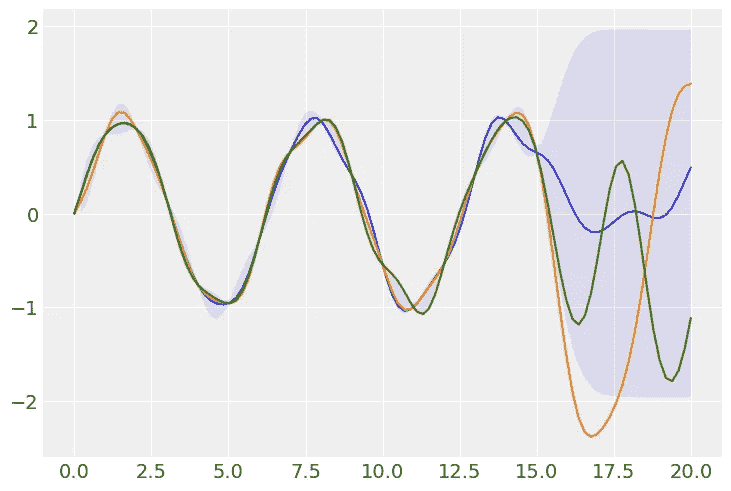

当我们向我们的训练数据添加噪声，但不向我们的模型添加任何噪声时，我们可以看到我们完全过度拟合了数据的不规则行为。

另一方面，当我们对噪声建模时(在第二个图中)，我们可以看到我们可以相对更好地恢复数据中存在的潜在模式。

```
noise_train = 0.8
X_train = np.arange(0,16).reshape(-1,1)
Y_train = np.sin(X_train) + noise_train * np.random.randn(*Y_train.shape)

_, ax = plt.subplots(2, 1)
X = np.linspace(0, 20, 100).reshape(-1, 1)
mu_new, cov_new = posterior(X, X_train, Y_train, noise_train=0, noise_predict=0)

samples = np.random.multivariate_normal(mu_new.ravel(), cov_new, 3)
uncertainty = 1.96 * np.sqrt(np.diag(cov_new))
ax[0].plot(X.ravel(),samples.T)
ax[0].fill_between(X.ravel(), mu_new.ravel() + uncertainty, mu_new.ravel() - uncertainty, alpha=0.1);

mu_new, cov_new = posterior(X, X_train, Y_train, noise_train=0.2)
samples = np.random.multivariate_normal(mu_new.ravel(), cov_new, 3)
uncertainty = 1.96 * np.sqrt(np.diag(cov_new))
ax[1].plot(X.ravel(),samples.T)
ax[1].fill_between(X.ravel(), mu_new.ravel() + uncertainty, mu_new.ravel() - uncertainty, alpha=0.1);
```

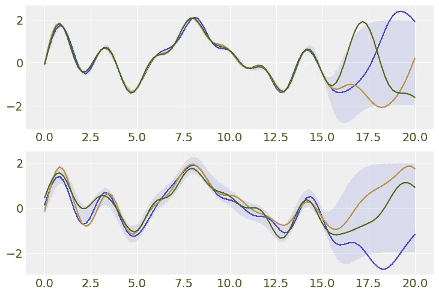

## 2.6 最大后验概率

估计我们的参数的一种方法是最大化对数边际可能性(要理解这个表达式是如何导出的，参见[【3】](/first-bayesian-state-space-model-with-pymc3-51cbb06ef8bd))，

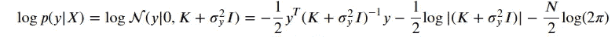

这相当于最小化负对数边际可能性，这通常是首选的(参见[【4】](http://krasserm.github.io/2018/03/19/gaussian-processes/)对这些想法的扩展)。

```
def l_fn(X_train, Y_train):
    """Partially adapted from http://krasserm.github.io/2018/03/19/gaussian-processes/"""
    Y_train = Y_train.ravel()
    def negative_log_like(theta):
        K = sq_e_kernel(X_train, X_train, l=theta[0]) + theta[1]**2 * np.eye(len(X_train))
        return (0.5 * np.log(det(K))
                + 0.5 * Y_train.dot(inv(K).dot(Y_train))
                + 0.5 * len(X_train) * np.log(2*np.pi))
    return negative_log_like

res = minimize(l_fn(X_train, Y_train),
               [1.,1.],
               method='L-BFGS-B')

l_opt, noise_train_opt = res.x

print('l_opt:' + str(np.round(l_opt, 2)))
print('noise_train_opt:' + str(np.round(noise_train_opt, 2)))

mu_s, cov_s = posterior(X, X_train, Y_train, l=l_opt, noise_train=noise_train_opt)
plt.plot(X.ravel(), np.random.multivariate_normal(mu_s.ravel(), cov_s, 3).T)
plt.fill_between(X.ravel(), mu_s.ravel() + uncertainty, mu_s.ravel() - uncertainty, alpha=0.1);l_opt:1.94
noise_train_opt:0.71
```

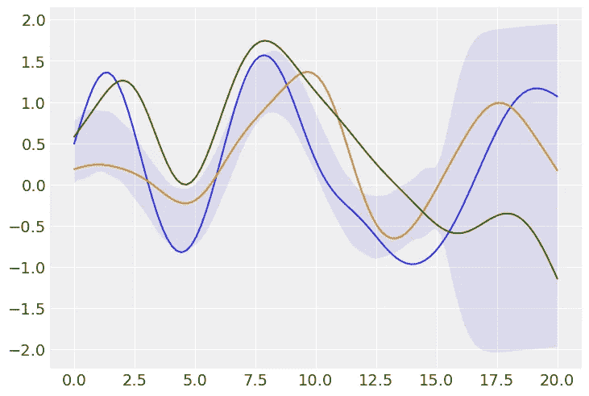

# 3.模型

## 3.1 数据

```
covid19 = pd.read_csv('./data/owid-covid-data20210120.csv')

covid = covid19[['location', 'continent', 'date', 'new_cases']] 
covid.columns = ['Country', 'Continent', 'Date', 'Count']
covid['Date'] = covid['Date'].astype('datetime64[ns]')
covid_pt = covid.loc[covid['Country']=='Portugal'].set_index('Date')
covid_pt = covid_pt.dropna()dates = covid_pt.index
c_pt = covid_pt['Count'].fillna(0).reset_index().set_index('Date')['Count'].values
c_pt = np.abs(c_pt)
X = np.arange(c_pt.shape[0]).reshape(-1,1)
```

下面我们可以看到葡萄牙新病例的演变。正如我前面所说，疫情的传播有一个已知的动力。尽管如此，在这种情况下，我们可以看到，随着时间的推移，采取的行动产生了不同的结果。在病毒传播的第一波中，葡萄牙被认为是遏制病毒的一个很好的例子。这既是由于政治措施，也是由于普通民众的行为。在第二次浪潮中没有发生同样的情况，缺乏规划导致我们面临挑战。现在，在分析数据时，我们被列为世界上最糟糕的国家之一。我们正面临着病例数量前所未有的增加，几乎导致我们的卫生系统崩溃。

该数据包含从 2020 年 2 月 3 日到 2021 年 1 月 19 日的值。请记住，这些值总是指前一天，因此数据集中的最后一天实际上是 1 月 18 日。

```
n = c_pt.shape[0]

plt.plot(np.arange(n), c_pt, label='data')
plt.legend();
```

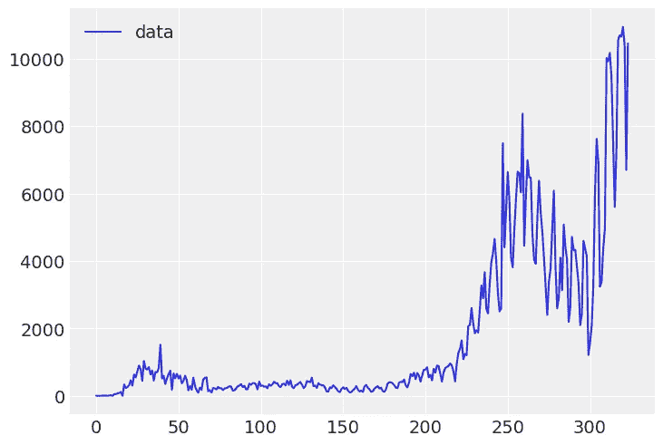

## 3.2 模型实施

## 内核

内核可以分为静态和非静态(参见我的另一篇文章以了解更多这些概念[【5】](/5-levels-of-difficulty-bayesian-gaussian-random-walk-with-pymc3-and-theano-34343911c7d2))。在远离观察点的区域中，稳定核将总是返回到高斯过程的均值。发生这种情况是因为在点之间建模的协方差只取决于它们的相对位置，而不取决于它们的绝对距离。一个例子可以是指数二次核或周期核。另一方面，线性核是不稳定的核。我们的模型是信号的三个 GP 和噪声的一个 GP 的总和:

1.  模拟中期不规则性(不同波)的指数二次核
2.  每周季节性的周期性术语。
3.  说明趋势的线性核(在本例中为指数)
4.  噪声被建模为白噪声核。

作为时间函数的 y 的先验是，

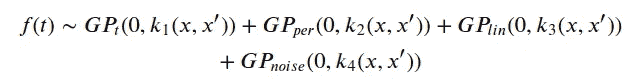

## 平均函数

如果我们在模型中没有指定均值函数，我们假设 GP 的均值为零。如果我们只使用稳定的内核，这将意味着函数最终会回到零，正如我们对未来的预测。这是一个合理的假设吗？对于这个疫情来说，情况可能并非如此——未来我们将不得不忍受它。所采取的措施的主要目标是控制传播速度，而不是完全让它从地球上消失。我们可以定义一个不同于零的均值函数，我在下面添加了代码来实现。然而，我们模型中使用的方法将使用线性核来代替。

```
from pymc3.gp.mean import Mean

class Linear(Mean):
    def __init__(self, b, a=0):
        Mean.__init__(self)
        self.a = a
        self.b = b

    def __call__(self, X):
        return tt.squeeze(tt.dot(X, self.b) + self.a)
```

## 可能性

在我们的例子中，我们正在处理计数数据。因此，我们希望使用一个或多个 GPs 作为潜在过程来估计泊松均值(和标准差，因为它们是相同的)。

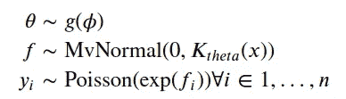

当我们使用一个分布作为泊松分布时，我们需要确保我们为该分布估计的参数被限制为正实数。这可以通过使用传统的对数连接函数来保证——这样，exp(f_i)总是正的。

## 3.3.4 使用重新参数化来加速

我添加这一小部分是为了让你了解`PyMC3`的默认参数化。它使用了我们多元常态的非中心参数化。我们已经知道，来自高斯过程的样本是具有参数化协方差矩阵的多元正态的实现。将 f 上的多元正态密度添加到对数后验密度的最佳方法是使用乔莱斯基分解得到因子 L，并将其乘以一个单变量正态随机变量的向量。

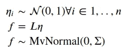

因此，f 的密度对其超参数(核参数)的先验依赖性被消除。

## 超参数分布

良好的做法是始终执行一些预先的预测检查，从而确保所有参数的预先分布都得到很好的定义。由于高斯过程的灵活性，我认为这样做更为重要。他们很容易过度拟合数据，给你意想不到的结果。如果你使用信息丰富的前科会有所帮助(见一篇关于这个主题的优秀文章[【6】](https://betanalpha.github.io/assets/case_studies/gaussian_processes.html))。

```
X_ = np.linspace(0, 350,1000)[:, None]

with pm.Model() as model_prior:
    l_t = pm.InverseGamma('l_t', 4, c_pt.shape[0]/4)
    l_p = pm.InverseGamma('l_p', 4, c_pt.shape[0])
    c = pm.Normal('c', 0, 0.05)

    η_trend = pm.HalfNormal('η_trend',0.1)
    η_ts = pm.HalfNormal('η_ts', 0.01)
    η_per = pm.HalfNormal('η_per', 0.2)
    σ  = pm.HalfNormal("σ",  sigma=0.02)

    cov = (η_trend**2 * pm.gp.cov.ExpQuad(input_dim=1, ls=l_t)
           + η_ts**2 * pm.gp.cov.Linear(input_dim=1, c=c)
           + η_per**2 * pm.gp.cov.Periodic(1, period=7, ls=l_p)
            + pm.gp.cov.WhiteNoise(σ))

    gp = pm.gp.Latent(mean_func = pm.gp.mean.Zero(), cov_func = cov)

    f = gp.prior("f", X=X_)
    f_ = pm.Deterministic('f_', tt.exp(f))

    prior_checks = pm.sample_prior_predictive(samples=1000)

plt.plot(c_pt, color='darkorange')
plt.plot(X_, prior_checks['f_'].T, color='b', alpha=0.1)
plt.ylim(0, 15000)
plt.title('Draws from GP');
```

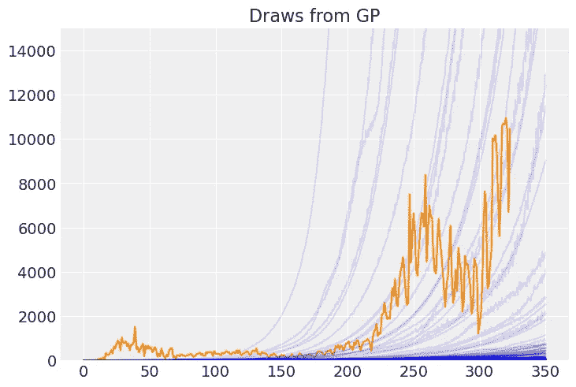

我们可以看到，我们以前的样本多少包含在我们的数据范围内。

## 3.3.6 现在一起

下面你可以找到我们用来适应葡萄牙新冠肺炎新病例的模型，因为疫情已经到达葡萄牙。

```
with pm.Model() as model:

    l_t = pm.InverseGamma('l_t', 4, c_pt.shape[0]/4)
    l_p = pm.InverseGamma('l_p', 4, c_pt.shape[0])
    c = pm.Normal('c', 0, 0.05)

    η_trend = pm.HalfNormal('η_trend',0.1)
    η_ts = pm.HalfNormal('η_ts', 0.01)
    η_per = pm.HalfNormal('η_per', 0.2)
    σ  = pm.HalfNormal("σ",  sigma=0.02)

    cov = (η_trend**2 * pm.gp.cov.ExpQuad(input_dim=1, ls=l_t)
           + η_ts**2 * pm.gp.cov.Linear(input_dim=1, c=c)
           + η_per**2 * pm.gp.cov.Periodic(1, period=7, ls=l_p)
            + pm.gp.cov.WhiteNoise(σ))

    gp = pm.gp.Latent(mean_func = pm.gp.mean.Zero(), cov_func = cov)
    f = gp.prior('f', X=X, reparameterize=True)

    y_pred = pm.Poisson('y_pred', mu=tt.exp(f), observed=c_pt)
    mp = pm.find_MAP(maxeval=20000, progressbar = True)
```

现在，是时候根据新数据(即我们想要预测的 30 个新时间点)来调整我们的模型了。

```
X_new = np.arange(c_pt.shape[0]+30).reshape(-1,1)
with pm.Model() as model:
    f_n = gp.conditional('f_n', Xnew=X_new)

    y_pred_new = pm.Poisson("y_pred_new", 
                            mu=tt.exp(f_n), 
                            shape=X_new.shape[0])

    pred_samples = pm.sample_posterior_predictive([mp], 
                                              vars=[y_pred_new], 
                                              samples=200,
                                              progressbar = False)
```

# 4.结果和讨论

最后，让我们画出我们的结果。

```
from pymc3.gp.util import plot_gp_dist
fig = plt.figure(figsize=(12,5)); ax = fig.gca()

plot_gp_dist(ax, pred_samples['y_pred_new'], X_new, palette="Blues", fill_alpha=0.1, samples_alpha=0.1);
plt.plot(np.arange(c_pt.shape[0]),c_pt, label='data', color='darkorange')
plt.ylim(0,max(c_pt)*4)
plt.legend();
```

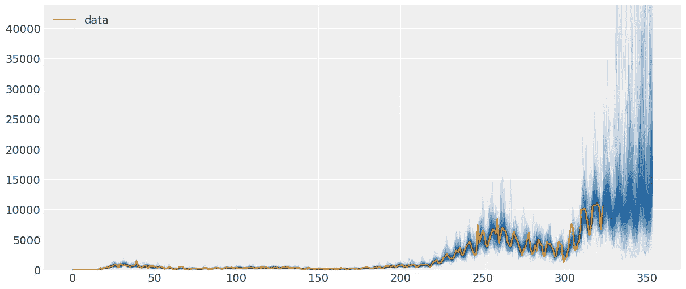

```
n_new = X_new.shape[0]
```

放大我们预测的未来 30 天的消息并不好。该模型估计平均病例数在 2 月 18 日达到 24.047 例。但更重要的是，它还告诉我们，在锁定等措施碰巧非常有效的情况下，24.047 的峰值可能低至 8.753(50%区间的底部)或高达 29.939(50%区间的顶部)。您还可以看到关于 90%可信区间的更极端的情况。

当我写完这篇文章的时候，今天新病例的数量被公布了——我把它作为一个红叉加了进去。不幸的是，我们可以看到它在我们区间的顶端，在 50%和 90%之间。可能只是一个不规律(比如更多测试的结果，数据注册，前几天的累积效应等。)或者表示行为的改变。我们需要分析接下来几天的数据来理解它。

```
mean_values = pd.DataFrame({'x':np.arange(n, n_new), 'y':np.mean(pred_samples['y_pred_new'], axis=0)[-30:]})
top_mean_values = pd.DataFrame(columns=['x', 'y'])
top_mean_values['x'] = [mean_values[(i)*6:(i+1)*6].sort_values(by='y', ascending=False)[:1].values[0][0] for i in range(5)]
top_mean_values['y'] = [mean_values[(i)*6:(i+1)*6].sort_values(by='y', ascending=False)[:1].values[0][1] for i in range(5)]

low_q25_values = pd.DataFrame({'x':np.arange(n, n_new), 'y':np.percentile(pred_samples['y_pred_new'], axis=0, q=[25]).ravel()[-30:]})
low_q25_values = low_q25_values.loc[low_q25_values.x.isin(top_mean_values.x)]
high_q25_values = pd.DataFrame({'x':np.arange(n, n_new), 'y':np.percentile(pred_samples['y_pred_new'], axis=0, q=[75]).ravel()[-30:]})
high_q25_values = high_q25_values.loc[high_q25_values.x.isin(top_mean_values.x)]

low_q10_values = pd.DataFrame({'x':np.arange(n, n_new), 'y':np.percentile(pred_samples['y_pred_new'], axis=0, q=[10]).ravel()[-30:]})
low_q10_values = low_q10_values.loc[low_q10_values.x.isin(top_mean_values.x)]
high_q10_values = pd.DataFrame({'x':np.arange(n, n_new), 'y':np.percentile(pred_samples['y_pred_new'], axis=0, q=[90]).ravel()[-30:]})
high_q10_values = high_q10_values.loc[high_q10_values.x.isin(top_mean_values.x)]plt.fill_between(np.arange(n, n_new), np.percentile(pred_samples['y_pred_new'], axis=0, q=[10]).ravel()[-30:],
                 np.percentile(pred_samples['y_pred_new'], axis=0, q=[90]).ravel()[-30:], alpha = 0.1, color='b', label='90% CI');
plt.fill_between(np.arange(n, n_new), np.percentile(pred_samples['y_pred_new'], axis=0, q=[25]).ravel()[-30:],
                 np.percentile(pred_samples['y_pred_new'], axis=0, q=[75]).ravel()[-30:], alpha = 0.25, color='b', label='50% CI');
plt.plot(np.arange(n, n_new), np.mean(pred_samples['y_pred_new'], axis=0)[-30:], label='mean')
for i, j in zip(top_mean_values.x, top_mean_values.y):
    plt.annotate(str(int(j)), xy=(i,j))
for i, j in zip(low_q25_values.x, low_q25_values.y):
    plt.annotate(str(int(j)), xy=(i,j))
for i, j in zip(low_q10_values.x, low_q10_values.y):
    plt.annotate(str(int(j)), xy=(i,j))
for i, j in zip(high_q25_values.x, high_q25_values.y):
    plt.annotate(str(int(j)), xy=(i,j))
for i, j in zip(high_q10_values.x, high_q10_values.y):
    plt.annotate(str(int(j)), xy=(i,j))

plt.plot(324, 14647, 'rx', label='New cases Jan-19')
plt.legend();
```

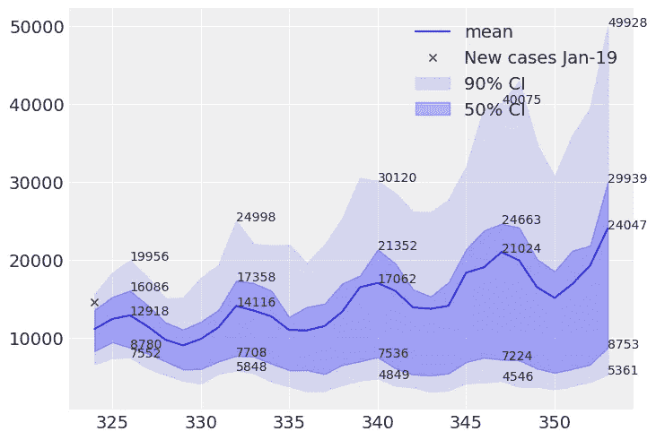

# 5.结论

本文旨在展示高斯过程在处理难以适应的模式时的优势和灵活性。伴随这种力量而来的是巨大的责任，尤其是在过度配合的时候。当我们花时间明智地选择我们的核，并根据它们的参数定义信息先验时，我们几乎可以用它们来拟合任何类型的数据。我们发现，我们的模型相对较好地描述了像葡萄牙每天新增新冠肺炎病例这样不规则的模式。我说相对较好，是因为我们应该用误差指标评估我们的预测，与基线模型进行比较，并将我们的模型应用于不同的场景(其他国家，其他指标如死亡人数等)。).使用高斯过程时要考虑的另一个重要方面是，它们并不具有很好的可伸缩性(O(n))，尽管有一些有趣的方法可以提高它们的可伸缩性(例如[【7】](https://arxiv.org/abs/1411.2005))。

这篇文章是科学练习；请不要根据其结果采取任何行动。

***来自《走向数据科学》编辑的提示:*** *虽然我们允许独立作者根据我们的* [*规则和指导方针*](/questions-96667b06af5) *发表文章，但我们不认可每个作者的贡献。你不应该在没有寻求专业建议的情况下依赖一个作者的作品。详见我们的* [*读者术语*](/readers-terms-b5d780a700a4) *。*

保持联系: [LinkedIn](https://www.linkedin.com/in/luisbrasroque/)

# 参考

[1]—[https://ourworldindata . org/grapher/rate-of-daily-new-confirmed-cases-of-新冠肺炎阳性率？tab =表格&y scale =线性&时间=最早..最新](https://ourworldindata.org/grapher/rate-of-daily-new-confirmed-cases-of-covid-19-positive-rate?tab=table&yScale=linear&time=earliest..latest)

[2]—[https://distilt . pub/2019/visual-exploration-Gaussian-processes/](https://distill.pub/2019/visual-exploration-gaussian-processes/)

[3]—[https://towards data science . com/first-Bayesian-state-space-model-with-pymc 3-51 cbb 06 ef 8 BD](/first-bayesian-state-space-model-with-pymc3-51cbb06ef8bd)

[4]—[http://krasserm.github.io/2018/03/19/gaussian-processes/](http://krasserm.github.io/2018/03/19/gaussian-processes/)

[5]—[https://towards data science . com/5-难易度-贝叶斯-高斯-随机漫步-pymc 3-and-the ano-34343911 c7d 2](/5-levels-of-difficulty-bayesian-gaussian-random-walk-with-pymc3-and-theano-34343911c7d2)

[6]—[https://betanalpha . github . io/assets/case _ studies/Gaussian _ processes . html](https://betanalpha.github.io/assets/case_studies/gaussian_processes.html)

[7]—[https://arxiv.org/abs/1411.2005](https://arxiv.org/abs/1411.2005)