# 通过优化 Python 中的特征选择来预测商店流量

> 原文：<https://towardsdatascience.com/forecasting-store-traffic-using-feature-selection-with-sklearn-and-pandas-in-python-6a1feddebd74?source=collection_archive---------23----------------------->

## 该分析最初是在一些数据科学角色的评估中激发和提供的。然而，数据集被修改后发表。

照片由 [Aditya Rao](https://unsplash.com/@travelcompany?utm_source=unsplash&utm_medium=referral&utm_content=creditCopyText) 在 [Unsplash](https://unsplash.com/s/photos/japan-restaurant?utm_source=unsplash&utm_medium=referral&utm_content=creditCopyText) 上拍摄

# 介绍

我的发现将涵盖日本各地餐馆/商店客流量波动的原因。这些信息将有利于 F&B 行业的公司管理层优化品类管理、商店选择和相关资源分配，从而提高商店访问量、增加收入，并通过更好的客户服务获得更好的声誉。考虑到其他当地因素，如假期、天气和季节性，所探讨的因素也将显示日本市场在顾客口味方面的更好图景。

# 数据理解

我们有如下三个主要数据集。由于原始数据非常庞大和复杂，这三个数据集已经是预处理过程的结果。

-**2016 年店铺访问数据**(train _ restaurant _ visitors . CSV):按日期提供访问日期、餐厅/店铺类型、店铺经纬度、各店铺访问人数等数据。

- **日本的假日信息**(holidays _ data . CSV):按日期提供日本不同的假日名称。

-**2016 年天气数据**(new _ Weather _ data 2 . CSV):提供每一天的各种天气属性，以关键类别表示:温度、湿度、雨、阳光、雪、风。

# 数据准备和探索

*数据清理*

在检查了三组数据后，我承认有许多值丢失了。在为每个类别提供解决方案之前，我将缺失值的级别分为三类:> 60%缺失，< 20%缺失，100%缺失。对于第一个解决方案，我决定删除所有缺失值超过 60%的变量。为了处理缺失值低于 20%的要素，我对数值天气属性值使用了中值方法:Temp、Sun、Rain_avg_year、Sun_avg_year Total_precip。就假日信息而言，我用 Normal_day 替换了缺失值，因为带有假日信息的数据在一年中只占很小的百分比。

由于三个清理过的数据集没有任何缺失值，下一步应该是数据合并。使用来自每个数据集的相同日期列(主键)进行连接，最终得到一个主数据集。该数据集包括按日期排列的每个商店的商店访问量信息、按日期排列的假日信息(如果是)和天气信息。

最后，在清理和合并过程中，我从我们的主数据集中删除了其他不相关的数据特征，从而产生了用于转换、EDA 和建模部分的最终数据集。最终数据集具有以下变量:1 .日期，2。月份，3。访问者的数量，4。键入，5。假日名称，6。温度 7 度。Total_Precip，8。雨 _ 平均 _ 年，9。孙，10 岁。太阳平均年。

*数据转换*

查看我们的因变量 number of visitors 的分布，我得出的结论是，我们的数据不是正态分布的，而是略有偏斜。运行 QQ 图后，我们需要将数据转换为正态分布。新的 QQ 图表明，我们的 log(number_of_visitors)值更符合正态分布，使我们能够继续分析。

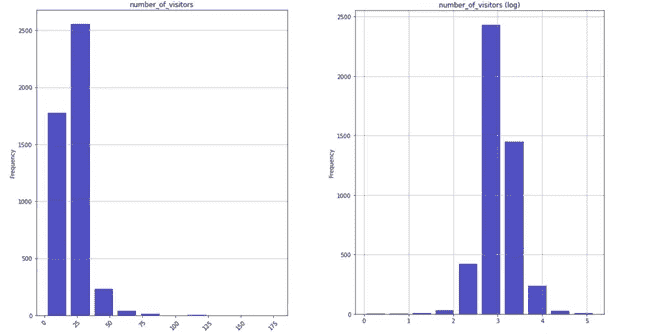

访客数量分布-按作者分类的图片

我做的另一个转换是将所有的字符串列转换成因子/分类变量:Type、Holiday_Name 和 Month。

*数据探索性*

转到 EDA，首先，我想确定 2016 年期间的任何趋势或季节性模式。从访客数量来看，我们发现 3 月至 5 月期间，每家商店的平均访客数量较高，12 月再次增加。与此同时，8 月至 11 月期间的平均访问量最低。

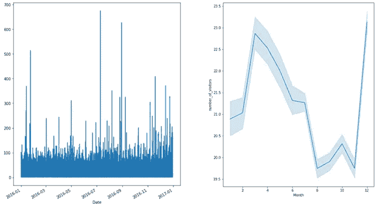

一段时间内的访客数量-按作者分类的图片

然而，假设每家商店的平均访问量受到 2016 年期间开设的商店数量的影响，我使用了两种可视化方法来证实我的假设。因此，下半年有大量商店开业，增加了商店的总访问量。

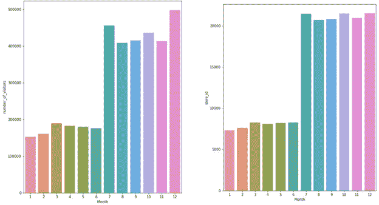

一段时间内访客和商店的总数-按作者分类的图片

在时间分析中考虑餐厅/商店类型，我们还看到 2016 年下半年开业的一些新店提供了平均访客数量更高的新类别。

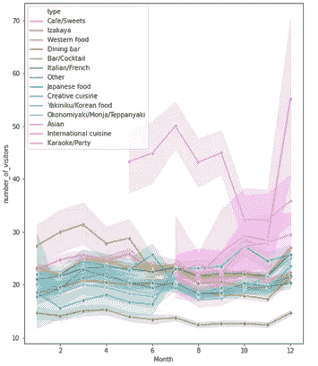

一段时间内按类别划分的访客数量—按作者划分的图片

为了深入研究访问者数量的其他统计数据，比如方差，我还使用了如下的箱线图。我们看到，甚至每个商店的平均访问量也没有太大差异；由于新店的扩张，自 6 月以来，差异有所增加。

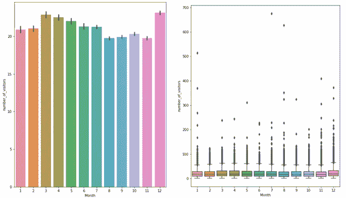

一段时间内的访客数量-按作者分类的图片

使用月周期的箱线图，我还研究了其他数值自变量的模式，其中大部分是天气特征。没有新的发现表明夏季温度较高，雨季发生在六月和九月。最冷的月份是一月，温度最低，而最热的月份是八月。

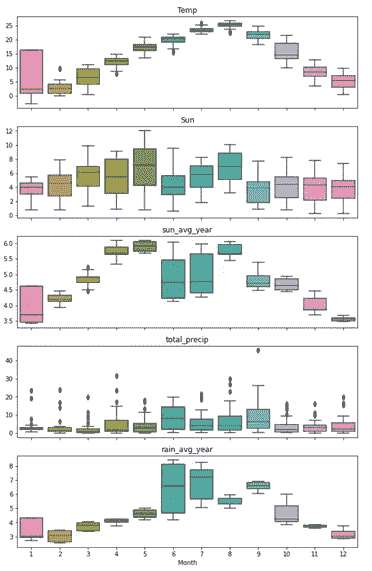

一段时间内的天气数据-按作者分类的图片

为了理解不同感兴趣变量的特征和相互作用，我还使用直方图来了解其他独立变量的频率。

接下来，我构建了二维箱线图来可视化访问者数量和独立变量之间的关系。考虑到假期日期，有趣的是，人们在新年那天最少去商店或餐馆。与此同时，其他场合如天皇生日或昭和日也吸引了很多人来逛商店。就商店/餐馆类别而言，我们看到了亚洲食品的主导地位，这可能在日本这样的亚洲国家最容易获得。相反，同期去酒吧/鸡尾酒会等其他高端场所的人并不多。

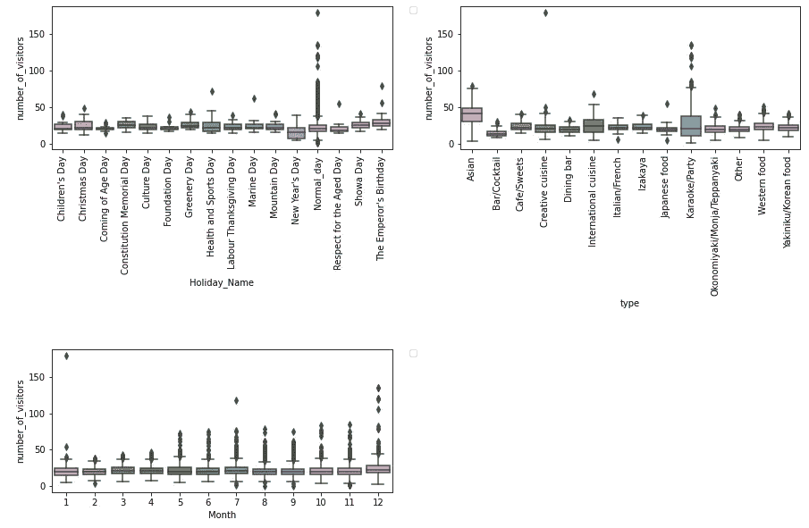

访客数量和分类数据—按作者分类的图片

在与访客数量的关系分析中，我还考虑了其他数值自变量。以月份作为第三个属性构建三维散点图，我们可能会同意，唯一值得一提的模式是总 precip 的平均值，这意味着一种负相关关系:Precip 越低，商店的访客数量越多。除了谈论游客的数量，我们还知道 12 月的晴天和雨天更少，这部分解释了为什么人们在同一时期外出最频繁。

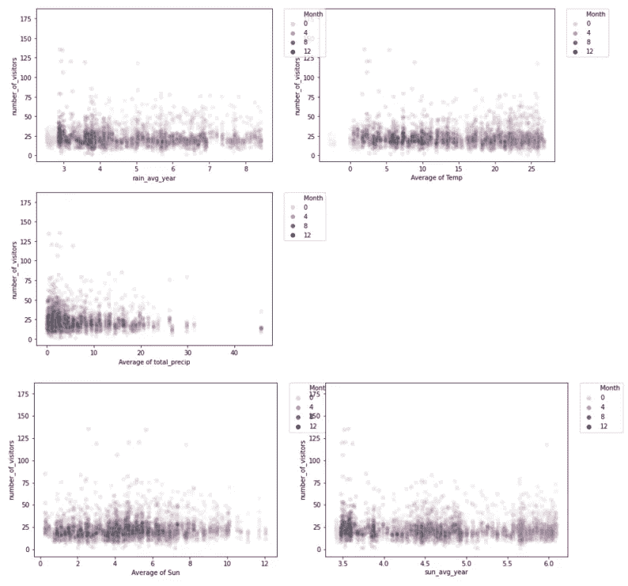

一段时间内的访客数量和天气数据-按作者分类的图片

*相关性分析*

为了了解哪些变量可能会影响访客数量，我对所有选定的自变量和因变量进行了相关性分析。在此之前，我将所有分类变量转换为虚拟变量来计算相关性。一旦完成，我选择任何与访客数量相关度超过 10%的变量。这组变量被称为最感兴趣的 13 个变量。

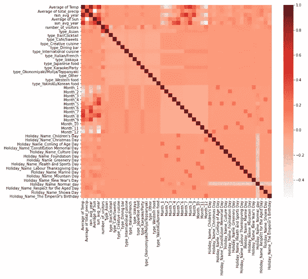

相关矩阵-作者图片

最后，我使用另一个相关矩阵考虑了当前前 13 个变量的数据中是否存在共线性问题:

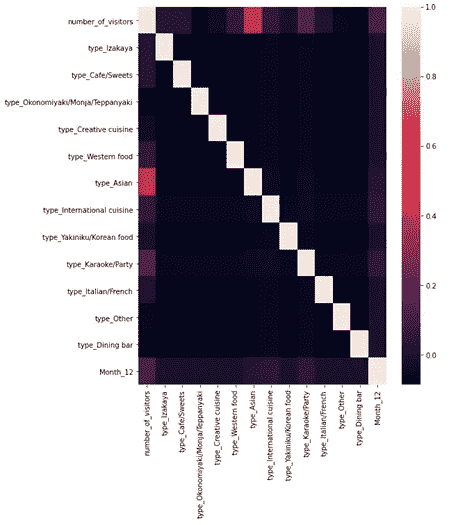

前 13 个变量的相关矩阵—作者图片

在下一个建模部分，我们将利用 LASSO 等正则化技术来处理其他高度相关的变量。

# 特征选择和建模

对于特征选择和建模部分，我决定使用三种不同的方法。在后面的分析中，我将深入研究每一个问题。

***方法一:过滤方法***

顾名思义，在这种方法中，我使用了 filter 并只提取相关特性的子集。模型是在选择特征之后构建的。这里的过滤是使用相关矩阵完成的，最常见的是使用皮尔逊相关。

我们知道，访问者的数量与许多变量高度相关(我们的“前 13 个”)。我们采用多元线性回归建立了一个最佳的游客数量预测模型。我称之为“模型 1”，它包括了我们的“前 13 个”解释变量(与访问者数量高度相关的变量)。使用训练-测试分割方法，我们得到如下模型 1 摘要:

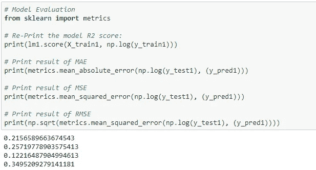

模型 1 摘要—作者提供的图片

在模型 1 中，所有确定的变量都与我们的目标变量——访问者数量——高度相关。所有变量都与目标变量有正相关关系。Type_Asian 对目标变量的边际影响最大。

***方法二:包装器方法***

包装器方法需要一个机器学习算法，并使用其性能作为评估标准。这意味着您将这些特征输入到所选的机器学习算法中，并根据模型性能添加/删除这些特征。尽管这是一个迭代且计算量大的过程，但它比滤波方法更精确。在这个分析中，我将讨论两种包装方法:逆向淘汰和 RFE。

模型 2.1: **逆向淘汰**

首先，我会将所有可能的特征放入模型中。在检查模型的性能之后，它将迭代地逐个移除性能最差的特征，直到模型的整体性能达到可接受的范围(使用高于 0.05 的 p 值)。我称之为“模型 2.1”，它包括了所有重要的解释变量。使用训练-测试分割方法，我们得到模型 2.1 摘要如下:

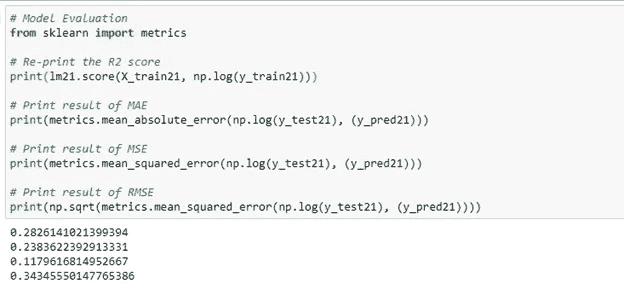

模型 2.1。摘要—按作者分类的图像

在模型 2.1 中，我们发现一些变量与目标变量——访问者数量——存在负相关关系。最显著的是 type_Bar/Cocktail，暗示人们最少去这个地方。像模型 1 一样，Type_Asian 对目标变量具有最积极的实质性边际影响。

模型 2.2: **RFE(递归特征消除)**

该方法递归地删除属性，并在保留的属性上构建模型。它考虑准确性度量，根据特征的重要性对其进行排序。RFE 方法将使用的模型和所需特征的数量作为输入。然后，它对所有变量进行排序，1 是最重要的。它也给出了它的支持，True 作为相关特征，False 作为不相关特征。

在找出 12 个特征的最佳数量后，我拟合了这 12 个变量，称之为“模型 2.2”。使用训练-测试分割方法，我们得到模型 2.2 摘要如下:

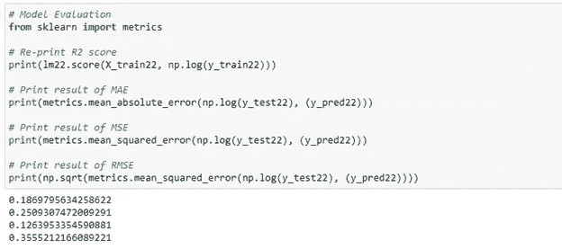

模型 2.2。摘要—按作者分类的图像

在模型 2.2 中，我们看到所有变量都与目标变量——访问者数量——成负相关。和模型 2.1 一样，最显著的是 type_Bar/Cocktail，暗示人们最少去这个地方。

***方法三:嵌入式方法***

正则化方法是最常用的嵌入式方法，其在给定系数阈值的情况下惩罚特征。我将使用套索进行特征选择。如果变量是不相关的，拉索惩罚系数，使其为 0。因此，系数= 0 的特征被移除，而其余的被采用。

使用套索回归方法，我们提出了“模型 3 ”,它执行变量选择和正则化。深入研究变量选择，我们有对模型最重要的前 30 个预测因子。这是通过使用 MDI(基尼系数重要性或杂质平均减少量)来完成的，MDI 将每个特征的重要性计算为包括该特征的分裂数(跨所有树)的总和，与它分裂的样本数成比例。

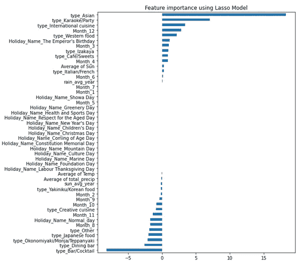

模型 3 变量的重要性—作者图片

模型 3 总结如下:

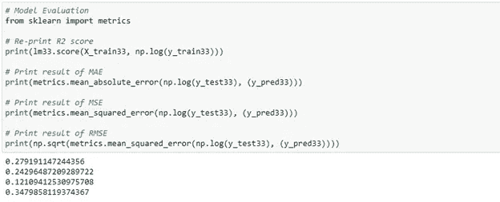

模型 3 摘要—作者提供的图片

与模型 1、模型 2.1 和模型 2.2 相比，我们对月份变量组有了更多的了解。但是，我们可以再次确认 Type_Asian(正)和 Type_Bar/Cocktail(负)对目标变量的反向影响。

# 估价

在运行了我们的四个模型之后，我使用了四个指标:R 平方、MAE、MSE 和 RMSE 来评估我们的模型预测性能。正如我们从下表中所预期的那样，就所有指标而言，使用反向消除的模型 2.1 是最好的。另一个性能非常接近的模型是使用 LASSO 正则化的模型 3。

预计过滤方法(模型 1)不太准确，包装和嵌入方法(模型 2.1 和模型 3)提供更准确的结果。然而，当处理大量特征时，这两个后面的模型在实践中在计算上将是昂贵的。

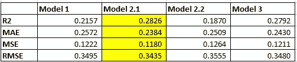

4 个模型的比较—作者提供的图片

# 部署

通过分析一组与商场客流量相关的数据集，我创建了一个模型，可以帮助高层管理团队、资源规划人员，尤其是 F&B 行业的商场经理预测商场/餐厅的客流量，并更好地了解日本市场的顾客偏好。我发现使用反向消除的模型 2.1 比其他模型表现得更好。我还从使用套索正则化的模型 3 中看到了令人印象深刻的预测准确性。总的来说，我发现一些变量与访客数量成正相关，而另一些变量与目标变量成负相关。冷季(8、9、10、11 月)去商店/餐厅的人比较少，Type_Bar/Cocktail 是最不受欢迎的地方。然而，客流量在 12 月再次增加，并在天气更适合购物活动的夏季达到高峰。同样清楚的是，Type_Asian 对访问者数量具有最积极的实质性边际影响。另一个值得一提的发现是假期变量组，因为它不会对日本顾客的购物或用餐决策产生很大影响。

然而，这种分析有一些局限性。首先，数据集的一些属性中有许多缺失值，这会降低我们预测的准确性。解决方案是通过与数据提供者合作进行挖掘和清理步骤来包含更多合格的数据。第二，基于与数据提供商的协议，我无法使用关于商店/餐馆位置的变量，而这些变量可能是商店客流量的良好预测指标。另一个限制是缺乏与商店/餐厅相关的数据特征，如商店容量、商店评级和客户服务。这些因素会影响吸引人们访问的能力。我们可以通过向数据提供者要求更多的内部数据来处理这个问题。最后是关于数据时间段。在这个分析中，我们只有 2016 年的店铺流量数据，这可能无法反映业务和市场的现状。应考虑通过纳入更多更新数据，向数据提供者提议进一步扩展这一分析。在未来，我们还可以尝试其他性能指标和其他机器学习技术，以获得更好的性能和结果比较。