# 用后分层多水平回归预测 2020 年美国大选

> 原文：<https://towardsdatascience.com/forecasting-the-2020-us-election-using-multilevel-regression-with-post-stratification-bbf2f93585fb?source=collection_archive---------15----------------------->


图片来源:Pixabay

## 总统选举，特朗普，政治民调，PYMC3，Python

# 如何评估美国的公众舆论

估计州一级意见最常用的方法叫做 ***分解*** 。这个过程很简单，也很容易实现:在合并了一组全国性的民意调查后，您可以计算出按州分列的意见百分比。

***分解*** 的问题在于，它需要收集超过 10 年或更长时间的大量全国性调查，以在每个州内创建足够的样本量。此外， ***分解*** 不能纠正抽样问题，可能会模糊州意见中的时间动态。

为了克服这些缺点， [***带后分层的多水平回归***](https://en.wikipedia.org/wiki/Multilevel_regression_with_poststratification)(***MRP***)被开发出来从全国民调中估计美国各州层面的意见。

# 什么是 ***后分层多水平回归*** (MRP)？

MRP 首先使用多级回归将个人调查响应建模为人口统计和地理预测的函数，在数据确定的范围内部分汇集各州的受访者。最后一步是后分层，其中每种人口地理应答类型的估计值按每种类型在实际州人口中的百分比进行加权(后分层)。

假设我们进行了一项调查，询问人们是否支持同性婚姻。我们有一个 1000 人的调查，其中 700 人为男性，300 人为女性。我们可以利用调查结果来计算支持同性婚姻的人的比例。但是，我们知道男女之间的人口分布大致是 50%/50%，而不是我们调查所暗示的 70%/30%。因此，仅从我们的调查中得出的原始结果就过度代表了男性的观点。

鉴于我们知道更广泛人群的性别分布，我们可以重新加权(分层后)我们的结果:所以在这个例子中，支持同性婚姻的人的比例估计为:

***0.5×男性比例+0.5×女性比例***

这种技术被称为后分层。我们需要调查数据和可靠的人口普查数据，以获得人口权重。数据可以根据许多不同的类别重新加权，如年龄、教育、性别、种族等。

# 预测 2020 年美国大选

在本帖中，我们将按照示例[这里](https://www.tellingstorieswithdata.com/mrp.html#ref-wang2015forecasting)和[这里](https://austinrochford.com/posts/2017-07-09-mrpymc3.html)使用分解技术& MRP 和两个数据集(一个民调数据集和一个人口普查数据集)预测 2020 年美国大选。我们走吧！

# 选举民调数据

我不能分享数据集，但是，下面是如何获取数据的说明:

1.  转到网站:【https://www.voterstudygroup.org 。
2.  点击“国家景观”。
3.  点击“获取最新的国家景观数据”。
4.  填写您的姓名和电子邮件地址，然后点击“提交请求”。
5.  您将收到一封带有下载链接的电子邮件，单击此链接。
6.  我们会下载。dta 文件。
7.  解压下载的“nation scape-data release _ weekly materials _ DTA _ 200910 _ 161918”，然后打开文件夹“phase_2_v20200814”。
8.  有很多 dta.files，我用的是“ns20200625.dta”，指的是 2020 年 6 月 25 日。

poll_data.py


表 1

数据中有许多特征，这个分析将需要七个:“投票 _2020”，“种族 _ 民族”，“教育”，“州”，“性别”，“年龄”，“人口普查 _ 地区”。

# 电子设计自动化(Electronic Design Automation)

```
df.vote_2020.value_counts(normalize=True)
```

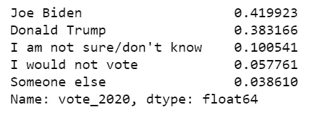

图 1

在数据中，大约 42%的人说他们会投票给拜登，38%的人说他们会投票给特朗普，10%的人不确定，以此类推。

## 各州的民意测验答卷人数量

respondents _ by _ state.py

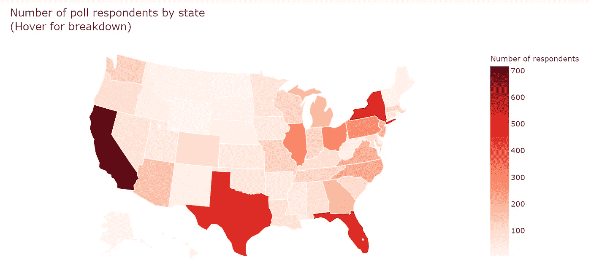

图 2

很明显，越大的州，越多的受访者。值得注意的是，每个州都有回答者。

## 按州和种族分列的受访者

1.  我们将种族简化为四类:“白人”、“黑人”、“亚裔”和“其他”。
2.  因为我们对特朗普的选民感兴趣，所以会重新编码“vote_2020”变量。

状态 _ 种族. py

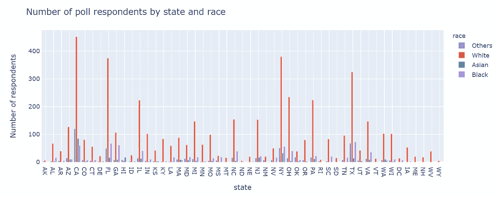

图 3

所有的州都有白人受访者，几个州没有黑人和/或亚裔受访者，甚至更多的州只有很少的黑人和/或亚裔受访者。

## 按州和性别分列的受访者

state_gender.py

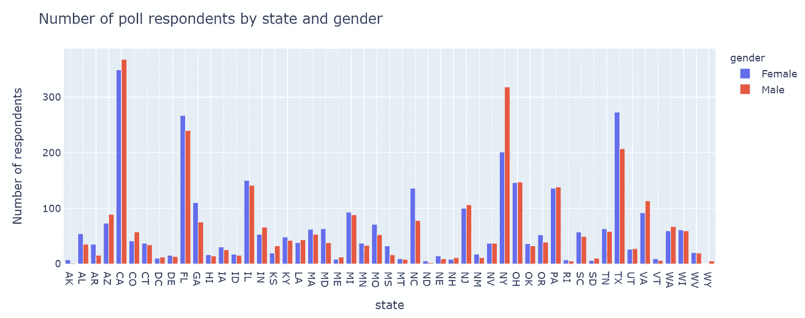

图 4

一个州(WY)没有女性答卷人，所有其他州都有男性和女性答卷人。

## 估计对特朗普的支持

disa_trump.py

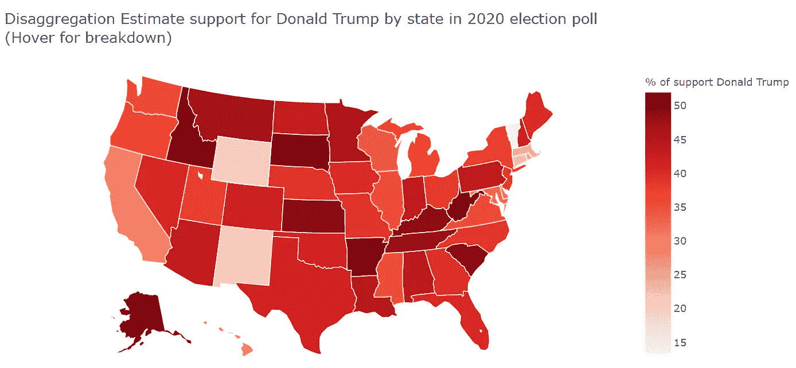

图 5

阿肯色州的支持度最高，佛蒙特州对特朗普的支持度最低。

## 按年龄和性别给特朗普投票

年龄 _ 性别. py

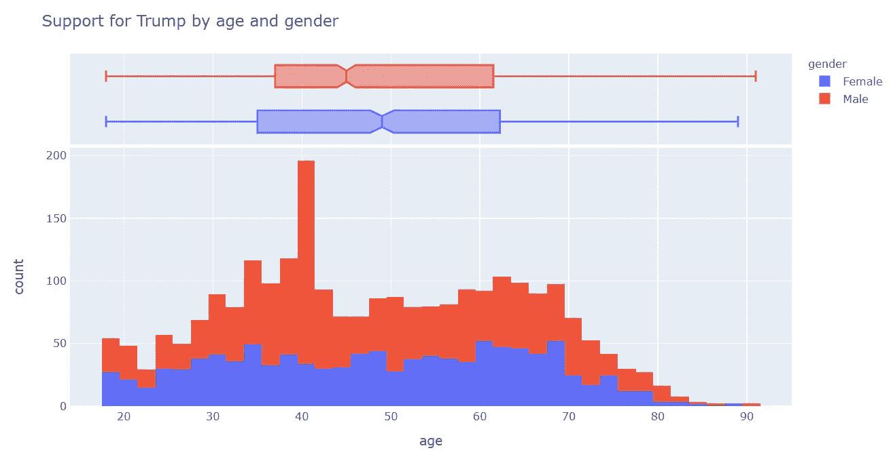

图 6

在这次民意调查中，大约 35-45 岁的男性是特朗普最大的投票群体。

## 简化教育和年龄变量

sim_edu_age.py

我们将通过结合性别(2 类)、种族(4 类)、年龄(4 类)和教育(4 类)的所有可能组合来探索特朗普的选民。

## 按性别给特朗普投票

gender_group.py

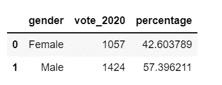

表 2

在表示将投票给特朗普的选民中，大约 43%是女性，57%是男性。

## 按年龄类别投票给特朗普

age_cat.py

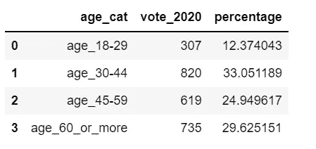

表 3

30-44 岁是最大的投票群体，其次是 60 岁及以上。

## 按年龄和性别给特朗普投票

ageCat_genderCat.py


表 4

## 按种族给川普投票

race.py

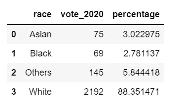

表 5

## 按种族和性别给特朗普投票

race_gender.py


表 6

## 按种族和年龄给特朗普投票

race_age.py

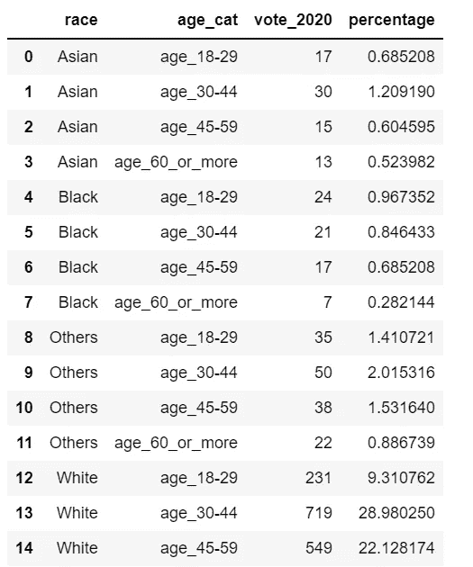

表 7

## 教育投票给川普

edu _ 猫. py


表 8

## 按教育和性别给特朗普投票

edu_gender.py


表 9

## 按教育和种族给特朗普投票

edu_race.py


表 10

## 按教育和年龄给特朗普投票

edu _ 时代. py

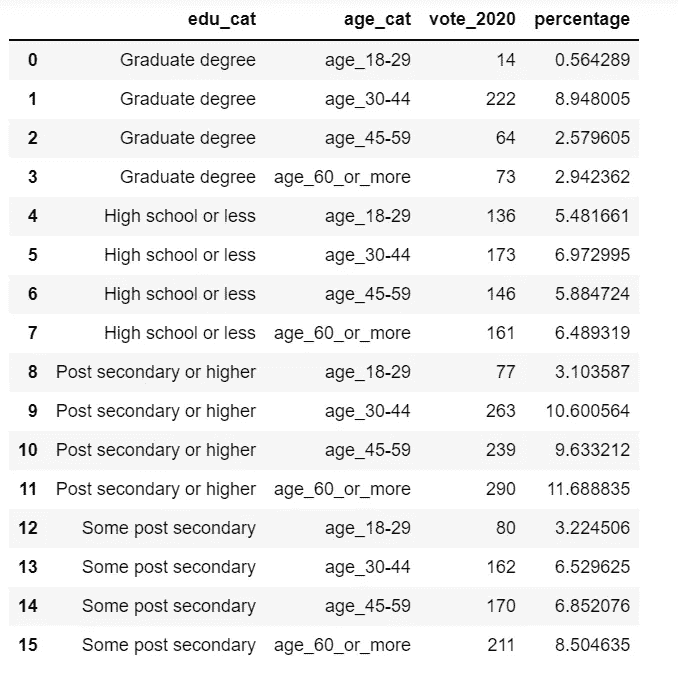

表 11

# 多层模式

我们的多级投票模型将包括州、种族、性别、教育、年龄和投票等因素。为了加速推断，我们计算了这些因素的独特组合的数量，以及每个组合有多少受访者会投票给特朗普。

encode_uniq.py

这种减少将数据集中的行数减少了近 70%。

```
uniq_dt_df.shape[0] / dt_df.shape[0]
```


多级. py

现在我们准备好用 PyMC3 指定模型，从在`theano.shared`中包装预测器开始。

shared.py

我们指定α_state 的多级(分层)模型。

hierarchical_normal.py

我们指定参数如下:

参数. py

最后，我们使用 NUTS 指定模型的可能性和样本。

样本. py

我们可以使用 Gelman Rubin 测试来正式验证链的收敛性。接近 1.0 的值表示收敛。

赫尔曼·鲁宾

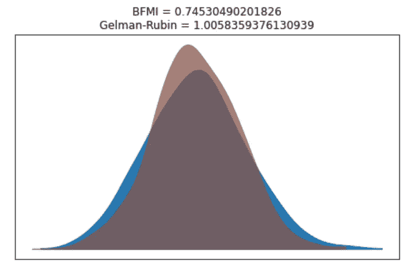

图 6

# 分层后数据

我们将使用 IPUMS 美国人口普查和美国社区调查数据。同样，我无法分享数据集，以下是获取数据集的步骤:

1.  进入 https://ipums.org IPUMS 网站:，然后点击“美国 IPUMS”上的“访问网站”。
2.  点击“获取数据”。
3.  如果你以前没有做过，你需要创建一个帐户，然后等待确认。
4.  一旦您有了一个帐户，请转到“选择样品”并取消选择除 2019 年 ACS 之外的所有产品。
5.  我们需要得到我们感兴趣的变量。在家庭中，我们想要“STATEICP”，而在个人中，我们想要“性别”、“年龄”、“教育程度”和“种族”。
6.  选择所有内容后，“查看购物车”，我们要将数据格式更改为”。dta”。它应该小于 300MB，然后提交请求。
7.  你应该会收到一封邮件，说你的数据可以在几分钟内下载。
8.  我下载了“usa_00002.dta”并保存在我的数据文件夹中。

我们现在可以开始清理数据，包括重新组织年龄类别、教育类别、种族类别，并将州名改为两个字母的州缩写，这与我们之前分析的调查数据一致。

```
census_df = pd.read_stata('data/usa_00002.dta')
census_df.head()
```


表 12

post_stra.py

创建每个子单元的计数和各州的比例后，与之前的州数据合并。现在我们终于有了分层后的数据:


表 13

同样，我们将类别变量编码为数字，并以与之前相同的方式对组合数据进行编码。

ps_encode.py

现在，我们将 PyMC3 模型中的`theano.shared`变量的值设置为后分层数据，并从后验预测分布中取样。

ps_mean.py

我们通过对每个州内的人口统计单元进行加权求和来完成后分层步骤，以从州级投票分布中产生后验预测样本。州级民意测验的最简单概括是后验期望均值。

下图显示了 MRP 对各州特朗普支持率的估计。

mrp_trump.py

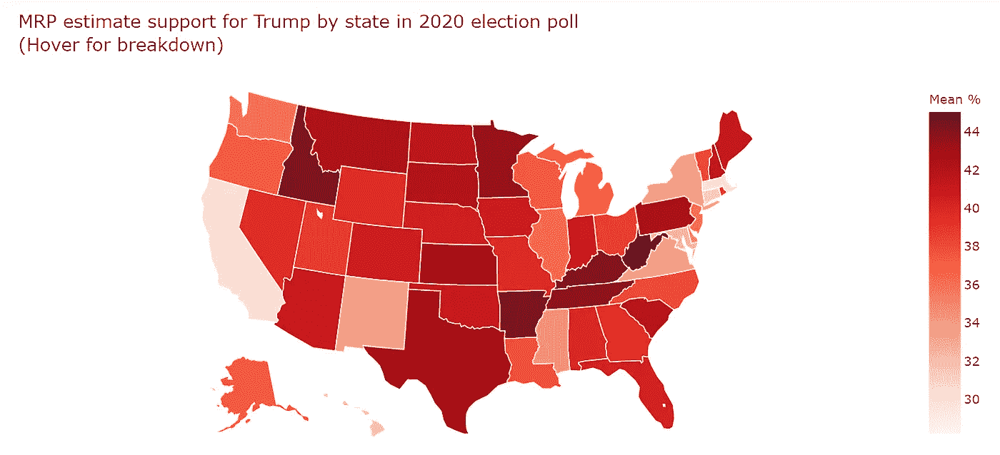

图 7

我们可以看一下我们的估计值，比较每个状态的估计值在分解和 MRP 之间的差异。

mrp_disa.py

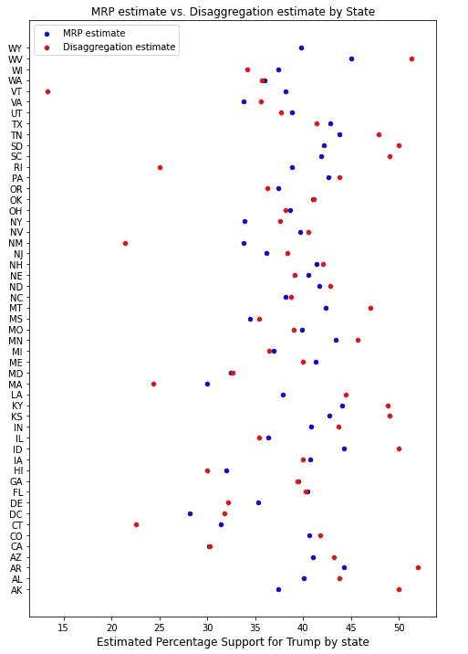

图 8

# 特朗普是如何得到黑人支持的？

我们试着用两个估计来回答这个问题。

首先，我们绘制了黑人男性对特朗普支持率的分解估计。我们意识到，在许多州，民意测验专家很少或根本没有调查黑人。因此，这些州的黑人男性对特朗普的支持度不能用分解法来衡量。

黑人 _ 男人 _disa.py

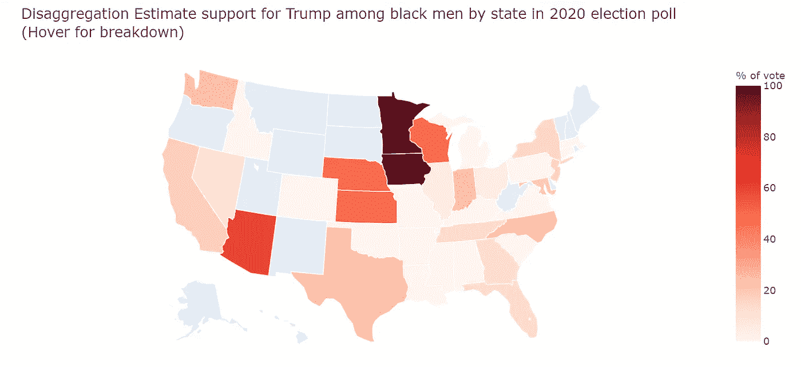

图 9

在使用 MRP 时，我们能够估计所有州的黑人男性对特朗普的支持度。

黑人 _ 男人 _mrp.py

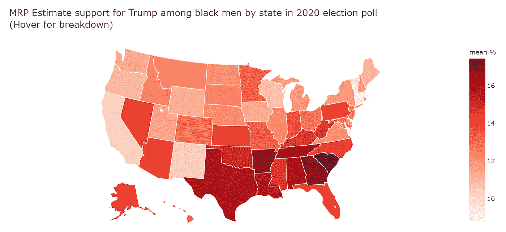

图 10

Jupyter 笔记本可以在 [Github](https://github.com/susanli2016/Machine-Learning-with-Python/blob/master/Multilevel%20regression%20with%20post-stratification_election2020.ipynb) 上找到。祝你周末愉快。

参考资料:

[https://scholar . Princeton . edu/sites/default/files/jkstellec/files/MRP _ primer . pdf](https://scholar.princeton.edu/sites/default/files/jkastellec/files/mrp_primer.pdf)

 [## MRPyMC3 -多水平回归和 PyMC3 后分层

### 几周前，YouGov 正确地预测了 2017 年英国大选的结果是一个无多数议会

austinrochford.com](https://austinrochford.com/posts/2017-07-09-mrpymc3.html) 

[https://www . tellingstorieswithdata . com/MRP . html # ref-Wang 2015 预测](https://www.tellingstorieswithdata.com/mrp.html#ref-wang2015forecasting)