# 用 SEIR 模型预测新冠肺炎趋势

> 原文：<https://towardsdatascience.com/forecasting-the-covid-19-trend-using-the-seir-model-90979abb9e64?source=collection_archive---------13----------------------->

## 编写一个 Java 程序来分析新冠肺炎数据并预测趋势。

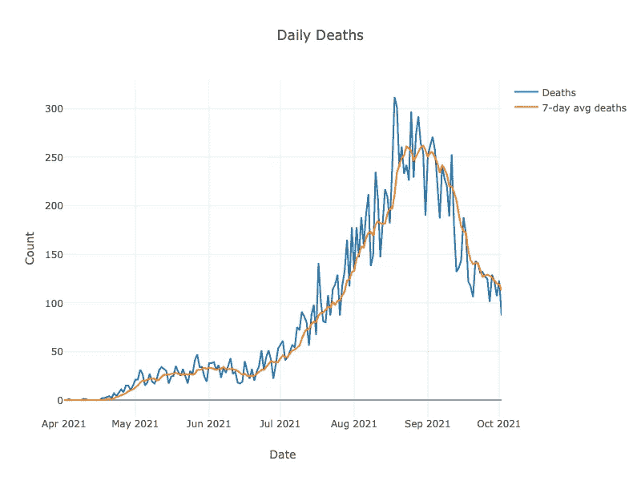

图片作者。泰国 2021 年 4 月 1 日至 2021 年 10 月 2 日每日新冠肺炎死亡人数和 7 天平均值图

泰国在 2020 年非常好地应对了新冠肺炎。与其他国家相比，病例和死亡人数相对较低。自 2021 年 4 月左右开始的最新一波疫情以来，情况已经发生了变化。死亡人数迅速上升。虽然，最近几个月，这个数字有所下降。

我们将讨论:

*   SEIR 模式
*   用代码模拟 SEIR
*   检索公共 COVID 数据
*   搜索模型参数
*   利用模型进行预测
*   可视化结果
*   将繁殖率的变化可视化

# SEIR 模式

SEIR 模型是描述包括新冠肺炎在内的各种疾病的流行模型。一些文章已经讨论了 SEIR 模式。比如这里的和这里的。我们将简单介绍一下，以便快速进入主题。

该模型将人群分为以下几组:

*   易感者。这组人还没有被感染。
*   暴露(E)。该组中的个体被感染但还没有传染性
*   传染性(一)。这个群体会传染给其他人。
*   已恢复。组里的人都康复了。

五个微分方程描述了这些群体中的人数如何随时间变化。我们只考虑简化版本而不是严格版本，因为我们忽略了出生率和其他原因的死亡率。

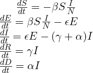

图片作者。由[代码生成](https://latex.codecogs.com/legacy/eqneditor/editor.php)。这些是 SEIR 微分方程。

SEIR 模型参数是:

*   Alpha(𝛼)是由疾病引起的平均死亡率。
*   Beta(𝜷)是每次接触传播疾病的概率乘以单位时间内的接触次数。
*   Epsilon(𝜺)是从接触到传染性疾病的进展速度。它是潜伏期的倒数。
*   Gamma(𝜸)是回收率。这是传染期的倒数。

要使用模型进行预测，我们需要在开始时知道上述参数以及以下值:

*   暴露计数
*   传染性计数
*   恢复计数
*   死亡人数

我们还需要知道初始易感人数。然而，我们可以从总体和上面的初始值中计算出来。易感人数等于总人数减去暴露人数、感染人数、康复人数和死亡人数。这里我们将 SEIR 微分方程转化为差分方程。

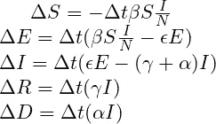

图片作者。由 [CODECOGS](https://latex.codecogs.com/legacy/eqneditor/editor.php) 生成。这些是 SEIR 差分方程。

这样更容易用代码实现。

有两个指标与新冠肺炎相关。繁殖率(R0)是由感染个体产生的继发性病例的平均数。如果我们忽略自然出生率和其他原因造成的死亡，下面的等式描述了繁殖率:

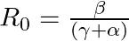

图片作者。由[代码生成](https://latex.codecogs.com/legacy/eqneditor/editor.php)。这是繁殖率方程式。

如果 R0 小于 1，则疾病停止。如果 R0 大于 1，疾病继续传播。
另一个是感染和病死率(IFR)。以下等式描述了 IFR:

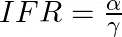

图片作者。由 [CODECOGS](https://latex.codecogs.com/legacy/eqneditor/editor.php) 生成。这是感染率和病死率的等式。

# 用代码对 SEIR 建模

首先，我们在一个类中模拟 SEIR 参数。然后，我们用另一种方法表示微分方程。

## 模型参数类

这里我们封装了 SEIR 参数和初始条件。成员变量是α、β、ε、γ、初始暴露、传染性、恢复和死亡计数。

我们将人口存储在这个类中，因为我们用它来计算易感性。人口值是不变的。因此，在代码中，它是静态的，我们只能设置它一次。

## SEIR 模特班

SEIR 模型类有一个将模型参数作为参数的构造函数。

run 方法接受一个参数，即我们希望模型预测的天数。run 方法通过计算来预测未来所有组中的个体数量。run 方法有一个嵌套循环。外环处理一天。我们把每天分成小的时间间隔，在我们的例子中是 10 个时间间隔。内部 for 循环将计算每组中个体数量的增量。我们使用 SEIR 差分方程来进行计算。我们将结果放入 SEIRResult 对象中。

# 检索公共 COVID 数据

我们的 COVID 数据来自这个[站点](https://github.com/djay/covidthailand)。感谢迪伦杰伊和其他贡献者。

我们使用 Tablesaw 库来处理表和列数据。该库可以处理统计分析以及一些数据可视化。有关 Tablesaw 的更多详情，请点击查看[。](https://jtablesaw.github.io/tablesaw/userguide/toc)

## 人口

泰国人口数据来自 excel 文件[这里](http://statbbi.nso.go.th/staticreport/Page/sector/EN/report/sector_01_11101_EN_.xlsx)。尽管文件提供了更多的信息，我们只需要这个国家的总人口。下面是代码。

代码很简单。我们从 excel 文件创建一个表格。然后，我们获取 Total 列的第一行。就是人口值。最后，我们将其设置为模型参数对象。

## 案例简报

每日新信息可在 CSV 格式[这里](https://raw.githubusercontent.com/wiki/djay/covidthailand/cases_briefings.csv)获得。以下是样本内容。

案例简报 CSV 文件的样本内容

虽然我们只对这些列感兴趣，但是有很多数据:

*   案例
*   死亡
*   恢复

以下是代码:

*   首先，我们通过读取在线 CSV 文件来创建一个表。
*   这个表格有很多栏。我们删除了除日期、病例、恢复和死亡之外的所有列。
*   我们计算死亡列的 7 天滚动平均值，并将其存储在一个新列中。我们不会在 SEIR 模型中使用新列。只是想象。
*   接下来，我们过滤表格。仅获取特定日期当天或之后的数据。该日期是该国最新一波 COVID 浪潮的开始。
*   我们从“病例”列减去“已恢复”列，创建一个新的“传染性”列。
*   每天都有感染、康复和死亡病例。对于每一个，我们创建一个累积值列。
*   最后，我们绘制图表。

这是三张图表:

*   死亡人数和 7 天平均死亡人数。这张图是本文的第一张图片。
*   累积病例、感染和恢复计数
*   每日病例、传染性和恢复计数

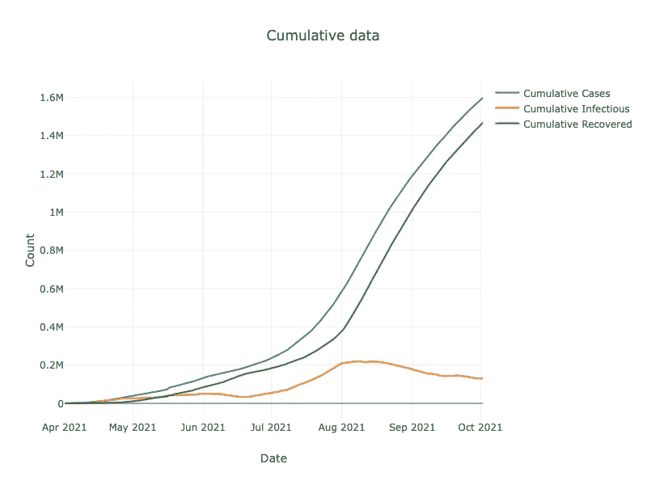

图片作者。泰国 2021 年 4 月 1 日至 2021 年 10 月 2 日累计病例数、感染数和痊愈数图表

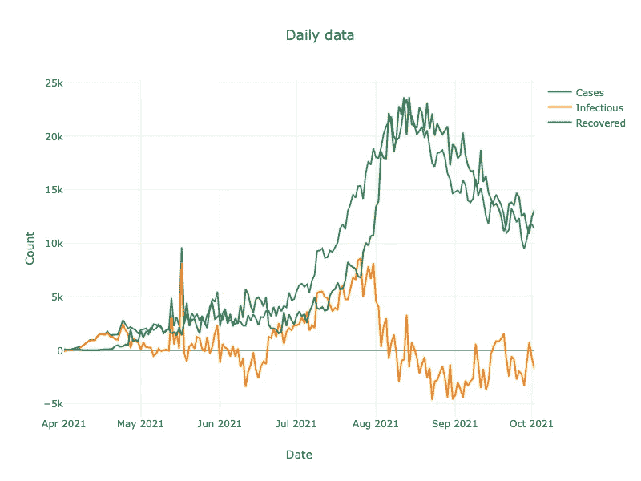

图片作者。泰国 2021 年 4 月 1 日至 2021 年 10 月 2 日每日病例数、感染数和痊愈数图表

# 搜索模型参数

为了使用 SEIR 模型进行预测，我们需要 SEIR 参数和初始条件。以下是我们将要做的事情:

*   识别未知的独立模型参数和初始条件。
*   确定每个未知参数的可能值。
*   实施通用网格搜索
*   实施 SEIR 参数网格搜索

## 识别未知独立参数

这些是:

*   希腊字母的第一个字母
*   贝塔
*   埃普西隆
*   微克
*   初始暴露计数。不得而知。
*   初始感染计数。虽然有官方的数值，但可能太低了，因为权威机构可能没有足够的 COVID 测试。我们将视其为未知。
*   初始恢复计数。出于与上述相同的原因，来自数据的值可能太低。我们将视其为未知。

最初的死亡人数可以从我们得到的数据中得到。应该够靠谱了。

总之，我们有七个未知的独立参数要寻找。

## 识别每个未知参数的可能值

对于每个模型参数，我们确定或列出可能的值。

*   Alpha 的范围从 0.000005 到 0.0001。
*   贝塔系数的范围从 0.05 到 1.0。
*   ε是潜伏期的倒数。平均潜伏期为 5.2 天。我们把它做成一个从 1/5.6 到 1/4.8 的值列表。
*   γ是传染期的倒数。据信，这一时期是一个星期或更少。我们把它做成一个从 1/9 到 1/4 的值列表。
*   初始暴露计数。我们没有确切的数字。我们猜测它将从 2 倍官方感染开始到 20 倍官方感染计数。
*   初始感染计数。我们估计它会从官方最初的传染数上升到 10 倍的数值。
*   初始恢复计数。我们有官方的数字。然而，正确的数字可能更高。我们猜测它将从官方恢复的计数开始到官方恢复的计数的 10 倍。

## GridSearch 类

GridSearch 类将 run 方法作为唯一的方法。请注意，它是一个泛型类，以便将来可以重用。在我们的例子中，类型参数是 ModelParameter 类。

方法参数包括:

*   参数网格。
*   ModelParameter 对象的约束。
*   一个我们需要最小化的目标函数。我们通常在模型输出和实际数据之间提供一个误差函数。
*   我们希望函数返回的结果集大小。

该方法将使用网格中所有可能的值来评估目标函数。然后，返回一组排序后的 ModelParameter 对象，这些对象具有目标函数值最低的值。

为此，我们使用生产者-消费者设计模式。我们有一个生产者来创建许多参数，并把它们放在一个绑定的队列中。我们有多个消费者来获取队列的参数并计算目标函数值。

下面是代码的一些解释

*   首先，该方法计算要创建的消费者任务的数量。它是可用处理器的数量减 2。
*   接下来，它构造一个阻塞队列。Deque 是一个队列，一个元素可以从前面或后面添加或删除。德克族是被束缚的。这意味着我们可以加入一定量的元素。如果达到限制，生产者任务将被阻止。
*   该方法创建并提交生产者任务。
*   生成器任务测试网格中每个 ModelParameter 对象的约束，然后将其放入队列。
*   对于每个消费者来说，生产者任务就像一颗毒丸。消费者会知道何时停止。
*   run 方法创建并提交消费者任务。
*   每个消费者任务创建一个绑定树集。我们根据目标函数值对树集进行排序。此外，它只保留最低指定数量的元素。树集源代码这里是[这里是](https://gist.github.com/mananai/cd639294eabae6a5f009b2e64b9b1bb2)。
*   每个消费者从队列中获取一个 ModelParameter 对象。如果不是毒丸，则评估目标函数，并将一对 ModelParameter 和函数值添加到集合中。当消费者任务发现毒丸时，它会停止。
*   一旦所有的使用者都完成了，run 方法就组合所有使用者的结果，并将其返回给被调用者。

## SEIRParameterGridSearch 类

这个类使用案例简报中的数据表来搜索模型参数。

*   它使用表中的第一行作为初始条件的开始猜测。
*   接下来，我们创建一个参数网格。它计算所有参数的笛卡尔乘积。对于每个组合，它都会构建一个模型参数对象，然后调用一个使用者。
*   然后，我们定义一个目标函数，它是我们希望最小化的模型参数的函数。我们使用误差函数来比较模型输出和观察值。我们用来比较的数值是每日死亡数，因为它比传染数或恢复数更可靠。
*   最后，我们称之为网格搜索。

## 网格搜索和结果

上面的代码执行参数搜索。稍后，我们将结果转换成表格。然后，将表格保存为 CSV 文件，如下所示。

*   我们使用 61 天的数据:从 8 月 3 日开始。2021 年至 2021 年 10 月 2 日。
*   最低的 RMSE 值是 29.9。考虑到数据是有噪声的，我们认为这个值是有意义的。
*   繁殖率为 1.6。
*   IFR 为 0.032%。好像太低了。但是根据这个[站点](https://www.statista.com/statistics/1105914/coronavirus-death-rates-worldwide/)，死亡率最低在 0.07%左右。

## 想象结果

让我们看看这个模型是如何在图表中拟合观察到的数据的。下面是代码。

*   第一张图是来自实际数据和我们的模型的每日死亡人数。我们可以看到模型与数据非常吻合。此外，所有模型结果都非常接近。
*   第二张图与此类似，只是我们展望了未来 60 天。我们可以看到预测的死亡人数逐渐减少。然而，还不完全是零。
*   第三张图绘制了来自观察数据和 SEIR 模型的感染计数。在这里，我们看到模型值远远高于官方的感染计数。

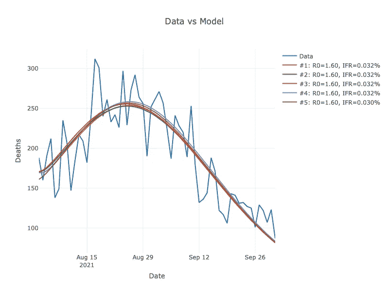

图片作者。泰国 2021 年 4 月 1 日至 2021 年 10 月 2 日每日观察死亡数和模型结果图

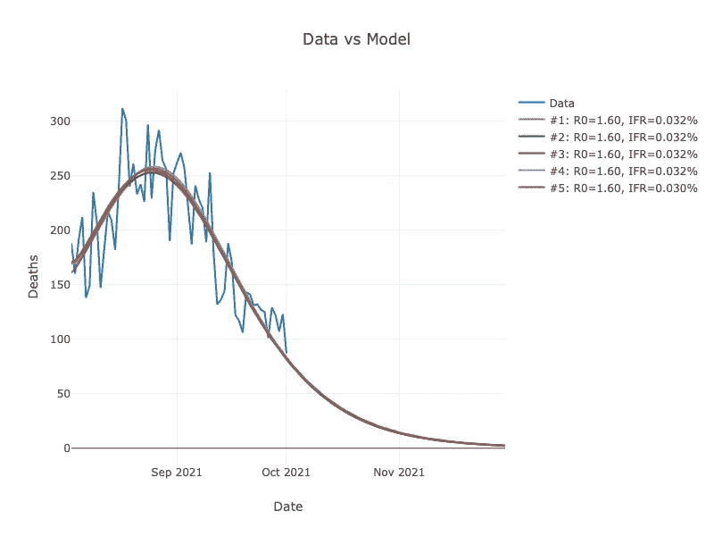

图片作者。泰国 2021 年 4 月 1 日至 2021 年 10 月 2 日观察到的每日死亡数和模型结果的图表。此外，我们预测未来 60 天

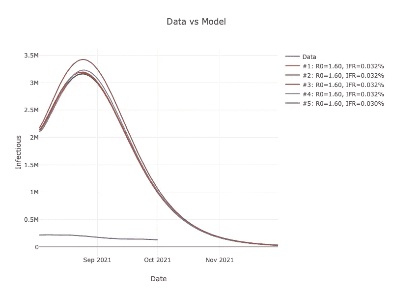

图片作者。泰国 2021 年 4 月 1 日至 2021 年 10 月 2 日观察到的感染数和模型结果的图表。此外，我们预测未来 60 天

我们可以看到形势似乎对国家更有利。

## 将复制率的变化可视化

让我们看看繁殖率是如何逐月变化的。我们将这样做:

*   按月划分案例数据。
*   使用月度数据运行参数网格搜索。
*   计算每月的复制率并绘制数据。

以下是代码:

图表如下。

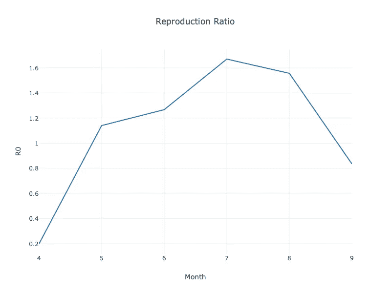

图片作者。2021 年 4 月至 2021 年 9 月的繁殖率变化

*   4 月份，繁殖率小于 1。
*   然后，R0 一直增加到 7 月。
*   8 月份，R0 略有下降，但仍大于 1。
*   9 月份 R0 下降很多。现在这个值又小于 1 了。

有了这种出生率的变化，我们更加相信疫情的情况正在好转。

# 结论

我们使用 SEIR 模型和公共在线每日数据来分析和预测新冠肺炎趋势。结果看起来很有希望。模型输出与观测数据非常吻合。

我们可以做一些事情来改进这个模型:

*   我们可以包括自然出生率和其他原因的死亡率。
*   我们本可以在方程式中加入移民工人的数量。

所有的源代码文件都可以在 GitHub [这里](https://github.com/mananai/repository/tree/master/ForecastCovidTrend)获得。

**引用:**迪伦杰伦。泰国新冠肺炎数据。从 https://github.com/djay/covidthailand[取回](https://github.com/djay/covidthailand)。它是在[知识共享署名 4.0 国际许可](http://creativecommons.org/licenses/by/4.0/)下授权的