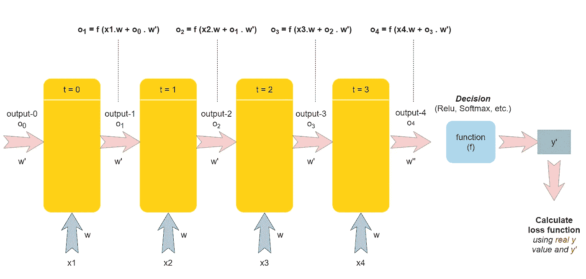
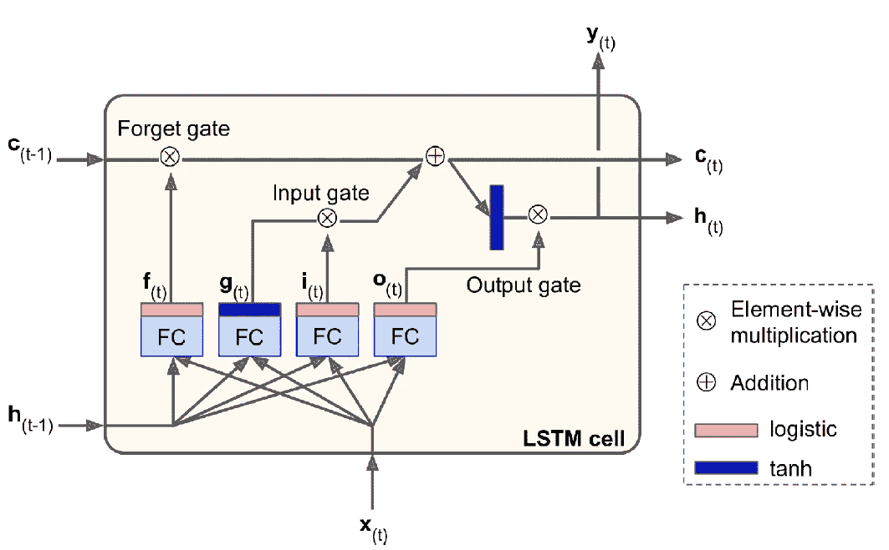
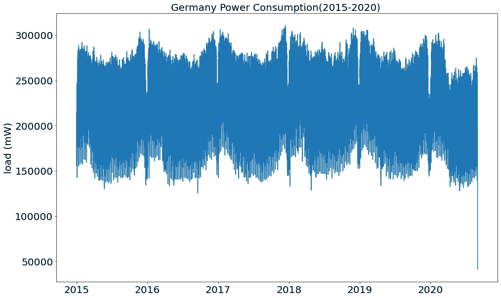
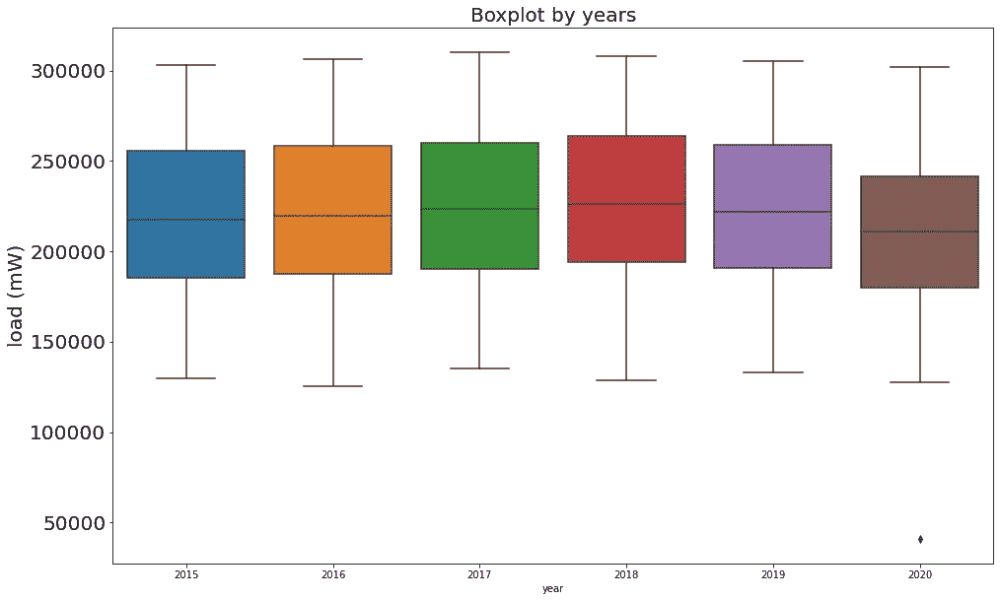
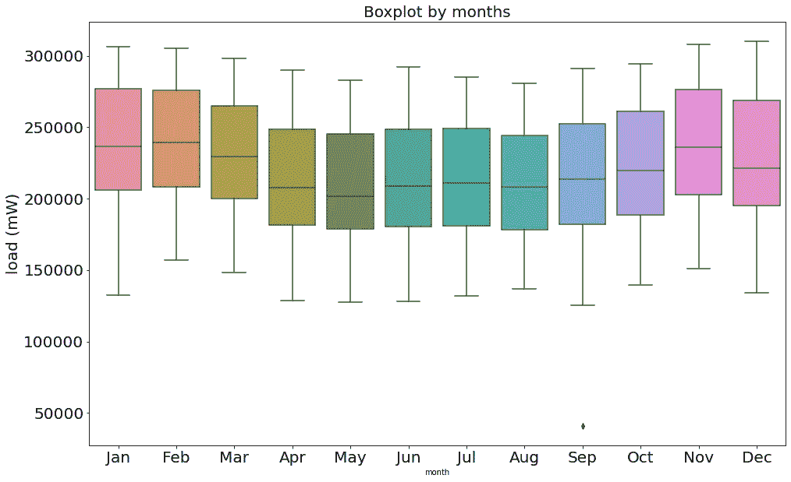
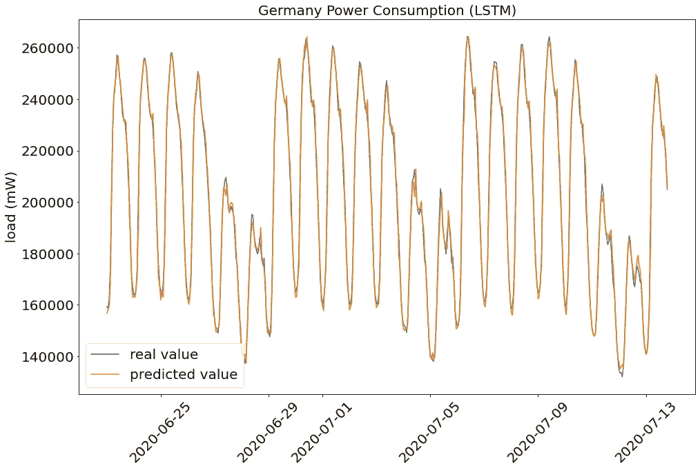
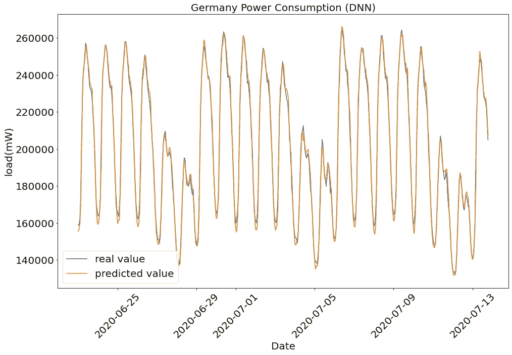

# 利用 LSTM(RNN)和 DNN 预测德国未来的电力消费

> 原文：<https://towardsdatascience.com/forecasting-the-future-power-consumption-of-germany-using-lstm-rnn-and-dnn-d8e05e7fdc0a?source=collection_archive---------2----------------------->

## 利用 LSTM(RNN)和 DNN 对过去 5 年的电力消耗进行探索性数据分析，并预测未来的电力消耗

人类生活在时间轴上，并据此设计自己的日常生活。他们通常在晚上睡觉，其他活动通常在特定的时间进行(例如早餐——在早上)。当我们考虑语言时，众所周知，所说或所写的保持并遵循某种意义的完整性。当我们谈论机器学习时，这种序列数据集中的模型训练是通过使用统计方法(如 ARIMA、SARIMAX)以及使用神经网络来进行的。基本思想是时间 t 的数据是几个先前数据点的结果。本文解释了 RNN-LSTM 的理论部分，并包括一个关于时间序列数据集的快速探索性数据分析和使用 LSTM 和 DNN 预测德国未来功耗的教程。

```
***Table of Contents* 1\. Theory
1.1\. Recurrent Neural Networks
1.1.1\. Under the Hood
1.1.2\. Vanishing Gradient Descent
1.2\. Long-Short Term Memory
2\. Tutorial
3\. Conclusion
4\. References**
```


丹尼·米勒在 [Unsplash](https://unsplash.com?utm_source=medium&utm_medium=referral) 上的照片

# 递归神经网络

在按顺序流动的数据集中，时间 t 的每个数据都与历史数据相关。比如我们考虑 NLP，一个段落的延续是按照它前面的关键词来塑造的，也就是按照意思的完整性来塑造的。阅读小说时，平均每秒钟可以看到 3-4 个单词，并且可以流畅地继续阅读。虽然在 1 个小时的阅读结束时，已经看到并阅读了几千个单词，但很难背下来。然而，阅读的部分可以很容易理解和解释。在机器学习中，递归神经网络可以用来从这样的序列数据集中提取基本含义和模式。让我们继续不同的例子；电影由画面组成，根据电影的主题和内容，这些画面具有一定的完整性。我们在理解了电影之后，可以很容易地预测电影中的下一个瞬间或者下一帧。递归神经网络可用于通过检测序列数据中的流动模式来预测未来。在另一个例子中，它提供时间序列，即在随时间变化的图形*(股票市场，冠状病毒随时间的传播)*中，来检测流量并进行预测。那么，如何用数字从数学上解释是什么提供了这些可能性呢？

## 在后台

下图显示了递归神经网络过程如何在 4 秒钟内处理 4 个数据的顺序数据集中工作。其基本工作原理类似于前馈神经网络。整个系统可以简要概括如下:

分配给输入的权重值在图层后变成输出，并与实际输出进行比较，以确定损失值，即与应有位置的距离。根据该损失值，更新权重值，并重复相同的过程。更新权重的目的是最小化损失值并确定最佳权重值。

另一方面，RNN 是顺序设计的，即，在反向连接中检测时间`t`与`(t-1)`的数据连接。当然，除了仅仅`t`和`(t-1)`，也许它在时间 t 的值是根据最后 10 个值计算的，这要归功于它的后向连接结构。现在让我们详细研究一下图 1。



图一。递归神经网络，作者图片

让我们考虑 4 个数据点(x1、x2、x3 和 x4)。黄色结构代表层。每个输出的等式如上所述。正如所看到的，每一层的输出被顺序地呈现为下一层的附加输入。最终输出结果基于选定的激活函数。然后，计算所得结果的偏差，根据损失输出导出权重，并通过反向传播过程进行更新。RNN 的结构基本上遵循这种模式。如果我们看看这个 RNN 结构的缺点，消失梯度的问题就迎刃而解了。

## 消失梯度下降

当很难收敛到全局极小点时，这种情况称为消失梯度下降。

在 RNN，当有太多层并且权重用 **Sigmoid 函数**更新时，这个过程发生。用 **Sigmoid 函数**获得的值应该在 0 和 1 之间。然而，在反向传播过程中，第一输入*(NLP 的前几个字，时间序列的前几次)*在连续序列的学习中对系统的影响被最小化，因为权重更新处于如此低的水平，以至于当到达第一层时。这会导致这些输入及其权重被忽略，从而将顺序学习集中在最后的输入上。

如果用另一个激活函数代替 Sigmoid 函数，比如 **ReLu** ，由于 **ReLu** 的结构，会出现与消失梯度下降相反的情况，即权重变化太大以至于无法安全到达全局极小点。

# 长短期记忆

LSTM 设计用于防止在更新权重期间忽略顺序序列中第一个输入的影响。图 2 显示了 LSTM 模型如何避免在权重调整中不考虑不重要的先前数据(先前数据的权重)的问题。



图二。长短期记忆(LSTM)，[来源](http://A. Géron, Hands-on Machine Learning with Scikit-Learn, Keras, and TensorFlow (2019, O’reilly). O’Reilly Media, 2017.)

**逻辑(Sigmoid)激活功能**输出 0-1 之间的数据。这样，数据的显著性水平被评估为 0-1。0 变得不重要，并在乘法运算中反映为 0。1 表示它很重要。

**双曲正切激活函数**通过输出(-1)和(+1)之间的值来承担调节任务。

## 步伐

1.  先前单元输出`(h(t-1))`和当前输入`(x(t))`通过**逻辑(sigmoid)函数**传递。长期状态`(c(t-1))`乘以结果值`(f(t))`。在这个阶段(忘记门)，从长期状态中数学推断出哪些数据是重要的，重要到什么程度。
2.  在第一步中获得的 sigmoid 值也在这里用相同的输入(先前单元输出`(h(t-1))`和当前输入`(x(t))`)获得`(i(t))`。此外，这些输入也通过**tanh**激活功能并与 sigmoid 输出`(g(t))`相乘。在这个阶段，(输入门)`i(t)`从数学上表达了 g(t)值有多重要。
3.  将前两种情况下获得的数学表达式(遗忘门和输入门)相加，形成新的单元状态`(c(t))`。此外，该结果通过传递 **tanh** 并乘以前两个阶段的两个输入(前一个单元输出`(h(t-1))`和当前输入`(x(t))`)的**逻辑(sigmoid)函数**结果`(o(t))`而被规则化。返回短期状态`(h(t))`。在这个阶段(输出门)，长期状态的重要性转移到系统。

> LSTM 及其配置版本适用于许多基于时间的数据集，尤其是股票市场价格预测。

# 辅导的

在本教程中，使用 2015 年 1 月 1 日至 2020 年 9 月 1 日之间德国数据集的每小时能耗，对 LSTM 和 DNN 的模型进行了训练。数据集可以从[链接](https://www.kaggle.com/francoisraucent/western-europe-power-consumption)下载。

数据集的许可:CC0:公共域

## [1]

首先，导入必要的库，由于时间 t 的数据与之前的数据相关，因此从 2015 年 1 月 1 日到 2019 年 5 月 31 日保留为训练集，2019 年 5 月 31 日–2020 年 9 月 1 日保留为测试集。数据集由每 15 分钟的功耗值组成。通过将 4 个值(0-15 分钟、15 分钟-30 分钟、30 分钟-45 分钟、45 分钟-60 分钟)相加，数据集被转换为基于小时的值。然后如图 3 所示。



图 3。德国 2005 年 1 月 1 日至 2020 年 9 月 1 日的电力消耗，图片由作者提供

## [2]

添加年份和月份列后，根据年份和月份的盒状图分别如图 4 和图 5 所示。



图 4。按年份排列的方框图，按作者排列的图像



图 5。按月份排列的方框图，按作者排列的图像

## [3]

在本节中，使用以下策略根据神经网络模型对数据集进行重新调整和重新设计:

将 24 个数据(1 天= 24 小时)按顺序用`last_n = 24`设计为输入，25。数据被输出。例如，在索引的基础上，输入 0–24，而输入 24。数据输出；25.输入 1–25 时的数据输出；26.输入 2–26 时的数据输出，等等。

当设计 LSTM 模型时，`return sequence=True`被设置直到最后一个 LSTM 层，并且模型被训练。在训练结束时，模型分别预测更新的权重以及训练和测试数据集。

图 6 显示了在创建输入-输出时，通过重新排列由所选数字引起的移位，测试数据集的随机部分的可视化结果。



图 6。LSTM 预测与真实值的比较，作者图片

## [4]

在这一部分中，使用密集层来构建模型，以使用深度神经网络来训练模型。在数据集中使用相同的缩放器方法，并在制作适合模型的形状后对其进行训练。LSTM 使用的流程经过配置，适合 DNN 模型，测试数据集随机部分的预测如图 7 所示。



图 7。DNN 预测与真实值的比较，作者图片

# 结论

顾名思义，长短期记忆(LSTM)是基于通过更新权重来训练模型，同时考虑到长期历史数据的重要性。使用上述密集层创建的 DNN 模型是在神经网络的基础上根据输入和输出之间的激活函数来更新权重。当我们粗略对比上面的结果(图 6 和图 7)时，可以说两种结果都接近现实。然而，当仔细观察时，可以看出 LSTM 在较低和较高的峰值处，尤其是在较低的峰值点处绘制了更成功的图形。尽管 DNN 结果中几乎所有较低的峰值都低于它们应有的水平，但 LSTM 绘制了一个更成功、更恰当的图表，尽管存在小幅的上下偏差。

由于 LSTM 的设计考虑了先前数据的重要性，因此它可以更有效地执行学习过程。因此，当模型被训练时，DNN 可以使错误模式成为学习过程的一部分，而 LSTM 在这一点上更灵活地呈现模型。由于这个数据集结构大致遵循一定的顺序(见图 3)，只有仔细研究才能看出这两个模型之间的区别。然而，对于具有较高随机性(难以检测模式)的数据集和时变数据集，可以更清楚地看到 LSTM 的差异。

# 参考

[http://colah.github.io/posts/2015-08-Understanding-LSTMs/](http://colah.github.io/posts/2015-08-Understanding-LSTMs/)

[](https://ibrahimkovan.medium.com/machine-learning-guideline-959da5c6f73d) [## 机器学习指南

### 所有与机器学习相关的文章

ibrahimkovan.medium.com](https://ibrahimkovan.medium.com/machine-learning-guideline-959da5c6f73d)