# 预测滑雪板的销售

> 原文：<https://towardsdatascience.com/forecasting-the-sale-of-snowboards-3a18a3689818?source=collection_archive---------27----------------------->

## 从零开始的时间序列练习


作者拍摄的照片

如果你了解基本知识，时间序列预测可以是一个简单的练习，就像滑雪一样。有很多时间序列预测的例子，但是，如果我对这个例子感兴趣，我会学到更多。所以，我决定创造一个我自己的例子，关于我最喜欢的运动之一——单板滑雪！

这篇文章的结构如下:

1.  查看您可以拥有的不同类型的数据。

2.了解时间序列数据的特征。

3.探索可应用于数据和不可应用于数据的模型类型。

4.滑雪板使用案例——请随意使用您自己的数据集。

# 正确掌握基础知识

你在处理什么样的数据？

## 横截面数据

没有时间维度的数据—这可能是某个时间点的许多特征和度量，例如，年龄、性别、平均收入、学校教育……都在某个时间点。

## 时序数据

具有时间维度的数据—一段时间内的观察结果，例如过去 5 年的平均家庭收入(HHI)。如果你想预测下一年的 HHI，这将被称为单变量时间序列预测，因为你预测的是单个变量。

**我们将关注用例中的单变量时间序列预测。*

## 汇集的数据

这是横截面和时间序列数据的组合，例如，观察一段时间内的销售情况，以及客户满意度和实际可支配收入(RDI)。如果您想预测下一年的销售额，以及外部因素(例如，客户满意度和 RDI)，那么这被称为多元时间序列预测，因为您是在预测一段时间内的多个变量。

时间序列预测可以简单地通过观察历史模式来完成，或者可以使用机器学习模型(例如，神经网络或随机森林回归等)。).然而，历史模式并不总是未来行为的良好指标，机器学习模型有时会使分析过于复杂，人们需要考虑如何向利益相关者解释这些模型。

# 了解时间序列数据的特征

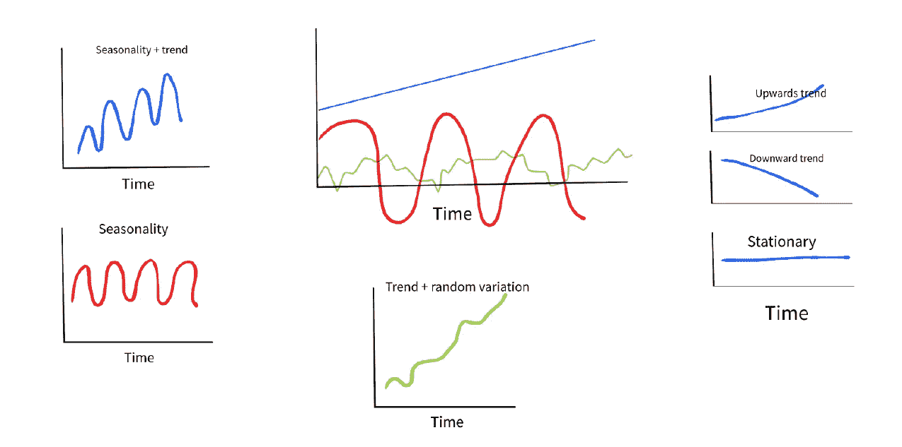

来源:作者

## 趋势:

这是你长期观察的大致方向。它是向上的、向下的还是水平的(通常称为静止的)？

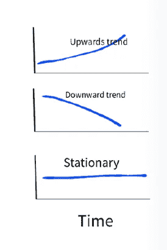

来源:作者

## 季节性:

如果有一个模式以相等的时间间隔重复，则您的数据包含季节性:

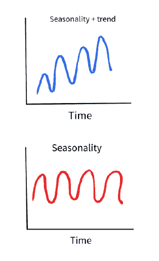

来源:作者

## 不规则变化:

除了季节性和趋势性之外，您的数据中还可能存在峰值，例如假期峰值或趋势的任何变化:

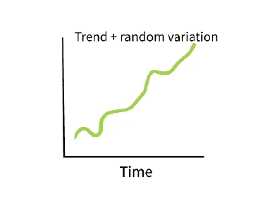

来源:作者

# 使用哪种预测模型？

以下指南根据您的数据特征推荐使用的模型([若宫，C (2020)](https://datax.berkeley.edu/wp-content/uploads/2020/06/Intro-to-Time-Series.pdf) ):

## 无季节性+疲软趋势:

●简单的指数平滑

● ARIMA

## 季节性和趋势:

你会得到加法和乘法季节性:

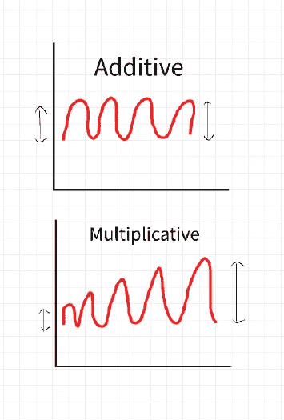

来源:作者

根据 [Pegels，C.C (1969)](http://Pegels, C.C. (1969) Exponential Forecasting: Some New Variations. Management Science, 15, 311-315\. http://dx.doi.org/10.1287/mnsc.15.5.311) 所做的工作，在预测时有许多时间序列模式:

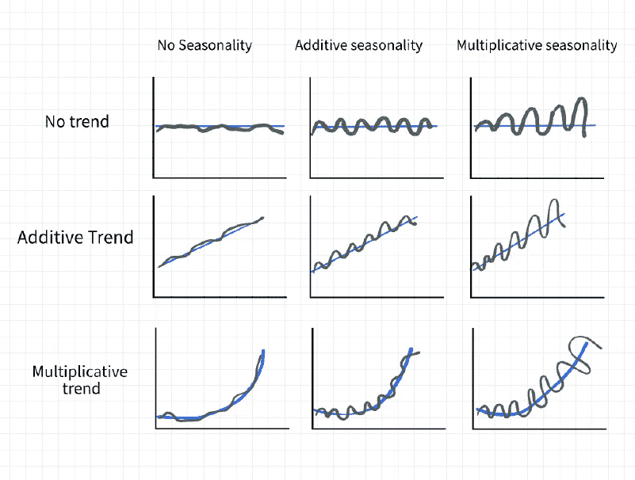

来源:作者

●三重指数平滑法(Holt Winters) —您可以定义加法和乘法的季节性类型。

●SARIMA——是 ARIMA 款的季节性延伸。

## 复杂模型:

这将在最后讨论。

# 用例

在本例中，我们将:

*   了解您拥有的数据类型。
*   了解哪些预测模型最适合您的数据，以及为什么其他模型不适合。
*   知道如何评价自己选择的模式。
*   如何让你的模式更进一步？

# 数据

根据 [360 研究报告](https://www.theexpresswire.com/pressrelease/Snowboard-Equipment-Market-Size-is-set-to-anticipated-Worth-50348-Million-USD-Globally-grow-with-a-CAGR-of-671-Top-Countries-Data-Analysis-by-Trends-Growth-and-Forecast-2021-2027_13332603)最近的一份报告:

> “2020 年，全球滑雪板设备市场价值为 5.0348 亿美元，并将从 2020 年到 2027 年以 6.71%的 CAGR 增长。”——360 研究报告(2021 年)

我创建了一个虚拟的数据集，你可以在这里下载。它显示了从 2009 年 1 月到 2020 年 12 月售出的滑雪板数量。

```
#Import packagesimport pandas as pd
import statsmodels.api as sm
import matplotlib.pyplot as plt
from statsmodels.tsa.seasonal import seasonal_decompose
from statsmodels.graphics.tsaplots import plot_acf, plot_pacf
plt.rcParams.update({'figure.figsize':(20,18), 'figure.dpi':500})
from numpy import log
import warnings
import itertools
import numpy as np
plt.style.use('fivethirtyeight')#Load dataset
data = pd.read_excel('Snowboard_Data.xlsx',
                       index_col ='Date',
                       parse_dates = True)# Print the 1st 5 rows of the dataset
data.head()
```

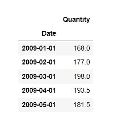

来源:作者

```
#We need to ensure the date is a date type and is indexed
data.info()
```

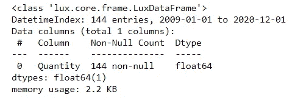

来源:作者

让我们绘制数据，看看它看起来像什么:

```
#Plot data#import matplotlib.pyplot as plt
#import seaborn as sns
#import pandas as pdsns.set(font_scale=2) 
plt.figure(figsize = (12,10))#choose a grid style out of darkgrid, whitegrid, dark, white, ticks
sns.set_style("ticks", {"axes.facecolor": "white"})
sns.lineplot(x = "Date", y = "Quantity", data = data, color='blue', linewidth=3.5)
plt.show()
```

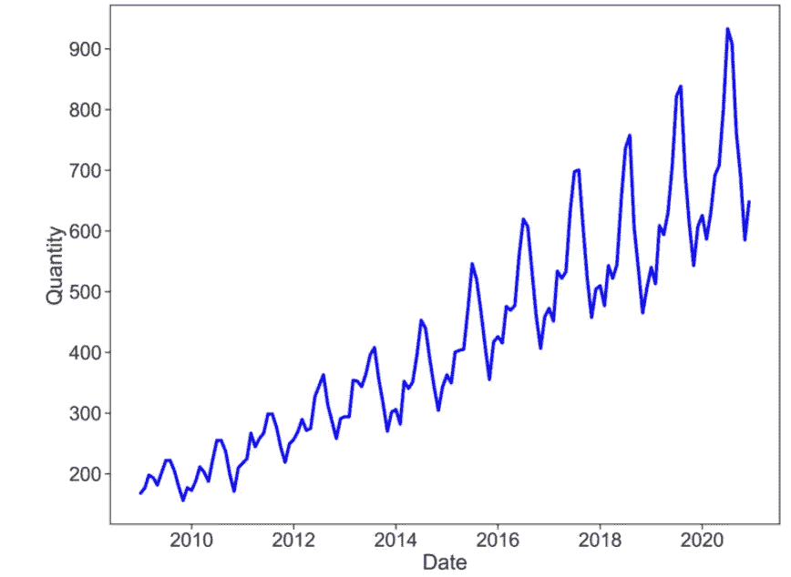

来源:作者

# 查看线图

我们不仅看到了一个线性上升的趋势，而且我们看到周期的幅度在有规律地增加。这表明我们的数据具有倍增的季节性。

# ETS 分解

我们现在将使用 ETS 分解在单独的图表上绘制误差、趋势和季节性:

```
# ETS Decomposition --> our data is multiplicativeresult = seasonal_decompose(data['Quantity'], 
                            model ='multiplicative')

# ETS plot
result.plot()
```

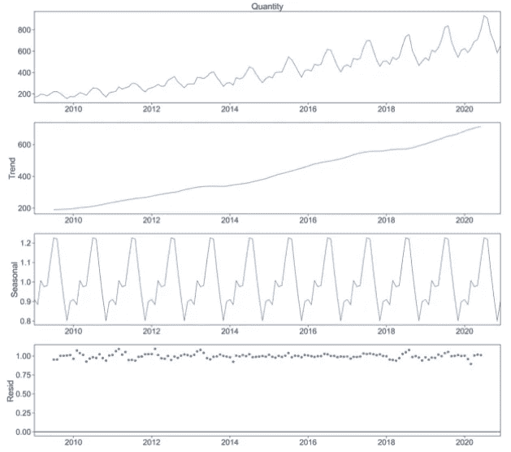

来源:作者

第一张图简单地描绘了原始数据。以下三幅图分别显示了趋势、季节性和误差(残差)成分。这三个图结合在一起给出了第一个图中的原始数据。我们看到的是:

1.  这种趋势随着时间的推移而增强，并且每隔一段时间就会出现季节性(峰值)。

2.残差在早些年和晚些年显示出高度可变性。

我们有一个强劲的上升趋势和季节性，我们证实这是倍增的。

# 模拟倍增季节性+趋势

如果我们忽略了季节性或者我们对它不感兴趣呢？那么可以使用简单移动平均(SMA)/简单指数平滑。然而，这往往会过度平滑数据的急剧增加或减少，并假设季节性年复一年地重复(回想一下，这并不总是正确的)。

SMA 是最基本的预测技术。取最后 N 个值的平均值，这个平均值就是下一个周期的预测值。让我们将 SMA 应用于我们的数据，看看如果我们忽略季节性会发生什么(回想一下，SMA 用于没有季节性和趋势疲软的情况)。注意不规则性是如何被消除的。

```
# Take the moving average of last 6 observations
rolling = data.rolling(window=6)
rolling_mean = rolling.mean()

# plot the two series (original data and the rolling average)
plt.plot(data)
plt.plot(rolling_mean, color='red')
plt.show()
```

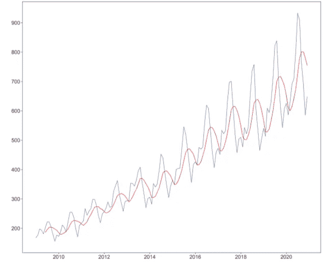

来源:作者

但是我们已经知道 SMA 不是为我们的数据设计的，所以我们转向指数移动平均线(EMA)/指数平滑(ES)。EMA 对旧的观察值应用指数递减的权重，因为旧的数据不太重要。我们对最近的观察更感兴趣，因此对更相关的数据赋予更高的权重。这消除了数据中的一些噪声，并改进了预测。这种方法只有在用于短期预测时才是可靠的。

## 3 种 es 预测方法

## 1.单一(简单)指数平滑法

SES 使用指数递减权重的加权移动平均，这很简单，因为没有特定的结构。这不处理趋势或季节性，适用于单变量数据。

## 2.双指数平滑

Holt 的趋势修正双指数平滑法是 SES 的扩展。这确实处理趋势(加法和乘法),并应用于单变量数据，即

*   *加性趋势:*线性趋势的双指数平滑。
*   *倍增趋势:*双指数平滑带指数趋势。

## 3.三重指数平滑

三重指数平滑/乘法霍尔特-温特斯/霍尔特-温特斯指数平滑-是双重指数平滑的扩展，您可能已经猜到了，它可以处理单变量时间序列的趋势和季节性。

*   *加性季节性:*线性季节性的三重指数平滑。
*   *倍增季节性:*三重指数平滑，具有指数季节性。

现在，我们将对数据应用双重和三重 ES。

# 双 e 和三 e

```
#import numpy as np
#import pandas as pd
#import matplotlib.pyplot as plt
#from statsmodels.tsa.api import ExponentialSmoothing# Split data into train / test sets
train = data.iloc[:len(data)-12]
test = data.iloc[len(data)-12:]# Set one year(12 months) for testing
fit1 = ExponentialSmoothing(np.asarray(train['Quantity']) ,seasonal_periods=12 ,trend='multiplicative', seasonal='multiplicative',).fit()# Create class
# Apply the box-cox power transformation - this that takes the original (non-normally distributed) data as input and returns the fitted data (normally distributed)
# See Source: (GeekksforGeeks , 2021) - [https://www.geeksforgeeks.org/box-cox-transformation-using-python/](https://www.geeksforgeeks.org/box-cox-transformation-using-python/)EMA_fit = ExponentialSmoothing(train['Quantity'], seasonal_periods=12, trend='multiplicative', seasonal='multiplicative').fit(use_boxcox=True)# fit model and make prediciton
fcast = EMA_fit.forecast(len(test))#or can be len(12)
# if the series was monthly data and the seasonal period repeated each year, then the Period=12.y_hat_avg = test.copy()
y_hat_avg['Holt_Winter'] = fit1.forecast(len(test))#holt winter is ES and can be additive or multiplicative and we know we have multiplicative seasonality
ax = train.plot(figsize=(10,6), marker='o', color='black', title="Forecasts from Exponential Smoothing" )
ax.set_ylabel("Quantity Snowboards Sold")
ax.set_xlabel("Index")
EMA_fit.forecast(12).rename('Train').plot(ax=ax, marker='o', color='blue', legend=True)
y_hat_avg.Holt_Winter.rename('Holt_Winter - Test').plot(ax=ax, style='--', marker='o', color='red', legend=True)
```

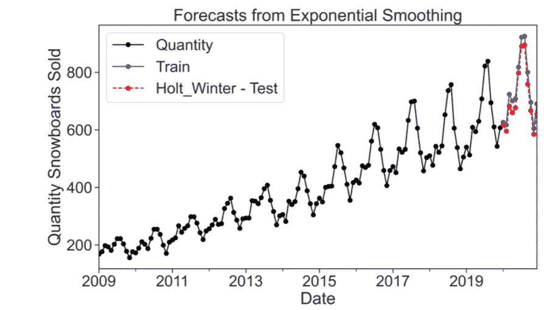

来源:作者

```
forecast = fcast 
forecast = pd.DataFrame(forecast)
forecast
forecast_es = forecast.rename(columns={0: "ES_Forecast"})
forecast_es
```

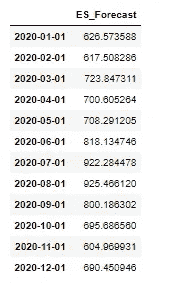

来源:作者

```
# Load specific evaluation tools
# We will now calculate RMSE to check to accuracy of our modelfrom sklearn.metrics import mean_squared_error
from statsmodels.tools.eval_measures import rmse
from math import sqrtrms = sqrt(mean_squared_error( forecast_es.ES_Forecast, test.Quantity))
print(rms)#The value we get is: 34.69362278646293
```

这个 34.69 是什么意思？这就是[均方根误差(RMSE)](https://www.relataly.com/measuring-prediction-errors-in-time-series-forecasting/809/) ，这是衡量预测模型性能的方法之一。

我们看到了为什么 SMA 不适用于包含趋势和季节性的时间序列。为了完整起见，让我们看看为什么 ARIMA 不起作用。

# ARIMA 失败的原因

ARIMA 不支持季节性。我们通过对我们的数据进行差分并没有消除增加的幅度这一事实来看到这一点。即使对数据进行两次差分，序列仍然是非平稳的。这意味着我们的数据有很强的季节性，我们不能忽视。

```
#Original Series
fig, axes = plt.subplots(3, 2, sharex=False)
axes[0, 0].plot(data.Quantity); axes[0, 0].set_title('Original Series')
plot_acf(data.Quantity, ax=axes[0, 1]) #autocorrelation plot#1st Differencing
axes[1, 0].plot(data.Quantity.diff()); axes[1, 0].set_title('1st Order Differencing')
plot_acf(data.Quantity.diff().dropna(), ax=axes[1, 1]) #autocorrelation plot#2nd Differencing
axes[2, 0].plot(data.Quantity.diff().diff()); axes[2, 0].set_title('2nd Order Differencing')
plot_acf(data.Quantity.diff().diff().dropna(), ax=axes[2, 1]) #autocorrelation plotplt.show()
```

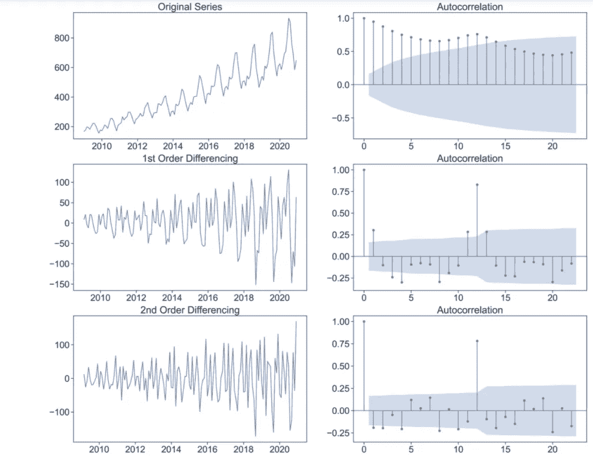

来源:作者

# 萨里玛/萨里马克斯

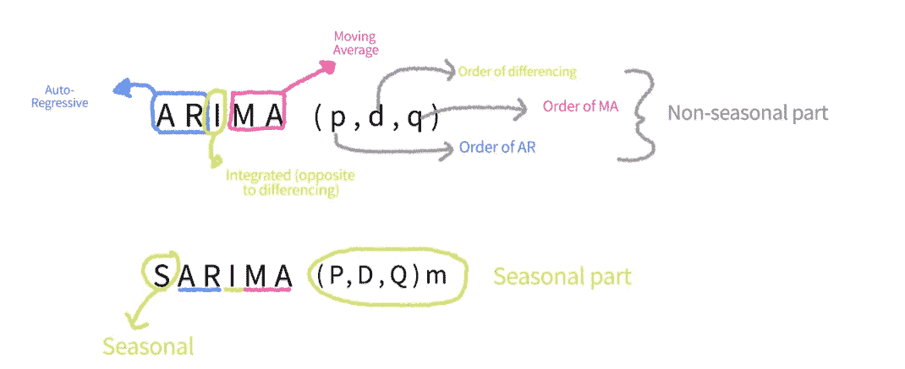

来源:作者

萨里玛利用季节差异。

我们将对我们的数据应用 *auto_arima()* 函数。该功能可选择使用逐步方法搜索模型中使用的 [p，d，q 参数](https://otexts.com/fpp2/seasonal-arima.html)的多种组合。为了识别 p、d 和 q 的最佳组合，选择具有最低 **AIC** 的模型。

只是澄清一下**阿凯克信息标准** ( **AIC** )的含义:

我们正在利用一个统计模型(SARIMA)来表示生成我们的滑雪板销售数据的过程。因为这只是一个模型而不是真实的过程，所以信息会丢失。AIC 越低，模型丢失的信息就越少，我们的模型就越能更好地描述过程。AIC 还考虑到模型的简单性，以确保模型不会过度拟合或欠拟合数据。

每当逐步方法找到具有较低 AIC 的模型时，该模型就成为新的最佳模型，直到该过程不能找到接近当前最佳模型的模型。

下面是分步结果的代码:

```
# Import library
from pmdarima import auto_arima

# Supress warnings that are not important
import warnings
warnings.filterwarnings("ignore")

# Apply auto_arima to data
sw_fit = auto_arima(data['Quantity'], start_p = 1, start_q = 1,
                          max_p = 3, max_q = 3, m = 12,
                          start_P = 0, seasonal = True,
                          d = None, D = 1, trace = True,
                          error_action ='ignore',   
                          suppress_warnings = True,  
                          stepwise = True)#We are using the stepwise approach          
# Summarise the stepwise results
sw_fit.summary()
```

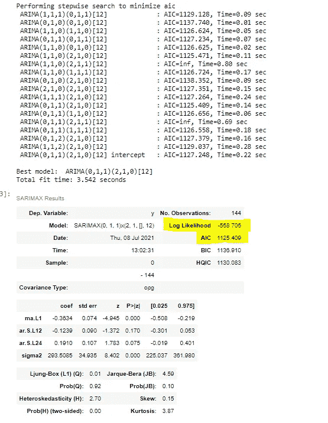

来源:作者

最好的模型是 SARIMAX(0，1，1)x(2，1，1，12)。现在，我们将数据分为训练集和测试集，并将此模型应用于训练集:

```
# Split data into train and test setstrain = data.iloc[:len(data)-12]
test = data.iloc[len(data)-12:] # set one year(12 months) for testing

# Fit a SARIMAX(0, 1, 1)x(2, 1, 1, 12) on the training setfrom statsmodels.tsa.statespace.sarimax import SARIMAX

model = SARIMAX(train['Quantity'], 
                order = (0, 1, 1), 
                seasonal_order =(2, 1, 1, 12))

result = model.fit()
result.summary()
```

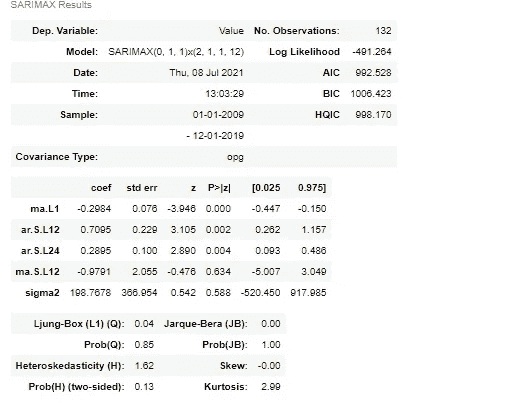

来源:作者

现在，我们将模型的一年预测与我们的测试集进行比较:

```
start = len(train)
end = len(train) + len(test) - 1

# Predictions for one-year against the test set
pred = result.predict(start, end,
                             typ = 'levels').rename("Predictions")

# plot predictions and actual values
pred.plot(figsize = (12, 5), legend = True)
Quantity =test['Quantity']
Quantity.plot(legend = True)
```

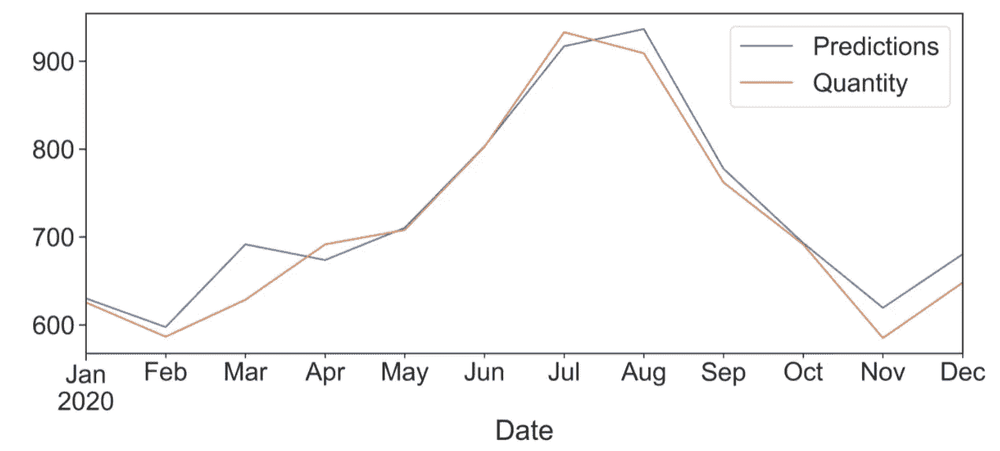

来源:作者

```
# Load specific evaluation tools
from sklearn.metrics import mean_squared_error
from statsmodels.tools.eval_measures import rmse

# Calculate root mean squared error

#RMSE is always greater than 0, where 0 indicates that our model has a perfect fit(theoretically possible, but hardly achieved in practice)rmse(test["Quantity"], pred)#The value we get: 25.715869516322755#This is a much lower RMSE as our previous model
```

现在，我们在完整的数据集上拟合模型:

```
# Train the model on the full dataset
model = SARIMAX(data['Quantity'], 
                        order = (0, 1, 1), 
                        seasonal_order =(2, 1, 1, 12))
result = model.fit()

# Forecast for the next 2 years
fcast_sarima = result.predict(start = len(data), 
                          end = (len(data)-1) + 3 * 12, 
                          typ = 'levels').rename('Forecast')

# Plot the forecast values
data['Quantity'].plot(figsize = (12, 5), legend = True)
fcast_sarima.plot(legend = True)
```

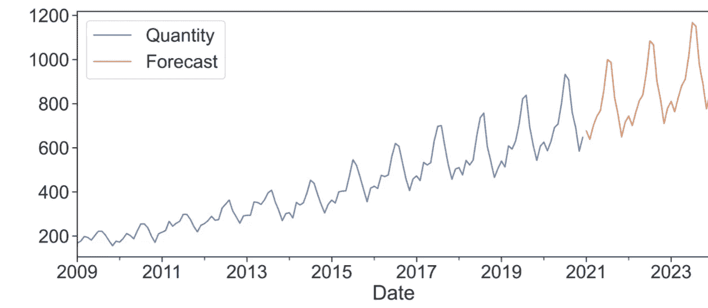

来源:作者

这一预测与融 360 研究报告中的发现一致。

让我们来看一些诊断:

```
sns.set(font_scale=1) 
result.plot_diagnostics(figsize=(13 , 10))
plt.show()
```

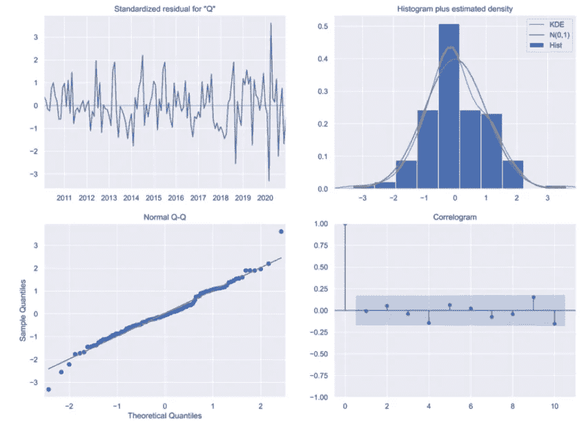

来源:作者

快速分析我们的诊断图表:

1.  标准化残差(左上):这显示了一段时间内的残差。这里必须没有模式，残差越不一致越好。我们已经确定了季节性和趋势。如果这里有一个模式，那么这意味着我们还没有确定趋势或季节性。
2.  KDE 图(右上角):如果橙色密度线(KDE)紧跟绿线，那么残差的分布是正态分布。
3.  正态 qq 图(左下角):这是一个直观的检查，看看我们的因变量是否正态分布。如果蓝点紧跟红线，那么我们的因变量遵循正态分布。这是我们做的一个隐含的假设，但是我们的统计分析必须有效。
4.  相关图(右下):如果大多数蓝点落在蓝色阴影区域，那么这表明我们的残差与它们自身的滞后版本几乎没有相关性。

诊断图表明，我们已经找到了适合我们数据集的模型。最后，回忆一下我们发现的 RMSEs:

欧洲标准:34.693

萨里玛:25.72

其中 SARIMA 是 ES 的改进，因为它产生了较低的 RMSE。

# 复杂模型

您可能已经遇到了各种预测库和算法，它们可以进一步改进 SARIMA 模型。因此，有必要提及一些后续步骤。

LinkedIn 发布了一个名为 Greykite 的时间序列预测库，其中包含 Silverkite，这是一种自动预测的预测算法。同样，脸书发布了 Prophet，这是一种预测算法，有助于处理数据中的峰值和变化趋势。

# 先知 vs 银雀:

更详细的对比可以在[这里](http://A high-level comparison can be found here)找到。

## 先知模型

●由脸书创作。

●它可以处理缺失数据、异常值、季节性影响和时间序列数据的突然变化，如产品促销或世界杯等。

●是开源的，Python 和 r 都可以用。

## 银风筝模型

●由 LinkedIn 创建。

●允许定制回归变量，以说明季节性、数据点变化、增长、交互项和自回归。

●如果快速部署很重要，这是首选。

●增加可解释性的各种可视化选项。

●预测分位数，而不是平均值。

●自带内置模板。

# 结论

回头看看我们的虚拟数据集，滑雪板的销售显示出季节性是有道理的，因为这是一项冬季运动。我们还研究了滑雪板的销售预计在未来几年将会增加。

我们看到，过度简化您的模型并不能捕捉数据中的所有细微差别。更进一步(SARIMA)展示了增加一个额外的复杂性层如何能够极大地改善结果。然而，我们能更进一步吗？这就是建模艺术的用武之地，因为正如一个人可以过度简化一个模型，他也可以过度复杂它。

然而，我很想听听你对如何模拟这些数据的反馈。

可能的扩展和注意事项:

●典型的冬季分为淡季、旺季和旺季。

●由于 COVID 期间，度假村意外关闭。

●向数据添加额外的解释变量，使其成为多元变量。


由[埃罗尔·艾哈迈德](https://unsplash.com/@erol?utm_source=medium&utm_medium=referral)在 [Unsplash](https://unsplash.com?utm_source=medium&utm_medium=referral) 上拍摄的照片