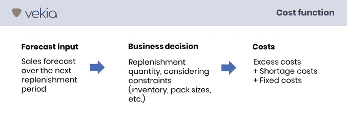
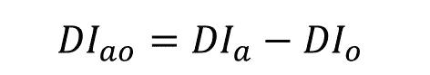
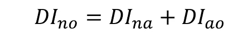
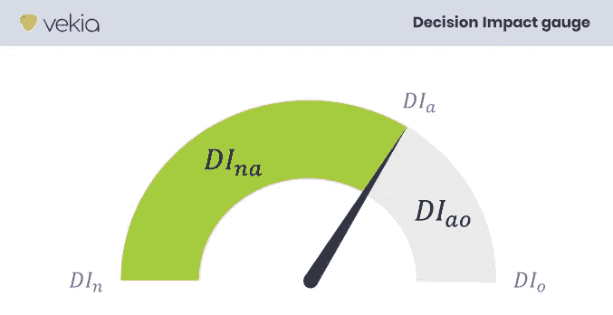
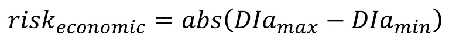

# 当准确性不再是目标时的预测:一个充满可能性的新世界

> 原文：<https://towardsdatascience.com/forecasting-when-accuracy-is-no-longer-the-goal-a-new-world-of-possibilities-59c6012290e?source=collection_archive---------12----------------------->

## [行业笔记](https://towardsdatascience.com/tagged/notes-from-industry)

## 业务预测需要面向业务的指标，而准确性指标则不需要。弥合这一差距开启了公司和从业者长期以来期待的多个用例。

由[扬·安东宁·科拉尔](https://unsplash.com/@jankolar?utm_source=unsplash&utm_medium=referral&utm_content=creditCopyText)在 [Unsplash](https://unsplash.com/s/photos/locker-bank?utm_source=unsplash&utm_medium=referral&utm_content=creditCopyText) 上拍摄

在这个系列的文章[1]中，我们已经展示了现有的预测准确性指标为什么以及如何阻止需求计划者提供更多的商业价值。

更准确地说，使用来自 M5 竞赛的数据，我们根据经验建立了准确性指标和成本效益之间的**弱相关性**。

换句话说:现有指标没有考虑预测的预期用途和相关成本…在这种情况下，通过改进预测来最小化成本(或最大化盈利能力)与其说是科学，不如说是运气！

对于公司和从业者来说，浪费时间和资源努力工作却发现并不总是增加预期的价值(更糟糕的是，经常降低盈利能力)是多么令人沮丧！

但好消息是，任何需求规划者都可以通过简单地从“准确性”转换到“成本”指标来创造更多的商业价值。

关注“成本”**为需求规划打开了一个全新的可能性世界，并允许半打独家用例！**

在这篇文章中，我将举例说明其中的一些。但是首先，让我们快速看一下什么是“决策影响”指标。

# 什么是“决策影响”指标？

本系列的第一篇文章[2]提醒我们，预测本身并不是目的，而是为了支持决策者做出更好的决策。

> 预测的目的不是也从来不是提供有史以来最好的预测！其目的是做出最佳决策。

因此，最好的预测并不是完美的预测，而是能够做出最佳决策的预测。因此，预测者的使命不应是最小化预测与现实之间的误差，而是最小化决策误差。

这意味着从侧重于预测内在质量的“预测准确性”(FA)转向侧重于基于预测的最终决策及其相关性/成本和影响的“决策影响”(DI)。

## 通用成本函数

提议的度量标准要求创建一个“成本函数”，该函数可以针对任何预测输入，评估业务决策并评估其质量。

虽然决策的质量可以用许多方式来表达，但在本研究中，我们选择了财务成本。

作者图片

这种“成本函数”的创建在本系列的第一篇文章中也有详细介绍[2]。让我们假设定义了这样一个“成本函数”。然后，它允许我们计算与任何输入预测相关的成本。

## 成本指标#1:实际成本(直径)

通过将成本函数应用于我们的“实际”预测，我们获得了由我们的预测引起的成本。让我们用直径来表示。

## 成本指标#2:原始成本(DIn)

通过将成本函数应用于“原始”预测(例如，移动平均预测)，我们可以获得由我们可以实现的最简单的预测过程引起的成本。让我们用晚餐来表示它。

## 成本指标#3: Oracle 成本(DIo)

通过将成本函数应用于“预言”预测(即实际销售)，我们获得*后验*对未来的完全了解会导致的成本。让我们用 DIo 来表示它。

# 组合 DIa/DIn/DIo 构建模块

这三项成本是基本的构建模块，可以很容易地组合在一起创建三个有洞察力的指标。

## 衡量挣值

*预测流程的性能如何？它产生价值了吗？多少钱？*

在衡量他们给公司增加的价值时，需求计划者经常做不到。由于他们的关键角色通常以交付定性预测而告终，因此他们唯一的资产就是 f a。他们几乎没有评估商业价值的方法。

然而，有人试图评估他们的表现。

其中之一是将 FA 与行业基准进行比较。但是 Nicolas Vandeput 最近在一篇文章[3]中提醒我们，有许多原因可以说明为什么要不惜一切代价避免基准测试！

这些原因包括业务战略的多样性(投资组合的规模、产品和品牌定位)、预测准确性的衡量水平，甚至指标本身的定义(尤其是价值加权公式)也可能不同，等等。

另一种方法是应用 FVA(预测增加值)。大多数情况下，它包括将实际 FA 与简单预测的 FA 进行比较，以评估预测是否得到了改进。

这听起来很棒*，的确如此！*但它的应用方式仍有重要的局限性:

*   **FA 不是关键经营业绩指标(KPI)**
    我们已经说过，FA 与经营业绩相关性不大。所以提高 FA 并不意味着你在创造价值。随着精度的变化，成本可能增加、减少或保持不变。
*   **FA 指标互相矛盾**
    FA 指标有几十种，它们并不都一样。更糟糕的是，它们经常互相矛盾:一个改善，另一个恶化。因此，从一个 FA 指标到另一个 FA 指标的简单转换可以深刻地改变你的 FVA 结果。
*   **应用于 FA 的 FVA 不是 FVA，而是 FAA**
    正如 Paul Goodwin 在最近的一次聊天中总结的那样，“预测增加值(FVA)，正如它经常被应用的那样，实际上是预测准确度增加值(FAA)，这可能会产生误导。”事实上，只要 FA 在 FVA 被使用，它的真正价值就无法实现...

不要误解我。我是 FVA 和迈克·吉利兰作品(《FVA 教父》)的忠实粉丝。他的工作是这一系列文章的灵感来源。

> 但是，只要 FA 在 FVA 被使用，FVA 与商业价值的相关性就和 FA 一样小。

有趣的是，FVA 的方法本身并没有真正的问题！在 2019 年 ISF 演讲中[5]，迈克·吉利兰给出了 FVA 的定义:

> *预测绩效指标* ***的变化*** *可归因于预测流程中的特定步骤或参与者。*

因此，很明显，FVA 可以应用于任何指标。因此，用 DI 代替 FA 不仅尊重 FVA 的定义，而且只要以评估商业价值为目的，就更加自然。

然后让我们计算 DIna，即 DIn(原始成本)和 DIa(实际成本)之间的差值。

迪娜衡量的是什么？不亚于 FVA:从商业角度看预测过程的附加值。

## 衡量尚未实现的价值

*你应该对自己目前的迪娜表现满意吗？创造价值是好的…但是你已经抓住了它的全部，还是仅仅抓住了它的表面？*

有趣的是，根据 FA 指标，你能梦想到的最好的表现是 100%的准确率！这对每个 SKU 都是一样的。*这是需求规划的圣杯！*

但是 100%准确的附加商业价值是什么？一百万美元还是 1 美元？嗯…我们又一次不知所措了！

DI 指标如何帮助我们？

我们还是按照之前的逻辑，介绍一下 DIao:DIa(实际成本)和 DIo (oracle 成本)的区别。

刁衡量的是什么？不亚于不劳而获的价值:通过改进预测仍然可以获得的价值。

当然，不可能获得每个 SKU 的 100%的 DIna 值，因为这需要对未来有一个完美的了解。然而，刁提供了我们所能想到的最有趣的见解之一…因为它有助于确定真正的价值所在。下面描述的用例将告诉你更多这方面的信息。

## **测量可获利价值**

到目前为止，我们已经介绍了迪娜和刁？我们来评价一下迪诺。它会测量什么？

遵循和之前一样的逻辑，DIno 就是 DIn(朴素成本)和 DIo(甲骨文成本)的区别。因此，它也可以定义为 DIna(挣值)和 DIao(未挣值)的总和。

因此，DIno 是对整个竞争领域的一种衡量:总的可赚取价值。

## 总结一下

*   DIn:天真预测的成本
*   直径:实际预测的成本
*   DIo:Oracle 预测的成本
*   迪诺衡量总的可用价值
*   DIna 衡量挣值
*   刁衡量的是尚未获得的价值
*   DIna/DIno 衡量挣值的比例
*   DIao/DIno 衡量尚未获得的价值的比例

# 七个用例最终解锁

## 分享预测绩效

*“预测总是错的！”、“预测太这个”、“预测不够那个”、“70% FA 是什么意思？”，“这是好是坏？”*

需求计划员通常需要以客观、易于理解且不矛盾的方式与各种各样的受众分享和维护他们的绩效。

到目前为止，FA 通信是规则。但是说实话，

*   大多数(如果不是全部)FA 指标对于非从业者来说很难理解。
*   一个给定的 FA 水平是一个事实，并不能说明它是好是坏
*   FA 指标相互矛盾:一个指标得到改善，而另一个指标恶化。

在这种情况下，通过 FA 指标进行有效沟通几乎是不可能的。在每家公司，这往往会让人产生怀疑，更不用说批评了。

DI 指标是表示财务成本、收益或损失的指标。这使得他们很容易理解，无论谁读这些数字。

有了 DIna 指标，需求计划者现在可以证明，即使预测并不完美，它仍然节省了一定数量的资金。相反，他们可以准确评估绩效不佳的成本，并主动启动必要的工作。

## 建立预测的投资回报率

*需求规划部门的季度、季度或年度投资回报率是多少？*

所有重大的商业决策都需要了解投资回报。如果你不知道你的努力是否正在产生结果，你如何才能恰当地实现盈利最大化？然而，在需求计划中，我们在玩猜谜游戏。

但是现在，DIna 指标为公司的附加值提供了一个深刻的视角。然后，确定预测的投资回报率是非常实际的。

为了说明这一点，让我们回顾一下 M5 竞赛的一些教训[6]。如果沃尔玛应用“F_ADIDA”方法生成其预测，DIna 指标确定，在竞争范围内(10 家商店，3049 件商品，1 个月)，该预测将节省 2，345 美元(与简单的“移动平均”方法相比)。通过减去一些内部预测成本(人员、工具等。)，那么预测的 ROI 就很容易计算出来了。

## 推广最佳实践，消除不良实践

判断性预测会让事情变得更好还是更糟？这些 X 或 Y 数据是否改善了预测？哪种预测模型增加的价值最大？

当这些问题被提出时，通常的答案是“FVA”。这才是正确的答案……只要附加值确实是衡量出来的。这正是迪娜的切入点。

如果你还不熟悉 FVA，那么我强烈推荐你观看兰开斯特大学 CMAF 的“CMAF 周五预测讲座”系列中的这个精彩的网络研讨会。

## 公平评估预测员工绩效

*在评估个人表现时，你能识别出表现最好和最差的人吗？*

当然，仅从业务附加值的角度来评估一个人的表现有太多的限制。人类不是纸上的数字。

然而，丢弃这些信息并且不能识别最佳和最差的表现者也是不公平的。

很多时候，业绩是用 FVA(基于准确性)来评估的，通常用投资组合收入、数量或项目数来加权。但是这种方法并不能公平对待每个人的工作。有些周界比其他周界更容易或更难预测，有些更大，有些更关键，等等。

但现在，demand planner 计算的“增值”(DIna)或“增值比例”(DIna/DIno)提供了一个清晰、真实的衡量标准，可以衡量每个人对公司的贡献，从而更好地评估所做的工作和每个投资组合的特点。

## 为投资建立强有力的商业案例

*我们应该投资先进的解决方案吗？值得吗？哪个供应商的解决方案最适合我的特定环境？*

投资新的需求计划解决方案通常需要三个步骤:

*   调整管理团队以获得批准并启动项目
*   确定最能满足您需求的解决方案
*   部署后，确保解决方案提供预期的价值。

在需求计划中，FA 在这三个步骤中都起着核心作用。因此，拥有最好 FA 的供应商拥有最好的卡！

但是提高 FA 不是一个商业案例。因此，它不是证明改进需求的正确 KPI，也不是选择正确的解决方案或评估其提供的价值的正确 KPI。

相比之下，DI 指标是自然支持这种投资过程的成本指标。刁从商业角度展示了改进潜力。反过来，DIna 评估每个供应商的实际附加值，以确定为预期用途提供正确解决方案的供应商。最后，随着时间的推移，对 DIna 的监控确保了项目已经交付(并继续交付)了长期的预期价值。

再一次，为了说明这一点，让我们回顾一下 M5 竞赛的一些教训[6]:

*   如前所述，如果沃尔玛应用“F_ADIDA”方法生成其预测，DIna 指标确定该预测在竞争范围内(10 家商店，3049 件商品，1 个月)将节省 2，345 美元(与简单的“移动平均”方法相比)。
*   DIao 指标确定改进潜力为 21，946 美元(在相同的小范围内)。因此，总可寻址值的约 10%已通过当前方法得到保护。这样的潜力值得启动一个项目吗？大概吧。
*   为了提高业绩，沃尔玛可能有兴趣采用赢得 M5 竞赛的“YJ _ 斯图”方法。通过这样做，它将节省 2，981 美元(与简单的“移动平均”方法相比)。因此，与现行方法相比，这种方法的增加值为 636 美元。
*   让我们想象一下，沃尔玛也向另一个“供应商”，即“Hiromitsu Kigure”，要求提供概念证明。这种方法在比赛中排名第 45 位，这意味着根据应用的预测准确性指标，这种方法不如“YJ _ 斯图”。然而，该方法的 DIao 显示，沃尔玛可以节省 5000 美元(与简单的“移动平均”方法相比)。因此，与现行方法相比，这种方法的增加值为 2 655 美元，高出 4 倍多。
*   当然，项目成本(人员、工具等。)仍然需要考虑，以便对这两家供应商进行公平的比较，并决定哪种解决方案最适合沃尔玛的具体情况。

## 确定工作优先级

我应该对自己目前的表现感到满意吗？我应该继续改进吗？我应该停止吗？应该先关注哪里？好的表现到底有多好？

并非所有的 SKU 都是平等的！有些很难预测，有些则不然。有些是高风险，有些不是。有些是战略性的，有些不是。有些有很强的供给约束，有些没有。诸如此类。

在这种情况下，期望相同的性能，或者为每个 SKU 投入相同的精力是不合理的。

你如何定义优先检查的范围？FA 最低的物品是否优先？许多从业者应用 ABC/XYZ 分类，这有助于集中在正确的范围吗？

不幸的是没有。

我们不要过多讨论 FA，因为我们已经讨论了它对业务的价值。

关于 ABC/XYZ 的局限性，我推荐你阅读 Nicolas VanDePut 的这篇文章:“ *ABC 分析不是一个好主意。改为这样做。*【⑧】。本文清楚地陈述了局限性，并提供了一些关于如何关注正确范围的想法。指导方针包括关注价值、保质期、持有成本、供应提前期、季末和关键程度。

有趣的是，这些要素中的大部分(如果不是全部的话)都与触发决策的成本有关。因此，它们正确地反映在 DI 指标中。

换句话说，DI 指标自然会对项目进行排名，并优先考虑那些影响最大的项目(即，可以获得较高的 DIao 值)。

## **利用概率预测**

当从确定性预测转向概率性预测时，从业者需要用概率性预测来取代他们旧的确定性准确性指标。

第一个好消息是，这不适用于 DI 指标！因为它们关注决策和成本，而不是预测本身，所以 DI 指标在设计上与任何类型的预测都兼容。

第二个好消息是，将 DI 与概率预测结合使用提供了额外的见解！

这里有一个。概率预测准确地描述了未来可能发生的事件及其发生的概率。这是识别有风险的外围环境和确定决策评审优先级的一个很好的方法。

例如，假设我们关注 5%到 95%的百分比范围，该范围涵盖了 90%的需求值。预测的不确定性越高，范围就越大。因此，这一范围的宽度可以被视为优先审查具有高度不确定性的周界的一种有趣方式。

太好了。然而，高度不确定性并不一定意味着企业面临风险。真正重要的是这种不确定性的经济风险！

我们如何衡量不确定性的经济风险？为此，我们可以利用 DI 指标！

让我们用 1)“最小直径”表示与 5%百分比的预测相关的成本，用 2)“最大直径”表示与 95%百分比的预测相关的成本。“最小直径”和“最大直径”之间的绝对差值定义了不确定性带来的额外成本的实际风险。

然后应该首先审查哪些项目？正如你已经猜到的，那些具有最高经济风险的不确定性代表了真正的风险区域。

# 结论

业务预测需要面向业务的指标。这似乎是显而易见的，但不言而喻的是，说出来会更好。

FA 指标不是以业务为导向的，经验表明它们不能作为这类指标的代理。

向您的“预测指标名人堂”中引入成本指标(如提议的 DI 指标)并不像听起来那么困难，而且它**打开了新的视角和独家用例！**

*这篇文章旨在阐明预测性能测量的当前实践、局限性和可能的改进。它肯定不是完美的，并且受到限制。*

如果你觉得这很有见地，请分享和评论…但是，也请随时挑战和批评。如果你想进一步讨论这个问题，请联系我！

在所有情况下，敬请关注下一篇文章！同时，请访问我们的网站[*www . vekia . fr*](http://www.vekia.fr/)*了解更多我们在为供应链提供高价值方面的专业知识和经验。*

*Linkedin:*[*www.linkedin.com/in/johann-robette/*](https://www.linkedin.com/in/johann-robette/)
*Web:*[*www . vekia . fr*](https://www.vekia.fr/)

# 参考

[1]韦基亚，j .罗贝特， [*《决策影响度量》文章-目录*](https://www.linkedin.com/pulse/decision-impact-metrics-articles-table-content-johann-robette-/) ，2021

[2] Vekia，J. Robette，[“*决策影响”:实施新一代面向业务的指标*](/decision-impact-10-reasons-to-implement-the-new-generation-of-business-oriented-metrics-fcc17ea7871d) 的 10 个理由，2021

[3] Nicolas Vandeput，[*评估产品的可预测性:预测基准与 COV*](https://nicolas-vandeput.medium.com/assessing-products-forecastability-forecasting-benchmarks-vs-cov-2bdac1e7fd5f)，2021

[4]麦克·吉利兰，[*《商业预测交易*](https://www.amazon.fr/Business-Forecasting-Deal-Eliminating-Practices/dp/0470574437)，2010 年

[5] ISF，Mike Gilliland，“ [*预测增加值分析*](https://isf.forecasters.org/wp-content/uploads/gravity_forms/2-dd30f7ae09136fa695c552259bdb3f99/2019/07/Gilliland_Michael_ISF2019.pdf) ”，2019

[6] Vekia，J. Robette，“[“最后的将是第一，第一个是最后的”……来自 M5 竞赛的见解](/the-last-will-be-first-and-the-first-last-insights-from-the-m5-competition-f0b9290dc45)，2021 年

[7] CMAF、罗伯特·菲尔德斯、迈克·吉利兰，[*关于预测附加值，我们需要知道什么？*](https://cmaf-fft.lp151.com/)2020 年

[8] Nicolas Vandeput，[*ABC 分析不是一个好主意。改为这样做。*](https://nicolas-vandeput.medium.com/abc-analysis-is-not-a-good-idea-do-this-instead-4cb2fae9d8ab)，2021