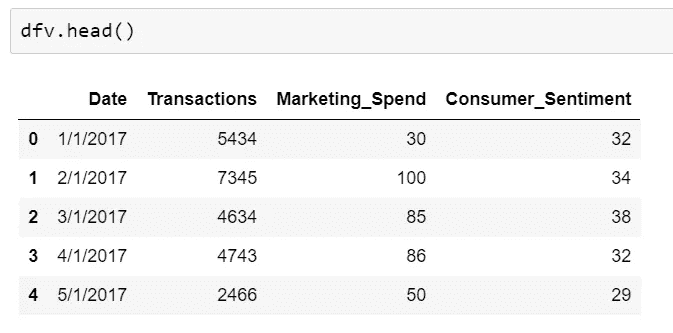
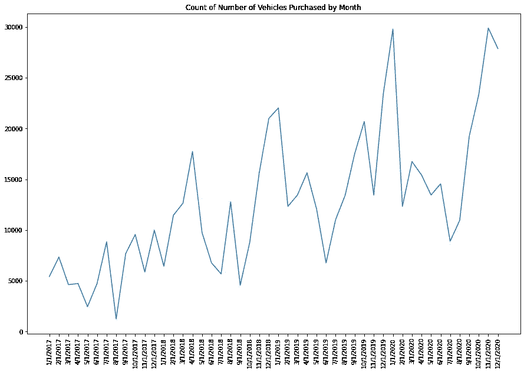
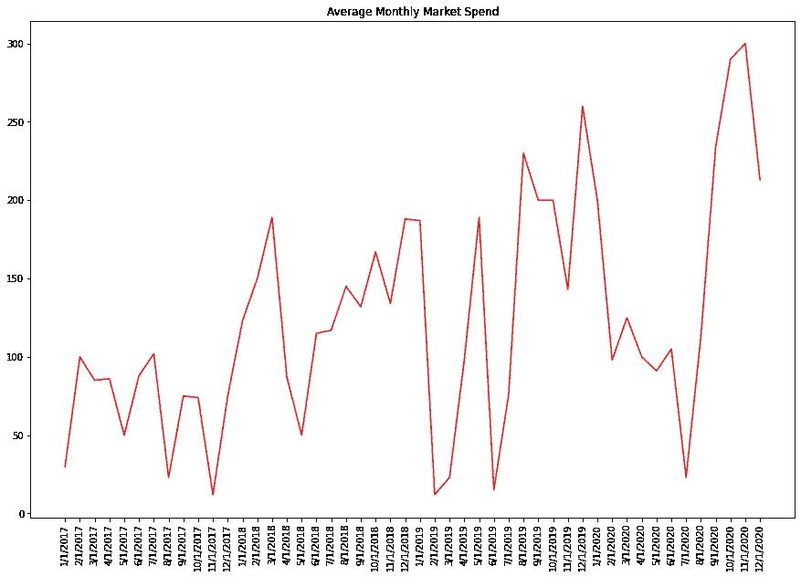
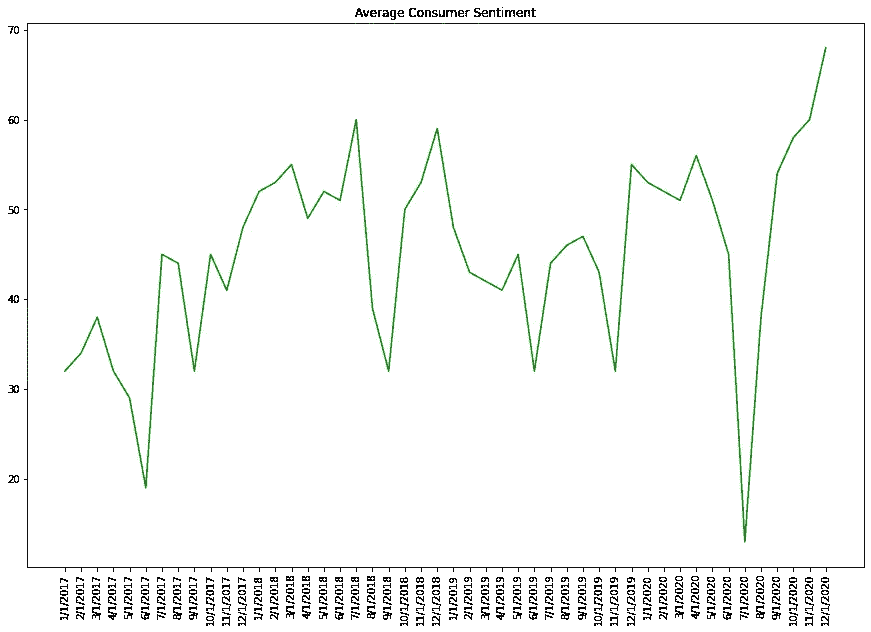
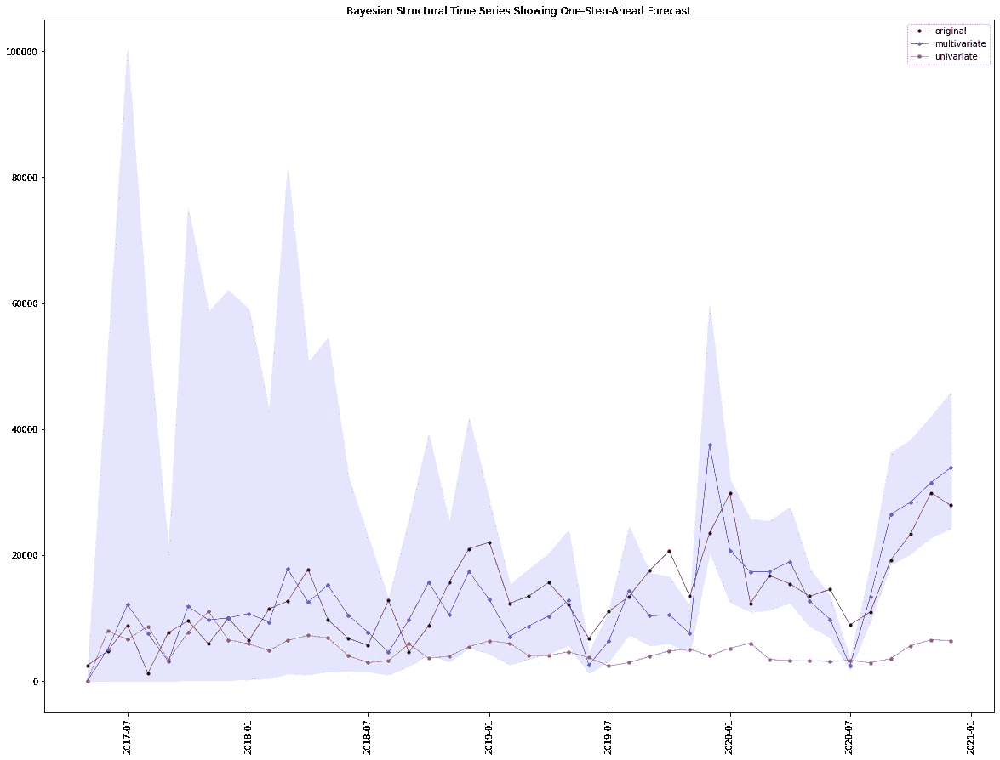
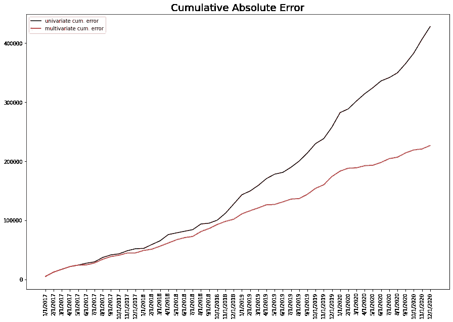
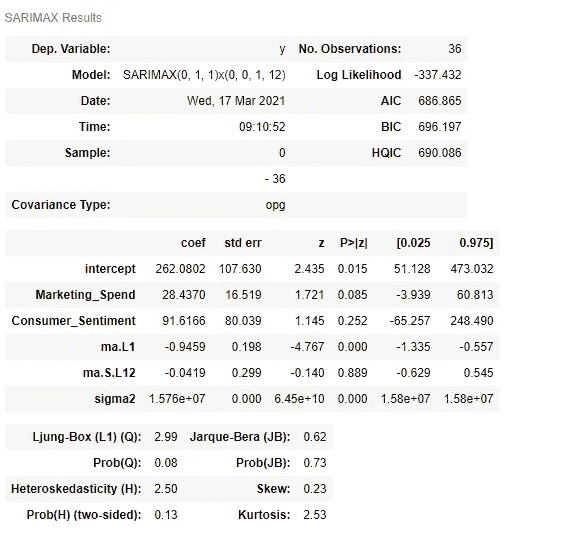
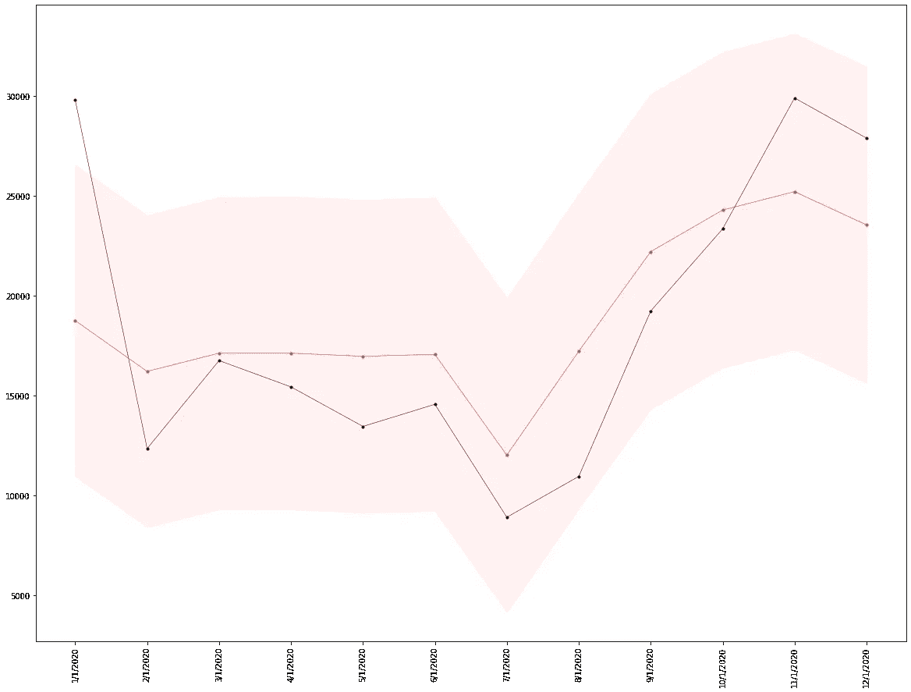
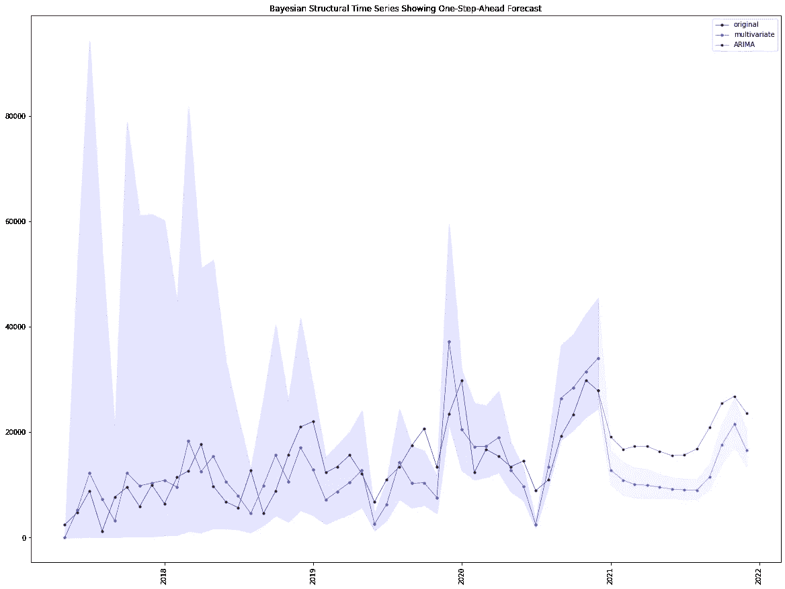

# Python 中贝叶斯动态广义线性模型的预测

> 原文：<https://towardsdatascience.com/forecasting-with-bayesian-dynamic-generalized-linear-models-in-python-865587fbaf90?source=collection_archive---------8----------------------->

## 对多元时间序列数据比较贝叶斯和频率主义方法的案例研究


图片由原作者提供。

当规划收入目标、库存管理、员工人数和其他对管理成功企业至关重要的经济因素时，预测对几乎所有企业都至关重要。高度准确的预测通常很难实现，但对于企业在动态市场中规划转变和变化至关重要。通常，预测模型可以(也应该)利用额外的输入或变量，这些输入或变量可能有助于解释目标或从属序列中的可变性。例如，根据网站访问量预测销售量，或根据每月营销支出预测每月收入。通常情况下，可用数据往往有限或不完整，这使得使用标准算法生成准确预测的能力变得复杂。

在这篇文章中，我将介绍多元时间序列的贝叶斯方法，并提供与传统的频率方法，如 ARIMA 的对比。时间序列是回归的一个特例，其中独立变量是一个规则的间隔时间度量(即周、月、年等)。)，以及可能有助于解释序列残差变异的潜在外生特征。ARIMA(自回归，综合，移动平均)已成为时间序列预测的标准方法之一；这是一个强大的算法，广泛应用于许多行业。然而，有许多复杂的考虑因素:数据应该是平稳的，可能有多个趋势，独立变量往往是滞后的，存在季节性——有时同一数据中有多个季节，必须有相当数量的可用数据等。由于这些原因，时间序列是一种难以掌握的统计技术，并且生成准确的预测是相当具有挑战性的。

贝叶斯方法为时间序列提供了一种概率方法，以减少不确定性并纳入“先验”信息。这些模型被称为动态线性模型或结构时间序列(状态空间模型)。它们通过动态拟合时间序列中的结构变化来工作，换句话说，随着时间的推移，随着新信息的增加，模型参数不断发展和更新。相比之下，ARIMA 估计序列的参数，这些参数保持固定，然后使用最大似然估计来确定时间序列的预测。贝叶斯方法使用 MCMC(蒙特卡罗马尔可夫链)从分布中生成估计值。在这个案例研究中，我将使用[py bats](https://pypi.org/project/pybats/)——Python 的贝叶斯预测包。对于那些感兴趣的人来说，关于时间序列贝叶斯方法的统计力学的深入文章可以在[这里](https://www.jmlr.org/papers/volume19/18-009/18-009.pdf)找到。

# **案例分析**

在本案例研究中，我们评估了两个独立时间序列(协变量)对因变量的影响:特定汽车制造商每月汽车购买总量。因为这是计数数据，所以我们看到的是泊松过程，它假设了与高斯分布不同的基础分布。泊松模型基于计数，因此最低可能值为 0。这两个协变量包括:营销支出，按月汇总，以及给定品牌的消费者情绪指标，标准化为 0-100 分。

# 数据

我们的数据由 2017 年 1 月至 2020 年 12 月间的 48 次观测组成。没有丢失的值。这些数据代表了每月的汽车销量、平均营销支出(以万计)和平均消费者情绪——一个专有指标。由于我们使用的是 Python，我将提供一些代码片段来演示分析步骤。

```
# Import the necessary libraries
import pandas as pd
import numpy as np
from scipy import stats
import pmdarima as pmd
import matplotlib.pyplot as plt
import pybats
from pybats.loss_functions import MAPE
from pybats.analysis import analysis
from pybats.point_forecast import median

# import the data
dfv = pd.read_csv("vechicle_data.csv")
```



我们上面的数据集显示了我们将用于此分析的三个变量:交易是因变量，营销支出和消费者情绪是动态回归模型中的两个自变量(或协变量)。我们本质上要说的是:营销支出和消费者情绪对交易数量有随时间变化的影响吗？我们能否对它们的影响进行建模，并利用我们对这些变量的了解，对超出我们当前数据集的交易做出合理的预测？

让我们来看看目前为止的 3 个独立的时间序列:

**DV:售出车辆数量**

简单的视觉检查揭示了在这个系列中发生的几件重要的事情:1)数据不是静止的，2)似乎有可能的季节效应，3)方差随时间增加。对 ARIMA 来说，这将是有问题的，我们的系列将受到多重“调整”，如差异和季节分解，以达到平稳的要求。



**IV 1:营销支出**

下图显示了同一时期平均营销支出的变化。这个系列就不太清楚了。可能有季节性，可能有趋势的变化；这个系列看起来并不稳定。然而，如前所述，这些考虑与时间序列的贝叶斯方法无关。



**IV 2:消费者情绪**

我们的消费者情绪指标与营销支出指标密切相关，考虑到营销努力会对消费者情绪产生影响，我们可能会预计到这一点。



# 模型构建

为了构建模型，我们将在 Python 中构建一个函数来使事情变得简单一些。在模型本身中有许多参数需要调整，包括学习和衰减率、季节性、前期应该有多长(以学习前期方差)等。我不会在这里深入讨论，因为 Pybats 教程提供了描述和指南。

```
def bayes_forecast(iv,dv):
    '''
    This functions runs the Pybats algorithm by taking two parameters: an independent variable matrix and a dependent variable. 
    Both elements must be sequential time series. 
    '''
    # first check if the iv = None, indicating this would be a univariate series
    if iv is None:
        x = None
    else:
        x = iv.values

    y = dv.values

    # set the one-step-ahead value; by default we want 1
    k = 1                                                       
    forecast_start = 0                                         
    forecast_end = len(y)-1 mod, samples = analysis(Y=y, X=x, family='poisson',
       forecast_start=forecast_start,      
       forecast_end=forecast_end,         
       k=k,                                
       ntrend=1,
       nsamps=5000,
       seasPeriods=[12],
       seasHarmComponents=[[1,2]],
       prior_length=4,                     
       deltrend=0.94,                      
       delregn=0.90,                        
       delVar=0.98,
       delSeas=0.98,
       rho=.6,
       ) forecast = median(samples)

    # set confidence interval for in-sample forecast
    credible_interval=95
    alpha = (100-credible_interval)/2
    upper=np.percentile(samples, [100-alpha], axis=0).reshape(-1)
    lower=np.percentile(samples, [alpha], axis=0).reshape(-1)
    print("MAPE:", MAPE(y[-18:], forecast[-18:]).round(2))

    #Generate the Bayesian Future Forecast
    return mod, forecast, samples, ymv_mod, mv_for, mv_samp, mv_y = bayes_forecast(dfv.iloc[:,2:4], dfv.Transactions)
```

我们将使用上面的 Python 函数来运行没有协变量的等效模型，即标准的单变量时间序列。我们这样做是为了确定在模型中包含独立变量是否具有减少模型中整体残差的预期效果。换句话说，包含变量是否提高了我们对数据的理解；值得将它们包含在模型中吗？

```
# Calculate Bayesian estimate for the univariate model
uv_mod, uv_for, uv_samp, uv_y = bayes_forecast(None, dfv.Transactions)
```

# 结果

下图显示了我们的分析结果。我们有许多观察结果。首先，该模型在学习序列的开始结构时经历了一段困难的时间，正如序列开始时的宽可信区间所证明的那样。最终，“学习”的模型参数和多变量模型的单步超前预测开始更紧密地遵循原始序列。这是我们所期望的。然而，请注意，单变量序列在捕捉原始序列的移动和值方面做得相当差。虽然它似乎了解趋势，但它的预测基本上始终偏离原始的相关值，尤其是在序列的后期。这告诉我们一些关于模型中额外协变量的功效——我们将在下一步讨论。



**提前一步预测**

上面的图显示了贝叶斯预测的输出。它显示了一步到位的预测，可信区间为 95%。这与产生样本内预测的 ARIMA 不同。

样本内 ARIMA 预测和 Pybats 预测的一个重要区别是:在 ARIMA，样本内预测实际上是没有用的。它们反映了估计的参数与数据的拟合程度，为此，你可以很容易地通过过度参数化你的模型来过度拟合数据；它没有告诉我们参数在看不见的数据上表现如何(更不用说参数是固定的)。对于 Pybats，这不是一个真正的“样本内”预测。这是一种一步到位的预测，从序列的开头开始，并在序列中移动时更新每个参数。因此，每一步实际上都是一个真正的“样本外预测”，因此预测误差反映了基于后验概率的真实样本外估计。为了让 ARIMA 做到这一点，您需要在序列的末尾指定一个保留样本，然后实现一个 For 循环，迭代保留样本中的每个数据点，更新模型，移动到下一个点，更新模型，等等。

**贝叶斯:比较单变量和多变量**

我们的多变量贝叶斯模型比单变量模型表现得更好吗？通过比较多变量和单变量预测中的累积绝对误差，我们可以更容易地观察到这种差异。下图比较了两个模型(单变量和多变量)之间的累积误差。它表明，随着时间的推移，协变量开始解释时间序列模型中更多的可变性——这是我们在模型根据以前的值学习和调整参数时所期望的。



比较单变量和多变量贝叶斯时间序列模型之间累积误差的图形

此外，我们可以检查每个模型的 MAPE(平均绝对百分比误差)，并确定哪个模型在一步预测中更准确。在这种情况下，我们检查了前 12 个月的预测，并比较了 MAPE。对于多变量模型，我们实现了约 20%的 MAPE，而单变量模型实现了 54%的 MAPE。20%留下了很大的提升空间，但肯定比 54 强多了！多变量模型的 MAD(平均绝对偏差)约为 3，300，这意味着我们的汽车交易量估计值每月约有 3，300 辆的误差。

# ARIMA

让我们看看 ARIMA 是如何处理我们的数据的。首先，我们需要在数据中创建一个训练/测试分割；在这里，我们将使用该系列的最后 12 个月作为一个坚持样本。

```
dfv_train = dfv[:-12]
dfv_test = dfv[-12:]
dfv_test
```

我们使用的是 [pmdarima](https://pypi.org/project/pmdarima/) ，它是一个方便的包，围绕 SARIMAX 的 Statsmodels 实现构建了一个包装器。

```
mod = pmd.auto_arima(y=dfv_train.Transactions, exogenous=dfv_train.iloc[:,2:4], stepwise=True, m=12, seasonal=True)
y_pred = mod.predict_in_sample(exogenous=dfv_train.iloc[:,2:4], return_conf_int=True, alpha=0.05)
a_low = y_pred[1][:,0]
a_high = y_pred[1][:,1]
mod.summary()
```

我们的 SARIMX 输出(因为它是季节性的，有两个外生协变量)如下所示。这里有很多复杂性。首先，模型是不同的，我们在两个主要序列中观察到一个移动平均分量，并且在季节分量中，季节效应也是不同的。显然，数据不是静止的。我们的协变量都没有发现在模型中有统计学意义；根据 ARIMA 的说法，它们没有任何效果。这与贝叶斯模型观察到的结果不同。



在坚持 12 个月的样本中，ARIMA 模型的表现如何？不算太坏。我们观察到 MAPE 为 22%,贝叶斯模型在同样的 12 个月时间内 MAPE 为 20%。



# 未来预测

下一步是使用我们创建的模型预测未来。因为我们引入了额外的协变量，我们还需要预测(或以某种方式知道)这些协变量的未来值。实际上，从业者将需要使用他们领域的专业知识来生成对未来预测的可靠估计。在某些情况下，最好的方法可能是使用另一个模型来预测这些变量的未来值。然而，注意:从预测中产生预测是一个潜在的危险领域！出于本例的目的，我们使用单变量 BTS 模型(Pybats 仅使用单个变量)估计了每个协变量的 12 个月预测，并在预测目标系列时使用这些预测作为输入——与我们的更好判断相反。

下图显示了模型对未来 12 个月的预测。我也用同样的数据提供了可比较的 ARIMA 预测。请注意，ARIMA 预测明显高于贝叶斯模型的预测。随着每个月数据的到来，我们需要跟踪这些数据。考虑到交易的历史模式，如果 ARIMA 模型经常出错，而贝叶斯模型更准确，我不会感到惊讶。



# 结论

本文简要介绍了使用 Pybats 进行多元贝叶斯预测。这个工具非常强大，值得那些需要利用动态线性回归模型的能力进行准确预测的人去研究。贝叶斯方法大大弥补了 ARIMA 的不足，特别是在数据不足、存在多个变量以及需要理解模型中变量的相对重要性的情况下——这种方式比 ARIMA 提供的方式更加透明。