# 使用基于群组的模型进行预测

> 原文：<https://towardsdatascience.com/forecasting-with-cohort-based-models-e71003bc7ecd?source=collection_archive---------5----------------------->

## [行业笔记](https://towardsdatascience.com/tagged/notes-from-industry)

## 预测付费订阅时时间序列模型的替代方法

由[米哈尔·马特隆](https://unsplash.com/@michalmatlon?utm_source=medium&utm_medium=referral)在 [Unsplash](https://unsplash.com?utm_source=medium&utm_medium=referral) 上拍摄的照片

## **TLDR**

> 提供订阅服务的公司(如 Wix、Spotify、Dropbox、Grammarly)可以使用时间序列模型预测其未来的付费订阅，如 ARIMA 或先知。这些模型针对包含按日期排序的订阅的时间序列数据进行训练。
> 
> 一个有趣的替代方法是重新格式化数据，按照用户的注册日期和购买日期进行订阅，基本上将时间序列数据转换成表格数据。这使得应用回归模型成为可能，如 GLM 或 GBM，这通常会产生更好的预测，并提供关于用户群未来订阅归属的更多见解。这些模型被称为基于群组的模型。

# 什么是队列？

根据[字典的定义](https://dictionary.cambridge.org/dictionary/english/cohort)，一群人是一群具有共同特征的人，通常年龄为。在我们的例子中，在给定日期注册的用户代表一个群体。例如，“*2019–01–01*群组”由 2019–01–01 注册的所有用户组成。同样，“2019 年的*队列”包括 2019 年期间注册的所有用户。*

在我们深入讨论之前，还有几个定义:

*   **注册日期**:用户注册的日期；
*   **升级日期(购买日期)**:用户购买高级订阅的日期；
*   **队列/用户的年龄** : 自注册之日起的天数；
*   **溢价**:付费订阅。用户首先注册，然后购买订阅，有时是在同一天，有时是在免费使用产品一段时间后。Wix、Spotify、Dropbox 等许多公司都有一种“*免费增值*”的商业模式，或者为他们的产品提供免费试用期。

下图显示了 2019 年 1 月 1 日登记的一个假设队列在登记后的前 30 天产生的保费数量。

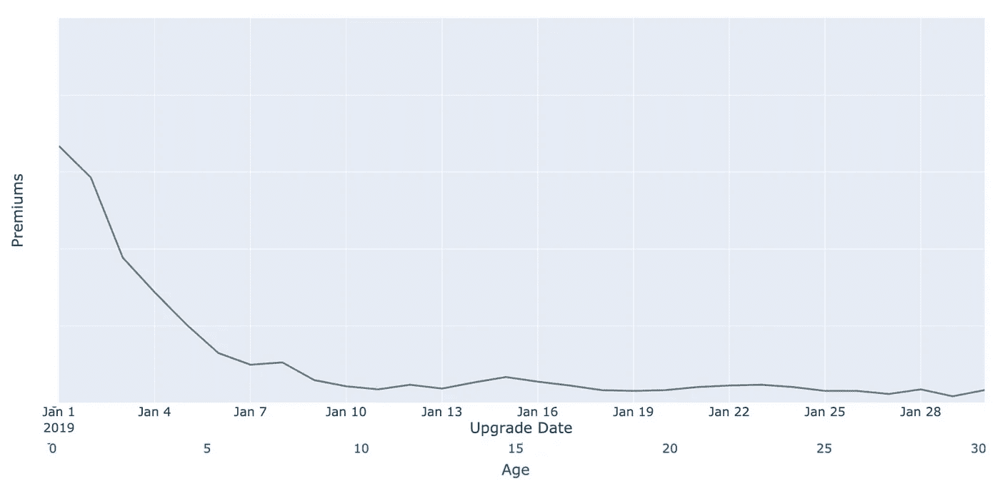

图一。2019-01-01 登记日期群组按升级日期和年龄划分的保费。*(图片作者)*

# 群体行为(几乎)相似

通常，群体的行为是相似的。当按升级日期绘制不同注册日期的多个队列的保费时，我们可以观察到它们具有相似的形状。

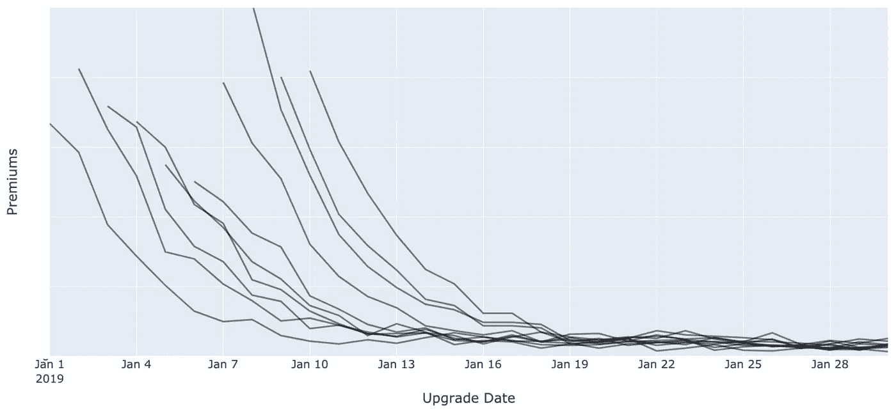

图二。按**升级日期** —前 30 天划分的不同注册日期的群组。(图片由作者提供)

当我们用年龄而不是日期来划分相同的人群时，这种相似性就更加明显了。

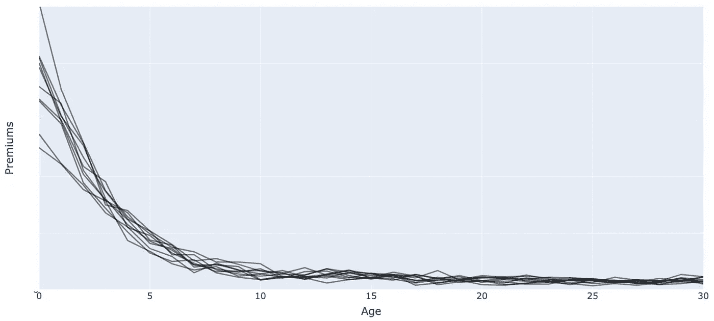

图 3。按**年龄** —前 30 天划分的不同注册日期的队列。(图片由作者提供)

同样，如果我们按年龄划分相同的队列，但现在是注册后的 365 天，我们可以观察到一些长尾，这意味着队列在注册后很久才产生保费。

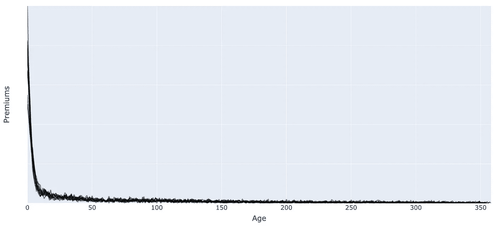

图 4。按**年龄**——前 365 天划分的不同注册日期的队列。(图片由作者提供)

在上图中可以观察到一些重要的特征:

*   注册后的头几天会产生更多的保费；
*   随着新用户“变老”，他们购买保费的速度正在迅速下降。这种下降以非常非线性的方式出现，类似于[幂律](https://en.wikipedia.org/wiki/Power_law)关系；
*   大量订阅是在用户注册后很久才被购买的——“长尾”。

# 按群组预测保费

假设今天是 2020 年 1 月 1 日，我们想预测未来 90 天的新保费。最终，保费将来自现有的**群组(到今天为止注册的用户)和未来的**群组(从明天开始的季度中注册的用户)。****

## 最近的队列

首先，让我们将过去 365 天内注册的所有现有群组称为**最近的**。

> 这里 365 天的门槛是任意选择的。对于一些公司来说，根据尾部的不同，最近一批是在过去 90 天内注册的，对于其他公司来说，可能是 2 年。这个想法是将现有的组群分为新的和旧的，并应用不同的预测模型。我们稍后将回到这一点。

绘制最近的群组时，它们可能如下图所示。我们的任务是预测今天以后的日期，用红色标记。红色标记右边的线条对我们来说是未知的。这就是我们想要预测的。

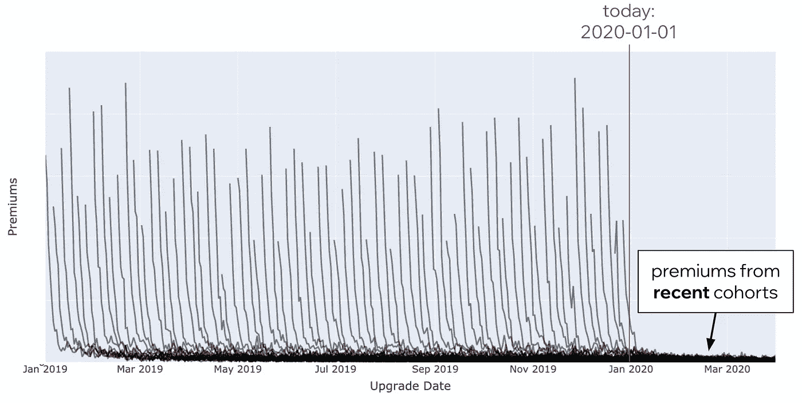

图 5。最近的一群人。(图片由作者提供)

预测最近几个群体产生的保费意味着将这些群体的“尾部”外推至未来。例如，正如您在下图中看到的，对于 2019 年 12 月 15 日登记的现有群组，我们必须用红色虚线来猜测真正的灰色线，这是我们未知的，但希望可以从旧群组中了解到。现有的近期组群也是最容易预测的，因为我们对它们了解更多，最重要的是，我们知道它们的规模，我们知道它们的初始动态。

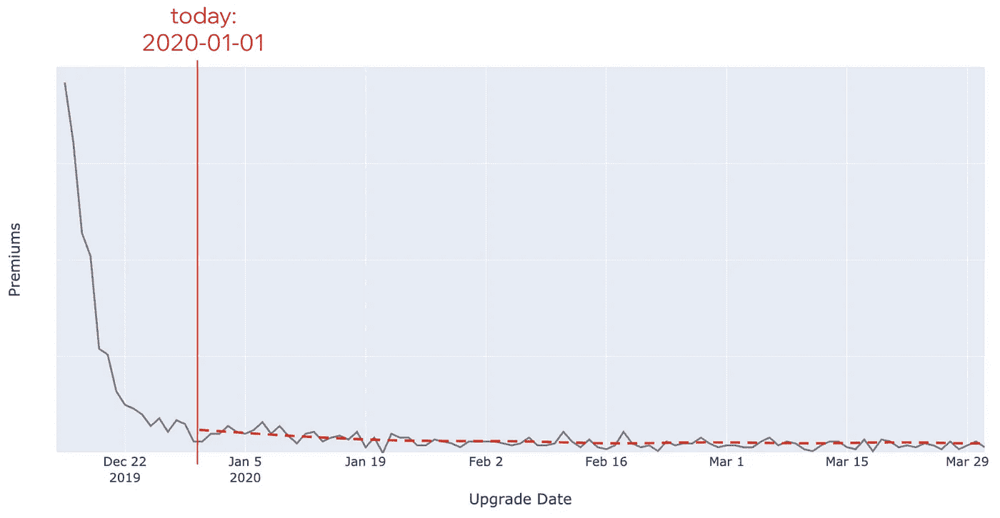

图 6。最近一批人截至今天的实际保费，然后是实际保费和之后的预测保费。(图片由作者提供)

## **未来的队列**

我们还必须对今天之后出生的未来人群进行估计。这些在下图中用蓝色标出。我们不太了解未来的群体，也许除了在接下来的 90 天里我们每天都会有一个新的群体。明天出生的群体将有 90 天产生保费，而在预测期最后一天登记的群体将只有一天产生保费。希望这些群体与过去的群体具有相同的特征，绘制蓝色形状更接近于数据科学，而不是绘画。

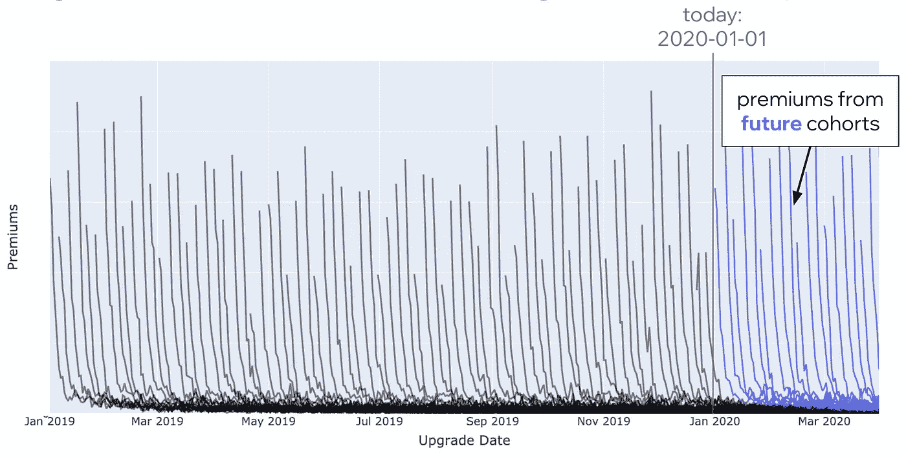

图 7。近期和未来的队列。(图片由作者提供)

## 老同学

除非我们的产品(或公司)还不到一年(我们为最近选择的阈值)，否则我们最终也会拥有**的老**团队。这些是现有的组群，在最近的组群之前和预测期开始之前很久就登记了。让我们将它们也添加到情节中，并用橙色标记它们。它们表现为许多略高于零的重叠线条。可以有很多。例如，如果产品的历史从 2010 年开始，将有大约 3，285 个队列行(9 年* 365 个注册日期)。尽管数量很少，但老团队产生的总保费可能占总收入的很大一部分。

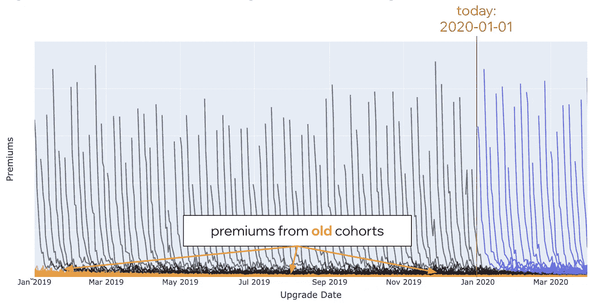

图 8。旧的、最近的和未来的队列。(图片由作者提供)

现在，让我们按升级日期汇总所有群组，并绘制它们的总数。如下图所示，这是一些看起来不错的时间序列。这里要做一些观察:

*   最近一批人的保费随着时间而下降(记住幂律随年龄衰减)。
*   未来群体在未来保费总额中所占比例更大。
*   老年群体可能占总数的很大一部分。

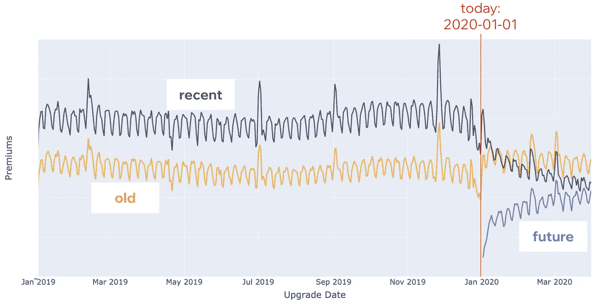

图 9。按旧的、最近的和未来的群组划分的总保费。(图片由作者提供)

让我们更进一步，总结所有三个部分:旧的、最近的和未来的。这将得到我们的目标总保费的时间序列。也就是下图中的黑色粗线。

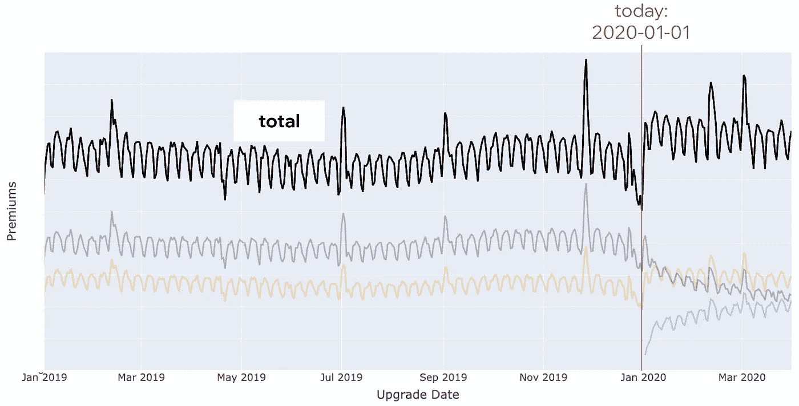

图 10。按旧的、最近的和未来的群组列出的保险费总额。(图片由作者提供)

上述技术正是我们用来预测保费的。我们将群组分为旧群组、新群组和未来群组。对于每一部分，我们应用一个独立的回归模型。我们这样做是因为这些模型在分布和可用特性方面是不同的。这些模型中的每一个都预测了许多队列(注册日期)的保费。对于每个群组，它预测未来许多升级日期的保费。然后，我们按升级日期汇总每个模型的预测，以获得每个部分的时间序列:旧的、最近的和未来的。最后，我们将所有三部分加在一起，得出升级日期的总保费。这实际上是时间序列模型将带给我们的——未来日期的溢价。基于群组的方法以更复杂的方式做到了这一点。就预测的准确性和对用户的额外了解而言，这有其优势。

> 总之，我们刚刚证明，使用基于群组的方法，我们将预测的时间序列任务转化为回归任务。

## 预测目标的时间序列属性

总计的时间序列有一些有趣的属性需要我们建模:

*   季节性(每周、每年)
*   节假日(如圣诞节、独立日、复活节)
*   特殊活动期间的销售高峰(如黑色星期五，网络星期一)

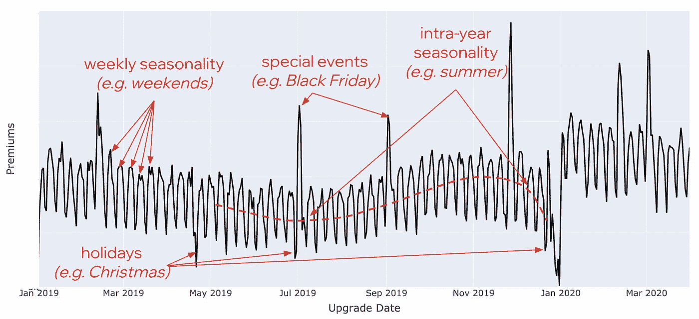

图 11。时间序列属性:季节性，节假日。(图片由作者提供)

当然，当缩小一点时，我们可能会发现我们的模型中也需要包含趋势(见下图)。

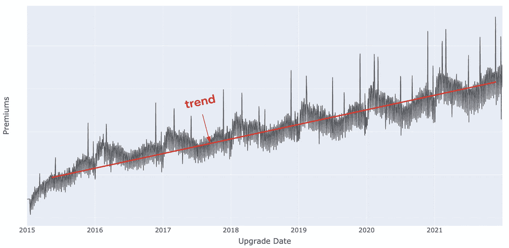

图 12。时间序列属性:趋势。(图片由作者提供)

# 基于群组预测的回归模型

在我们进一步讨论之前，让我们回忆一下通常的时间序列方法。我们有一个目标，我们希望以时间序列的形式按日期进行预测。时间序列是日期-值对的序列。我们也可以将外生变量添加到模型中。数据可能如下表所示。

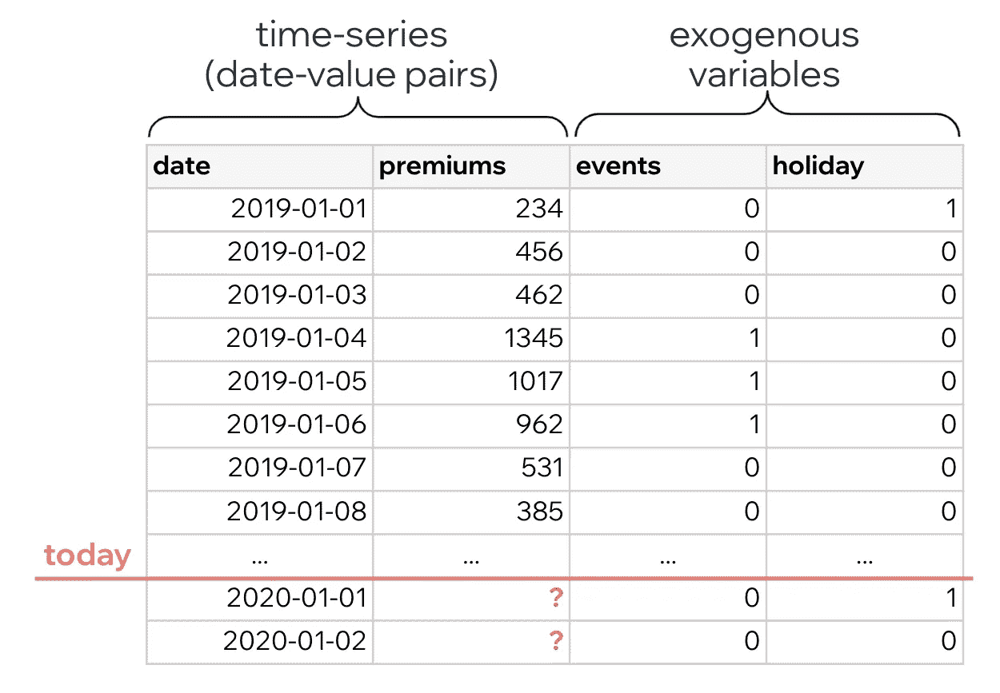

表 1。时间序列数据。(图片由作者提供)

通常使用的候选模型有 Prophet、Holt-Winters、SARIMAX、LSTM、X11、SEATS 等。

相比之下，群组模型的数据具有双重关键，因为我们通过注册日期和升级日期来表示目标。每个群组(注册日期)有许多升级日期。这是注册日期和升级日期之间的笛卡尔乘积。对于这些关键字，我们可以加入各种特征，如年龄、事件、假期、季节性条款等。一些将通过升级日期(例如假期)连接，其他将通过注册日期(例如群组的大小)连接，或者甚至通过两个关键字连接，例如，年龄特征被计算为升级和注册之间的差异。最终，这个表格数据比时间序列数据有更多的列和更多的行。

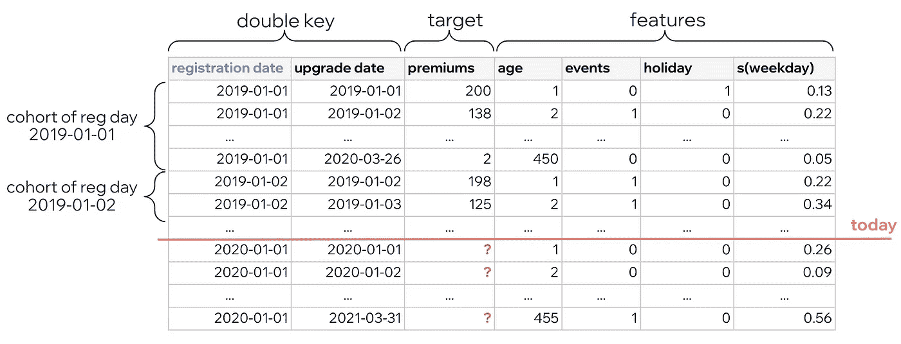

表二。队列数据。(图片由作者提供)

美妙的是，对于这种类型的数据，我们可以应用任何回归模型。我们来考虑几个。

## **广义线性模型(GLM)**

> **优点**:可解释性&简单性；2)当包括时间作为特征时趋势的外推；3)支持来自指数族的非正态分布(泊松、伽马、特威迪)。
> 
> **缺点** : 1)手动特征工程(好用:非线性的样条，交互的张量积)；2)很少有 python 包具备所有的分布和正则化；3)对分布和链接功能的选择敏感。

[广义线性模型](https://en.wikipedia.org/wiki/Generalized_linear_model)是一种线性模型，允许目标具有非正态误差分布。GLM 允许通过连接函数对特征和目标之间的非线性关系进行建模。例如，我们可以假设目标的条件均值遵循泊松分布，并使用对数函数。该公式可能如下所示:

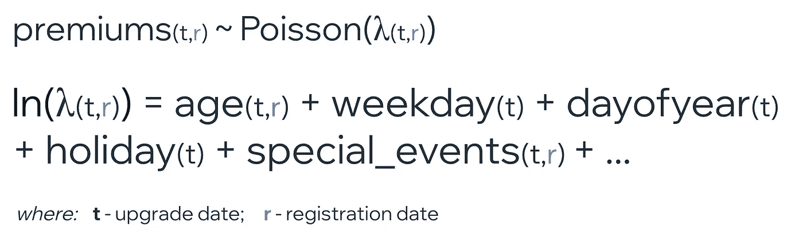

(图片由作者提供)

在 Python 中，至少有两个好的 GLMs 库:`[statsmodels](https://www.statsmodels.org/stable/generated/statsmodels.genmod.generalized_linear_model.GLM.html)`和`[scikit-learn](https://scikit-learn.org/stable/modules/linear_model.html#generalized-linear-regression)`。在 R 中有著名的`[mgcv](https://cran.r-project.org/web/packages/mgcv/index.html)`包和来自 stats 的`[glm](https://stat.ethz.ch/R-manual/R-devel/library/stats/html/glm.html)`方法。参见下面一个使用`statsmodels`的代码存根。

GLM 的代码示例(来源:作者的 [Github](https://gist.github.com/nicolaivico/98b730883047f8330af6143f2c48e3c6)

## 梯度增压机(GBM)

> **优点:** 1) 通过设计处理非线性和交互；2)不需要或很少需要特征工程；3)支持来自指数族的非正态分布(泊松、伽马、特威迪)；4)对分布的选择不太敏感；5)许多好的库可供选择(例如 LightGBM、XGBoost、CatBoost)；
> 
> **缺点** : 1)不能根据看不见的数据进行推断，例如不能推断趋势；

[梯度增强机器](https://arogozhnikov.github.io/2016/06/24/gradient_boosting_explained.html)是强大的模型，在我们的情况下表现良好，特别是如果数据没有趋势或只有微弱的趋势。在我们的例子中，这是 GBM 的唯一缺点:它不能根据看不见的数据进行推断，这意味着它也不能推断趋势。预测时间越长，最终误差越大。

GBM 有几个不错的库: [LightGBM](https://lightgbm.readthedocs.io/) ， [XGBoost](https://xgboost.ai/) ， [CatBoost](https://catboost.ai/) 。请参见下面的`lightgbm`代码存根。

GBM 的代码示例(来源:作者的 [Github](https://gist.github.com/nicolaivico/d213f46e0855a464ea8e3500492b8dc5)

# **几条重要建议**

## 选择正确的发行版

这在 GLMs 的情况下尤其重要。目标通常非常不正常，有严重的右倾斜。该分布通常属于指数族。它可以是泊松、伽马或更一般的 Tweedie(方差幂在 1 和 2 之间)。通过验证来尝试它们中的每一个。作为证明，在下图中，即使在对数变换之后，目标仍然高度倾斜。仅仅用对数变换或 Box-Cox 对目标进行归一化并假设正态性是不够的。

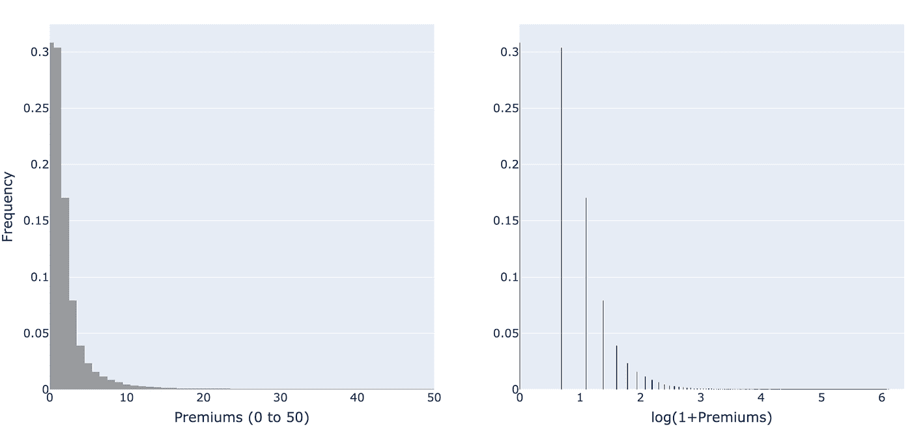

图 13。目标的分布:原始的和转化的。(图片由作者提供)

## 随年龄非线性衰减的工程特征

通常，“年龄”是最重要的特征，因为它描述了保费的非线性衰减——变异的主要来源。如下图所示，在 *log(保费)*和 *log(年龄)*之间有一个近似线性的关系，暗示了原始值之间的幂律关系。

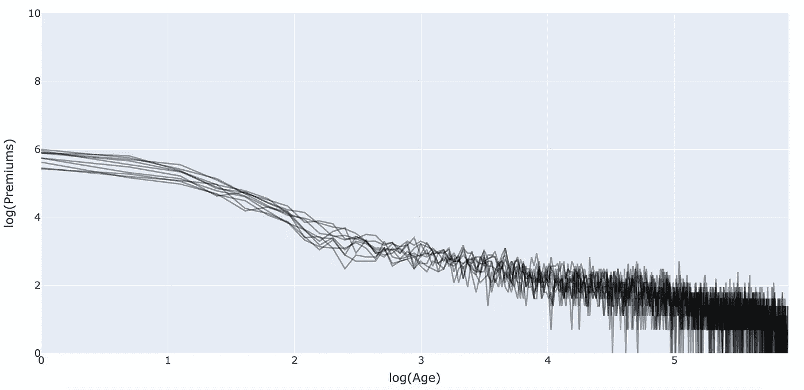

图 14。log(保费)和 log(年龄)之间几乎呈线性关系，证实了原始值之间的幂律关系。(图片由作者提供)

这种非线性只能通过“年龄”这一原始特征的转换引入到线性模型中。这对于 GLMs 也是特别重要的。GBMs 将自动处理这种非线性，年龄的转换不一定有帮助。

在 GLMs 的情况下，如果对数变换是不够的(通常是不够的)，我会推荐使用 B 样条。有时甚至更好，如果你考虑一个[通用加法模型](https://m-clark.github.io/generalized-additive-models/) (GAM)模型(因为样条是算法的一部分)。在下图中，我们有一组彩色的 B 样条曲线，它们加在一起形成红色的粗线，并适当地近似非线性衰减。

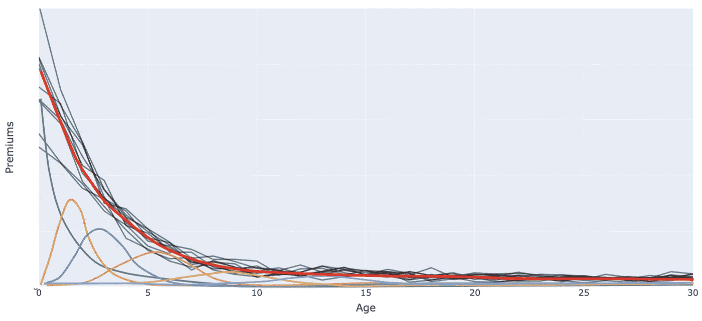

图 15。用 B 样条对非线性衰减建模。(图片由作者提供)

有几个 Python 库提供了 B 样条:`statsmodels`、`scikit-learn`、`patsy`、`pygam`。样条作为一组替换原始年龄的要素添加到线性模型中。每个样条特征都有一个系数，因此它们的总和形成了一个好看的形状，就像上图中的红线一样。应该通过在拟合时施加惩罚来控制摆动。在 GAM 模型中，也有可能对衍生品施加惩罚。看看下面我们如何用`statsmodels`构造一组 B 样条曲线。

B 样条的代码示例(来源:作者的 [Github](https://gist.github.com/nicolaivico/9d4ae16b1e5c29edb87a5d1068be9163)

## 在旧群体和新群体之间选择正确的界限

在本文中，我们选择旧队列和新队列之间的截止年龄为 365 天。该阈值应被视为需要校准的超参数。一个很好的经验法则是从按年龄划分多个现有群组开始。你会得到一个类似下图的图片。

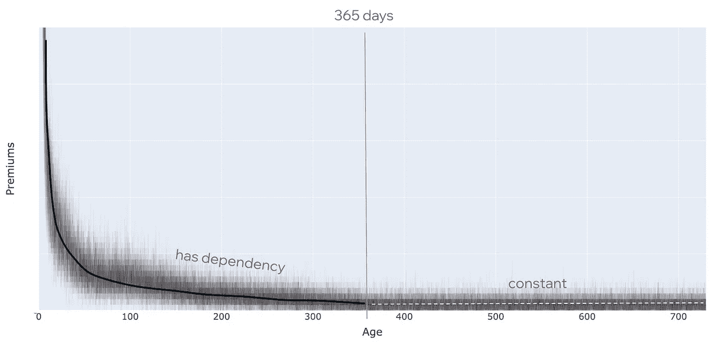

图 16。在旧年龄和最近年龄之间选择截止年龄。(图片由作者提供)

我们希望找到保费对年龄的依赖性消失并变得恒定的点。从该值开始，然后通过网格搜索向左和向右移动，找到确保旧群组和最近群组之间最佳分离的阈值。最佳分离是确保聚合模型(旧模型+最近模型+未来模型)的最低 MAPE 的分离。这很重要，因为我们将不同的模型应用于新的和旧的队列。较高的截止年龄将指定更多的组群为近期组群，较少的组群为老年组群。换句话说，当我们增加阈值时，最近模型在聚集模型中的权重将增加。

## 使用时间序列模型预测旧队列

继续前面的建议，有些情况下最好使用时间序列模型来预测旧群组。发生这种情况有两个原因:

*   通过注册日期加入的与群组相关的特征对于模型变得无关紧要。例如，年龄变得无关紧要(记住平坦的尾部),群组大小(注册用户的数量)等其他特征也变得不必要，可以在不损失预测精度的情况下删除。
*   旧群组有很长的历史，数据量变得太大而无法处理。假设我们有 10 年的历史。最近的队列需要一年的时间，而旧的模型需要 9 年。最终，旧表将有大约 5，397，255 行(9 年* 365 个注册日期，每个日期平均有 1，643 个升级日期，算术和—第一个注册日期有 9*365 个升级日期，而最后一个注册日期只有一个升级日期)。

## 使用滚动向前验证

即使我们处理表格数据，我们也必须尊重数据的时序性质。我们必须避免前瞻偏见，这意味着我们必须始终根据过去进行训练，并预测未来。一个好的验证方法是在升级日期之前执行滚动的前推验证。下图说明了这种技术。

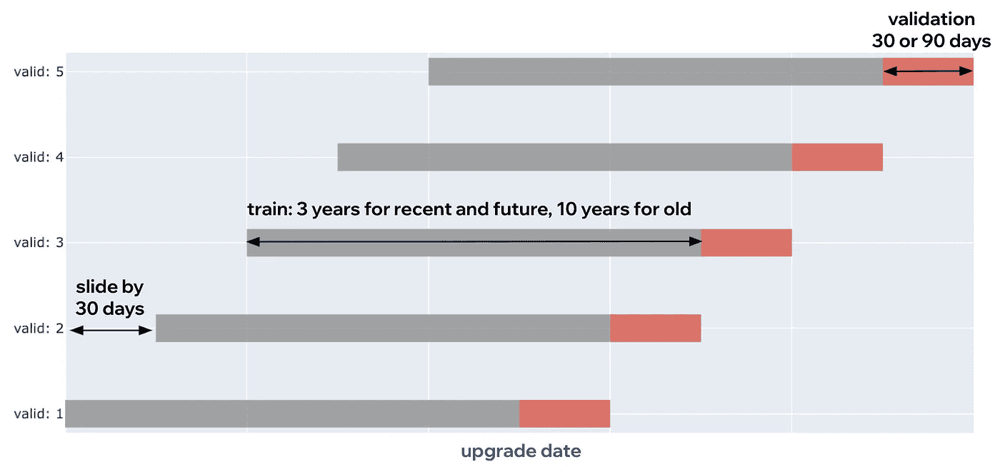

图 17。按升级日期滚动向前验证。(图片由作者提供)

# 综合数据

通常情况下，你不会发现一个特定公司的高级订阅的历史数据。这是财务数据，意味着它是敏感的，不会公开。这也是为什么你不会找到太多关于如何预测高级订阅的文章的原因。对于本文中的所有数据，我都使用了我自己生成的合成数据，这些数据模拟了我在[Wix.com](https://www.wix.com/)处理公司数据时观察到的主要特性。你可以用[这个](https://github.com/nicolaivico/gen-synth-data-cohorts) Python 脚本生成同样的合成数据。

*特别感谢我的同事*[*Nicolas Marcille*](https://medium.com/u/f19c7e83c1c3?source=post_page-----e71003bc7ecd--------------------------------)*，他最初在*[*Wix.com*](https://www.wix.com/)*开始群组模型的工作。*