# 使用机器学习模型进行预测

> 原文：<https://towardsdatascience.com/forecasting-with-machine-learning-models-95a6b6579090?source=collection_archive---------4----------------------->

## [行业笔记](https://towardsdatascience.com/tagged/notes-from-industry)

## mlforecast 通过机器学习快速轻松地进行预测

*乘*[尼克斯队](https://github.com/Nixtla/) *。* [*费德·加尔萨·拉米雷斯*](https://medium.com/u/2855bd3e0293?source=post_page-----95a6b6579090--------------------------------) ，[马克斯·梅根塔尔](https://medium.com/u/76b639655285?source=post_page-----95a6b6579090--------------------------------)

> **TL；博士**:我们介绍了 mlforecast，这是一个来自 [Nixtla](https://github.com/Nixtla/nixtla) 的开源框架，它使得在时间序列预测任务中使用机器学习模型变得快速而简单。它允许您关注模型和特性，而不是实现细节。使用 mlforecast，您可以以更轻松的方式进行实验，它具有内置的回溯测试功能，可以帮助您找到性能最佳的模型。
> 
> 您可以在自己的基础设施中使用 mlforecast，或者使用我们的[完全托管解决方案](https://github.com/Nixtla/nixtla)。只需给我们发邮件到 [federico@nixtla.io](http://federico@nixtla.io) 来测试私有测试版。
> 
> 虽然这个例子只包含了一个时间序列，但是这个框架能够处理成千上万的时间序列，并且在时间和内存上都非常有效。

## 介绍

我们在 Nixtla，正试图让时间序列预测更容易被每个人接受。在本帖中，我们将讨论在预测任务中使用机器学习模型。我们将用一个例子来说明主要挑战是什么，然后我们将介绍 [mlforecast](https://github.com/Nixtla/mlforecast) ，这是一个有助于在预测中使用机器学习模型的框架。 **mlforecast** 为您进行特性工程并负责更新，用户只需提供一个遵循 scikit-learn API(实现拟合和预测)的回归变量，并指定她想要使用的特性。这些功能可以是滞后、基于滞后的转换和日期功能。(如需进一步创建功能或自动预测管道，请检查 [nixtla](https://github.com/Nixtla/nixtla) 。)

## 动机

许多年来，像 ARIMA 和 ETS 这样的经典方法统治了预测领域。其中一个原因是，大多数用例涉及以月、季度或年为粒度预测低频序列。此外，没有很多时间序列数据集，因此为每个数据集拟合一个模型并从中获得预测是很简单的。

然而，近年来，对更大数据集、更高频率的预测需求有所上升。更大和更高频率的时间序列对传统的预测方法提出了挑战。这些方法并不意味着对许多时间序列一起建模，它们的实现是次优的和缓慢的(你必须训练许多模型)，此外，序列之间可能有一些共同或共享的模式，可以通过对它们一起建模来学习。

为了解决这个问题，已经有各种努力来提出不同的方法，这些方法可以在许多时间序列上训练单个模型。一些有趣的深度学习架构已经被设计出来，可以准确地预测许多时间序列，如 ESRNN，DeepAR，NBEATS 等。(检查 [nixtlats](https://github.com/Nixtla/nixtlats) 和[为我们的 WIP 复制 ESRNN 结果](https://nixtla.github.io/blog/deep%20learning/forecasting/m4/2021/06/25/esrnn-i.html)。)

像梯度提升树这样的传统机器学习模型也已经被使用，并且已经表明它们也可以实现非常好的性能。但是，将这些模型与基于滞后的要素结合使用并不简单，因为您必须在每个时间步长中更新要素才能计算预测。此外，根据您的预测范围和您使用的滞后时间，在某个时间点，您会用完系列的实际值来更新您的要素，因此您必须采取措施来填补这些缺口。一种可能的方法是使用您的预测作为序列的值，并使用它们更新您的要素。这正是 **mlforecast** 为你做的。

## 例子

在下一节中，我们将展示一个非常简单的单序列示例，以强调在预测任务中使用机器学习模型的困难。这将在以后激发对 mlforecast 的使用，这是一个使整个过程更加容易和快速的库。

## 图书馆

## 数据

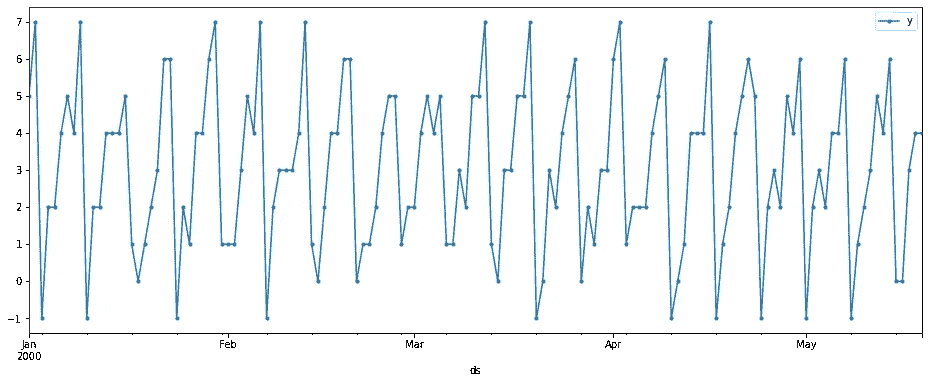

作者图片

我们的数据具有每日季节性，正如您在创建中看到的，它基本上只是 dayofweek + Uniform({-1，0，1})。

## 培养

假设我们想要未来 14 天的预测，第一步将是决定使用哪个模型和特性，因此我们将创建一个包含数据中最后 14 天的验证集。

作为起点，我们将尝试滞后 7 和滞后 14。

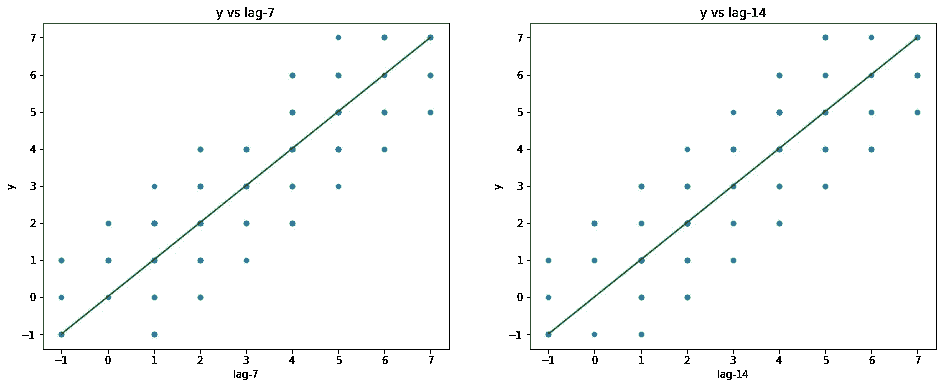

作者图片

我们可以看到滞后和目标之间的预期关系。例如，当 *lag-7* 为 2 时， *y* 可以是 0、1、2、3 或 4。这是因为一周中的每一天都可以有值[day-1，day，day + 1]，所以当我们处于一周中的第 2 天时，我们可以得到值 1、2 或 3。然而，值 2 可以来自第 1 周的某一天，其最小值为 0，也可以来自第 3 周的某一天，其最大值为 4。

计算滞后值会使一些行为空。

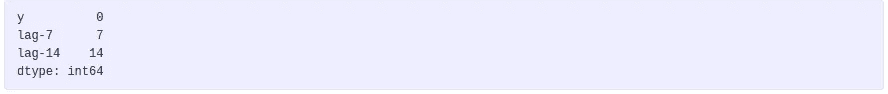

作者图片

我们会在训练前放下这些。

为了简单起见，我们将训练一个没有截距的线性回归。因为最好的模型是取一周中每一天的平均值，我们期望得到接近 0.5 的系数。

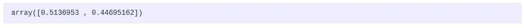

作者图片

这个模型取的是 0.51 * lag_7 + 0.45 * lag_14。

## 预测

太好了。我们有训练有素的模特。我们如何计算未来 14 天的天气预报？机器学习对特征矩阵 *X* 建模，输出预测值 *y* 。因此，我们需要为接下来的 14 天创建特征矩阵 *X* ，并将其交给我们的模型。

如果我们想得到第二天的 *lag-7* ，按照训练集，我们可以得到从末尾开始的第 7 个位置的值。训练集结束后两天的 *lag-7* 将是从末尾开始的第 6 个位置的值，依此类推。对于 *lag-14* 也是如此。

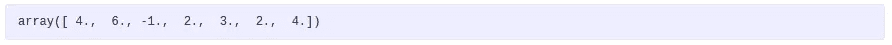

作者图片

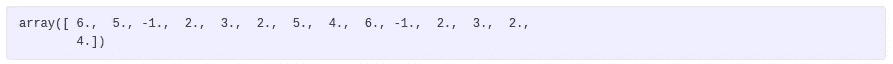

作者图片

您可能已经注意到，我们只能从历史记录中获得 7 个 *lag-7* 值，而我们可以获得所有 14 个 *lag-14* 值。有了这些信息，我们只能预测接下来的 7 天，所以我们只取*滞后-14* 的前 7 个值。

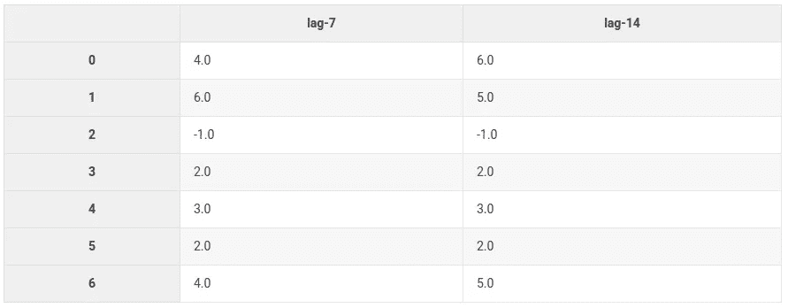

作者图片

有了这些功能，我们可以计算未来 7 天的天气预报。

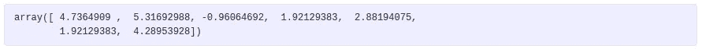

作者图片

这些值可以解释为最后一次训练日期后接下来 7 天的系列值。为了计算该日期之后的预测，我们可以使用这些值，就像它们是我们系列的值一样，并将它们用作后续期间的 *lag-7* 。

换句话说，我们可以用这些值和 *lag-14* 的真实值填充特征矩阵的其余部分。

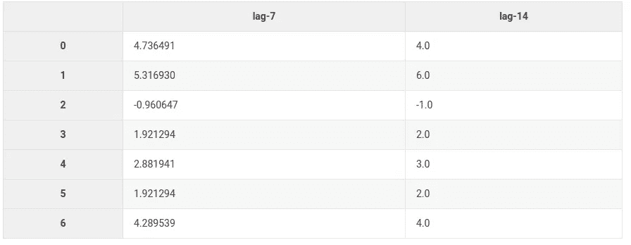

作者图片

如你所见，我们仍在使用 *lag-14* 的真实值，并且我们插入了我们的预测值作为 *lag-7* 的值。我们现在可以使用这些特征来预测剩余的 7 天。

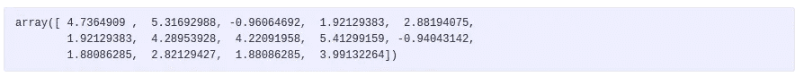

作者图片

现在我们有了未来 14 天的预测！这并不痛苦，但也不漂亮或容易。我们刚刚使用了滞后，这是我们可以拥有的最简单的功能。

如果我们使用了 *lag-1* 会怎么样？我们需要做这个预测更新步骤 14 次！

如果我们有更精细的特征，比如在一段时间内的滚动平均值，会怎么样呢？正如你可以想象的那样，它会变得相当混乱，而且很容易出错。

## ml 预测

带着这些问题，我们创建了 [mlforecast](https://github.com/Nixtla/mlforecast) ，这是一个帮助你使用机器学习模型预测时间序列的框架。它为你处理所有这些混乱的细节。你只需要给它一个模型，并定义你想要使用的功能，让 *mlforecast* 做剩下的事情。

**mlforecast** 在 [PyPI](https://pypi.org/project/mlforecast/) ( `pip install mlforecast`)以及 [conda-forge](https://anaconda.org/conda-forge/mlforecast) ( `conda install -c conda-forge mlforecast`)中均有。

使用 **mlforecast** 和以下代码可以解决之前描述的问题。

首先，我们必须按照要求的格式设置数据。

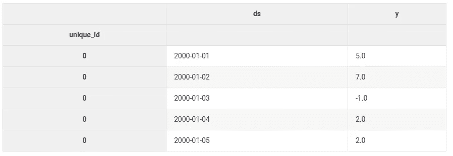

作者图片

这是必需的输入格式。

*   一个名为 **unique_id** 的索引，用于标识每个时间序列。在这种情况下，我们只有一个，但是你想要多少就有多少。
*   带有日期的 **ds** 栏。
*   带有值的 **y** 列。

现在我们将导入[时间序列](https://nixtla.github.io/mlforecast/core.html#TimeSeries)转换器，在这里我们定义我们想要使用的特性。我们还将导入[预测](https://nixtla.github.io/mlforecast/forecast.html#Forecast)类，它将保存我们的转换器和模型，并将为我们运行预测管道。

我们初始化我们的转换器，指定我们想要使用的滞后。

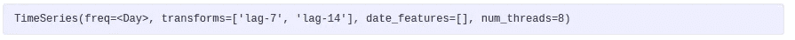

作者图片

如你所见，该变压器将使用*滞后-7* 和*滞后-14* 作为特征。现在我们定义我们的模型。

我们用模型和时序转换器创建一个[预测](https://nixtla.github.io/mlforecast/forecast.html)对象，并使其适合我们的数据。

现在，我们只需调用我们想要的预测范围的预测。

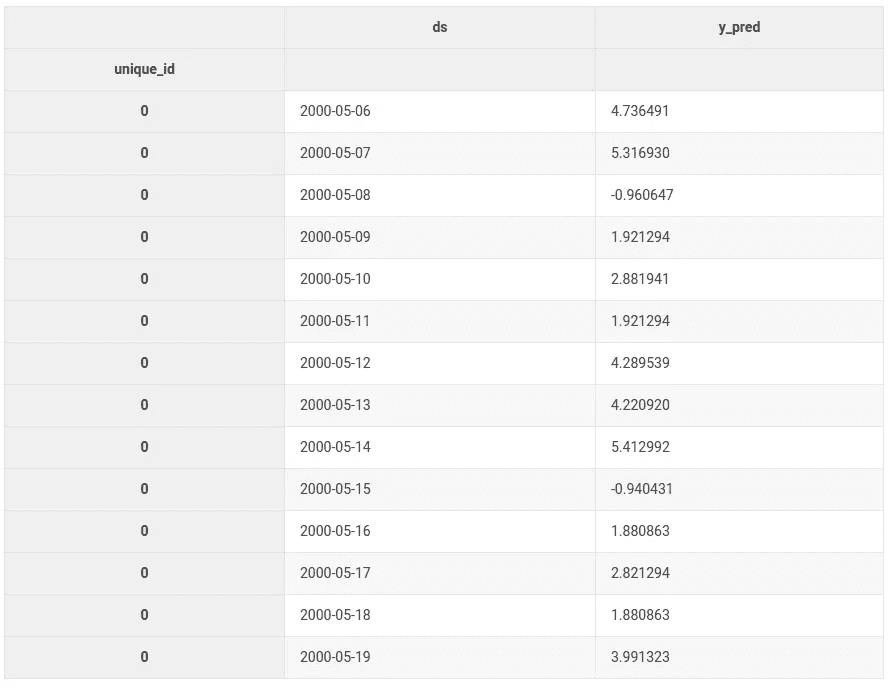

作者图片

这要容易得多，在内部，这与我们以前做的一样。让我们快速验证一下。

检查我们是否得到了相同的预测:

检查我们是否有相同的型号:

## 实验变得更容易

有了这种高层次的抽象，我们就可以专注于定义最好的特性和模型，而不是担心实现细节。例如，我们可以通过编写一个利用 *mlforecast* 的简单函数来非常容易地尝试不同的滞后:

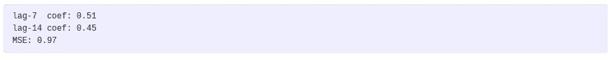

作者图片

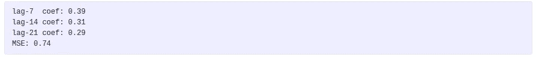

作者图片

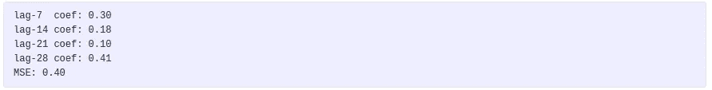

作者图片

## 回溯测试

在前面的例子中，我们手动分割数据。**预测**对象也有一个[回溯测试](https://nixtla.github.io/mlforecast/forecast.html#Backtesting)方法可以为我们做到这一点。

我们将首先把所有的数据转换成所需的格式。

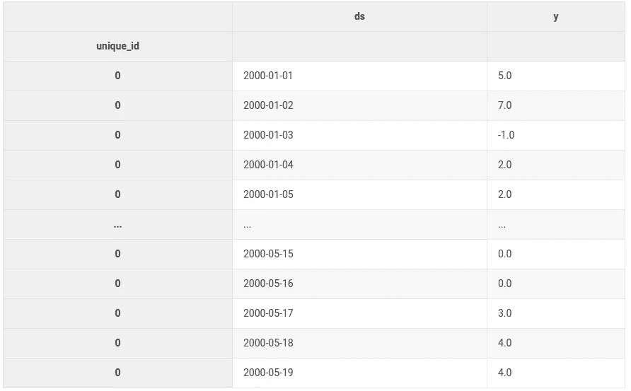

作者图片

现在我们像以前一样实例化一个`Forecast`对象，并调用`backtest`方法。

这将返回一个生成器，其中包含每个窗口的结果。

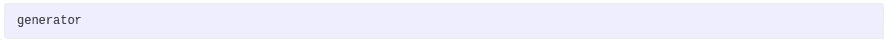

作者图片

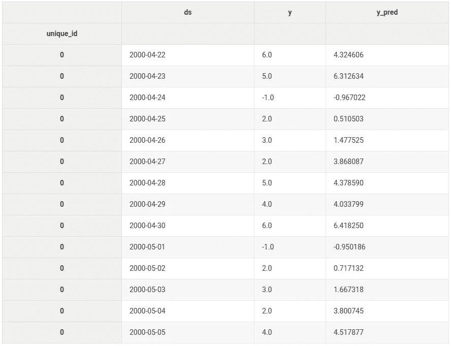

作者图片

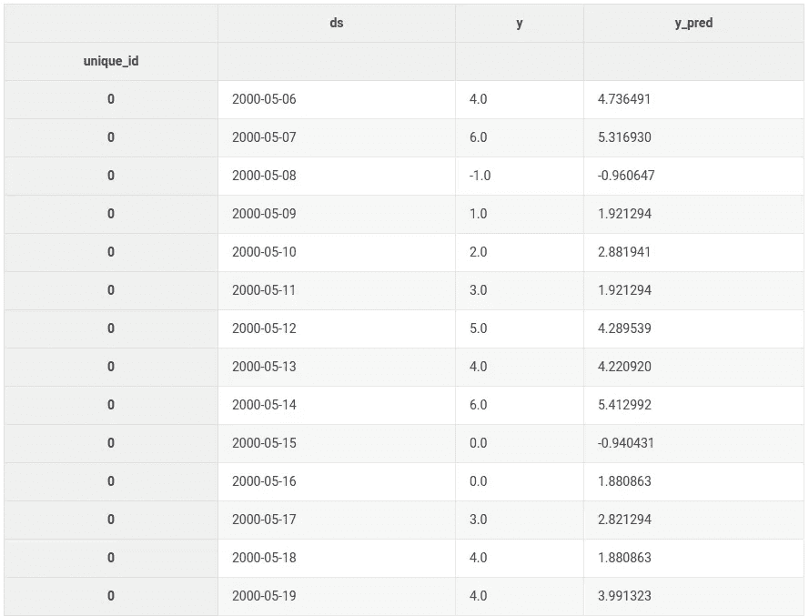

作者图片

`result2`这里和我们手动做的评估一样。

我们可以使用几个窗口为不同的滞后定义一个验证方案。

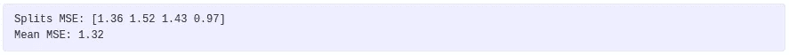

作者图片

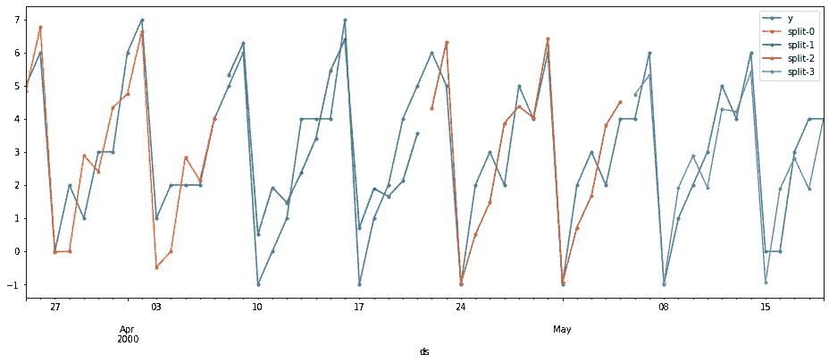

作者图片

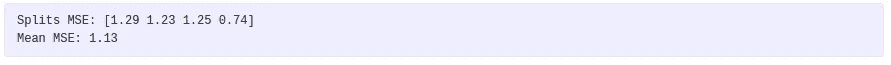

作者图片

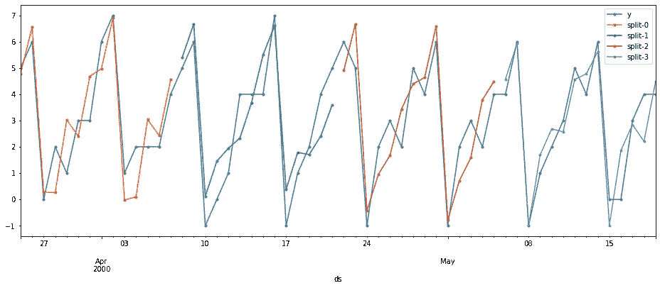

作者图片

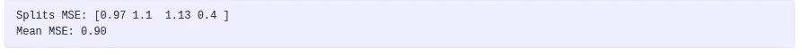

作者图片

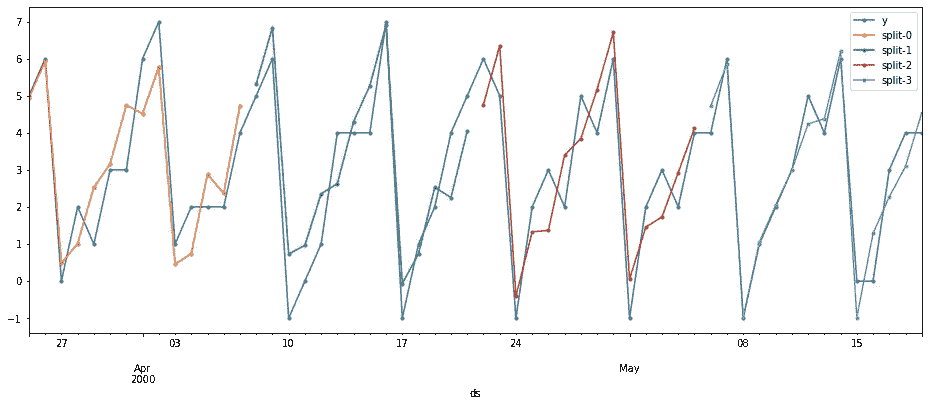

作者图片

## 滞后转换

我们可以指定滞后上的转换，也可以只指定滞后。 [window_ops](https://github.com/jose-moralez/window_ops) 库有一些不同窗口函数的实现。您也可以定义自己的转换。

让我们试试季节性滚动平均值，这是过去`n`个季节的平均值，在这种情况下，它将是过去`n`周一、周二等的平均值。计算这个特性的更新可能会有点烦人，但是，使用这个框架，我们可以把它传递给 *lag_transforms* 。如果转换需要额外的参数(除了序列的值之外)，我们指定一个类似于`(transform_function, arg1, arg2)`的元组，在本例中是`season_length`和`window_size`。

```
help(seasonal_rolling_mean)Help on CPUDispatcher in module window_ops.rolling:

seasonal_rolling_mean(input_array: numpy.ndarray, season_length: int, window_size: int, min_samples: Union[int, NoneType] = None) -> numpy.ndarray
    Compute the seasonal_rolling_mean over the last non-na window_size samples of the
    input array starting at min_samples.
```

*lag_transforms* 获取一个字典，其中键是我们想要应用转换的 lag，值是转换本身。

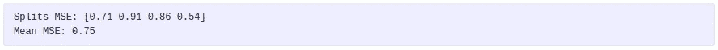

作者图片

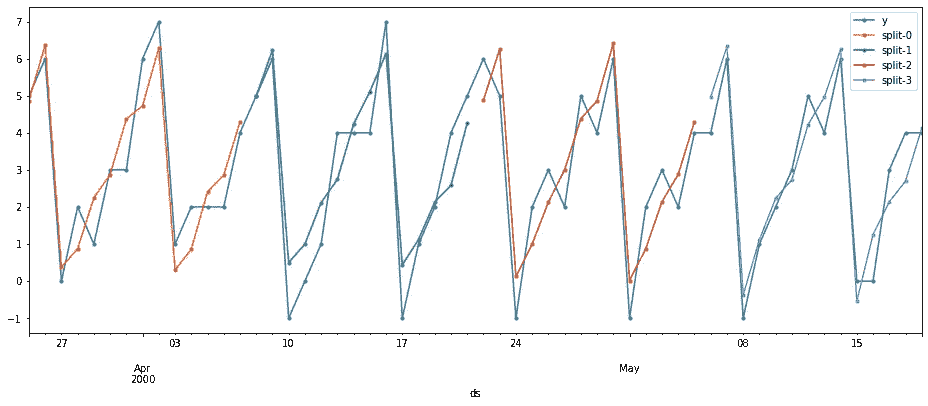

作者图片

## 日期功能

您还可以指定要计算的日期特性，这些特性是 **ds** 列的属性，并且也在每个时间步长中更新。在本例中，最好的模型是取一周中每一天的平均值，这可以通过对一周中的某一天列进行一次性编码并拟合线性模型来实现。

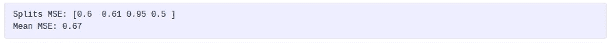

作者图片

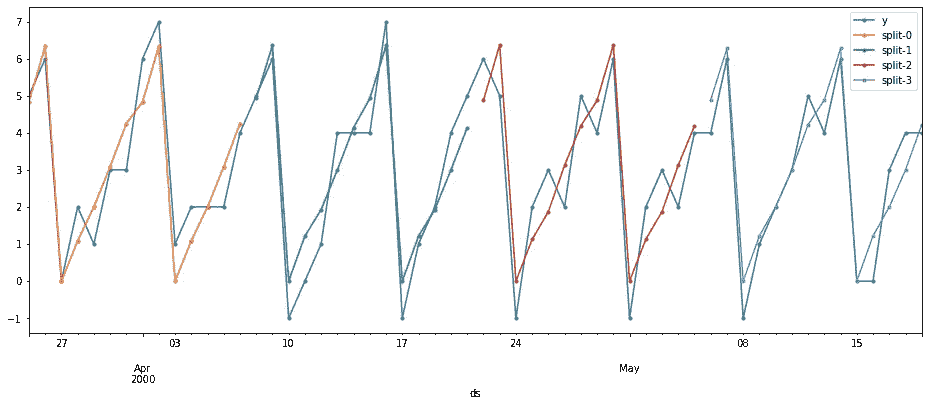

作者图片

## 后续步骤

mlforecast 拥有更多类似[分布式训练](https://nixtla.github.io/mlforecast/distributed.forecast.html#Example)和 [CLI](https://nixtla.github.io/mlforecast/cli.html#Example) 的特性。如果您感兴趣，可以从以下资源中了解更多信息:

*   GitHub 回购:[https://github.com/Nixtla/mlforecast](https://github.com/Nixtla/mlforecast)
*   文档:[https://nixtla.github.io/mlforecast/](https://nixtla.github.io/mlforecast/)
*   在 https://www.kaggle.com/lemuz90/m5-mlforecast 的 M5 竞赛中使用 mlforecast 的示例: