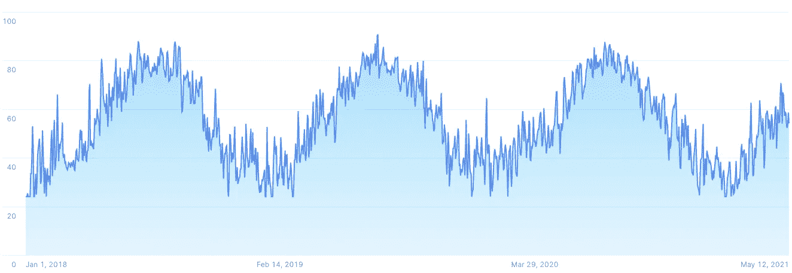
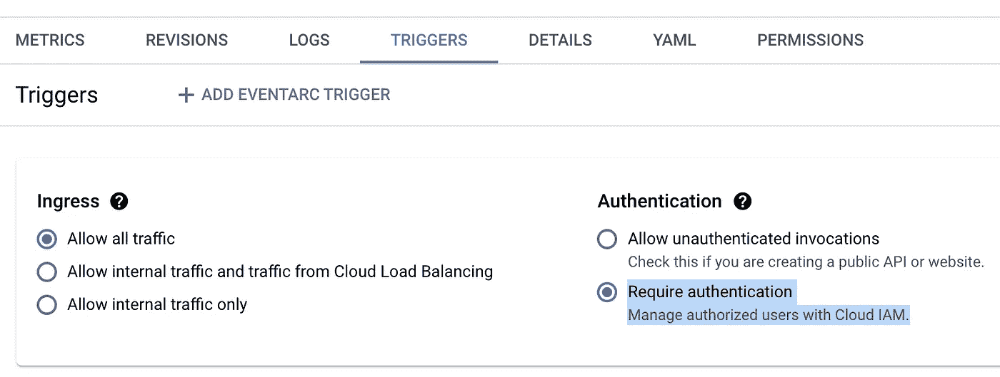

# 雪花中的预测:用 SQL 运行云上的脸书预言家

> 原文：<https://towardsdatascience.com/forecasts-in-snowflake-facebook-prophet-on-cloud-run-with-sql-71c6f7fdc4e3?source=collection_archive---------15----------------------->

## 通过创建一个雪花外部函数，我们可以得到脸书预言家对任何时间序列的预测。了解如何轻松地将这些预测集成到您的 SQL 管道中 Snowflake 连接到在 Google Cloud Run 内的 Docker 容器上运行的 Prophet。


图片: [Pixabay](https://pixabay.com/photos/woman-spirit-ball-5439365/)

# 2022–09 更新

> [脸书先知现在运行在雪花](https://hoffa.medium.com/facebook-prophet-forecasts-running-in-snowflake-with-snowpark-14fc870b56ae)内部，不需要外部函数。

<https://hoffa.medium.com/facebook-prophet-forecasts-running-in-snowflake-with-snowpark-14fc870b56ae>  

# 目标

这篇文章的目标是构建一个可以在 Snowflake 中用来预测时间序列的函数。一个很棒的开源工具是[脸书先知](https://facebook.github.io/prophet/)，我们只需要一种在我们的雪花环境中使用它的方法。这很容易，因为雪花能够运行[外部函数](https://docs.snowflake.com/en/sql-reference/external-functions-introduction.html)——因此我们只需要托管 Prophet 的一个实例，并添加必要的管道，以在雪花中完成`prophetize(timeseries)`函数。

先来个演示，雪花里任何时间序列都行:比如纽瓦克机场 2018 年以来纽约市周边的气温:

```
select date, temp
from noaa_gsod
where country_fips='US'
and station = 'NEWARK LIBERTY INTERNATIONAL AP';-- TODO: Show how to get NOAA GSOD from Knoema in a future post.
```



纽瓦克机场的每日温度

然后我们可以调用我们的函数`prophetize()`(见下面如何创建它),将之前的时间序列聚合到一个包含日期和值的数组中:

```
select prophetize(array_construct(
        array_agg(temp::float) 
          within group(order by date)
        , array_agg(date::date) 
          within group(order by date))::string) str
from table(result_scan(last_query_id(-1)));
```

仅此而已。我们得到的是一个带有预测的数组。可视化这些结果的一个简单方法是将前面两个查询的值结合起来:

```
select date, temp::float avg_temp
    , 0 forecast, 0 fore_min, 0 fore_max
from table(result_scan(last_query_id(-2)))
union all
select x.value[0]::date, 0, x.value[1]::int forecast, x.value[2]::int fore_min, x.value[3]::int fore_max
from table(result_scan(last_query_id(-1))) a, table(flatten(a.$1)) x;
```


纽瓦克机场的每日温度，加上未来 365 天的预报波段。

上面有趣的笔记:

*   Prophet 能够轻松检测季节模式并预测未来值。
*   Prophet 的许多工作方式都是可调的，但是开箱即用也是可行的。
*   在雪花上，我使用了`last_query_id(-1)`和`last_query_id(-2)`来组合前面两个查询的结果。这是一个很棒的功能。

现在让我们检查一下如何将雪花 SQL 世界`prophetize()`中的一个函数连接到运行在 Cloud Run 上的脸书先知的细节。

# 如何

## 将 Prophet 部署到云运行的容器上

构建这个容器的`requirements.txt`非常简单:

```
flask==1.1.4
requests==2.25.1
gunicorn==20.1.0
pandas==1.2.4
pystan==2.19.1.1  # <3.0
fbprophet==0.7.1
```

正如`Dockerfile`:

```
FROM python:3.8# Allow statements and log messages to immediately appear in the Cloud Run logs
ENV PYTHONUNBUFFERED TrueCOPY requirements.txt .
RUN pip install -r requirements.txtENV APP_HOME /app
WORKDIR $APP_HOME
COPY main.py ./CMD exec gunicorn --bind :$PORT --workers 1 --threads 1 --timeout 0 main:app
```

这是`main.py`，一个基本的 web 服务器，它将传入的数组解析成一个数据帧，Prophet 用它来预测任意数量的周期。然后，它返回一个序列化数组，其中包含雪花将收到的预测和不确定性间隔:

```
import json
import logging
import osfrom fbprophet import Prophet
from flask import Flask, request
import pandas as pdlog = logging.getLogger()
app = Flask(__name__)def forecast(df: pd.DataFrame, periods=365) -> pd.DataFrame:
    df["ds"] = pd.to_datetime(df["ds"]) model = Prophet()
    model.fit(df) future_df = model.make_future_dataframe(
      periods=periods, include_history=False) return model.predict(future_df)[["ds", "yhat", "yhat_lower", "yhat_upper"]][@app](http://twitter.com/app).route("/", methods=["POST"])
def index():
    payload = request.get_json()
    logging.info(payload)
    # [https://docs.snowflake.com/en/sql-reference/external-functions-data-format.html](https://docs.snowflake.com/en/sql-reference/external-functions-data-format.html) rows = payload["data"]
    return_value = []
    for row in rows:
        row_number = row[0]
        function_input = json.loads(row[1])
        df = pd.DataFrame({'ds': function_input[1], 'y': function_input[0]})
        fc = forecast(df)
        fc['ds'] = fc['ds'].dt.strftime('%Y-%m-%d')
        row_to_return = [row_number, fc.to_numpy().tolist()]
        return_value.append(row_to_return) json_compatible_string_to_return = json.dumps({"data": return_value})
    return (json_compatible_string_to_return)if __name__ == "__main__":
    app.run(debug=True, host="0.0.0.0", port=int(os.environ.get("PORT", 8080)))
```

如果我们想在 Google Cloud run 上构建和运行这个容器，我们需要运行:

```
gcloud builds submit --config cloudbuild.yaml;
gcloud run deploy --image gcr.io/fhoffa/prophetize --platform managed
```

第一次在云构建上构建映像很慢，因为编译 Prophet 需要时间——但这个`cloudbuild.yaml`在以后的构建中使用映像缓存使它变得很快:

```
steps:
- name: 'gcr.io/cloud-builders/docker'
  entrypoint: 'bash'
  args:
  - '-c'
  - |
    docker pull gcr.io/fhoffa/prophetize:latest || exit 0- name: 'gcr.io/cloud-builders/docker'
  args: [
          'build',
          '--cache-from', 'gcr.io/fhoffa/prophetize:latest',
          '-t', 'gcr.io/fhoffa/prophetize:latest',
          '.'
        ]images: ['gcr.io/fhoffa/prophetize:latest']
```

## 云运行在 Google API 网关之后

我在这个项目背后的主要目标之一是庆祝 [Snowflake 现在支持 GCP](https://docs.snowflake.com/en/sql-reference/external-functions-creating-gcp.html) 的外部功能。因此我选择部署在云上运行。

现在，要通过 GCP 运行外部函数，我们需要建立一个从 Snowflake 到 Google API Gateway，以及从 API Gateway 到 Cloud Run 的连接。

首先，我们需要一个用于 API Gateway 的`gateway.yaml`,让它知道它将充当我们在 Cloud Run 上部署的服务的代理:

```
swagger: '2.0'
info:
  title: API Gateway config for Snowflake external function.
  description: This configuration file connects the API Gateway resource to the remote service (Cloud Run).
  version: 1.0.0
schemes:
  - https
produces:
  - application/json
paths:
  /test:
    post:
      summary: Prophetize
      operationId: prophetize
      x-google-backend:
        address: [https://prophetize-zqnzinxyeq-wl.a.run.app/](https://prophetize-zqnzinxyeq-wl.a.run.app/) 
        protocol: h2
      responses:
        '200':
          description: <DESCRIPTION>
          schema:
            type: string
```

然后你可以按照 GCP 的文档[用这个配置创建一个 API 网关](https://console.cloud.google.com/api-gateway/gateway/create)。哦，请确保用您自己的服务 URL 替换上面的值。

## 雪花到谷歌 API 网关

这是我如何连接雪花上的点，以创建与 API Gateway 的集成:

```
use role accountadmin;
use schema temp.public;create or replace api integration prophet_test
    api_provider = google_api_gateway
    google_audience = 'test1-3s4aecfho43ih.apigateway.fhoffa.cloud.goog'
    api_allowed_prefixes = ('[https://prophetize-4r3ddv95.wl.gateway.dev'](https://prophetize-4r3ddv95.wl.gateway.dev'))
    enabled = true;

describe integration prophet_test;
create or replace external function prophetize(x string)
    returns variant
-- IMMUTABLE
    api_integration = prophet_test
    as '[https://prophetize-4r3ddv95.wl.gateway.dev/test'](https://prophetize-4r3ddv95.wl.gateway.dev/test') ;
grant usage on function prophetize(string) to role sysadmin;
```

这就是你所需要的，现在你可以像在 Snowflake 中的任何其他查询一样调用刚刚生成的`prophetize()`:

```
select prophetize('[[41,43,62,43],["2019-12-30","2020-01-06","2020-01-13","2020-01-20"]]');
```

其结果如下:

```
[
  [
    "2020-01-21",
    51.3641167654911,
    40.85673826625397,
    61.745184538148166
  ],
  [
    "2020-01-22",
    51.72223221323965,
    41.87259513681375,
    61.29144225035811
  ],
  [
    "2020-01-23",
    52.0803476609882,
    41.66374622035821,
    61.55883149200517
  ], [...]
]
```

## 保护流量

你可能已经注意到了上面我的配置中的许多 URLs 现在你已经看到了它们，你可能想开始从你的帐户调用我的函数。那很好，但我更想保护他们。

雪花使这变得容易。创建上述集成后，将自动提供 GCP 的服务帐户。您可以用`describe integration prophet_test`获取它的值，然后使用该服务帐户更新`gateway.yaml`，这样其他人就不能调用它了:

```
swagger: '2.0'
info:
  title: API Gateway config for Snowflake external function.
  description: This configuration file connects the API Gateway resource to the remote service (Cloud Function).
  version: 1.0.0
securityDefinitions:
  snowflakeAccess01:
    authorizationUrl: ""
    flow: "implicit"
    type: "oauth2"
    x-google-issuer: "ftyqmxcfyo@sfc-prod2-1-947.iam.gserviceaccount.com"
    x-google-jwks_uri: "[https://www.googleapis.com/robot/v1/metadata/x509/](https://www.googleapis.com/robot/v1/metadata/x509/)ftyqmxcfyo@sfc-prod2-1-947.iam.gserviceaccount.com"
schemes:
  - https
produces:
  - application/json
paths:
  /test:
    post:
      summary: Prophetize.
      operationId: prophetize
      security:
        - snowflakeAccess01: []
      x-google-backend:
        address: [https://prophetize-zqnzinxyeq-wl.a.run.app/](https://prophetize-zqnzinxyeq-wl.a.run.app/) 
        protocol: h2
      responses:
        '200':
          description: <DESCRIPTION>
          schema:
            type: string
```

然后按照这些[雪花文档，用上面的安全配置更新您的 GCP API 网关](https://docs.snowflake.com/en/sql-reference/external-functions-creating-gcp-set-security-policy.html#reload-the-updated-configuration-file)。

请注意，这个 GCP 服务帐户是由雪花提供的，无论您使用什么云来托管您的雪花帐户。在这种情况下，我在 AWS 上的雪花上运行了整个演示，它能够毫不费力地调用 GCP 服务。

同时，在云运行中，确保停止允许未经验证的调用。这样，只有通过 API 网关授权的呼叫才能得到服务:



停止允许云运行上未经身份验证的调用。

# 了解更多信息

[脸书预言家](https://facebook.github.io/prophet/)是一款多功能工具，拥有许多调节杠杆和方法:

> Prophet 是一种基于加法模型预测时间序列数据的过程，在该模型中，非线性趋势与每年、每周和每天的季节性以及假日影响相适应。它最适用于具有强烈季节效应的时间序列和几个季节的历史数据。Prophet 对缺失数据和趋势变化非常稳健，通常能够很好地处理异常值。

阅读更多信息，请访问:

*   [预测云成本的七个技巧(与 FB 的预言家一起)](https://blog.doit-intl.com/seven-tips-for-predicting-the-future-with-facebooks-prophet-51cf8d6c89dc)来自 [Gad Benram](https://medium.com/u/b45fa95a7293?source=post_page-----71c6f7fdc4e3--------------------------------) 。
*   [使用 Google Cloud Run、Pub/Sub、云存储和 Terraform](/building-a-serverless-containerized-batch-prediction-model-using-google-cloud-run-and-terraform-82c97ab17515) 构建无服务器、容器化的批量预测模型 [Sebastian Telsemeyer](https://medium.com/u/b7f2b6fc948e?source=post_page-----71c6f7fdc4e3--------------------------------) 。
*   [云运行成本和特性](https://github.com/ahmetb/cloud-run-faq)，由 [Ahmet Alp Balkan](https://medium.com/u/2cac56571879?source=post_page-----71c6f7fdc4e3--------------------------------)

# 后续步骤

*   用一个[雪花免费试用](http://bit.ly/sf-free-trial)账户试试吧——你只需要一个电子邮件地址就可以开始了。
*   我将用所有这些文件建立一个 GitHub 项目(完成后在这里更新)

## 玩弄先知:比特币预测

[Knoema](https://medium.com/snowflake/knoema-datasets-and-the-snowflake-data-marketplace-challenge-95ff0d7ac6eb) 已经对雪花市场中的多个加密硬币进行了估值，因此使用 Prophet 构建时间序列预测非常简单:

```
-- define the time series
select "Value" value, "Date" date
from KNOEMA_FINANCE_DATA_ATLAS.FINANCE.CMCCD2019 
where "Cryptocurrency Name" = 'Bitcoin (btc)' 
and "Measure" = 'PriceUSD' 
and date > '2017-01-01'
order by "Date";-- prophetize
select prophetize(array_construct(
        array_agg(value::float) within group(order by date)
        , array_agg(date::date) within group(order by date))::string) str
from table(result_scan(last_query_id(-1)));-- prepare the viz
select date, value, 0 forecast, 0 fore_min, 0 fore_max
from table(result_scan(last_query_id(-2)))
union all
select x.value[0]::date, 0, x.value[1]::int forecast, x.value[2]::int fore_min, x.value[3]::int fore_max
from table(result_scan(last_query_id(-1))) a, table(flatten(a.$1)) x;
```


预言家对比特币价格的预测——用来自 [Knoema](https://medium.com/snowflake/knoema-datasets-and-the-snowflake-data-marketplace-challenge-95ff0d7ac6eb) 的数据在雪花上运行

你和 Prophet 玩得越多，你就越会发现预测在很大程度上取决于你给它输入什么值，以及你如何调整它。在这种情况下，根据我对时间序列使用的起始日期，预测会有很大不同——从 2016 年开始意味着 Prophet 将观察到一个更复杂的模式，从 2018 年开始向它提供数据，以此类推。

对我来说最好的部分？我可以在不离开舒适的雪花 SQL web UI 的情况下完成这一切:


在 Snowsight(雪花的网络用户界面)中可视化预测

# 想要更多吗？

我是 Felipe Hoffa，雪花的数据云倡导者。谢谢你和我一起冒险。你可以[在 Twitter](https://twitter.com/felipehoffa) 和 [LinkedIn](https://www.linkedin.com/in/hoffa/) 关注我，查看【reddit.com/r/snowflake】的[了解最有趣的雪花新闻。](https://www.reddit.com/r/snowflake/)

<https://github.com/Snowflake-Labs/awesome-snowflake>  <https://medium.com/snowflake/knoema-datasets-and-the-snowflake-data-marketplace-challenge-95ff0d7ac6eb> 