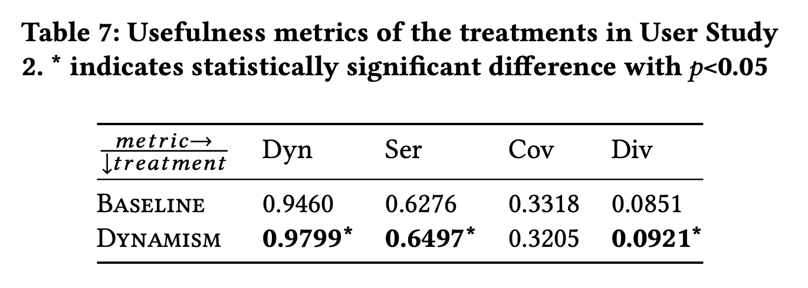

# 忘记手推车问题；现实世界中务实而公平的人工智能

> 原文：<https://towardsdatascience.com/forget-the-trolley-problem-pragmatic-and-fair-ai-in-the-real-world-350dc1e77f3f?source=collection_archive---------29----------------------->

## [公平和偏见](https://towardsdatascience.com/tagged/fairness-and-bias)

## 深思熟虑地(共同)设计人工智能系统可以在现实世界中发挥作用

《T2》中的人工智能末日场景，是由《T4》【过滤泡沫】 (2011)和[数学毁灭武器](https://www.goodreads.com/book/show/28186015-weapons-of-math-destruction) (2016)等书籍点燃的，正慢慢被**对人工智能更加务实和细致入微的观点**所取代。我们承认我们*控制着人工智能*并且能够*以反映我们选择的价值观的方式设计它们的视图*。

由 [Med Badr Chemmaoui](https://unsplash.com/@medbadrc?utm_source=medium&utm_medium=referral) 在 [Unsplash](https://unsplash.com?utm_source=medium&utm_medium=referral) 上拍摄的照片

这种转变可以从计算机科学家越来越多的参与中看出，例如，通过诸如[The Ethical Algorithm](https://www.goodreads.com/book/show/44244975-the-ethical-algorithm)(2019)或 [Understand，Manage，and Prevent Algorithm reliate Bias](https://www.goodreads.com/book/show/45007552-understand-manage-and-prevent-algorithmic-bias)(2019)等书籍，这些书籍描述并承认算法公平性的挑战和复杂性，但同时为更公平和更道德的算法提供了具体的方法和工具。这种转变也可以从这些书中描述的方法已经进入所有主要云提供商的产品中看出，例如，在 [FAccT 2021](https://facctconference.org/2021/) 教程“[工业中负责任的人工智能:实践中吸取的教训](https://sites.google.com/view/ResponsibleAITutorial)”微软、谷歌和亚马逊向 FAccT 社区的多学科观众展示了他们公平的人工智能解决方案。

信息很明确:我们能够(也应该！)*实现算法的公平性*。

为了做到这一点，我们不需要在允许自动驾驶汽车上路之前首先[“解决”电车问题](https://www.wired.com/story/trolley-problem-teach-self-driving-car-engineers/)，我们不需要从根本上消除不公正，或者完全摆脱偏见，然后我们才能建立有用和公平的人工智能工具。我们现在可以跳过哲学和理论上的“纸上”问题，专注于设计和构建实用的现实世界的解决方案。

事实证明，我们对人工智能有很多控制，而不是解决假设的问题，深思熟虑地(共同)设计人工智能系统可以在现实世界中产生影响。我用 fair AI 在雇佣招聘，价值驱动的新闻推荐来举例说明。

# ⚖️人才招聘会

在我们深入研究最常被引用(但在我的经验中并不经常实践)的负责任的人工智能和算法公平需求的“海报儿童”:雇佣和招聘领域之前——一个小小的提醒，由彭等人(2019)的下图进行了有益的说明:

# 偏见无处不在！

混合招聘系统的高级示意图。转载自[所见即所得？彭等人(2019)的《代表标准对雇用中的人为偏见的影响](https://arxiv.org/abs/1909.03567)》。

# 在人类中…

1999 年， [Steinpreis 等人](https://link.springer.com/article/10.1023/A:1018839203698)对人类雇佣偏见进行了原型研究。他们的方法很简单:收集简历，保持其内容固定，但通过将名字改为典型的男性或女性发音来改变候选人的性别。发出这些不同的简历，并记录下哪些收到了面试邀请。

瞧吧:“与拥有相同记录的女性求职者相比，男性和女性都更有可能雇佣男性求职者。”类似的方法，但在“受保护的属性”上有所不同的是 [Bertrand 和 Mullainathan](https://www.nber.org/papers/w9873) 的研究，他们发现*“白人”的名字在面试中获得的回应比“非裔美国人”的名字多 50%。”*

# …在算法方面

已经发现算法也包含和/或复制偏差。你可能听说过[亚马逊的 CV 过滤系统](https://www.theguardian.com/technology/2018/oct/10/amazon-hiring-ai-gender-bias-recruiting-engine)，这是算法公平世界中另一个经常被引用的例子。这个系统*告诉自己男性候选人更受青睐。它对包含“女性”一词的简历进行处罚，比如“女子象棋俱乐部队长”。并且降低了两所女子大学毕业生的等级。”*

科学研究发现了类似的结果，通过一种所谓的“无权限审核方法”[陈等人](https://dl.acm.org/doi/10.1145/3173574.3174225)发现，三个流行的简历搜索引擎(返回职位名称查询的求职者的引擎)表现出*“对女性候选人(轻微)不利，即使在控制所有其他可见的候选人特征时也是如此。”*

# 🦾人工智能拯救:公平意识的重新排名

幸运的是，事实证明，在雇佣和招聘的背景下让算法变得公平非常简单。以 LinkedIn 的“公平意识重新排名”为例他们的想法是*“[确保]显示的女性候选人比例与符合该查询的相应档案比例相同。”*

这个想法和技术实现都很简单——我们正在谈论一个事后重新排序的步骤，在算法上没有什么太复杂的——但现实世界的影响是显著的。作者报告*“在不影响业务指标的情况下，公平性指标得到了巨大的改善。”*这种影响超出了实验结果，因为他们的重新排名模型现在*“部署到全球所有 LinkedIn 招聘人员用户中。”*

这种有公平意识的重新排名是如何做到“公平”的？显然，这是一个小的干预，仅限于性别偏见(在他们论文中报告的 A/B 测试中)，并且只是公平的一个操作化。另一种可能是让算法系统反映世界分布。另一个是代表申请人的分布。或者合格的候选人。

这才是重点；没有单一的解决办法。我们可以争论这在多大程度上是(不)公平的，但这总比完全不做公平排名要好。LinkedIn 明确选择了将这种公平理念付诸实施；一个主观的解决方案，但也是可以辩护的。

# 🤖更进一步:人工智能修正人类偏见

[彭等人](https://ojs.aaai.org/index.php/HCOMP/article/view/5281)(来自图片)将雇佣中的偏差缓解算法向前推进了一步，旨在调整算法系统的输出，以便*进一步补偿人类偏差*。基本上；显示更多的女性填补传统上通常由男性填补的空缺。

作者发现他们的“过度补偿”策略是有效的，因为*“平衡候选人名单中的性别代表可以纠正某些职业的偏见，”*但不是在所有情况下；*“这样做对人类持续偏好发挥作用的职业没有影响”*(例如保姆和妇科医生)。在“人类持续偏好”旁边，作者发现了影响其偏见缓解策略有效性的其他因素，如决策者的性别、决策任务的复杂性以及性别的过度和不足。

后一项发现强调了招聘中偏见的复杂性，以及人类决策和算法系统之间的相互作用，同时强调了采取措施的重要性。不过，必须指出的是，作者使用众包进行了他们的研究，我认为可以肯定的是，外行人会表现出与受过培训的人力资源专业人员不同的行为。

# 📰价值驱动的人工智能新闻推荐

虽然不像人力资源和招聘那样是高风险领域，但算法新闻传播已经得到了广泛的关注，这要归功于(坊间的)帕里泽的过滤泡沫(事实证明，[很难根据经验建立](https://graus.nu/blog/the-filter-bubble-doesnt-exist/))。对我们来说，这是一个好消息，早在 2019 年，我们就与数据科学家团队一起为荷兰财经日报*“Het Financieele Dagblad”*(荷兰版的《金融时报》)设计并构建了一个定制的基于内容的新闻推荐系统。

来源:来自作者

那么，什么是新闻推荐中的公平呢？通过在我们组织中不同的利益相关者之间进行对话，我们开始定义我们认为我们的算法“应该”做什么。更具体地说，我们参与了 Bastian & Helberger 的一项研究，他*“对来自不同部门的员工(记者、数据科学家、产品经理)进行了半结构化采访，从新闻编辑室的角度探讨了价值表达的成本和收益以及算法新闻分发中的任务敏感方法。”*

从这些采访和随后的讨论中，我们提炼出了一个“编辑价值”的子集，在利益相关者之间共享，并且(并非不重要)在技术上是可行的。我们发现我们的算法新闻推荐应该继续:

1.  让读者惊讶
2.  提供及时、新鲜的新闻
3.  支持多样化的阅读行为
4.  增加文章的(阅读)覆盖面

有了这四个编辑价值，在我们的 UMAP 2020 年出版物 [*“超越点击优化:将编辑价值纳入新闻推荐”*](https://graus.nu/research/beyond-optimizing-for-clicks-incorporating-editorial-values-in-news-recommendation-at-umap2020/) 中，我们进行了**干预，以调整我们的推荐系统，明确提供更及时和新鲜的推荐**(即我们列表中的第二个价值)。

A/B 测试结果显示，我们的干预治疗提高了动态性、意外收获和多样性，增加了及时和新鲜的新闻推荐(来源:作者)

与 LinkedIn 的公平意识重新排名类似，我们采用了一种重新排名策略来提升最近的新闻。我们的基线新闻推荐和新近提升推荐之间的 A/B 测试结果显示:( I)我们**可以增加及时和新鲜的新闻传递，而不损害准确性**(同样，与 LinkedIn 论文相同的故事)，而且(ii)改进新鲜新闻推荐增加了四个值中的三个(新鲜度、惊喜和多样性)。

就像 LinkedIn 的例子一样，我们工作的贡献并不是带来公平或道德新闻推荐的终极解决方案。用新文章取代旧文章没什么了不起的。重要的是，我们与利益相关者坐在一起，共同决定和选择我们的推荐系统应该做什么。

# 🗣讨论

电车问题的普遍解决方案并不存在:伦理和公平是与环境、领域、文化和时间相关的。LinkedIn 的公平意识排名没有修正性别偏见，我们的价值驱动的新闻推荐不能取代编辑决定。

然而，在某些方面，两者都比未经调整的同行做得更好，也更公平。[保持谦逊](https://www.youtube.com/watch?v=tvTRZJ-4EyI)忘掉解决根本的不公正，根除歧视，开始接触并共同设计算法。决定什么是公平的不能也不应该由我们这些数据科学家来做:这不是我们的工作，也不是我们的专长。然而，我们的工作和专长应该是接触相关的利益相关者，共同决定和设计我们想要实现的目标。

# 注意

这篇博客是我在 DDMA 会议人工智能上的一次演讲的书面记录，演讲名为[面向数据科学家的实用主义、伦理和公平的人工智能](https://www.slideshare.net/davidgraus/pragmatic-ethical-and-fair-ai-for-data-scientists)，它本身由之前两次演讲的几张幻灯片组成；一个是我在[举办的关于人力资源](https://graus.nu/blog/algorithmic-bias-and-bias-mitigation-talk-at-the-anti-discrimination-hackathon/)中算法偏差和偏差缓解的反歧视黑客马拉松，以及我们的 [UMAP 2020 论文的幻灯片:“超越点击优化:在新闻推荐中融入编辑价值。”](https://graus.nu/research/beyond-optimizing-for-clicks-incorporating-editorial-values-in-news-recommendation-at-umap2020/)

# 🔍参考

1.  彭，a .，努希，b .，克奇曼，e .，因克彭，k .，苏里，s .，&卡马尔，E. (2019)。所见即所得？代表标准对雇佣中人的偏见的影响。人类计算和众包 AAAI 会议记录，7(1)，125–134。
2.  “性别对求职者和终身职位候选人简历审查的影响:一项全国性实证研究。”性别角色 41，509–528(1999 年)。
3.  玛丽安·伯特兰和森迪尔·穆莱纳桑。Emily 和 Greg 比 Lakisha 和 Jamal 更适合工作吗？劳动力市场歧视的现场实验。NBER (2003 年)。
4.  路透社:[https://www . the guardian . com/technology/2018/oct/10/Amazon-hiring-ai-gender-bias-recruiting-engine](https://www.theguardian.com/technology/2018/oct/10/amazon-hiring-ai-gender-bias-recruiting-engine)
5.  陈乐、马瑞军、阿尼科·汉纳克和克里斯托·威尔逊。调查性别对简历搜索引擎排名的影响。驰 2018，ACM。
6.  沙欣·杰姆·格伊克、斯图尔特·安布勒和克里希纳拉姆·肯塔帕迪。2019.搜索和推荐系统中的公平意识排名及其在 LinkedIn 人才搜索中的应用。在*第 25 届 ACM SIGKDD 知识发现国际会议论文集&数据挖掘*(*KDD’19*)。美国纽约州纽约市计算机械协会，2221–2231。
7.  [https://www . ifow . org/publications/artificial-intelligence-in-hiring-assessing-impacts-on-equality](https://www.ifow.org/publications/artificial-intelligence-in-hiring-assessing-impacts-on-equality)
8.  Bastian 和 n . hel Berger(2019 年 9 月)。捍卫新闻 DNA:新闻推荐者对价值敏感算法设计的态度。加的夫未来新闻会议。
9.  F.陆、和格劳思，“超越点击优化:在新闻推荐中融入编辑价值”，载于第 28 届美国计算机学会用户建模、适应和个性化会议论文集，美国纽约州，2020 年，第 145-153 页。