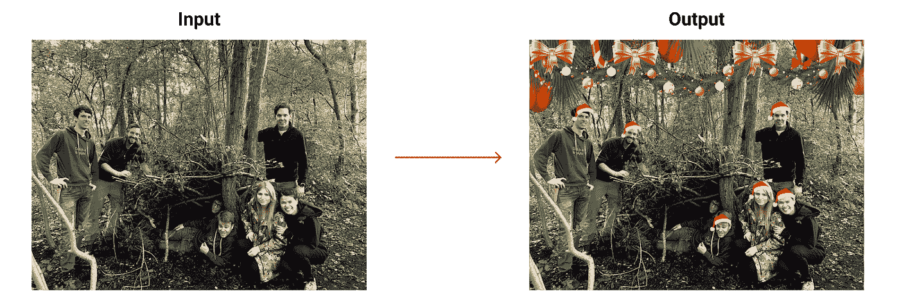
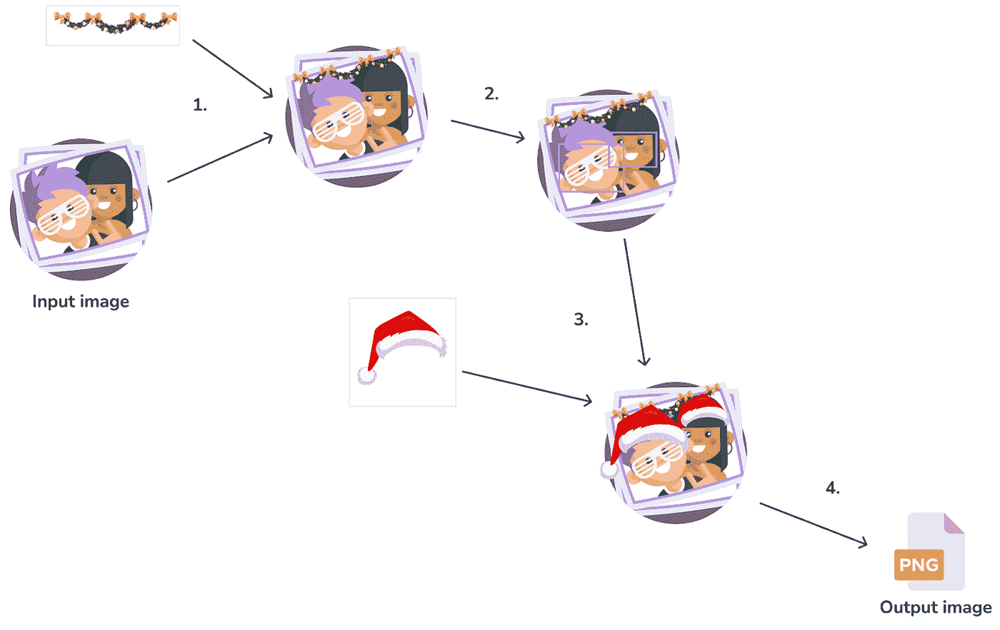

# 忘记做圣诞卡了？我们用 AI 做一个吧！

> 原文：<https://towardsdatascience.com/forgot-to-make-a-christmas-card-lets-make-one-with-ai-f2e1808b37a0?source=collection_archive---------33----------------------->

## 在 OpenCV 和 UbiOps 的一点帮助下

# 介绍

圣诞节又到了，我想这将是一个用编码和人工智能做些有趣事情的好机会！让我们制作一个简单的图像处理应用程序，给图片中的每个人一顶漂亮的圣诞老人帽子，并挂上一些圣诞装饰品，使图片更加喜庆。

模型的输入和输出示例。图片由作者提供。

你可以通过使用令牌`Token b1cc8511a5c8d59dfc43834b426deec265fa7729`前往[这个页面](https://requests.ubiops.com/projects/anouk-demo-project/deployments/christmas-model)来尝试这个应用的工作演示。填写完令牌后，您可以单击“连接”按钮，然后您将被带到一个可以上传图片的界面。只需点击运行按钮，该应用程序将为您的图像添加一些节日欢呼。

*免责声明:确保每个面部上方都有足够的空间放置圣诞帽。此外，图像分辨率越高，建模时间越长。分辨率较低的图像效果更好！*

交互式演示屏幕。图片由作者提供。

# 应用程序的工作方式

让我们看看这个应用程序是如何工作的。它实际上相对简单，只需要大约 50 行代码。它分 4 步工作:

1.  在输入图像上调整圣诞装饰图像的大小并叠加
2.  检测输入图像中的人脸(使用哈尔级联)
3.  把圣诞帽戴在脸上
4.  保存生成的图像并将其作为输出返回

*模型的示意图。由*[*Freepik*](https://www.freepik.com)*制作的图标来自*[*www.flaticon.com*](http://www.flaticon.com)*。作者提供的示意图。*

app 本身在 [UbiOps](https://ubiops.com/) 中服务，部署后自动生成界面。

# 代码

下面你可以看到上传到 UbiOps 的代码。

在`__init__`函数中，我们通过加载必要的叠加图像和用于人脸检测的 Haar 级联分类器来初始化模型。分类器是一个标准的分类器，默认由 [open-cv](https://opencv.org/) 提供。你可以很容易地把这个换成不同的 Haar 级联分类器来进行人脸检测。如果你想更多地了解哈尔喀斯，[Girija Shankar be hera](/face-detection-with-haar-cascade-727f68dafd08)[的这篇文章](https://medium.com/u/15521c3a84a9?source=post_page-----f2e1808b37a0--------------------------------)很棒！

每次向模型发出请求时，都会调用`request`函数，所以这是主要代码块所在的地方。我们从读入输入图像并检查其尺寸开始。try-except 子句的存在是因为我们无法预先知道输入图像是 BGR 图像还是二进制图像，这将影响 frame.shape 返回的值。一旦我们知道了图像的尺寸，我们就可以调整圣诞装饰图像的大小，并使用 [cvzone](https://github.com/cvzone/cvzone) 将它们覆盖在输入图像上。

之后，我们将输入图像转换为灰度图像以进行快速处理，并使用我们的分类器来检测人脸。我们遍历找到的面，并对每个面执行以下操作:

*   我们检查面部是否大于最小阈值，以确保我们筛选出一些错误的检测。
*   我们调整圣诞帽图像的大小以适合头部的大小
*   我们把圣诞帽放在脸的上方

最后，我们将生成的图像写入一个 PNG 文件，并将其作为输出返回。

# 其他必要的文件

为了正确部署应用程序，我们需要的不仅仅是代码本身。我们还需要一个详细说明代码依赖关系的需求文件，当然还有所有的图像文件和 Haar cascade 文件。

对于此模型，requirements.txt 文件如下所示:

我们使用的图像取自 [pngtree](https://pngtree.com/freepng/santa-claus-red-christmas-hat-cartoon_5594267.html) 和 [pngkey](https://www.pngkey.com/maxpic/u2e6t4r5y3q8i1u2/) ，Haar cascade 文件是 OpenCV 的标准文件。

我们只需要一个文件来将模型部署到 UbiOps，那就是 [ubiops.yaml](https://ubiops.com/docs/deployments/deployment-package/ubiops-yaml/) 。当我们将代码推送到 UbiOps 时，会生成一个 Docker 映像，其中安装了所有 Python 依赖项。然而，在我们的例子中，我们需要的不仅仅是 Python 依赖。 [Opencv 需要一些额外的操作系统级包](https://stackoverflow.com/questions/55313610/importerror-libgl-so-1-cannot-open-shared-object-file-no-such-file-or-directo)，这些包通常已经安装在你的本地机器上，但不在 Docker 镜像中。我们需要告诉 UbiOps 安装 APT，这正是 ubiops.yaml 的作用。我们需要的是这样的:

# 为应用服务

代码由 UbiOps 中的一个 **python 3.8 部署**提供，其中`input_image`作为输入，`festive_image`作为输出。我们使用的完整部署包可以在[这里](https://github.com/UbiOps/tutorials/tree/master/ready-deployments/christmas-model)找到。UbiOps 通过我们可以使用的 API 端点公开代码，但它也自动生成一个简单的接口。这个接口对于这个模型来说已经足够好了，所以我们只需要创建一个 API 令牌来访问这个接口，这样就完成了！你已经创建了一个简单的图像处理应用程序来转换你的图像，添加一些非常需要的节日欢呼。

# 后续步骤

当然，本文中描述的模型非常简单，有时可能会错误地将背景噪声识别为人脸。为了避免这种情况，可以使用不同的面部检测算法，或者在面部循环中使用不同的滤波器参数。[这篇文章](/a-guide-to-face-detection-in-python-3eab0f6b9fc1)由[马尔·杨奇煜](https://medium.com/u/ddcee06de4c8?source=post_page-----f2e1808b37a0--------------------------------)撰写，是关于 Python 中不同人脸检测方法的很好的参考资料。

然而，代码中的主要步骤适用于广泛的用例，而不仅仅是这个圣诞用例。这个应用程序可能只是让你的图像更快乐一点，但它确实告诉你如何检测人脸，以及如何根据这些数据改变图像。例如，如果你把圣诞帽换成太阳镜并改变偏移量，你可以很容易地制作一个 Snapchat 滤镜。随意摆弄代码，创造出完全不同的东西。希望这个圣诞模型能给你一些探索 Python 中图像处理的灵感。

请在评论中告诉我你对我的实现有什么看法，不要忘记添加你的圣诞图片！

您对 Python 的图像识别和处理感兴趣吗？那你也应该看看 [*这篇文章讲的是一个用 Python 和 Mendix 做的年龄估算器 app*](https://ubiops.com/building-a-low-code-app-powered-by-ai/) *。*