# 统计推断的形式介绍

> 原文：<https://towardsdatascience.com/formal-introduction-to-statistical-inference-8a0a2768e768?source=collection_archive---------26----------------------->

## 假设检验的技术演练

作者拍摄的照片。与自然连接！

当面临是否向整个客户群部署营销活动的决策时，从公司的战略角度来看:通过基础“样本”实施活动所能实现的**增量效应**的显著性水平的衡量和测试，可能会决定成功(“高”投资回报)和/或失败(金钱甚至声誉损失)。在这个舞台上，统计成为最好的工具。

如果你开始阅读这篇文章，你可能会想知道这是否与 A/B 测试有关。是的，它是。然而，我在这篇文章中关注的更多的是从 A/B 测试中获得的结果的统计评估，而不是方法背后的详细解释(例如，测试的设计、计划和运行)。通过这样做，我能够将决策方保持在分析的核心。

先了解一些背景信息。A/B 测试是一种可用于对 A 和 B 两种变异体进行实验的方法。这两种变异体可能有不同的名称，最常见的是对照组和治疗组，人们试图找出这两种变异体之间的任何差异。因此，统计分析用于检验这种差异的显著性。在建立 A/B 测试时，需要考虑的不同因素包括:1)随机选择过程，其中构成群体的任何个体都有被选择并成为“样本”一部分的同等概率；2)随机“样本”代表群体中的不同群体，因此没有偏见；3)并且“样本”具有相当大的规模，可以进行任何测试和分析。让我们想一想，由于缺乏资源和时间，我们无法测量所有的人口。

为了能够在给定的时间尺度下进行任何调查，根据上述标准从人群中抽取样本，从而可以推断出人群的特性并回答调查中的问题。因此，我们希望确保从这类人群中抽取的样本量足够大，以便在评估结果时能够有一定的置信度。多大才算大？在这一点上可能是个问题。如上所述，这篇文章没有详细阐述 A/B 测试和预评估阶段背后的方法，我建议读者进一步研究这一部分。不过，我希望在接下来的文章中，我可以强调在进行假设检验时，选择一个相当“大”的样本量的重要性。

在这里，我们已经进入了统计领域，在继续下一步之前，需要定义一些术语:

1) **假设检验:**一个假设，一个被公式化并被检验证明为真的假设，如果它是真的或者其他。因此，定义了两个语句:

1.1)零假设下的等式声明(Ho):

Ho:“对照组和治疗组是一样的。这两者之间没有区别”

1.2)及其补充陈述，即替代假说(H1)

H1:“治疗组的表现更好，因此这与对照组之间存在差异。”

**2)增量效应:**定义为在实验期间对治疗组进行的激励/治疗所触发的两个变量之间的差异

上述内容可以定义如下:

**H0: d = 0**

H1: d ≠ 0

其中 d 是两个变量之间的差异。在统计学中，这就是所谓的双尾检验。使用众所周知的钟形曲线，如下图所示

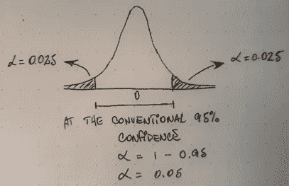

作者绘制的图像

**双尾检验:**这是要检验的区域，即正态分布曲线下的区域，并且在一个区域内，肯定不会拒绝说明两个变量之间没有显著差异的零假设。一个目的是识别和测试两个变量之间的增量差异的显著性，如果有的话，不区分哪个方向，意味着左/右单尾测试。

现在，如果我退后一步，提出以下两个关键问题:1)哪个假设是真的？意思是哪个假设与数据相符？以及 2)我们可以自信地说这种情况达到了什么样的显著水平？换句话说，两组之间有显著差异吗？

这是我们接下来要讨论的内容！让我们从背后的数学开始:

随机变量 X 被定义在一系列离散结果下，即 1(真)和/或 0(假)，这些结果是在随机过程下产生的，特别是对于具有给定试验次数的实验的伯努利过程。因此，使用了伯努利分布，它只是二项式分布的一个特例。为了表示这些结果的分布，(p)将是事件为真的概率和/或(1-p)为假的概率。在这里，假设事件彼此独立，即一个事件的发生不影响另一个事件发生的概率。在 A/B 测试中，我们的目标是测量每组中发生的真实事件(成功)的数量，并确定这两者之间的增量差*。在商业环境中，交谈率是评估和衡量成功的最常见(可变)指标。*

因此，

基于伯努利分布:

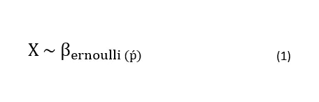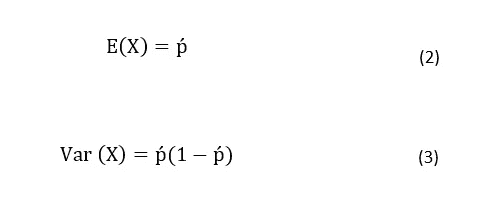

根据中心极限定理(CLM)，

从总体中抽取许多样本可以逼近总体的真实平均值。因此，p 的分布将是正态分布，其标准偏差等于平均值的标准误差。

这是，

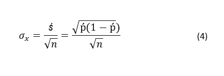

其中 n 是观察次数(样本大小)。

从等式 4 中可以看出，这是等式的分母，表示反向相关性，分母越大(样本越大)，σ越小(标准差越小)。这是一种数学表示，说明样本大小是抽样平均值相对于总体平均值的偏差(误差)大小的关键决定因素。

从上面可以看出，两组都可以表示为遵循近似的正态分布

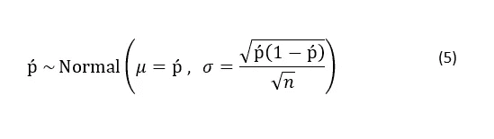

现在，下表列出了一些 A/B 测试的虚构数字。旨在衡量发送给治疗组的活动的成功水平，定义为通过接受活动中的报价并将其与未接受任何报价的对照组(除了业务照常沟通(BAU))进行比较而转化的客户数量，两组之间的任何差异可以确定为活动报价触发的增量差异。

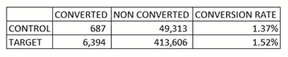

来自每组的两个感兴趣的参数是:1)平均值，这是(p)等于上表中该组的转换率，以及 2)如等式 5 所示导出的平均值的标准误差。

有了上面的知识，人们现在能够为控制组和目标组生成分布，

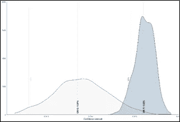

作者策划:对照组与治疗组

从上面的图表中，我们可以看到 x 轴上的对话率。然而，为了能够比较两组的对话率并推断出这两组之间的**差异**的统计显著性，我们需要制定零假设和替代假设。

概率论中，正态分布的独立随机变量之和也是正态分布的。因此，两组之间的**概率差**遵循正态分布。

由此可见，在零假设下，**【H0:】T5**

1.  平均值是两组之间的概率差:

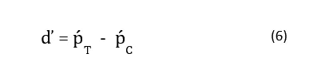

2.标准差(方差的平方根)等于两组的方差。根据总和的方差，它等于方差的总和:

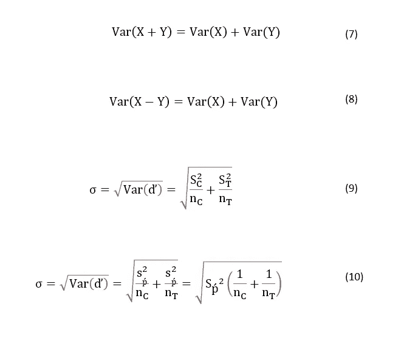

在替换之后，我们得到池的标准误差，SEp:

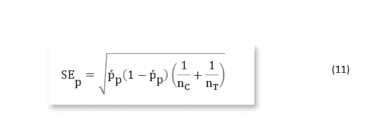

其中 pp 是池的会话速率估计值:

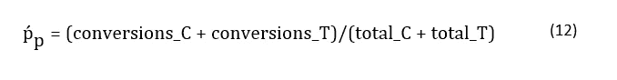

等式 11 基于以下假设导出:在零假设下，如果对照组和目标组是相同的，即这两者之间没有差异，则它们属于相同的基础分布。因此，来自对照和目标的实际输出可用于导出合并的标准误差:1)在零假设下均值为零(0 ),表示两组之间没有差异，以及 2)均值等于两组之间的**差异**,用于替代假设。

这是，

在原假设下， **H0:**

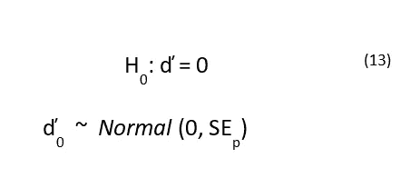

在另类假设下， **H1:**

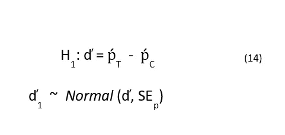

有了这两个假设的平均值和标准误差，我们可以继续计算用于统计推断目的的置信区间(CI)。

在传统的 95%置信度下，置信区间的下限(-)和上限(+)计算如下:

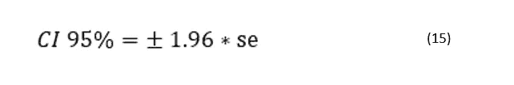

有了上述所有信息，现在可以直观地表示零假设和替代假设:

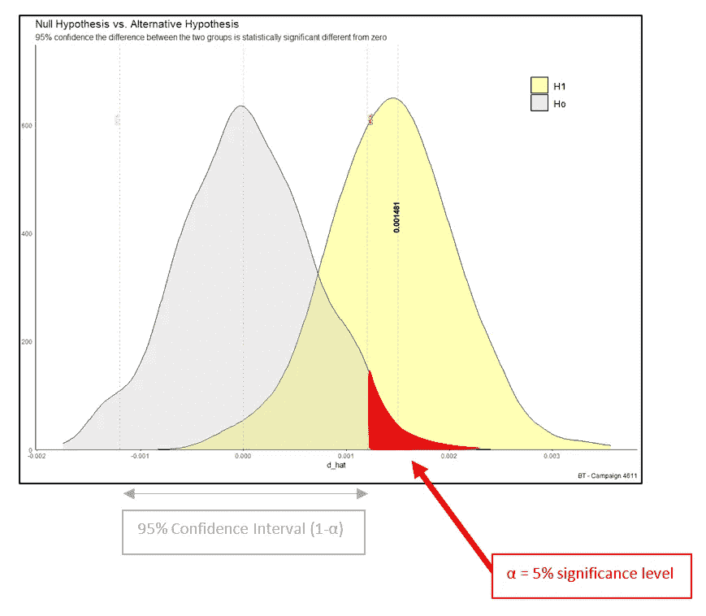

作者在 RStudio 中生成的情节。零假设与替代假设

在传统的 95%置信度下，两组之间的**增量差异**即 0.001481，显示为落入临界区域(红色区域)，即在置信区间之外，因此我们拒绝零假设，支持两组之间存在显著差异的替代假设。

因此，两组之间转换率的增量差异在 5%的显著性水平上在统计学上不同于零。这是:如果空值为真，那么这种极端观察到的增量差异发生的概率很小，只有 5%。

在α水平较低时，犯 I 型错误的概率降低:这是拒绝 null (Ho)的概率，当事实上为真时。这也被称为假阳性。

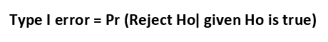

然而，当改变α的水平时，有一个权衡，这在下图中由红色虚线示出。

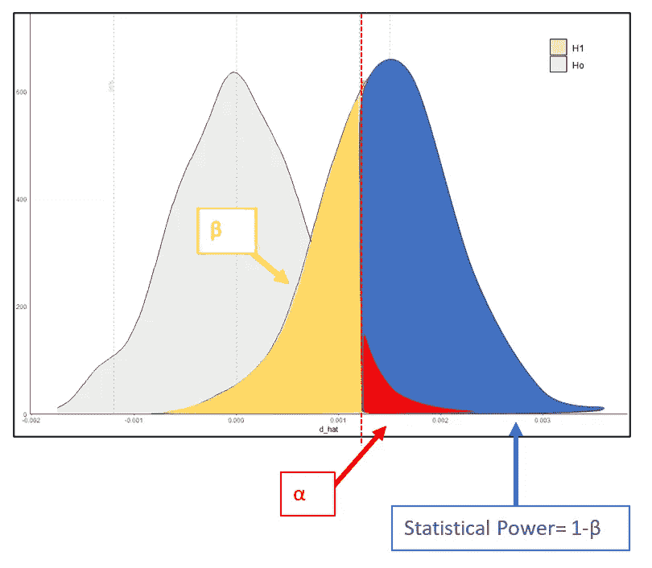

作者在 Rstudio 中生成的情节。第一类误差和第二类误差之间的权衡

低水平的 **β** 降低了犯类型 II 错误的概率:当事实上为假时，不能拒绝空值(Ho)。也称为假阴性。

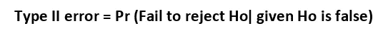

以上说明，在定义置信水平时，两个误差之间是有权衡的！

两个变量之间预期的增量差异将决定在 5%显著性水平(α)或更低水平下检测这种增量差异的高概率(统计功效)所需的样本量。因此，你的样本大小不是理所当然的。只要这个数字足够大，并且你的实验结果经过了正确领域的审查，你就最大化了正确决定站在你这边的机会！

**结论**

在这篇文章中，

1)我概述了在设置 A/B 测试时要考虑的三个关键要素，在本例中，是在两个变量之间进行实验以确定性能差异。

2)由于我的重点是检验 A/B 检验结果的统计显著性，我提供了假设检验的定义，并描述了支持假设检验的主要和补充陈述的表述，即零假设(H0)和替代假设(H1)

3)我借助数学推导出两个假设，以检验两组之间的增量差异的显著性。

4)在这篇文章中，我采用了不同的方法来展示一个相对“大”样本的重要性，以及它与预期增量差异的相关性。

5)我的目的是确定当定义置信水平来测试两组之间的增量差异的统计显著性时，即由活动提议触发的治疗组的更好表现，在拒绝事实上为真的空值(H0)和拒绝事实上为假的空值(H0)之间存在权衡。更准确地说:

5.1)得出结论，两组之间的增量差异很大，而实际上并不明显，这将导致部署的营销活动不成功，成本高昂，转化为负投资回报(ROI)

5.2)或者另一方面，确定两组之间的增量差异并不重要，因为事实上它因此错过了通过不正确测试的良好活动带来大量客户和收入的机会。

感谢阅读:)

在我的下一篇文章中再见。

AM！