# 在 python 中格式化字符串和数字

> 原文：<https://towardsdatascience.com/formatting-strings-and-numbers-in-python-16a326a5d5b3?source=collection_archive---------4----------------------->

## 在 python 中格式化字符串/数字输出的 6 种方式


图片来自[凯利·西克玛](https://unsplash.com/@kellysikkema)

# 关于这篇文章

大多数时候，一个简单的`print()`语句可能会导致混乱的代码。有时您不需要记录器来处理这项工作。Python 提供了不同的输出选项来处理字符串输出。这里有一些

# 格式化字符串

## 1.使用`%s in statements`

```
print(“Some text **%s** some text **%s** some text “ %(str1,str2))
```

`str1` 和`str2` 依次代替`%s`和`%s`

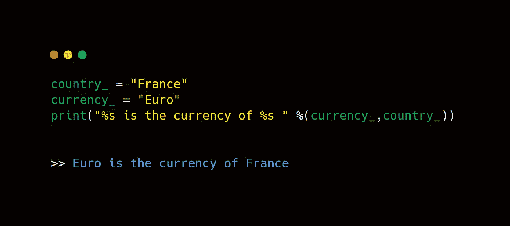

您甚至可以在字符串输出中进行数学运算。

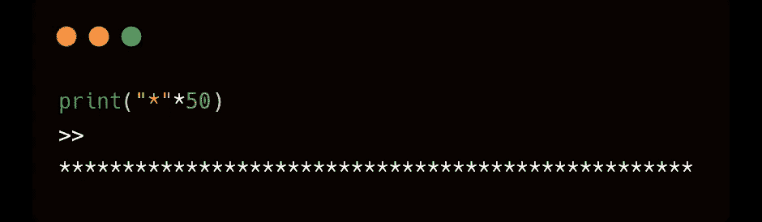

多次打印一个字符

## 2.使用 f 前缀格式化

我们可以使用 f-string 方法编写相同的代码。

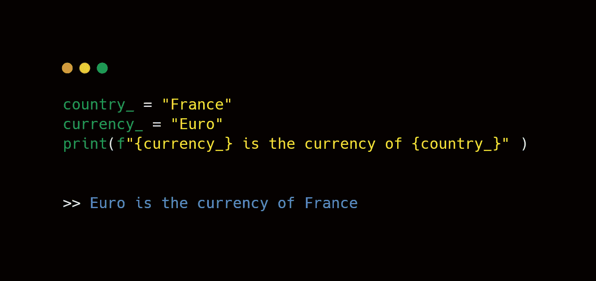

它克服了%s 的限制—您不能指定顺序(“轻松”)。所以当你使用`{variable_name}`时，你把它们嵌入到你想要的语句部分，自然就克服了“顺序问题”

## 3.使用 f 前缀整齐地对齐输出

您可以使用 f 格式中的 `**:>**`、`**:<**`或`**:^**`选项来左对齐、右对齐或居中对齐您想要格式化的文本。

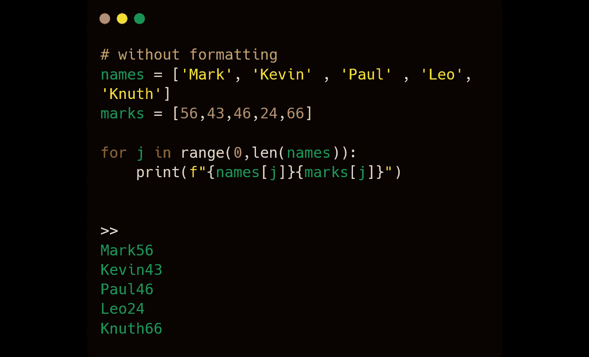

不格式化

格式化输出文本的对齐方式后…

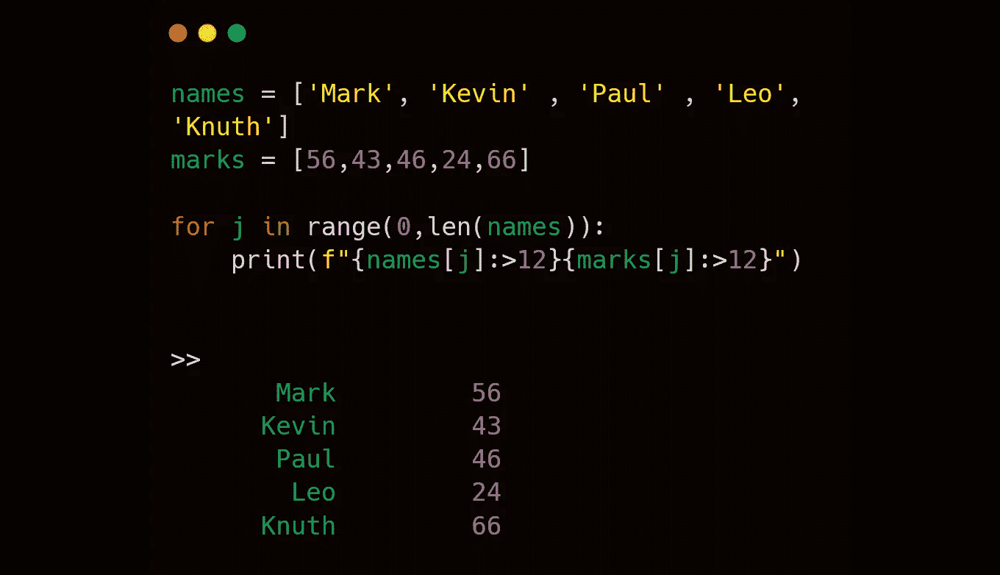

格式化后向右对齐

**4。使用格式关键字**

我们可以使用 python 中的`fortmat()` 字符串函数，按照我们想要的顺序输出想要的文本。

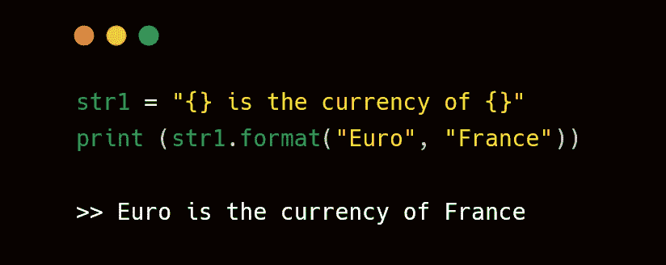

在 python 中使用 format()函数

# 格式化数字

现在使用`f keyword` 扩展格式(看上面的部分)，让我们试着在数字中使用，特别是涉及小数的`( float )`

## 1.限制小数点后的位数

例如:如果我想限制圆周率的值(小数点后第二或第三位)

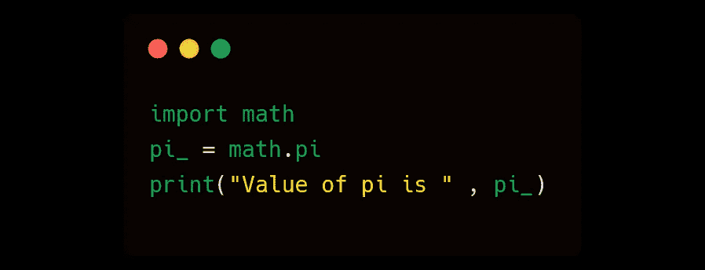

数字输出

通常，我们会得到这样的结果

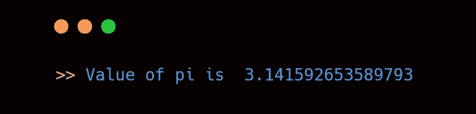

正常的预期产量

现在，通过格式化数字，我们可以将小数位数限制为两位数…

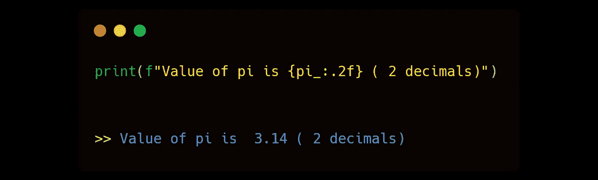

限制到小数点后两位

或 3 位数…

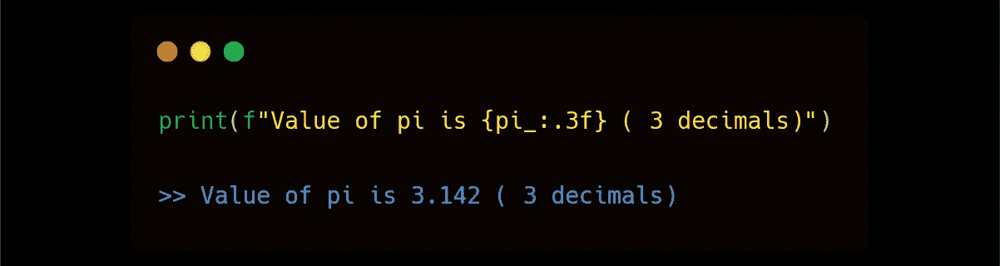

限制到小数点后 3 位

## 2.在 pandas 数据框中格式化输出

更进一步说，如果你想在数据框中以特定格式显示数字，当使用`pandas` 时，你可以使用 `pd.options.display`来显示你想要的方式。以下是启用`options.display`设置前后数字显示的示例。

让我们举个例子——

我们正在读取一个文件 `test.csv`并显示其内容。我们看到长度列显示了 6 个小数位。

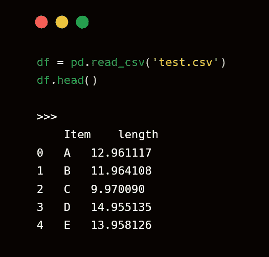

正常显示，长度栏显示 6 个小数点

如果我们只对显示两位小数感兴趣，我们可以使用 `pd.options.display`属性来改变它。下面是应用格式后数据帧的输出。

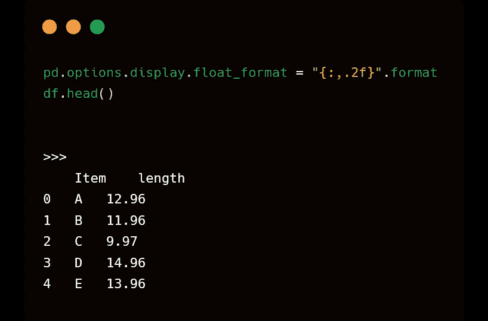

将浮点数据类型的格式设置为两位小数后的输出

**注**:从这里开始，对于所有的熊猫显示(甚至对于其他数据帧)，将只显示 2 个小数点。如果您想将其设置回小数点后 4 或 5 位，您必须将格式设置回您想要的格式。直到那时，它将继续显示只有 2 个小数点。

## **3。格式化 numpy 中的输出**

Numpy 具有将小数点精度更改为所需精度的设置。

```
**np.set_printoptions(precision=2)** 
```

让我们把输出看作是对前面熊猫例子的扩展。

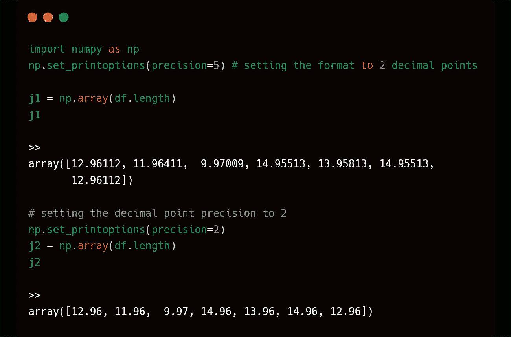

更改 numpy 中的小数点精度