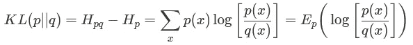
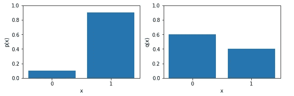
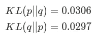
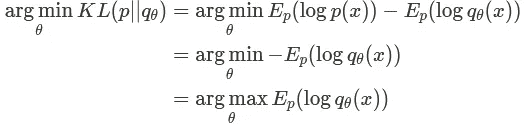
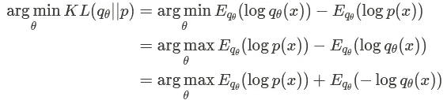
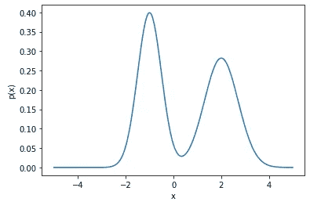
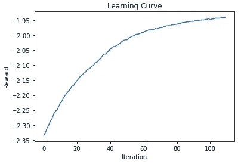
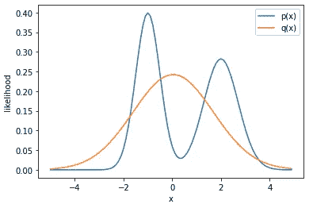
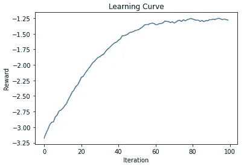
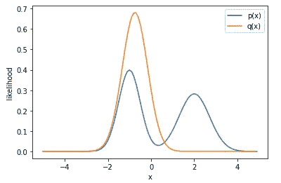

# 正向和反向 KL 散度

> 原文：<https://towardsdatascience.com/forward-and-reverse-kl-divergence-906625f1df06?source=collection_archive---------14----------------------->

爱丽丝·山村在 [Unsplash](https://unsplash.com?utm_source=medium&utm_medium=referral) 上的照片

在本文中，我们将调查正向和反向 KL 偏离之间的差异，以及这可能对您的项目产生的影响。为了做到这一点，我们将着眼于理论，然后用一些实验来证明实际结果😊

# 什么是 KL 发散？

很高兴你问了！本质上，**描述了一个概率分布与另一个**的偏差。它实质上是从“真实”分布和我们想要与“真实”分布进行比较的“预测”分布之间的交叉熵中减去“真实”分布的熵。这里的想法是，如果两个分布相同，那么交叉熵应该等于熵，所以结果将是 0。否则，交叉熵将大于熵项，因此结果将大于 0。换句话说，该值越接近 0，则“真实”和“预测”分布越相似。

下面给出了该方程，以及从初始定义导出的一些进一步的形式:

图片作者:KL 散度方程

这为什么有用？好吧，假设你想用一个我们可以控制参数的模型给出的“预测”分布来拟合一些“真实”的概率分布。有一个度量标准告诉我们模型分布与实际目标分布有多接近是很有用的。交叉熵可以服务于这个角色，但它并不持有直观的价值；也就是说，KL 散度直观地告诉你，你离单个数字的解有多近。

# 不对称的证明

首先，一个定义。无论参数的顺序如何，对称函数都具有相同的值。

看起来 KL 散度也应该是一个对称函数。如果它给出了两个分布之间的不相似性的度量，那么函数的分布输入的顺序应该无关紧要，因为这不会改变任何关于不相似性的东西，对吗？

好吧，我们来做个实验！为了简单起见，我们来看两个任意的伯努利分布，一个定义为 **p(x)** ，一个定义为 **q(x)** 。

图片作者: **p(x)** 有 **p = 0.1** 和 **q(x)** 有 **p = 0.6**

当我们计算具有不同参数顺序的相同分布的 KL 散度时，我们得到的值会发生变化:

作者图片:参数排序影响结果！

因此， **KL 发散不是对称的**。我们定义如下:

*   KL(p||q)是**前向 KL 散度**
*   KL(q||p)是**反向 KL 发散**

# 理论

那么有什么区别呢？再次设置场景，我们经常想要最小化 KL 散度，以使可控的“预测”分布符合一些固定的“真实”分布，但是我们应该最小化哪个 KL 散度度量？在下面的部分中， **p(x)** 是固定的“真实”分布， **q(x)** 是可控的“预测”分布。为了说明这一点，我将下标 **q** 和 **θ** ，它们是我们可以改变的 **q** 分布参数。

让我们首先来看看前向 KL 散度的最小化:

作者图片

换句话说，凡是 **p(x)** 有大概率的地方， **q(x)** 一定也有大概率。这是**均值搜索**行为，因为 **q(x)** 必须覆盖 **p(x)** 中所有高概率的模态和区域，但是 **q(x)** 不会因为具有高概率质量而受到惩罚，而 **p(x)** 不会。

现在，让我们将这与反向 KL 发散的最小化进行对比:

作者图片

让我们逐项分析一下。第一项类似于 KL 向前发散的目标。也就是说，它陈述了在 **q(x)** 具有高概率的地方， **p(x)** 也必须具有高概率。这是**模式搜索**行为，因为来自 **q(x)** 的任何样本必须位于 **p(x)** 的模式内。注意， **q(x)** 不会因为没有在 **p(x)** 的所有模式上放置概率质量而受到惩罚。第二项其实只是 **q(x)** 的熵！这阻止了分布坍缩到非常窄的模式。

# 实验

为了证明这一点，让我们尝试预测一个 GMM(2)分布， **p(x)** ，一个正态分布， **q(x)** 。“真实”分布 **p(x)** 如下所示:

作者图片:均值[-1，2]，方差[0.25，0.5]和权重[0.5，0.5]的 GMM 分布

我觉得很懒。我不想计算最优化方程的导数的解析形式，这太复杂了。相反，让我们使用进化策略(ES)算法和蒙特卡罗采样来优化函数！这很好，因为我们不再需要任何梯度信息；更多信息，请参见我写的关于 ES [**这里**](/evolutionary-strategy-a-theoretical-implementation-guide-9176217e7ed8) 的文章。对于正向和反向情况，我们将针对 **q(x)** 的均值和标准差进行优化。

先说**前进 KL 发散**。学习曲线如下所示:

作者图片

最终，该算法的平均值为 0.0401，标准偏差为 1.65，我们可以看到最终的 **q** 分布相对于下面的 **p** 分布的位置:

作者图片:最小化 KL 向前发散

显然,“预测”分布并没有确定“真实”分布的任何一种模式，而是证实了从理论中得出的均值寻找行为。

现在，让我们对**反向 KL 发散**做同样的事情。同样，学习曲线如下:

作者图片

这一次，算法确定平均值为-0.745，标准偏差为 0.585。我们可以看到合成的 **q** 分布相对于下面的 **p** 分布的位置:

作者图片:最小化反向 KL 分歧

显然，优化反向 KL 发散导致从“预测”分布中寻找模式的行为，几乎忽略了“真实”分布的其他模式。

总的来说，当优化模型目标函数时，前向和反向 KL 发散之间的细微差异会导致不同的行为；重要的是要仔细考虑哪一种更适合您的特定场景！作为机器学习设置中的一般规则，我们在监督学习中使用正向 KL 散度，在强化学习中使用反向 KL 散度。

如果您觉得这篇文章有用，请考虑:

*   跟踪我🙌
*   [**订阅我的邮件通知**](https://medium.com/subscribe/@rohan.tangri) 永不错过上传📧
*   使用我的媒介 [**推荐链接**](https://medium.com/@rohan.tangri/membership) 直接支持我并获得无限量的优质文章🤗

推广的方式，我希望这篇文章是一个有趣的阅读，并让我知道你的想法！！