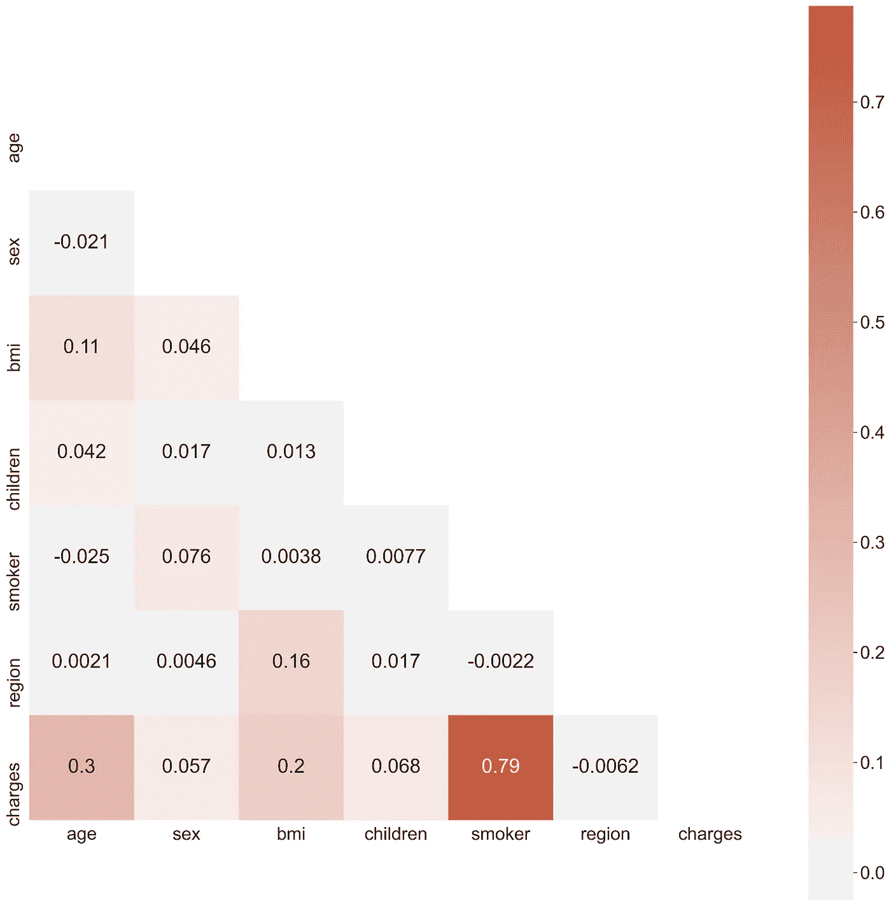

# 相关分析的基础

> 原文：<https://towardsdatascience.com/foundations-of-correlational-analyses-4b1ff3082220?source=collection_archive---------44----------------------->

## 如何恰当地测量数据中的二元关系

[照片](https://unsplash.com/photos/AT77Q0Njnt0?utm_source=unsplash&utm_medium=referral&utm_content=creditShareLink)由[艾萨克·史密斯](https://unsplash.com/@isaacmsmith?utm_source=unsplash&utm_medium=referral&utm_content=creditCopyText)在 [Unsplash](https://unsplash.com/s/photos/chart?utm_source=unsplash&utm_medium=referral&utm_content=creditCopyText) 上拍摄

情人节可能是一个遥远的记忆，但它仍然感觉像是一个与你讨论关系的完美机会——那是你数据中的关系。

在这篇文章结束时，你会对最常见的相关系数以及何时使用它们有更好的理解。不再依赖默认设置，这种自由会让你在解释和展示相关研究的结果时更加自信。

我们将看看:

*   皮尔逊氏 r
*   斯皮尔曼氏 rho
*   肯德尔氏τ
*   点双列相关

如果你想继续，你可以在这里找到我使用的数据集

## 如何衡量关系

我们可以通过测量变量之间的协方差来确定它们之间是否存在关系。在我们进入协方差之前，记住方差是我们的数据偏离均值的平均值(等式 1)。

等式 1——方差等式。其中，它等于第 I 个分数(xi)和平均值(X)之间的平方差的和(∑)并除以观察次数(N)减 1。

我们将上述等式中的偏差平方，以防止正负偏差相互抵消。举个简单的例子，假设我们有下面一组值(2，3，5，7，8)。这些值的总和是 25，因此平均值为 5。使用等式 1，我们得到:

[(2–5)² + (3–5)² + (5–5)² + (7–5)² + (8–5)²] / 5–1 = 6.5

如果我们不求离差的平方，得到的方差将为零，显然不是这样。

那么，协方差就是两个变量相对于彼此如何变化的度量。为了计算这一点，我们只需找到偏差叉积的平均值(等式 2)。如果关系存在，当一个变量偏离时，第二个变量也会偏离。如果两个变量偏离方向相同，则协方差的结果值将为正(两个正值的叉积)。相反，如果两个变量的偏离方向相反，则协方差的结果值将为负(正值和负值的叉积)。

等式 2——协方差等式。其中它等于每个变量 x 和 y 的方差的叉积。

协方差的问题是它的效用有限，因为值没有标准化。例如，在我们将使用的数据集中，有一个用于身体质量指数(身体质量指数)的变量。该值可以用千克/米或磅/英寸来测量，换算系数为 703。根据使用的单位，协方差值会有很大不同。尽管这些不同的价值观代表着同样的东西，我们怎么能比较它们呢(身体质量指数)？

通过计算方差的平方根，我们得到了方差的标准化度量(也称为标准差)。这样做可以让我们以一种有用的方式比较与平均值的偏差，而不依赖于变量的测量单位。当我们将这个想法扩展到协方差时，结果是一个标准化的协方差，称为相关系数(等式 3)。

等式 3——标准化协方差(r)的等式。其中协方差除以 x 和 y 的标准偏差的叉积，也称为皮尔逊相关系数。

这个值非常有用，因为结果介于-1 和+1 之间。这里，r 值为-1 表示完全的负关系，r 值为+1 表示完全的正关系，r 值为 0 表示没有线性关系。

r 值也用作效果大小的度量，其中值+/- 0.1 表示小效果，+/- 0.3 表示中等效果，+/- 0.5 表示大效果。

在下一节中，我们将探讨不同类型的相关性，以及如何为您的研究问题选择合适的测试。

## 二元相关性

最常见的二元相关包括如上所述的皮尔逊相关、斯皮尔曼相关、肯德尔相关和点双列相关。

## 皮尔逊氏 R

让我们从使用皮尔逊相关来探索我们的数据集开始。Pearson 的 r 是 python 中默认的相关性。如果我们绘制一张显示变量之间关系的热图(图 1 ),我们会得到以下结果:

图 1——使用 Pearson 的二元相关系数标注 r 值的热图。作者图片

假设我们想确定年龄和一个人要支付的健康保险金额(费用)之间是否有关系。将我们的注意力转向上图的左下角，我们看到变量之间存在正相关(和中等效应大小), r = 0.30。我们很快就会看到，在使用默认设置时，我们必须小心谨慎。

如果我们只对确定是否存在线性关系感兴趣，我们只需要确保我们的变量至少在一个区间水平上被测量(意味着它们是有序的，并且水平之间有相等的距离)。这里，年龄和费用都满足这个假设。然而，如果我们想确定这种关系在统计学上是否显著，就必须考虑进一步的假设。具体来说，为了使测试有效，我们的变量应该是正态分布的。

首先，让我们画出每个变量的分布图来检验正态性(图 2)。很明显，即使没有额外的测试，两个变量也不是正态分布的。对于年龄来说，这似乎不是极端分数(异常值)造成的。除了 20 岁左右的峰值之外，其余的年龄值都是相似的。另一方面，对于电荷，分布严重向左倾斜。对于那些付费的人来说，这是一个好消息，因为这意味着大多数人支付更少的保险费用！

图 2 —变量电荷(左)和年龄(右)的分布图。作者图片

调查异常值的一个好工具是使用箱线图(图 3)。这些图让我们用四分位数来可视化数据。方框内的线代表中位数(Q2-第 50 百分位)，方框以第 1(Q1-第 25 百分位)和第 3(Q3-第 75 百分位)四分位为界。从第三季度减去 Q1 的值，我们得到四分位数间距(IQR)。将 1.5x IQR 加到 Q3 上，然后从 Q1 中减去该值，得到了最小值和最大值(不包括异常值)，这些值用从方框向外延伸的线(称为晶须)来划分。任何超出胡须的值都被视为异常值。如可变电荷的箱线图所示，存在许多异常值。

图 3 —年龄(左)和费用(右)变量的箱线图。作者图片

这是一个很好的例子，说明皮尔逊相关不适合用来衡量两个变量之间的关系。相反，我们将不得不参考其他双变量选项之一。

## 斯皮尔曼的 rho vs 肯德尔的 tau

Spearman 和 Kendall 相关系数是根据排序数据计算的。当数据是有序的(意味着它们是有序的，级别之间的距离不相等)或者数据不符合皮尔逊相关的假设(如我们的示例)时，可以使用它们。根据所用的相关系数，您可以在下面找到相关性的不同之处。

值得注意的是，我们发现年龄和电荷之间的关系在使用秩序相关性时更重要。相反，与皮尔逊的 r 相比，变量身体质量指数和吸烟者与费用之间的关系更弱相关

## 点双列相关

在我们的数据集中，独立于使用的相关性检验，年龄和吸烟者与费用的关系最密切。我想让你注意可变吸烟者，因为它代表了一个特例。吸烟者是一个二元变量(不是吸烟者对吸烟者),二元变量和连续变量之间的关系应该使用点双列相关来研究。使用下面的代码，我们得到了 0.79 的相关性，这与使用 Pearson 的 r 得到的结果相同。事实上，当包含一个二元变量时，点双列相关在数学上等同于 r。

## 摘要

在本文中，我们学习了如何衡量两个变量之间的关系。我们看到，使用默认设置来执行相关性分析可能会有问题，并导致不适当的结论。我们讨论了最常见的相关系数以及何时使用它们。如果你想看看我的笔记本，请访问我的 [Github](https://github.com/ryancburke/correlation) 页面。

## 有用的资源

[关联](https://www.statisticssolutions.com/correlation-pearson-kendall-spearman/#:~:text=For%20the%20Pearson%20r%20correlation,a%20bell%2Dshaped%20curve).&text=Linearity%20assumes%20a%20straight%20line,distributed%20about%20the%20regression%20line.) —统计解决方案

有用的[引导](https://www.ncbi.nlm.nih.gov/pmc/articles/PMC6107969/)到相关系数