# 解释自然语言处理的基础——Bleu 评分和 WER 指标

> 原文：<https://towardsdatascience.com/foundations-of-nlp-explained-bleu-score-and-wer-metrics-1a5ba06d812b?source=collection_archive---------0----------------------->

## 直观的 NLP 系列

## NLP 模型的两个基本指标(Bleu 分数和单词错误率)的简明指南，用简单的英语编写

在 [Unsplash](https://unsplash.com?utm_source=medium&utm_medium=referral) 上 [engin akyurt](https://unsplash.com/@enginakyurt?utm_source=medium&utm_medium=referral) 拍摄的照片

大多数 NLP 应用程序，如机器翻译、聊天机器人、文本摘要和语言模型都会生成一些文本作为输出。此外，像图像字幕或自动语音识别(即语音到文本)输出文本，即使它们可能不被认为是纯 NLP 应用程序。

# 预测的产量有多好？

训练这些应用程序时的常见问题是，我们如何决定输出有多“好”？

对于像图像分类这样的应用，预测的类别可以明确地与目标类别进行比较，以决定输出是否正确。然而，对于输出是一个句子的应用程序来说，问题要复杂得多。

在这种情况下，我们并不总是有一个普遍正确的答案——我们可能有许多正确的答案。例如，当翻译一个句子时，两个不同的人可能会给出两个略有不同的答案，但两个答案都是完全正确的。

例如:*球是蓝色的*，*球是蓝色的*。

对于像图像字幕或文本摘要这样的应用程序来说，这个问题甚至更难，因为在这些应用程序中，可接受的答案范围甚至更大。

*同一张图片可以有多个有效的标题(图片由作者提供)*

为了评估我们的模型的性能，我们需要一个量化指标来衡量其预测的质量。

在本文中，我将介绍两个主要的 NLP 指标，您可能会在您的 NLP 模型中频繁使用这两个指标。

此外，如果您对 NLP 感兴趣，我有几篇文章探索了这个领域的其他有趣主题。

1.  [自动语音识别](/audio-deep-learning-made-simple-automatic-speech-recognition-asr-how-it-works-716cfce4c706) *(语音转文本算法和架构，使用 CTC 丢失和解码进行序列对齐。)*
2.  [波束搜索](/foundations-of-nlp-explained-visually-beam-search-how-it-works-1586b9849a24) ( *波束搜索如何增强 NLP 模型中的预测*)

# NLP 度量

多年来，已经开发了许多不同的 NLP 度量来解决这个问题。其中最受欢迎的是所谓的布鲁分数。

它远非完美，而且有许多缺点。但是计算和理解起来很简单，并且有几个引人注目的好处。尽管它有许多替代方法，但它仍然是最常用的指标之一。

它基于这样一种思想，即预测的句子越接近人类生成的目标句子越好。

Bleu 分数在 0 到 1 之间。0.6 或 0.7 的分数被认为是你能达到的最好成绩。即使是两个人也可能会对一个问题提出不同的句子变体，并且很少会达到完美的匹配。出于这个原因，接近 1 的分数在实践中是不现实的，并且应该发出您的模型过度拟合的信号。

在我们进入如何计算 Bleu 分数之前，让我们先了解两个概念。N-grams 和精度。

# n 元语法

“n-gram”实际上是常规文本处理中广泛使用的概念，并不特定于 NLP 或 Bleu 分数。它只是描述“一个句子中的一组‘n’个连续单词”的一种花哨方式。

例如，在句子“球是蓝色的”中，我们可以有 n 个字母组合，如:

*   1-gram(unigram):“The”，“ball”，“is”，“blue”
*   2-gram (bigram):“球”，“球是”，“是蓝色的”
*   三字组(三元组):“球是”，“球是蓝色的”
*   4 克:“球是蓝色的”

请注意，n-gram 中的单词是按顺序排列的，因此“蓝色是球”不是有效的 4-gram。

# 精确

该指标衡量预测句子中同时出现在目标句子中的单词数。

比方说，我们有:

*   他吃了一个苹果
*   **预言句**:他吃了一个苹果

我们通常使用以下公式计算精度:

*精度=正确预测字数/总预测字数*

*精度= 3 / 4*

但是像这样使用精度是不够的。我们还有两个案子需要处理。

## 重复

第一个问题是这个公式允许我们作弊。我们可以预测一句话:

*   他吃了一个苹果
*   **预测句**:呵呵呵

并且得到一个完美的精度= 3 / 3 = 1

## 多重目标句

其次，正如我们已经讨论过的，有许多正确的方法来表达同一个句子。在许多 NLP 模型中，我们可能会得到多个可接受的目标句子来捕捉这些不同的变化。

我们用一个修正的精度公式来说明这两种情况，我们称之为“削波精度”。

## 限幅精度

让我们通过一个例子来理解它是如何工作的。

比方说，我们有以下句子:

*   他吃了一个甜苹果
*   他正在吃一个美味的苹果
*   预测句:呵呵，他吃美味的水果

我们现在做两件不同的事情:

*   我们将预测句子中的每个单词与所有目标句子进行比较。如果该单词匹配任何目标句子，则认为它是正确的。
*   我们将每个正确单词的计数限制为该单词在目标句子中出现的最大次数。这有助于避免重复问题。这将在下面变得更加清楚。

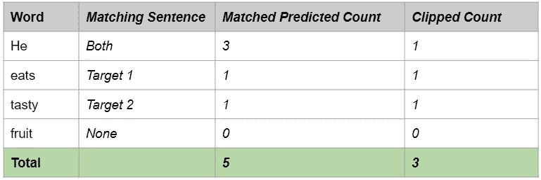

*裁剪精度(图片由作者提供)*

例如，单词“他”在每个目标句子中只出现一次。因此，即使“他”在预测的句子中出现了三次，我们也将计数“裁剪”为一，因为这是任何目标句子中的最大计数。

*裁剪精度=正确预测字数/总预测字数*

*削波精度= 3 / 6*

注意:在本文的其余部分，我们将只使用“精度”来表示“削波精度”。

我们现在准备继续计算 Bleu 分数。

# Bleu 评分是如何计算的？

假设我们有一个 NLP 模型，它可以生成如下的预测句子。为了简单起见，我们只取一个目标句子，但是和上面的例子一样，多个目标句子的过程非常相似。

*   因为下雨，警卫迟到了
*   因为下雨，警卫迟到了

第一步是计算 1-grams 到 4-grams 的精度分数。

## 精确 1 克

我们使用刚刚讨论过的限幅精度方法。

*精度 1 克=正确预测的 1 克数/总预测的 1 克数*

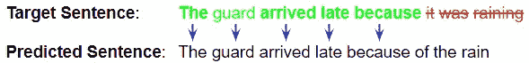

*精度(图片由作者提供)*

所以，精度 1 克( *p₁* ) = 5 / 8

## 精确 2 克

*精度 2-gram =正确预测的 2-gram 数/总预测的 2-gram 数*

让我们看看我们预测的句子中所有的 2 个字母:

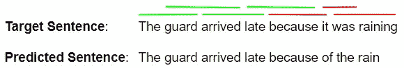

*精确 2 克(图片由作者提供)*

所以，精度 2-克( *p₂)* = 4 / 7

## 精确 3 克

同样，精确 3 克( *p₃* ) = 3 / 6

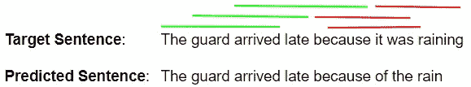

*精确 3 克(图片由作者提供)*

## 精确 4 克

并且，精度 4 克( *p₄* ) = 2 / 5

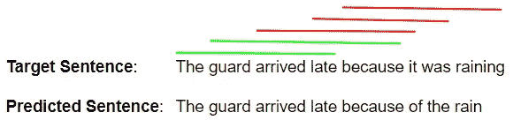

*精确 4 克(图片由作者提供)*

## 几何平均精度分数

接下来，我们使用下面的公式合并这些精度分数。这可以针对不同的 N 值并使用不同的权重值来计算。通常，我们使用 *N = 4* 和统一权重 *wₙ* = *N / 4*

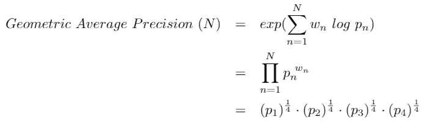

*精准评分(图片由作者提供)*

## 简洁惩罚

第三步是计算“简洁代价”。

如果您注意到精度是如何计算的，我们可以输出一个由单个单词组成的预测句子，如“The”或“late”。对于这种情况，1 克的精度应该是 1/1 = 1，这表示满分。这显然是一种误导，因为它鼓励模型输出更少的单词并获得高分。

为了弥补这一点，简短惩罚惩罚太短的句子。

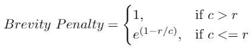

*简洁处罚(图片由作者提供)*

*   c 是*预测长度=预测句子的字数*和
*   r 是*目标长度=目标句子的字数*

这确保了简洁性损失不能大于 1，即使预测的句子比目标长得多。而且，如果你预测的字很少，这个值会很小。

在这个例子中，c = 8，r = 8，这意味着简洁代价= 1

## Bleu 评分

最后，为了计算 Bleu 分数，我们用精确度分数的几何平均值乘以简洁性损失。

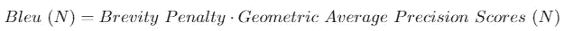

*Bleu 评分(图片由作者提供)*

可以针对不同的 N 值计算 Bleu 分数。通常，我们使用 N = 4。

*   BLEU-1 使用 unigram 精度分数
*   BLEU-2 使用一元和二元精度的几何平均值
*   BLEU-3 使用一元、二元和三元精度的几何平均值
*   诸如此类。

如果你在互联网上查看不同的资源，你也可能会遇到一种稍微不同的方式来编写 Bleu 分数公式，这在数学上是等价的。

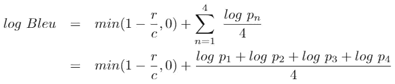

*Bleu 评分公式(图片由作者提供)*

# 在 Python 中实现 Bleu 评分

在实践中，您很少需要自己实现 Bleu 分数算法。nltk 库是 NLP 功能的一个非常有用的库，它提供了 Bleu Score 的实现。

现在我们知道了 Bleu Score 是如何工作的，还有几点我们应该注意。

# Bleu 分数是基于语料库计算的，而不是单个句子

虽然我们使用了匹配单句的例子，但是 Bleu 分数是通过将整个预测语料库的文本作为一个整体来计算的。

因此，你不能单独计算语料库中每个句子的 Bleu 分数，然后以某种方式平均这些分数。

# Bleu 评分的优势

Bleu Score 如此受欢迎的原因是它有几个优点:

*   它计算速度快，容易理解。
*   这与人类评价同一文本的方式一致。
*   重要的是，它是独立于语言的，这使得它可以直接应用于您的 NLP 模型。
*   当你有一个以上的基本真理句子时，可以使用它。
*   它的应用非常广泛，这样可以更容易地将您的结果与其他工作进行比较。

# Bleu 评分的弱点

尽管广受欢迎，但 Bleu Score 一直因其弱点而受到批评:

*   它不考虑单词的意思。对于一个人来说，用一个不同的词表达同样的意思是完全可以接受的，比如用“守夜人”而不是“警卫”。但是 Bleu Score 认为这是一个不正确的词。
*   它只查找完全匹配的单词。有时同一个词的一个变体可以被使用，例如“rain”和“raining ”,但是 Bleu Score 认为这是一个错误。
*   它忽略了单词的重要性。使用 Bleu Score，与句子不太相关的不正确单词(如“to”或“an ”)会受到与对句子意义有重要贡献的单词同样严重的惩罚。
*   它不考虑单词的顺序，例如，句子“警卫因下雨而迟到”和“因警卫而下雨迟到”将得到相同的(单字母组合)Bleu 分数，即使后者完全不同。

# 语音转文本应用使用单词错误率，而不是 Bleu 分数

虽然自动语音识别模型也输出文本，但是目标句子是明确的，并且通常不需要解释。在这种情况下，Bleu 分数不是理想的指标。

这些应用程序通常使用的度量标准是单词错误率(WER)，或者它的兄弟，字符错误率(CER)。它一个字一个字地(或一个字符一个字符地)比较预测的输出和目标抄本，以计算出它们之间的差异。

差异可以是存在于转录本中但在预测中缺失的单词(被计为删除)、不在转录本中但已被添加到预测中的单词(插入)、或者在预测和转录本之间改变的单词(替换)。

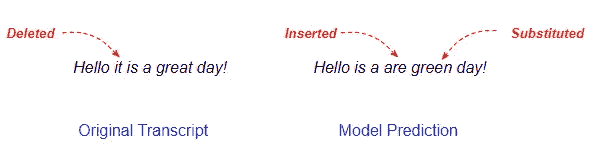

统计转录本和预测之间的插入、删除和替换(图片由作者提供)

度量公式相当简单。它是差异相对于总字数的百分比。

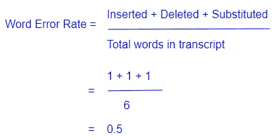

单词错误率计算(图片由作者提供)

WER 计算是基于衡量两个单词之间差异的莱文斯坦距离。

尽管 WER 是语音识别中使用最广泛的度量标准，但它有一些缺点:

*   它不区分对句子意义重要的词和不相关的词。
*   在比较单词时，它不考虑两个单词是仅仅单个字符不同还是完全不同。

# 结论

希望这能让你理解 NLP 的两个最重要的指标，以及它的优点和缺点。

最后，如果你喜欢这篇文章，你可能也会喜欢我关于变形金刚、音频深度学习和地理定位机器学习的其他系列。

 [## 直观解释的变压器(第 1 部分):功能概述

### NLP 变形金刚的简明指南，以及为什么它们比 rnn 更好，用简单的英语。注意力如何帮助…

towardsdatascience.com](/transformers-explained-visually-part-1-overview-of-functionality-95a6dd460452)  [## 音频深度学习变得简单(第一部分):最新技术

### 颠覆性深度学习音频应用和架构世界的温和指南。以及为什么我们都需要…

towardsdatascience.com](/audio-deep-learning-made-simple-part-1-state-of-the-art-techniques-da1d3dff2504)  [## 利用地理位置数据进行机器学习:基本技术

### 简明的地理空间数据特征工程和可视化指南

towardsdatascience.com](/leveraging-geolocation-data-for-machine-learning-essential-techniques-192ce3a969bc) 

让我们继续学习吧！